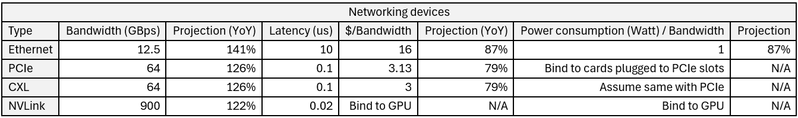
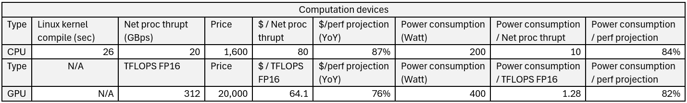

## 存储系统中的硬件

相比软件层面优化所需的人力成本和漫长周期，硬件性能往往指数增长。硬件的快速发展、模式的转变，是存储系统演进的持久动力之一，并向上重塑用户和市场。硬件能提供什么，是思考系统架构和未来策略的基石。

本章讨论存储系统相关的硬件，从数据层面评估，围绕它们的性能、成本、和未来增长。本文之后思考它们对存储系统的影响。

（关于存储中的软件，见 [Accela推箱子 - 存储架构空间 - 全文](https://mp.weixin.qq.com/s/h_TcizzlgELBF1wqmZI-fA) / [https://mp.weixin.qq.com/s/h_TcizzlgELBF1wqmZI-fA](.)）。

### 数据表

下表展示常见存储、网络、计算硬件的容量、带宽、能耗数据，并比较单位价格。数据均来自互联网，力求反映大致规模。准确的数据往往需要专业市场团队，受品牌和采购组合的影响，规模供应商甚至能提供折扣。

  * __HDD__ 吞吐量增长较慢。HDD的容量成本随新技术 SMR、HAMR 等逐步下降，导致单位容量性能缓慢下降。大致上，十年来 HDD 的容量增加了十倍，但吞吐量仅增加两倍。下表使用吞吐量（带宽），忽略IOPS，前者更反映综合性能。

  * __SSD__ 在 NVMe 技术下，近年来吞吐量呈指数增长，延迟接近原生闪存，瓶颈变成 PCIe。ZNS 等技术进一步改善容量和成本，大容量闪存利用并发通道提升性能。大吞吐量下，闪存磨损仍然是问题。近年 SSD 的单位容量成本快速下降，甚至有低于 HDD 的趋势。反直觉地，尽管单价昂贵，SSD 的单位带宽成本和能耗反而低于 HDD。

  * __DRAM__ 带宽随 DDR 技术换代呈指数增长，能耗随降低的电压逐步降低。Amazon 可采样容量和价格，下表以 DDR4 为基准。现代服务器常配备双通道、四通道以进一步提高带宽。DRAM 的能耗常分为静态刷新部分和读写传输部分，总体上与电压平方成正比。

  * __HBM__（High-bandwidth memory）常用于 GPU 或片上内存。相比 DRAM，它采用大接口宽度和堆叠提高带宽到极高水平，读写传输能耗很低。HBM 是随 GPU 变得广为人知的新技术之一，目前缺点是昂贵，单位容量价格是 DRAM 的约十五倍。

  * __Ethernet__ 是近年发展最快的技术之一，带宽呈指数增长，几乎每两年翻倍，成本呈指数下跌。今天 100Gbps 网卡已经常见，200Gbps 正被部署，400Gbps 逐步出现。存储系统架构正被快速提高的网络带宽重塑。相比服务器中的 DPU，ASIC 是交换机中广泛使用的技术。

  * __PCIe__ 带宽随 PCIe Gen 换代呈指数增长，几乎每隔几年翻倍。其延迟取决于频率（100Mhz）。下表使用 PCIe Gen5.0 16x 作为基准。PCIe 价格绑定在主板上，Amazon 可采样主板售价，近年来基本维持稳定。尽管 PCIe 带宽较高，但远不及 GPU/NVLink，也仅勉强跟上 SSD（一机多盘）、Ethernet。

  * __CXL__ 由 Intel 主推，将原来集成到 CPU 的内存桥归还主板控制，整合 PCIe，并实现远程访问的缓存一致性。尽管被热烈讨论，但明确的产品不多。CXL 1.1 和 2.0 使用 PCIe Gen5.0 作为物理层，本文基于 PCIe 推测其性能和成本。

  * __NVLink__ 可替代 PCIe 实现 GPU 互联，相比 PCIe 拥有极高的带宽和相近的延迟。今年 NVLink 带宽呈指数提高，鉴于生成式 AI 的革命性和投资热度，其发展甚至可能加快。结合 AI 对高带宽和 All-to-All 通信的需求，NVLink 正在重塑 AI 集群架构。下表以 NVLink Gen4.0 为基准（ A100 使用 Gen3.0 ）。价格上，NVLink 与 Nvidia GPU 捆绑出售。

  * __CPU__ 性能可分解为核心数 X 频率 X IPC 。IPC 由单线程性能反映，逐年缓慢提高。核心数近年提高较快，尤其是服务器 CPU，甚至有 Manycore 研究方向。而频率的增长受限于芯片散热和服务器能耗。CPU 总体性能常用 Linux 内核编译时间，或网络通信吞吐量来衡量。下表以 AMD EPYC 7702P 64-Core 为基准。

  * __GPU__ 提供极高的 FLOPS 计算性能，核心数和并发数远胜 CPU。相比 CPU 受限于 DRAM 带宽内存墙，GPU 的 NVLink 和 HBM 带宽极高。今天 GPU 售价昂贵且一卡难求，未来预期单位成本的计算能力呈指数提高，并能耗下降。下表以 Nvidia A100 为基准。

注意上表中 Projection 列即使 10% 的差异，因为指数，都可导致翻倍/半衰年数的显著不同。可与下表对比：

数据来源及引用：

  * HDD: [[1]](.) [[2]](.) [[3]](.)
  * SSD: [[4]](.) [[5]](.) [[22]](.) [[23]](.)
  * DRAM: [[6]](.) [[7]](.) [[8]](.) [[24]](.) [[27]](.)
  * HBM: [[9]](.) [[10]](.) [[11]](.) [[28]](.) [[29]](.)

  * Ethernet: [[12]](.) [[17]](.) [[24]](.)
  * PCIe: [[13]](.) [[14]](.) [[15]](.)
  * CXL: [[30]](.)
  * NVLink: [[16]](.)

  * CPU: [[18]](.) [[19]](.) [[25]](.) [[26]](.) [[41]](.)
  * GPU: [[20]](.) [[21]](.) [[31]](.)

[[1]](.)

[[3]](.)

[[6]](.)

[[8]](.)

[[12]](.)

[[19]](.)

[[26]](.)

[[31]](.)

[[32]](.)

[[33]](.)

[[34]](.)

上述数据可以用来计算不同架构下的存储成本，以及未来竞争力。特别地，容量、带宽价格反映购买成本，而能耗反映反映运营成本（TCO）。

### 额外成本

首先是能耗及制冷成本，一份能耗同时带来对应的制冷成本，两者加总为数据中心电费开销，几年后电费甚至超过购买成本。

  * __PUE__: 数据中心能耗效率。假如服务器能耗是 500W ，数据中心的 PUE 是 1.5x，则这台服务器包括制冷需要耗能 500W * 1.5 = 0.75KW 。假设电费是 \$0.1 每 KWh ，则一年耗电 $657，五年电费甚至超过服务器购买成本。

  * 常见数据中心 PUE 在 1.5x 左右，并基本维持稳定 [[33]](.) 。Google 数据中心甚至能将其压缩到 1.1x [[32]](.) 。

然后是网络带宽，一份服务器带宽需要配套对应的 T0（TOR）、T1、T2 等交换机带宽。

  * 假设 100Gbps 服务器网卡，T0、T1 层使用 100% 带宽 Full-provisioning ，T2 层使用 50% 带宽 provisioning，忽略更高层次 T*。加起来额外带宽配比有 __2.5x__ 。

除存储、网络、计算组件外，服务器在额外组件上花费的能耗数量可观。约 __30%__ 的额外能耗花费在电力传输（15%）、主板（10%）、冷却风扇上（4%） [[34]](.) 。

### 与公有云价格的比较

如今的公有云价格是作成本评估的良好参考，除非需要重新思考存储系统的架构，和硬件提供的可能性。本节以公有云存储 Azure Storage [[35]](.) 为基准，比较上文计算的存储成本数据。

除前文提到的额外成本外，需要计算对于 1GB 存储应配套的 DRAM、Ethernet、PCIe 等。DRAM 涉及被缓存的数据比例。HDD 和 SSD 往往价格显著不同。CPU 需要依带宽处理能力配置。数据复制、压缩、纠删码可显著影响物理数据体积。冷数据可以极低带宽成本存储。

  * 单位全文统一，容量 GB，带宽 GBps，货币 $。

下表计算了 __1GB 的 HDD 存储所需成本__，考虑了主要服务器组件、额外网络交换机配套、数据中心制冷等，也考虑了数据复制、压缩，以及部分是冷数据。购买成本和能耗成本都包含，购买成本按 60 个月摊还。可以发现：

  * 相比 Azure Storage Reserved Capacity ，计算出的数据成本是 Cool 的约 1/22x，是 Archival 的约 1/4.5x 。

  * 当然，文中的计算力求简单清晰，比实际 __忽略了诸多开销__。例如互联网带宽费用、数据中心建设、研发费用、销售费用、读写 IO 放大、SSD 磨损、跨区复制、备份和容灾等等。

  * 除存储外，Azure Storage 对数据读写额外收费。持续的高 IOPS ，或对冷数据的大带宽访问，费用高昂。而计算出的数据成本已经将 1GB 对应带宽纳入。

  * 计算出的 HDD 存储中，显著的购买成本从高到低分别是 HDD、DRAM。显著的能耗成本从高到低分别是数据中心制冷、HDD、服务器额外、DRAM。总能耗成本约占购买成本的 40%。

  * 同理计算出 5 年后的数据，各成本组分变化不大。主要因为各组件成本都在下降。但总能耗成本占购买成本上升到约 60%。（虽然 1GB 容量对应的 HDD 带宽在下降，计算时假定配套带宽不变。）

下表是 __1GB 的 SSD 存储所需成本__，与 HDD 版本对比，可以发现：

  * 相比 Azure Storage Pay-as-you-go ，计算出的数据成本是 Premium 的约 1/34x。当然，文中的计算相比实际忽略了诸多成本。

  * 计算出的 SSD 存储成本是 HDD 的 12x 左右，与 Azure Storage 类似，Premium 是 cool 的 15x 左右。

  * 计算出的 SSD 单位带宽的成本比 HDD 更低，这与 Azure Storage 相符，Premium 的读写价格比 Hot 更低，数据越冷读写成本越高。

  * 计算出的 SSD 存储中，显著的购买成本从高到低分别是 SSD、CPU。显著的能耗成本从高到低分别是数据中心制冷、服务器额外、SSD、CPU。总能耗成本约占购买成本的 50%。

  * 同理计算出 5 年后的数据，各成本组分变化不大。主要因为各组件成本都在下降。但总能耗成本占购买成本上升到约 58%。（虽然 1GB 容量对应的 SSD 带宽在上升，计算时假定配套带宽不变。）

可以推想，对于 SSD 存储，如果数据热度高、操作频繁、传输带宽大，并且功能简单，使用本地数据中心可能有成本优势。而对于冷数据，公有云是理想的存储地点，利用 Reserved Capacity 能进一步降低成本。

### 选择 HDD 和 SSD

基于需要的容量和带宽，可以将上文数据表中购买 HDD 或 SSD 的成本绘出，比较不同选择。加上能耗开销后结果类似。可以看到：

  * __Area 1__ 和 __Area 2__ 分别对应1）低带宽高容量需求，使用 HDD ；2）高带宽低容量需求，使用 SSD。相比 SSD，HDD 的带宽很低，因而 Area 1 面积较小。

  * __Area 2__ 全部使用 HDD，但带宽需求较高，需要为带宽额外购买 HDD 容量。__Area 3__ 全部使用 SSD，但带宽需求较低，给定容量的 SSD 有带宽闲置。

  * 作为改进，__Area 2__ 和 __Area 3__ 适合使用 HDD 和 SSD 的混合存储，或者使用 SSD 作为 HDD 的缓存。

### 硬件发展的推动因素

硬件性能如此高速发展，它受何推动？推动因素可以从技术层面和市场层面分析。

技术层面，总体上，更小的制程、更高的集成度、专用设计的芯片、更高的频率、新型物理介质，__摩尔定律__ 推动硬件性能指数提高。在各个组件上，近年来都有一系列技术创新：

  * __HDD__: 不断提高的存储密度，近年来逐渐推广的 SMR 技术，以及未来将采用的 MAMR、HAMR 等 [[36]](.) 更复杂但密度更高的存储技术。

  * __SSD__: 一系列技术从不同层面提高 SSD 性能。接口协议如 NVMe、NVMoF。简化 FTL 层如 ZNS、FDP [[37]](.) 。闪存架构如 3D NAND 。提高闪存密度，使用新型物理介质如 TLC、QLC、PLC 。

  * __DRAM__: 每一代 DDR 不断提高时钟频率，改进架构，降低电压。DRAM 的密度、封装也在改进，如 3D Stacking 技术。

  * __HBM__: 与 DRAM 一道，HBM 的堆叠技术在持续改进，允许更多层数和更高的跨层传输速度。线路的信号传输速率、接口宽度也在提高。

  * __Ethernet__: 以太网协议不断换代，大幅提高传输带宽。近年来 RDMA RoCEv2 普遍被采用，服务器使用 ASIC 芯片替代 CPU 处理高速网络。光纤交换机也在数据中心采用。

  * __PCIe__: 每一代 PCIe 的不断提速得益于编码协议和同步效率的改进，更多数据在一个时钟周期内传输。传输介质的改进容许更高的速率。然后，Lane 乘数加倍，并行传输。

  * __CPU__: 性能在不同层面得到改进。更多的晶体管数量、集成度，更小的制程。多核、Manycore 集成于一个处理器中。频率的小幅提高。微架构的改进、更高的 IPC 。新型向量处理指令 SIMD 。集成专用任务的加速器。能耗优化、DVFS 等技术。

  * __NVLink__: 类似于 PCIe ，PCIe 本身也在高速发展。NVLink 的提速额外受益于与 GPU 的高度集成、更大的连线宽度等，以及 AI 热度带来的投资。

  * __GPU__: 得益于生成式 AI 的工业革命式的投资热度，GPU 领域快速发展。每一代新 Nvidia GPU 更新架构，更多核数、执行单元，集成更多更大容量的组件，并减小制程。Tensor Core 和 RT Core 为专用任务优化。相比于 CPU ，GPU 将内存、总线集成于自身板上。HBM、PCIe、NVLink 本身也在高速发展。相比于 CPU ，GPU 的时钟频率较低，近年来持续提高。

硬件发展的另一方面推动力来自于市场需求。可以从衡量存储性能的常见指标上理解：

  * __容量__: 经典的大数据 3V [[38]](.) 理论 - volume, velocity and variety 。对比其它行业如彩电、冰箱、汽车，很少有市场能像数据一般贪婪地增长。__热数据量总是有限的__，正比于业务活跃周期 X 事务频率，意味着冷数据有广阔的优化空间；而政策合规进一步推高需求。用户乐于为基于容量的额外需求付费，如安全加密、备份容灾、分析挖掘等。

  * __吞吐量__: 更丰富的媒体体验，图片、视频、流媒体，AI 训练和服务，近年来仍在驱动需求增长。

  * __IOPS__: 事务处理偏向 IOPS 需求，数据库是少见的成熟但经久不衰的市场，近年来仍持续孵化创业公司。另一方面，Web、移动应用、互联网触及并深入每一个人。__O(1) 规模的业务极其少见__，即使好莱坞大片也难以达到（O(P) 指调查每一个人，有 P 概率使用该产品）。

  * __延迟__: 相对于人的感知，如今的硬件速度已经极快，延迟低于阈值后变得不再重要。但量化交易仍不竭地追求更低延迟；计算复杂的 AI、自动驾驶的延迟需求未被满足；以及物联网、机器人等接入物理的领域。另一方面，软件正变得日益复杂，意味着延迟优化被持续需要。

### 观察和要点

仔细观察上文的硬件数据表，可以发现许多值得思考的要点：

  * __延迟无法被购买__。从上文数据表可以看到，带宽、容量均有价格，更多的钱可以购买更多，技术上横向扩展。但延迟例外，甚至不像带宽和容量有逐年的显著提升。改进延迟往往需要技术换代（无法预期），或从头替换存储介质（成本、迁移巨大）。延迟是最昂贵的。

  * __数据容量对应的成本仍然昂贵__。从上文数据表可以看出，无论是购买成本还是能耗成本，无论是 HDD 还是 SSD 存储，硬盘都占据显著位置。可以想见，任何 Data Reduction 技术，如压缩、去重、纠删码，都有显著改进存储系统成本收益的潜力。

  * __DRAM 占有显著的购买和能耗成本__。相比 SSD，DRAM 购买成本昂贵。即使带宽未实际使用，DRAM 的静态刷新也持续耗能。尤其是 HDD 存储，DRAM 成本相比廉价的硬盘更加显著。一些新技术有利成本，如利用 SSD 而不是 DRAM 管理元数据，将冷（元）数据从 DRAM 卸载到 SSD。

  * __DRAM 带宽在未来可能成为瓶颈__。一台服务器不会有太多 DRAM 通道，但可以安装几十盘 SSD 。Ethernet 带宽增长速度也远超 DRAM 。GPU/NVLink 带宽远超 DRAM 。而 DRAM 容量昂贵、能耗高。作为 CPU-IO 的桥梁，DRAM 带宽会被一份数据多次消耗。CPU 内存墙问题今天已经显著。有一些勉强的解决方案，如为服务器插入额外的小容量 DRAM ，使用 DDIO [[39]](.) 技术让短命数据跳过 DRAM 。

  * __SSD 尽管昂贵，但单位带宽价格远好于 HDD__。这意味着用 SSD 作 Write Staging ，用廉价 SSD 为云存储作普适加速，是自然趋势。另一方面，在 SSD 普及到 HDD 存储后，存储系统需要支持适度混合 SSD/HDD 来适配各级别的“带宽/容量比”需求。类似地，NVDIMM-N 使用 DRAM 作 Write Staging ，闪存作断电存储。

  * __在 SSD 存储中，CPU 的购买和能耗成本显著__。这来自于高带宽的配套要求。由此可以看到 DPU 和专用网络芯片在改善成本上的巨大潜力。近年来，ARM CPU 被越来越多的采用，AWS Nitro 芯片取得巨大成功，压缩、加密专用卡已不少见。

  * __CPU 的性能提升较慢，跟不上 SSD 和 Ethernet__ ，CPU 的能耗开销显著。这催生今年来的一系列技术路线：1）使用 DPDK、SPDK 跳过操作系统内核；2）使用 DPU、加速卡替代 CPU 处理负载；3）使用 ARM 替代 Intel CPU ；4）绕过 CPU-DRAM-PCIe 生态，如 GPU，使用 GPU-HBM-NVLink 替代。

  * __Ethernet 和 PCIe 的带宽和价格达到相近水平__，两者也在指数改进。合理的推想是，__能否用 Ethernet 替代 PCIe__，简化计算机体系结构？Ethernet 更容易横向扩展，互联多台机器，池化额外带宽。但相比 PCIe ，Ethernet 延迟更高，难以解决无损传输和一致性问题。CXL 在此路线上。

  * __反过来推想，能否用 PCIe 替代 Ethernet__？集群架构很大程度上取决于机器的互联方式，例如 Hyper-converged、Disaggregated、Geo-replicated 等。鉴于生成式 AI 对 TB 级互联带宽的需求，未来的集群架构可能分化为不同路线：1）大规模、GB 级互联带宽的存储系统；2）小规模、TB 级互联带宽的 HPC-GPU 集群。（1）计算存储分离，而（2）计算存储融合 Co-locating 。公有云需要针对（1）、（2）售卖新型产品。

  * __Ethernet 发展极快，超过所有其它硬件__。这与存储系统和数据库向 Disaggregated 架构、Shared-nothing 架构、存算分离、Shared-logging、Log is database 等方向发展相符。另一方面，__只有 HDD 单位容量的带宽持续下降__，对未来的存储设计提出挑战 [[40]](.) 。主要原因是机械硬盘技术已经十分成熟，性能提升受机械物理的限制，而 SMR、HAMR 等提升存储密度的技术还有空间。

  * __高性能硬件并不一定意味着昂贵的价格，甚至单位带宽成本反而更低__，例如 DRAM < SSD < HDD 。Ethernet 也有类似趋势，单位带宽成本 100 Gbps < 40 Gbps < 10 Gbps 。这暗示共享和池化有利可图，具有规模效应，云存储可率先采用高端硬件。

  * __数据中心制冷的能耗成本显著__。如果把 PUE 从平均水准 1.5x 下降到 Google 数据中心的 1.1x 水准，收益巨大；或者，直接使用云计算服务。能耗并不是数据中心制冷的唯一问题，制冷系统损坏（如雷暴、过热）并不少见。如何向高密度的机架输送足够电力，并配套足够制冷，也有挑战。__服务器能耗是巨大的问题__，甚至可能超过存储系统对性能的关注度，在云存储中尤其显著。反之，高度规模化的云存储比私有数据中心更容易找到优化能耗的办法，例如建设选址和 Free Cooling 。另一方面，公有云厂商可利用规模优势，要求定制的服务器设计，以进一步节约能耗。

### 软件的价值在哪里

从上文的数据表可以发现，硬件普遍存在性能的 __指数增长__，或成本的指数下降。而通过软件改善性能，不仅研发成本昂贵，一年可能也只有 30% 的提升。那么，软件的价值在哪里？

  * __为用户暴露裸硬件延迟__：上文提到“延迟无法购买”，这就是软件的价值之一，尽可能为用户提供裸硬件的原生延迟水平（而不是带宽）。同时，软件层需要对抗系统的复杂性、物理组件的距离、动态负载的变动。许多架构技术来源于此。

  * __管理大量硬件__：只有软件能做到，而硬件本身难以要求一块 SSD 盘去管理另一块 SSD 盘。以此衍生出管理分布式系统、管理复杂性、管理资源效率等方向。相关联的需求是 __系统集成__，企业对集成打通、统一管理不同品牌系统的需求非常常见，见 _[存储系统的市场](.)_ 一章。

  * __分布式系统__：软件层将大量硬件联合成为分布式系统，其间运转复杂的技术。虚拟化、调度、故障恢复、容灾、复制等等。只有软件层能够为硬件带来横向扩展、高可靠、负载均衡、地理复制等功能。直至云计算。

  * __复杂性__：在系统内部，软件层管理复杂的用户需求和复杂的系统需求。跨系统，软件层提供互操作性、兼容性、跨硬件协议接口。在产品和市场层面，软件维护多方参与的生态系统。统一命名空间、文件系统、数据库、访问协议等被设计出来，软件使本地的硬件能力走向全球化。软件受益于复杂非标准的功能带来的差异化竞争，而硬件的接口趋向标准化，激烈的性能、成本竞争削减利润空间。另一种说法是，软件提供 __大量功能__、__统一性__、__简化管理__。

  * __资源效率__：软件层通过负载均衡、拥塞控制、池化共享、并行处理等方式，提高硬件的资源利用效率。软件使统计大量硬件提供监控数据成为可能。软件可以在高低性能硬件间搭配迁移，以最佳成本配比。软件可以预测未来，调度负载和冷热。更重要的是，软件可以管理能耗这一数据中心头等成本。另外，需要减少软件自身带来的额外 __管理成本__。

另一方面，这意味着在选择存储系统架构，或者作为程序开发人员的职业发展上，需要仔细思考何为高价值方向。例如，将开发工资想象为投资投入，软件层性能优化的回报率是否足够高？
