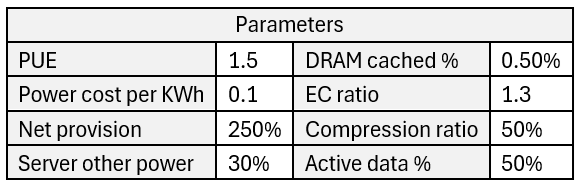
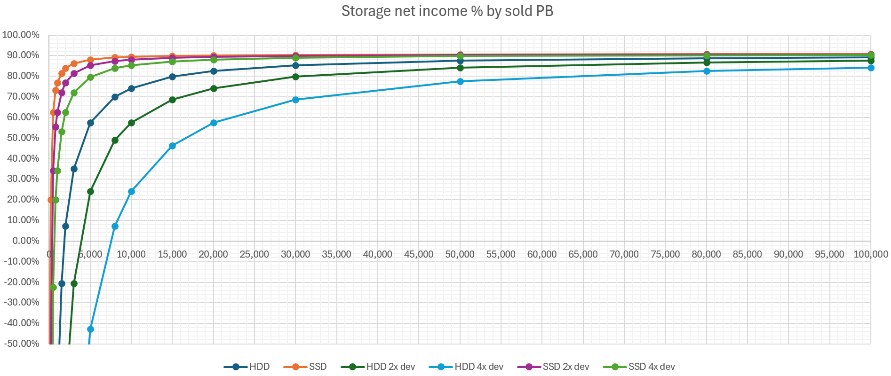

## 案例分析：EBOX

本章用一个案例来展示如何使用前文的框架进行分析。它能够帮助团队寻找前瞻性的投资方向，将技术创新映射到财务指标，规划未来 3~5 年的发展策略。

本章首先介绍什么是 EBOX，它的创新点，可能的收益与风险。接下来，本章从存储系统角度分析成本和收益、未来预期。然后，本章分析研发成本如何摊薄。最后，本章从供应商角度分析售卖 EBOX 是否有利可图。

### 什么是 EBOX

EBOX 是存储系统的一个有趣的可能的创新方向。它将传统的存储服务器进一步分解为 __硬盘框服务器 EBOX__ 和 仅剩计算功能的存储服务器。两者均可独立优化，在此基础上有一些列技术创新。有一系列来源提到了 EBOX 技术，同时介绍了 EBOX 如何工作：

  * __zStorage__ [[42]](.) : 下层存储使用双控的 EBOF 全闪存硬盘框，上层业务运行在标准服务器节点。所有业务节点共享访问 EBOF 存储节点。Vast Data 自己并不生产 EBOF 硬盘框，委托其它厂商生产，目标是让 EBOF 硬盘框变成像标准服务器一样廉价，发展生态。

  * __Vast Data__ [[43]](.) : 未找到 Vast Data 直接提及 EBOF 或 EBOX （同名但不同意，Vast Data 的指 Everything Box）。但如 zStorage 所总结，Vast Data 使用 DBox （NVMe JBOF）存储数据，CNode 计算管理集群，两者通过 NVMoF 联接。任何 CNode 可访问任何 DBox，这种共享架构大幅提高数据节点的可靠性（Availability，不是 Durability）。超长纠删码被允许使用，降低数据副本开销到 1.0x~1.1x 。

  * __NVMoF for Disaggregated Storage__ [[44]](.) : 见下图，NVMoF 带来的诸多存储架构的创新，如果数据服务器足够简单和标准化，那么可以通过 Direct Access 的方法访问 SSD，不再需要 CPU。甚至 PCIe 也可以省去，与 Ethernet 合二为一。

  * __HammerSpace NFS-eSSD__ [[45]](.) : HammerSpace 的网络文件系统首先利用 NFS4.2 协议，允许客户端跳过元数据服务器，直接访问存储节点。进一步，存储节点不再需要 CPU、DRAM、PCIe，将 SSD 直接接入 Ethernet，用定制芯片控制。

可以看到，EBOX 有一系列优势，本文基于它们分析成本收益：

  * __存储服务器与数据节点的全联接（Shared Everything）__。不同于以往数据硬盘被单一存储服务器独占，全联接架构可以将数据盘的可靠性（Availability）提高多个数量级。在此基础上，__超长纠删码__ 进一步降低数据副本开销。Fan-out 的联接有助于负载均衡。从 EBOX 到客户端的 DSR（Direct Server Return）有助于降低延迟。

  * __标准化的 EBOX 可将 CPU 替换为定制芯片或 DPU__。从 _[存储系统中的硬件](.)_ 章节可以看到，CPU 占有显著的购买开销和能耗开销。将 CPU 替换为定制芯片有助于大幅降低对应的成本。另一方面，相比传统存储服务器，定制芯片代劳了巨大的数据流量处理，从而使存储服务器 CPU 可以专注元数据层面工作，转而使用更廉价的 CPU。

  * __Ethernet SSD 替换 PCIe__。如果对 EBOX 的任何访问都来远程的服务器，来自于 Ethernet，那么其 PCIe 可以被省去，整合进 Ethernet。除了简化 EBOX 体系结构，将 PCIe 替代为 Ethernet 还可受益于近年来 Ethernet 在带宽和成本上的飞速进步。

  * __存储服务器和数据盘的 Disaggregation__。Disaggregation 设计常常有助于提高资源效率， 独立横向扩展。想象一个基于 HDD 的集群，如果数据持续变冷，则可以在保持 HDD EBOX 在线的情况下，逐步关闭配套的存储服务器，节省能耗开销。而传统服务器却无法解耦存储服务器和硬盘，单独关闭服务器而保持硬盘在线。

  * __EBOX 间的 Direct Access__。EBOX 可以和另一个（些）EBOX 直接通信，搬迁数据。数据传输过程中不需要存储服务器参与，除了启动阶段。这非常有利于实现存储系统常见的数据修复和数据迁移功能，类似于 EBOX 层面的 RDMA，存储服务器自身的带宽和 CPU 得以节省。

另一方面，EBOX 也有一系列额外成本和风险：

  * __EBOX 没有成熟方案，没有供应商和生态__。不成熟的制造意味着早期的高成本。虽然公有云可以提供大批量的订单，供应商需要思考为何参与。当然，低起点也意味着股票的高增长率、高投资回报。

  * __全联接提高数据可靠性基于假设__：EBOX 拥有比存储服务器高得多的可靠性。这是有理由的，完整的存储服务器比 EBOX 复杂得多，需要频繁升级软件、操作系统、重启。而 EBOX 足够简单，能够标准化操作。已知单独硬盘的可靠性往往远高于整台服务器。此外，双控需要额外的硬件成本。

  * __用 Ethernet 替代 PCIe 基于假设__：Ethernet 拥有比 PCIe 更低的成本，更高的带宽，并且未来增长更快。这不一定正确，PCIe 是为单服务器内传输特化的，特化很可能优于需要兼顾远近传输的 Ethernet 。更重要的是，额外的 Ethernet 建设成本。

  * __额外 Ethernet 建设成本__。存储服务器和硬盘被解耦，之间需要新的 Ethernet 联接，新的交换机、新的端口。但有办法规避，例如，将 EBOX 联接到已有网络，而不需构建新网。用 DSR 返回客户数据，存储服务器与 EBOX 只有元数据交流，甚至不需扩容带宽。

  * __研发成本，数据迁移成本__。基于全新硬件架构研发新系统并不容易，但有办法规避。例如，设计软硬件隔离层并力求只替换低层组件，或利用大规模用户摊薄成本。类似地，数据迁移成本可以摊薄，或设计价格策略引导用户自行迁移。

新技术的哪些优势有巨大潜力，哪些优势不如看上去重要，优势劣势如何映射到成本收益并系统地比较，需要更进一步的分析。

### 存储系统的成本收益

首先，可以定性地分析 EBOX 是否适用于现今的不同存储场景：

  * __高容量、低吞吐__：通常为 HDD 存储系统。适用。EBOX 带来诸多有利特性：超长纠删码降低冷数据的副本开销，将 CPU 替换为专用芯片以降低成本，关闭部分存储服务器以省电，EBOX 直接访问有利数据迁移平衡。

  * __低容量、高吞吐__：通常为 SSD 存储系统。适用。EBOX 除带来上述的有利特性外，数据链路省去 CPU，DSR 可提升吞吐量，降低延迟。

  * __高容量、高吞吐__：可以合并到“低容量、高吞吐”。

  * __低容量、低吞吐__：此场景不现实，并可以合并到“高容量、低吞吐”。

针对存储系统最昂贵的属性——延迟（_[存储系统中的硬件](.)_ 章节），EBOX 能否提供优势：

  * __有利因素__：将 CPU 替换为专用芯片，并且省去操作系统等复杂软件。虽然专用芯片的频率往往低于 CPU（能耗和稳定性约束），但延迟得益于更高并行处理能力，降低等待队列长度。

  * __不利因素__：将存储服务器与硬盘解耦，原本的 PCIe 联接被替换为 Ethernet。PCIe 的延迟在 100ns 级别，而 Ethernet 的延迟在 10us 级别，况且网络包途经额外的交换机。

接下来，针对存储系统的主要指标——容量、带宽、能耗、成本，可以基于 _[存储系统中的硬件](.)_ 章节的成本数据表进行分析。__下面展示 SSD 存储__：

  * __参数设置__：为比较 EBOX ，根据前文提到的潜在优势和额外成本，设定相应的参数。“全联接”带来的可靠性提升将纠删码冗余度从 1.3x 降低到 1.1x 。PCIe 被替换为 Ethernet。CPU 成本因替换为专用芯片而降低。分离的 EBOX 带来额外网卡开销。因早期不成熟，供应商生产成本有额外惩罚，惩罚每年递减 5% 。第 5 年因成熟标准化，没有惩罚，而成本下降 5%。

  * 其它参数复用 _[存储系统中的硬件](.)_ 章节。__单位全文统一，容量 GB，带宽 GBps，货币 \$__。

  * __购买和能耗成本表__：下表显示采用 EBOX 后，第 0 年 1GB SSD 存储对应的各组件的购买成本和能耗成本。与 _[存储系统中的硬件](.)_ 章节中 SSD 存储成本比较，可以看到成本相仿。CPU 的购买和能耗开销下降，SSD 购买成本下降，但节省的开支被供应商制造惩罚抵消。

  * __购买和能耗成本比例__：下表显示采用 EBOX 后，第 0 年的购买和能耗成本中，各组分的比例。与 _[存储系统中的硬件](.)_ 章节对比，可以看到能耗占购买成本比例下降。各组件大致比例相仿，但 CPU 的购买和能耗占比下降，对应 SSD 占比上升，DRAM 占比也上升。

下面考虑 __未来 5 年__ 硬件的性能成本变化，以 _[存储系统中的硬件](.)_ 章节的存储成本计算作为基准，比较 EBOX 的收益。__首先展示 SSD 存储__。下图分别展示不同特性对成本的影响，纵轴是节省成本的比例（越高越好）。

  * 各图例从左到右依次叠加更多特性，如 "++++ NIC cost extra" 表示开启了纠删码冗余度下降、PCIe 成本下降、CPU 成本下降、额外网卡成本，共 4 个特性（4 个 + 号）。

  * __主要成本节省来自纠删码和 CPU__。纠删码带来了 SSD 购买成本的下降，SSD 占总体成本较高，因而收益显著。另一方面，SSD 存储的高带宽带来高 CPU 成本，因而 CPU 上的改进效果明显。

  * __PCIe 替换为 Ethernet 的收益为负，但不显著__。Ethernet 成本仍然比 PCIe 高。PCIe 原本所占成本比例极小。额外网卡开销相对较小，这也是因为 Ethernet 开销原本所占成本比例相对较小。这也说明，Disaggregated 架构并不会因网络离散而引入过高的成本。

  * __总体成本节省在 20% 左右__，这需要 5 年后供应商制造成熟。5 年 20%，即年均 4% 的成本下降，可支撑多少股价上涨？结合 _[理解股价](.)_ 章节的计算，假设公司营收不变，初始利润率为 20%，则可支撑首年大致 __16% 左右的股价增长__。

  * __总成本节省比例逐年略微下降__，如果除去制造惩罚的影响，尽管下降非常轻微。主要原因是能耗占购买成本比例的上升，而纠删码冗余度下降不算进能耗节省。不能逐年下降的成本组分会逐渐增加占比，从而拖低节总节省，如 SSD 能耗、DRAM 购买成本。

__HDD 的版本__ 类似，略过相似的图表。下面展示其未来 5 年的成本变化，以 _[存储系统中的硬件](.)_ 章节的 HDD 存储计算表作为基准，进行比较。

  * __主要成本节省来自纠删码__。原因类似 SSD 存储，即使 HDD 廉价，其成本也占存储的显著比例。而 CPU 改进带来的节省不显著，因为其原本占比较小。类似地，PCIe 替换为 Ethernet 的收益不显著，额外网卡也开销不显著。

  * __PCIe 替换为 Ethernet 的收益不显著__。趋势与 SSD 存储类似。但在 HDD 存储中，PCIe 或 Ethernet 的开销更大，因为 SSD 带来的高带宽。

  * __采用 EBOX 后，各组件成本的比例变化不大__。值得注意的是，DRAM 的购买与能耗是 HDD 存储的显著成本，但 EBOX 并未对此提供改进。

  * __总体成本节省在 10% 左右__，这需要 5 年后供应商制造成熟。相比 SSD 存储，节省比例较低，原因在于 HDD 存储中 CPU 成本并不高。按相同方式换算，5 年 10% 对应年均 2% 的成本下降。可支撑首年大致 8% 左右的股价增长。

可以看到，对于 SSD 存储，EBOX 有不错的收益。最有效的改进来自于纠删码和 CPU。意料之外的是，Ethernet 替换 PCIe 并没有太多收益，EBOX 分离引入的额外网络成本也不高。

### 研发成本的摊薄

继续前文，下一个问题是，EBOX 需要多少研发成本？EBOX 需要销售多少 PB 的存储以摊薄其成本？首先，可以合理推测 __成本相关的参数__：

  * 单位 GB 的存储成本数据来自 _[存储系统中的硬件](.)_ 章节的计算。这个成本是较低的，参考此章节的公有云存储的售价对比，下面按 10x 设置销售价格（markup）。

  * 从不同国家雇佣开发者的大致月薪数据来自互联网，以美国最高。可以假设开发 EBOX 同时维持原产品运转需要 200 人。相比月薪，公司需付出 2x 的雇佣成本。

这个规模的研发团队需要销售多少 PB 的存储以 __足够支付自己的月薪__ 呢？这可以被计算出来，见下图：

  * 以最贵的美国雇佣为例，__销售 HDD 存储需要达到约 1.8K PB__。而销售 SSD 存储利润较好，只需约 1/10x PB 即可支付薪水。

  * 如果从其它国家雇佣，有希望立即将 __所需销售的存储 PB 削减一半__，而另一半将变为利润。可见跨国雇佣有巨大的潜在收益。

一个有趣的发现是，996 可以显著提升员工产出，从而削减员工数量，减少开支。见下图。当然，后文分析仍然是以正常工作时间制为准（周 40 小时）。

  * 一周 40 小时工作制下，__实际开发产出只有 40 小时的 31%__。这是因为开发工作的固定成本很高，例如已有 20% 时间用于开会，20% 时间用于运维和故障修复，20% 时间用于学习。此外，公共假日和带薪年假也占用约 9% 时间。

  * 相对于 40 小时工作制，__996 工作制可迅速将产出提高到 2.6 倍__，对应每周工作 60 小时。这是因为额外加入的工作时间不改变固定成本，直接转变为开发产出，边际效应显著。这里没有考虑长期 996 造成的疲乏。

  * 更加激进的是 早7-晚10-7天 工作制，可将产出进一步提高到 5 倍，对应每周工作 90 小时。这允许资金紧张的 Startup 显著压缩成本，等待后期规模的回报。注意，__每周工作 90 小时是 SpaceX 的常见水准__ [[63]](.)。

随着销售的存储规模增长，研发成本如何摊薄呢？下图展示随销售存储 PB 增长，__营收的变化__。单位是 \$M，周期是年度。

  * 随着销售存储 PB 增长，营收增长呈 __线性__，一分钱一分货。同样的销售存储 PB，SSD 的营收约为 HDD 的 __十倍__。

  * 如果营收过 __\$1B__，HDD 需销售约 __20K PB__ 存储，SSD 需销售约 __2K PB__ 存储。如果营收过 \$10B，HDD 需销售约 200K PB 存储，SSD 需销售约 20K PB 存储。

  * 对于全球约 \$160B 的云存储市场大小 [[46]](.)，可以推测，__\$1B__ 对应小型公有云水准，约 __1%__ 全球份额。\$10B 对应顶级公有云水准，约 10% 全球份额。

下面是关键，__净利润率__ 如何随着销售的存储 PB 变化？净利润率由营收扣除存储成本和研发成本计算。下面的计算以人力成本最贵的美国雇佣为例。下图中，可以看到剧烈的规模效应。

  * __何时开始盈利__。HDD 存储销售超过 2K PB 的临界点时开始盈利，SSD 则只需超过 200PB。尽管销售规模较小时，受研发成本拖累，亏损严重。HDD 亏损甚至能到约 -700%，SSD 能到约 -60% 。

  * __超过临界点后，不仅营收上涨，净利润率也迅速上涨__，这是极好的规模效应。普通业务往往在营收上涨的同时，净利润率下降。

  * __净利润率迅速上涨到 90%__。这是极为赚钱的业务水准。通常的经验是，制造业的净利润率在 5% 左右，尖端制造能到 15%~20%，优秀的软件业务可以达到 30% [[47]](.)。

  * __净利润率达到 80%~90% 只需约 \$1B 营收__。结合上一段，__\$1B__ 营收对应约 __1%__ 全球份额，小型公有云供应商。这意味着超高利润的规模效应，实际上并不要求很大的规模。而 10% 全球份额的顶级公有云供应商，可以稳赚巨大营收和极高净利润率。

  * __净利润率对成本不敏感__。下图额外展示了研发成本 X2、X4 后的净利润率。可以看到，具有一定规模后，翻倍的研发成本几乎不影响净利润率，后者仍然保持在 80%~90% 。业务非常健壮。

可以看到，对于具有一定规模的存储业务，负担 EBOX 的研发成本是足够的，甚至有余。当然，本文的分析相比实际作了许多简化，力求简单清晰，表明思路。

### 供应商和市场

Strategic 思考意味着不仅思考存储方自身，也思考对方一侧，这里是销售 EBOX 的供应商。成功的云存储策略需要供应商配合，尤其是新型硬件。假设供应商原本销售硬盘给公有云，本节的问题是，从供应商角度，供应商是否应该推出 EBOX 新产品销售？

作为思考的基础，可以借用 __Issue Tree Framework__（见前文 _[分析方法](.)_ 章节），将问题分解：

  * 市场需求
    * 公有云需求
    * 竞争性产品

  * 产品可行性
    * 技术可行性
    * 制造可行性

  * 财务能力
    * 潜在营收
    * 研发成本

  * 风险
    * 客户采用
    * 供应链

首先看 __市场需求__ 方面：

  * 从前文分析来看，可以和公有云联合生产设计，从而确保需求。公有云方有意通过 EBOX 获取成本优势，寻找供应商。

  * 如果抢先推出产品，则有利于超过竞争对手，扩大现有市场占有率。而公有云更可能大批量采购。

  * 从售卖硬盘到售卖 EBOX 整机，扩大了销售范围，有利于提高营收，以及附加利润。

然后看 __产品可行性__ 方面：

  * 技术可行性方面，EBOX 类似简化定制的服务器，并不是全新技术，关键在有整合和控制成本，具有可行性。

  * 制造方面，前期因不成熟引入额外成本，但可以通过售价转嫁。前文的计算可以看出，公有云方能够接受此价格的制造惩罚。

接下来看 __财务能力__ 方面：

  * 前提提到云存储市场规模 \$160B ，数据表中硬盘约占 80% 成本，假设供应商现已占有 10% 市场份额。则供应商的 __当前营收约为 \$13B__。

  * 抢先推出 EBOX 产品可扩大市场占有率。假设市场占有率从 10% 增长到到 20%，则 __营收增长为约 \$26B__。

  * 从售卖硬盘到售卖 EBOX，扩大了销售范围，进一步提高营收。从前文数据表中估算，营收提高在 13% 左右，__营收进一步增长为约 \$29B__。

  * 相比售卖硬盘，EBOX 更复杂，可提供更高的附加利润。假设净利润率从原先的 10% 提搞到 12%。供应商的 __净利润从约 \$1.3B 增长为约 \$3.5B__。

  * 从 \$1.3B 到 \$3.5B，净利润增长为 270%。假如该增长发生在 10 年间，结合 _[理解股价](.)_ 章节的计算，可支持 __平均每年 10% 的股价增长__。收益良好。

  * 研发成本方面，公有云带来的大批量采购能够摊薄成本。并且，EBOX 不是全新技术，其成本大头的硬盘是供应商经验成熟的领域。即使 200 人的研发成本，利用前文数据表计算，也 __只占 \$13B 的不到 1%__ 。

最后是 __风险__ 方面：

  * 公有云是否愿意持续大批量采购 EBOX 产品是一大风险。从供应商角度，最好避免绑定大客户，同时也向私有云销售 EBOX，并根据实际营收逐步提高投入。

  * EBOX 相比单纯售卖硬盘多出许多组件，其中 CPU 占第二大硬件成本。可从较通用的如 ARM CPU 开始推出产品，在之后几代才考虑更定制化的 DPU 或专用芯片。可以在“允许定制”之名下，把软件成本转嫁给公有云客户。

通过以上浅显的分析，可以看出从供应商角度也能从推出 EBOX 产品中获利，甚至收益良好。
