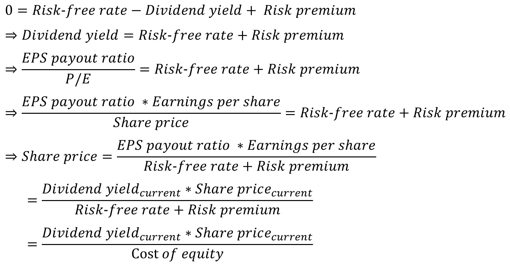

## 股价的分析

从公司角度，极为重要的目标是股价的增长。什么样的股价增长是合理的？如何将股价的增长映射到实际产品？对于部门或团队，需要完成什么样的目标以支撑股价？

这个目标进一步分解为团队 3~5 年的计划，映射到 Vision 和 Strategy。换句话说，股价的分析可以告诉团队，应该做到多好。

### 股价由什么构成

理解股价的关键是 __市盈率（P/E，Price-earning ratio）__。英文原文更容易理解：股价 vs 收益的比率。

  * 把股票想象成一张存折，市盈率的倒数就是它的 __利率__。其中，股价是 Share price。

其中，收益对应 __每股盈余__（EPS，Earning per share）。英文原文直白为，每股的收益。由公司的 __净利润__（Net income）除以股票总数（Average common shares）得到。

  * 公式中，优先股息（Preferred dividends）是优先股（Preferred stock）的股息。可以 __忽略__，通常总量较小，甚至很少使用 [[38]](.)。

将每股盈余，代入到市盈率的公式，可以发现：

  * 市盈率的倒数，是公司盈利除以公司市值（所有股票之和）。把公司想象成一张巨大的存折，市盈率的倒数就是“公司存折”的 __利率__。

  * 换一种理解，市盈率计算，“公司存折”需要多少年，其“利息”才能付清市值。即市盈率指多少年公司 __“回本”__。

上文中的“公司存折”的利率，实际有多高？以 MSFT [[39]](.) 为例：

  * 利率 = 1 / P/E = 1 / 37.32 = __2.68%__。

  * 对比，三十年美国国债利率是 __4.6%__ [[40]](.)。（同期三月美债利率更高，约 5.3%。）

美债利率甚至高出上述“公司存折”的利率许多。相对股价，公司的盈利能力不如购买无风险的国债。为什么？

  * 交易者认为尽管公司目前盈利能力不足，但未来 __股价可能升值__，因此持续买入，造成股价上涨，市盈率上升。

  * 换句话说，股价升值的期望被市盈率反映。或者说，__市盈率反映公司未来的预期__，即对股价上涨的预期 [[42]](.)。

  * 如果公司预期变好，股票被更多买入，市盈率上升。反之， 公司经营不善，市盈率下降。如果希望公司维持当前业绩，__市盈率应该保持平稳__。

另一面，净利润可以继续分解，映射到市场规模：

  * 净利润等于公司的 __营收__（Revenue）乘以 __净利润率__（Net profit margin）。

  * 营收可继续分解为 __市场规模__（Market size）和 __市场占有率__（Market share）。

由此，可以总结股价的构成：

  * 首先是公司的 __盈利能力__，取决于市场规模、市场占有率、净利润率。盈利与公司市值对比，反映为利率形式，对应市盈率的倒数。

  * 然后是交易者对 __公司未来的期望__，也由市盈率反映。其与无风险国债利率对比，可反映信念的强烈程度。

### 股价应该涨多快

股价应该上涨得多快？其应该能覆盖机会成本和风险溢价（Risk premium），否则交易者会选择卖出股票，购买无风险的国债。除股价上涨外，股票给持有者的另一收益是股息（Dividends）。

  * __机会成本__ 对应无风险利率（Risk-free rate），通常由短期国债利率衡量。

  * __股息收益率（Dividend yield）__，每股按股价比例给持有者的分红收益。

  * __风险溢价__，股票风险高于国债，交易者要求额外的回报。

首先来看股息收益率如何计算。股息来自于公司净利润，按比例取出后，发配到每股。

  * 如果只求简单，股息收益率一般可以从股票交易网站上直接 __查询__ [[41]](.)。

  * __股息收益率__ 可以分解为股票配息率（EPS payout ratio）除以市盈率。市盈率越高，股票收益率越低。

  * __股票配息率__ 指公司净利润中，有多少比例分配为股息；又等于每股盈余中，有多少比例分配为股息。股票配息率一般不受股价波动影响。它也可以在股票交易网站上查询。

接下来看风险溢价的计算，这里使用常见的 CAPM [[45]](.) 资产定价模型。

  * __风险溢价__ 可由 Beta 系数乘以股权风险溢价（ERP，Equity risk premium）得到。

  * __Beta 系数__ 反映某只股票的股价，相对市场均价的波动幅度 [[43]](.)，通常可在股票交易网站上直接查询 [[39]](.) 。

  * __股权风险溢价__ 由预期市场回报（Expected market return）减去无风险利率得到。预期市场回可以股指基金得到，常用选 S&P 500 [[46]](.)。无风险利率前文已经讲到。

  * CAPM 中的 __股本成本（Cost of equity）__ 正是前文提到的无风险利率，与这里的风险溢价之和。股本成本不取决于股价，而是由市场背景决定。

套用之前的公式，现在可以计算股价应该上涨多快。以 MSFT 股票为例：

  * 无风险利率取值自三十年美债，4.6% 。股息收益率直接查询，取 0.72% 。Beta 系数直接查询，取 0.89 。预期市场回报取 US S&P 500 过去五年的平均增长率，12.5%（惊人）。

  * __股价上涨（年）__ Share price growth = 0.046 - 0.0072 + 0.89 * (0.125 - 0.046) = 10.9% 。可见，该股价 __一年需上涨 10.9%__，以满足交易者成本收益平衡。

  * 相对高的股价上涨要求，一方面来自于当年较高的美债利息，另一方面来自于美股大盘高启的走势。

可以看到，在高利率牛市下，交易者对公司盈利要求苛刻。如果股价达不到预期，交易者将因机会成本或风险溢价导致亏损，从而卖出股票，降低市盈率和股价。最终的 __股价平衡点__ 在哪里？假设股价不再变化：

  * 继续上文的取值，股价取 $420。其它同上。假定股票配息率不变（26.9%），每股盈余不变（$11.25）。股价降低、市盈率降低，会提高股息收益率，从而平衡机会成本和风险溢价。

  * __稳定点的股价__ Share price = (0.0072 * 420) / (0.046 + 0.89 * (0.125 - 0.046)) = 26.0 。此时，市盈率为 2.31，股息收益率为 11.6%。此时，股息收益率正好等于股票的 __股本成本__，11.6%。

  * 除了股价低，这看上去是一支不错的股票。确实，有许多类似的真实股票 [[47]](.) ，低股价、高股息收益率、低市盈率。注意本文只作理论分析，不构成任何股价涨跌预测，不构成任何投资建议。

还有一些额外推论：

  * __股票上涨预期与公司市值无关__，假设忽略股息收益率，科技公司的通常很低。从上文公式可以看到，交易者要求的股票上涨幅度取决于市场背景利率和风险。公司股价、市值甚至不在公式中（忽略股息收益率）。

  * __高股价是负面作用__，现在考虑股息收益率。它取决于公司因素，由每股盈余、股票配息率决定。股价出现在分母，会拉低股息收益率，从而更难满足股票上涨预期。

  * __高市盈率是负面作用__。同理，因为它出现在股息收益率的公式的分母。高市盈率意味着，公司盈利能力不足，但股价较高。

本节已经展示，从交易者的角度，预期股价应以多快速度上涨，以保持市盈率和股价的稳定。那么，从公司角度，应该如何促使股价上涨以符合预期？

### 什么推动股价增长

前文提到市盈率反映交易者对公司未来的预期。为保持公司市盈率和股价的稳定，如何促使股价按预期上涨？从股票构成的公式中可见：

  * 首先，股价需要足额上涨，以跑赢无风险利率和风险溢价，即 __股本成本__。科技公司通常股息收益率都很低。

  * 股价上涨的动力来自于公司净利润，__净利润需要和股价等比例上涨__，以支撑股价。

  * 净利润展开为 __市场规模、市场占有率、净利润率__，它们是寻求增长的方向。

  * __造梦__。即使公司盈利能力不变，通过编织交易者对未来的乐观预期，也可推高市盈率，从而抬升股价。

从公司角度，上策是寻找高增长的新兴市场：

  * 例如，全球 __云存储市场__ 以每年 20% 以上的速率增长 [[36]](.)。单单进入这一市场，即有望满足前文中 11.6% 的股本成本。甚至不需要比同行更加优秀，类似搭便车。

  * 相比成熟大型企业，__小型新兴公司__（SMB）没有存量市场负担。它们反而拥有更加良好的股价上涨动力。

  * 科技、创新、新市场对于维系股价是必要的。

其次，公司可以寻求增加市场占有率：

  * 增加市场占有率意味着 __和竞争对手争夺__，公司业绩必须比同行更加优秀。这是艰难的方向。

  * 另一方面，这意味着在低增长的存量市场中，公司更难完成股价增长预期。大型成熟并不一定是优势。

下一个方向是提高净利润率：

  * 良好的路线是出售 __高附加值产品__，发挥比较优势，提升科技水准，提高市场认可等。

  * 另一条路线是，寻找 __规模效应__。随着规模扩大，固定成本降低，净利润率提高。

  * 常见的路线是 __降本增效__。当净利润率偏低时，降本增效更加有效。见下图。

此外，公司可以通过造梦来提高市盈率：

  * 市盈率反应交易者对股市预期，__造梦__ 提高预期、卖概念，而不要求公司盈利能力提升。

  * 此方法适合前期投入大，有 __规模效应__ 或 __科技积累__ 的业务。而一旦造梦破裂，股价可迅速下跌。

最后，真实公司的股价上涨是什么样呢？还是以 MSFT [[48]](.) 为例：

  * 公司整体营收以 17% 同比增长，而 __净利润__ 甚至增长更快，达 20%。表现出色。

  * XBox 营收增长达 62%，Azure 云服务增长达 31%，Dynamics 365 增长达 23%，智能云增长达 21%。它们 __远超股本成本__ 11.6%。

  * 此外，Office、Windows、搜索、LinkedIn 都有不错的增长，在 10% ~ 15% 间。

### 团队的目标

股价分析帮助搭建一个从上到下、从公司顶层到具体团队的框架，明晰该以什么目标工作:

  * __公司__ 需要股价涨幅达到交易者预期，覆盖股本成本（股价应该涨多快）。

  * 增长目标 __分解__ 到市场规模、市场占有率、净利润率、造梦（什么推动股价增长）。

  * 对于具体 __团队__，则需要制定计划以完成上述增长。

  * 对应到团队管理的某个 __产品__，需其市场规模、市场占有率、净利润率等达到增长目标。

具体的增长目标是多少呢？

  * 从前文分析，以 MSFT 为例，增长目标是年度 __10.9%__ 。

  * 对于其它公司，按照前文公式 `4.6% - 股息收益率 + Beta 系数 * (12.5% - 4.6%)` 计算。股息收益率和 Beta 系数与股票相关，可直接查询 [[39]](.) 。计算结果通常在 __11%__ 左右（互联网科技公司）。

  * 对于占有新兴市场的产品，甚至要求其增长 __超过__ 上述增长目标，以弥补公司处在市场衰退期的产品。

  * 普通产品应达到上述目标，作为公司的 __平均值__。它们是公司的大多数。然而，11% 的平均要求并不低。

  * 而 __低于__ 平均值的产品是可能的。这意味着它们处于市场衰退期，员工面临裁员风险，职业发展空间受限。

  * 本质上，增长目标是要求跑赢股市大盘以及国债利率。

最后的问题：

  * 对于 __个体员工__，如何完成至少 11% 的年平均增长要求？注意是每年如此。（你拖公司的后腿了吗？）

  * 对于 __团队__，如何制定 3~5 年的计划，确保每年 11% 或以上的增长？这就是需要 __Vision 和 Strategy__ 的地方了。

--------

本文是个人非专业的分析，所有文章仅表达作者个人观点，不构成对所述资产的任何投资建议。
