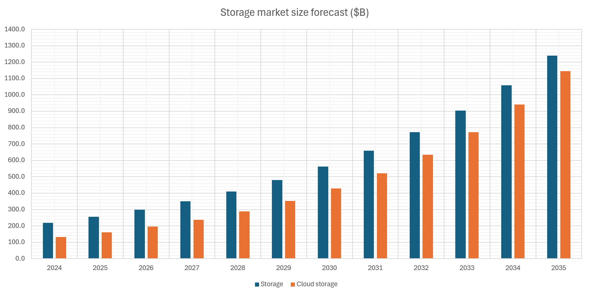
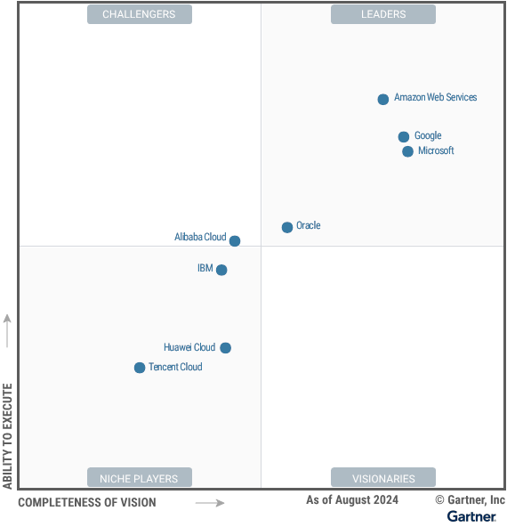

## 俯瞰存储市场

商业策略分析通常可以分解为客户、产品、公司（自身）、竞争对手层面，进一步深入（下图）。客户、产品、竞争对手可归结为“市场”格局。本章将调研存储系统的市场，列举市场的主要分区、产品特性、参与者。之后章节将进一步深入。

在不断变化的市场格局中，我们处于什么位置？3~5 年、或 10 年之后，市场版图又会如何变化？理解市场是 Vision 与 Strategy 的基础。围绕市场，可以逐步揭示其结构和发展空间，什么是价值，需求，演化周期，以及背后的驱动因素。

### 分类

第一个问题是如何将存储市场分类？本章使用如下分类来组织内容。后面各小节标题前的字母对应分类组。

  * A. 经典的分类是 __云存储和主存储__。云存储来自公有云。主存储（Primary Storage）[[49]](.) 一词多由 Gartner 使用，指部署在客户本地数据中心，服务关键数据的存储系统，通常为传统存储厂商。主存储也被称作“企业存储”（Enterprise Storage）。企业本地使用的另一大类存储是 __备份和归档__ 系统。

  * B. 按使用接口，存储可分类为 __对象、块、文件__ 系统。对象存储服务由 Key 查询的不可变 BLOB，通常为图片、视频、虚拟机镜像、备份镜像等。块存储通常由虚拟机使用，作为其磁盘挂载。文件存储由来已久，存储目录和文件，可由用户直接使用，常见的是 HDFS、NFS 等。此外 __数据库__ 也可看作存储。

  * C. 按存储介质分类，存储可分类为 __SSD、HDD、磁带__ 系统。SSD 存储昂贵、高性能，常用于文件系统和块存储。HDD 存储廉价、通用，常用于对象存储，或存储冷数据。磁带存储一般用于归档存储。此外，还有全 __内存__ 的存储，一般用作缓存或分析型数据库。

上述对存储市场的分类是经典且常用的，也为本章讲解方便。但事实上，存储市场中的产品更为有机，为渗透对方市场、获得竞争优势，它们 __互相交缠__。例如：

  * A. 云存储也售卖贴近客户的本地部署的 Edge 存储，如 AWS S3 Express。主存储也提供云端部署和云端卸载的版本，如 NetApp ONTAP。备份和归档也是云存储的一大卖点，如 AWS Glacier。

  * B. 对象存储正变得越来越像文件系统，如按文件系统的 AWS S3 Mountpoint，如支持对象上的元数据和搜索，支持层级的对象路径。数据库有 Key-Value 接口的产品如 RocksDB，而 SQL 数据库也往往支持非结构化数据，类似存储对象。块存储不单用于虚拟机磁盘，也可为数据库提供 Page 存储。另外，各种存储系统的底层也可统一到共享日志系统，如 Azure Storage，Log is Database 设计。

  * C. SSD 存储常常将冷数据卸载到 HDD 存储，以节省 SSD 的昂贵成本。HDD 存储常常将 SSD 作为缓存，或 Write Staging。内存被用作各种存储介质的缓存和索引，而内存存储系统也往往支持将冷数据或日志写到 SSD。

此外，为了简洁，本章省略了一些次要的分类。例如，

  * 按用户企业规模，可将市场分类为 SMB、大型企业、特殊领域。

  * 企业存储也常按 DAS、SAN、NAS 分类。这个分类与对象、块、文件存储部分重合。

  * 除磁带外，归档存储还可使用 DNA 技术，如今正在快速发展。

  * Cyberstorage 是在 Ransomware 背景下的新兴存储分类，不过更多地是作为安全功能集成在已有产品中。

  * 向量数据库是在 AI 背景下的新兴数据库类型，而传统数据库也往往集成向量支持。

### A. 云存储

关于预测市场未来的方向，咨询公司的分析报告是良好的信息来源。尽管报告付费，但通常有 __额外来源__：

  * 头部公司通常愿意提供免费的公开版本，作为公司的自我宣传。

  * 博客、报道尽管不是第一手资料，但也能反映主要内容。一些博主有专门渠道。

  * 在 Google 搜索前加入 `filetype:pdf`，可有效找到资料。

  * 在 Google 搜索后加入 `"Licensed for Distribution"`，可找到 Gartner 公开的文档。

  * 切换英文、中文搜索可以找到不同内容。中文社区可能保存一些文档。

  * 此外，阅读主导产品的用户手册也可了解领域的主要功能和评估指标。

Fortune 预测全球云存储市场规模在 \$161B 左右，约 21% 年增长率 [46]。相比之下，全球数据存储市场规模在 \$218 左右，约 17% 年增长率 [[60]](.)。可以看到：

  * 云存储市场有 __极好的增长率__。结合 _[理解股价](.)_ 章节可以看到，该增长率十分有利于支撑股价，而不太需要从挤压竞争对手或削减成本方面下手。

  * 在十年之后，__数据存储将完全被云存储取代__。这是由于云存储规模占比已经较高，且增长率快于数据存储整体。至少从预测来说如此。

从 Gartner 的云基础设施的魔力象限中 [[61]](.)（2024），可以找到市场的头部参与者：

  * __Amazon AWS__：持久的领导者。AWS 在全球拥有大规模的基础设施、良好的可靠性和生态系统。AWS 是寻求可扩展性和安全性的企业的首选。然而，其复杂的服务对于新用户来说可能有挑战。

  * __Microsoft Azure__：领导者。Azure 得力于混合云能力、与微软产品的深度集成，以及与 AI 领导者 OpenAI 的合作。Azure 的行业特定解决方案，以及协同战略，对企业有引力。然而，Azure 面临扩容挑战，也受到安全方面的批评。

  * __Google GCP__：领导者。在 AI/ML 创新领域领先，Vertex AI 平台备受好评，云原生技术独树一帜。在环境可持续、AI 服务方面，GCP 对数据为核心的组织很有吸引力。然而，GCP 不足于企业支持和传统工作负载迁移。

  * __Oracle OCI__：领导者。OCI 强于提供灵活的多云和主权云方案，吸引需要强大集成功能的企业。其在 AI 基础设施的投资、与 NVIDIA 的合作，巩固了市场地位。然而，OCI 的生成式 AI 服务和弹性架构仍不足。

  * __Alibaba Cloud__：挑战者。作为亚太区的主力，阿里云在国内市场的电子商务、AI 服务方面领先。尽管拥有出色的合作伙伴生态，阿里云在全球拓展方面受限于地缘政治和基础设施。

  * __IBM Cloud__：特定领域。IBM 借助混合云和面向企业解决方案的优势，与 Red Hat OpenShift 无缝集成。其解决方案对受监管行业有吸引力。但不足于产品组合分散，以及 Edge 战略不完善。

  * __Huawei Cloud__：特定领域参与者。华为是新兴市场的关键参与者，优势于电信领域的集成云解决方案。在 AI/ML 研究方面出色，并在高需求的企业环境中取得成功。然而，地缘政治紧张局势和制裁限制了其全球扩张。

  * __Tencent Cloud__：特定领域参与者。对可扩展和分布式应用优化，在社交网络集成方面独具优势。然而，其全球合作伙伴生态为有限，并且在成熟度上与全球同行存在差距。

云存储应该提供哪些 __主要功能__？Gartner 的云基础设施计分卡 [[62]](.)（2021）比较了各大公有云厂商，从中可以看到栏目列表，见下图。可以看到 AWS 的强劲实力。

另一方面，可将云存储看作逐步将传统存储的功能搬到云上，用主存储对标云存储。从这个角度来看，云存储应该具备哪些功能？哪些是主存储已有，而云存储未来可能发展的方向？有哪些衡量存储的关键指标？见下一节主存储。

### A. 主存储

本文将主存储对应于云下本地部署的企业存储，服务关键数据，这是存储由来已久的传统领域。其增长率大致对应存储市场的大盘，由 [[60]](.) 及其配图可见，年增长率在 17% 左右，正逐步被云存储取代。当然，实际上主存储已经与云深度结合。

从 Gartner 的主存储魔力象限中 [[59]](.)（2024），可以找到该市场的头部参与者：

  * __Pure Storage__：持久的领导者。通过 Pure1，向用户提供主动 SLA，有利 IT 运维。融合的控制面无需外部云通信和 AIOps 的以来。DirectFlash Module 直接操作裸闪存，推动硬件、SLA、数据管理的创新。但是，Pure Storage 在美国外的用户多元化方面落后，生命周期管理计划增加了阵列的资产和支持成本，不支持计算、存储分离。

  * __NetApp__：领导者。NetApp 提供 Ransomeware 恢复保证，不可变快照。通过 Keystone 策略和 Equinix Metal 服务简化 IT 运维。BlueXP 控制面提供 Sustainability 监控管理能耗和碳排放。但是，NetApp 不为块存储提供有竞争力的 Ransomeware 检测保证，系列产品不支持更大的 60TB/75TB SSD 盘，不支持计算、存储分离。

  * __IBM__：领导者。IBM 消费计划提供产品生命周期、升级的统一定价，提供能耗效率的保证。Flash Grid 分区、迁移，持续优化负载，跨平台。但是，IBM 不提供容量优化型 QLC 阵列，不在块存储上提供文件服务，本地闪存部署不支持性能、容量分离。

  * __HPE__：领导者。HPE 的 Alletra 服务器允许用户独立扩展容量和性能，以节省成本。GreenLake 可以在本地和 AWS 相同地部署，混合管理。负载模拟可为用户提供整全局的关于性能和容量的负载放置建议。但是，HPE 供应商在 Sustainability 和 Ransomeware 方面落后，不支持更大的 60TB/75TB SSD 盘，产品-负载组合存在混淆。

  * __Dell Technologies__：领导者。收购 EMC 后，Dell 拥有灵活的全线存储产品，APEX 提供跨本地和云的多云管理和编排。PowerMax 和 PowerStore 提供行业领先的 5:1 数据缩减和 SLA，与 Data Domain 数据备份整合。但是，Dell 不提供适用中端、高端的统一存储操作系统，这带来管理复杂度。

  * __华为__：挑战者。华为的多层 Ransomeware 防护优秀，采用网络协作。闪存阵列提供三年的 100% 可靠性和 5:1 容量缩减保证。NVMe SSD FlashLink 支持高磁盘容量，由 ASIC 引擎加速。但是，华为在北美地区受限，不提供对 AWS、Azure、GCP 的多云扩展方案，客户集中于少数垂直领域而增加风险，多款存储产品许可过于复杂。

  * __Infinidat__：挑战者。Infinidat 在高端全球企业市场享有口碑，提供高质量的服务。SSA Express 能够将多个较小的闪存阵列整合成更经济的单台 InfiniBox 混合阵列。在遭受网络攻击后，可从不可变快照中恢复数据。但是，Infinidat 缺乏中端产品，InfuzeOS 云版本限制为单节点架构，SSD 仅支持 15TB 硬盘。

  * __Hitachi Vantara__：挑战者。Hitachi 允许用户在安装后五年内升级到下一代解决方案，以减少碳排放。EverFlex 简化用户订阅的流程，基于实际使用付费。EverFlex Control 将功能模块化，允许用户根据平台定制需求。但是，Hitachi 在 Ransomeware 检测上落后，不提供计算存储的分离扩展，用于备份的 QLC SSD 方面落后。

  * __IEIT SYSTEMS__：特定领域参与者。IEIT 拥有独特背板和四控制器设计，自主负载均衡，可扩展至 48 控制器。提供在线反 Ransomeware 功能，通过快照回滚。Infinistor AIOps 工具提供性能工作负载规划和模拟。但是，IEIT 在中国市场之外不为人知，在全球多云扩展方面落后，独立软件供应商（ISV）生态方面落后。

  * __Zadara__：特定领域参与者。Zadara 提供全球化的高技能的托管服务，基于低成本的对象存储和 Disaggregated 的 Key-Value 架构，利用灵活的生命周期管理来减少硬件浪费，多租户环境中的硬件可被动态重组。但是，Zadara 提供的 SLA 有限如 Ransomeware 保护，商业规模和覆盖范围较小，第三方集成和 ISV 依赖于托管服务商。

主存储应该具备哪些功能？结合上文的魔力象限报告 [[59]](.)，Gartner 主存储关键能力报告 [[64]](.)（2023），企业存储主流趋势报告 [[66]](.)（2023），可以看到：

  * __Consumption-based 售卖模式__：与传统购买整套存储软硬件不同，而是类似云服务，按实际消耗量付费。相应地，SLA 按照用户端的指标重新定义，如 99.99% 可用性。Gartner 预测 2028 年将有 33% 企业投资采用 Consumption-based 模式，从 2024 年的 15% 迅速增长。关联概念：Storage as a Service（STaaS）。

  * __Cyber liability__：针对 Ransomeware 的检测和保护正成为企业标配，例如文件锁、不可变快照、网络监测、主动行为分析、Zero Trust 等功能 [[65]](.)。Gartner 预测 2028 年将有 2/3 企业采用 Cyber liability，从 2024 年的 5% 迅速增长。

  * __软件定义存储（Software-defined Storage，SDS）__：SDS 将用户从厂商专有硬件中解放，提供跨平台的、更灵活的管理方案，利用第三方基础设施，降低运维成本。另一方面，SDS 允许分离部署计算和存储资源、独立弹性地扩展，改善经济效益。__AIOps__ 功能变得重要，常与 SDS 结合。利用公有云的 __混合云__ 功能变得常见，该功能也常归于 SDS 名下。

  * __高级 AIOps__：例如实时事件流，主动的容量管理和负载均衡，持续优化成本和生产力，响应关键运维情形如 Cyber Resiliency 配合全局监控、报警、报告、支持。

  * __SSD / 闪存阵列__ 增长迅速。Gartner 预测 2028 年有 85% 的主存储是闪存阵列，从 2023 年的 63% 逐步增长，而闪存价格可能下降 40%。__QLC Flash__ 正普及，带来 60TB/75TB 的超大 SSD 盘，具有更好的能耗、空间、制冷效率。

  * __单平台支持文件和对象__（Single Platform for File and Object）。针对非结构化数据，同一存储平台同时支持文件和对象。融合的系统节约成本，Multiprotocol 使管理简化。文件和对象本身有相似性，图片、视频、AI 语料文件的使用方式近似对象，而对象加上元数据和层级路径后类似文件。

  * __混合云文件数据服务__（Hybrid Cloud File Data Services）。混合云为企业提供跨越 Edge、云、数据中心的统一访问和管理，命名空间一致，无需拷贝。企业能够在 Edge 对数据作低延迟访问、大批量的 Ingestion，在数据中心作复杂处理，在公有云存放冷数据和备份。可以看到传统存储产品纷纷上云，公有云纷纷开发 Edge 部署。

  * __数据管理服务__（Data Storage Management Services）。类似数据湖，数据管理服务读取元数据或文件内容，对数据进行分类（Classification）、洞察、优化。它跨越多协议，包括文件、对象，NFS、SMB、S3，跨越不同数据服务如 Box、Dropbox、Google、Microsoft 365。安全、权限、Data Governance、数据保护、Retention 也在议题中。在非结构数据快速增长的背景下，企业需要从数据中提取价值，并按重要性管理。

  * 其它常见特性，例如：__Multiprotocol__ 支持多种访问协议。__碳排放__ 的持续测量、报告、能耗控制。__定制的 NVMe SSD 产品__，以加强性能、耐用。__无干扰的迁移服务__，从当前阵列到下一阵列，其间保证 100% 的数据可用性。__NVMoF__ NVMe over Fabric 是 NVMe 原生的 SAN 网络。__Container Native Storage__ 为容器和 Kubernetes 提供原生存储挂载。__Captive NVMe SSD__ 为 SSD 配备智能处理芯片，类似智能网卡，可将部分计算任务下推。

  * 主存储需要支持的 __关键用户场景__：OLTP 在线事务处理，虚拟化，容器，应用整合（Application Consolidation），混合云，虚拟桌面基础设施（VDI）。

  * 主存储的 __关键能力指标__：性能，存储效率，RAS（Reliability, availability and serviceability），Scalability，Ecosystem，Multitenancy and Security，Operations Management。

// TODO Listen to customer feedback, the link: https://mp.weixin.qq.com/s?__biz=Mzg3MDY0OTQ0NA==&mid=2247490321&idx=1&sn=45cd7ac08aaba1100f40f74c9989d58e

// TODO 招标文件，Listen to customer：https://mp.weixin.qq.com/s?__biz=MzI4OTc4MzI5OA==&mid=2247544948&idx=6&sn=e89031d33a1b7f753095164b022ae80d&chksm=ec2b9b19db5c120fd39a521a1d5014dc866fb7aff39cb741c2df54e22562722a1008067f3b87

// TODO Tech radio tornado
https://www.smartx.com/blog/2022/08/gartner-hype-cycle-storage/

### A. 备份归档存储

// TODO 市场规模，增长率
// TODO Core capabilities

### B. 文件存储

// TODO Where is VAST DATA? https://www.vastdata.com/press-releases/leader-in-the-2024-gartner-magic-quadrant

### B. 对象存储

### B. 块存储

### B. 数据库

// TODO 强调会略过内容

### C. SSD 存储

### C. HDD 存储

### C. 磁带存储

### C. 内存存储

------------------------------------------

// TODO 用 Issue tree framework 开始，市场分析包括哪些部分：市场、参与者、产品
// TODO 市场本身、规模、增长率。市场分区。vs 市场主要参与者。vs 产品。

云存储、主存储、Backup
文件、块存储、对象存储、数据库

// TODO 主要功能列表，Critical capabilities
    1. + Documentation. + Customer support.
// TODO Evaluation matrix

// TODO 公有云、私有云分界
// TODO 利用gartner作导航
// TODO 列举主要vendor和其特点
// TODO 市场分析帮助vision和strategy认识我们在市场所处的位置

// TODO 市场、竞争对手
// TODO 什么是价值
// TODO 需求和驱动
// TODO 优势

externally, how we handle the scale. how we handle the competitors? how is the storage and cloud technology trends after 10 years?
think how we will be doing after 3 years 5 years 10 years.
what's the industry doing from 10 years past? compared to now to 10 years after?

Understand storage competitor & eco. Multiple lanes: 1) Cloud AWS/Google 2) Classic commercial SAN/NFS vendors 3) Data back/management vendors 4) Opensource community.
Externally, position of the world storage industry and academy

市场->产品->我们的位置->发展空间->什么是价值->需求变化->演化周期->驱动因素

文章-市场：分解为市场结构规律，创新，市场分区，政策问题，主要vendor，各分区主要产品和特点、Gartner比较，产品，什么是价值，需求驱动，发展空间，我们的位置

市场分析
    ….
Search “How come the gap of Azure vs AWS market share”
    关于市场发展规律，市场结构、创新突破的分析

产品
    ….
Distinctive advantage – Search “Distinctive advantage” see analysis
Search “什么是真正有价值的资产”

发展空间
    Search “发展的另一驱动是市场需求”
发展的驱动力是什么，什么驱动需求？
不同维度，分章节
        技术
        需求、消费者
        硬件
        市场老化、融合、换代

我们的位置
Where we are in the market
    Comparative tracks, vendor landscape
    Market, producer, consumer, us.

What's value
    The analysis of what's our key value other than tech
    What should be our invest
    各种反直觉结论的列表

创新和商业模式演化周期 -> 通过市场分析+竞争对手，定制5年业务发展天花板，和路线。

Driving factors behind -> market, customer, technology parts
Technology spectrum in storage industry landscape -> breakdown of the market and technology parts

Hardware price calculation
    Lanscape and growth strategy

市场    // Search “Breakdown storage product abilities into axes”。 Search “市场中Efficiency的变更”
    竞争对手
    垄断性 – 天然市场结构
    市场整体大小，增长率
    能否transform相邻的、现存市场
    1+1 > 2模式，模块循环feedback促进效应
    市场天花板
        什么时候进入高速增长期
        什么时候进入低速增长期
        天花板在哪里
        市场需求的产品以及类型
            Gartner score card 以及 收集的赛道 和产品特性
        增长模式：线性，指数，递减

2023年企业级存储主要发展趋势- https://mp.weixin.qq.com/s?__biz=Mzg3MDY0OTQ0NA==&mid=2247490328&idx=1&sn=c467bcc73b5308c43c1d4ce38ee7e6cb

5. possible direction to drill down vision. Breakdown storage product abilities into axes. Project how they can reach in market demand vs technology support, and what are the possible things we can do in the next years.
•	Project market demand
•	Project technology support
o	Hardware trends
o	Software abilities
•	Project competitors
•	Where are we
•	Where we will be in the next 3~5 years

1. market demand
    1. The best way is you have customers, you do market research, you buy analytics reports.
    2. I don't have that. I need to use the past and current status to project.

2. disruptive innovations
    1. I have to ignore that. Because all analysis are linear that based on projection from the past. disruptive innovations are hard to predict.
2. but disruptive innovations are important. we can study the seed investments, startups, new tech adoption/propagation trends, etc to find
3. A list of future promising technologies that we can take into picture and build another projection based on it.

市场占有替代过程，商业功能替代
新技术、新场景催生的新可能
新市场的成熟化：数据收集->数据大量存储->数据查询。
市场中Efficiency的变更：一个人管理一台电脑，到一个人管理1PB数据，到一个人管理一个数据中心
Competitor analysis: our position, predict the missing feature, predict the gap of non-functional properties.

Internal software maintenance cost. Software is viewed as a middle layer to expose hardware ability to customer. So
•	The true value of software layer is to provide functionalities. To manage the hardware resources.
o	Functionality is a key competitor in 2B software.
	把企业应用的复杂性分解为数据、权限、流程、算法、集成、报表等六个维度 (https://mp.weixin.qq.com/s/OXCBORheAx99o3fS-ZfUdg)

6. Our storage product architecture designs are based on assumption like below. What if the assumptions changed?
1) Networking speed is much faster than storage and CPU.
2) HDD favors sequential access. SSD also mostly favors sequential access.
    3) Commodity hardware can scale out to match performance of commercial hardware.

7. How likely is cloud storage becoming a pipe provider, just like what happened to Telecom vs Apps.
    E.g. Snowflake, Hammerspace use Cloud to build their service from much lower cost than traditional vendors when entering the market.

8. Distinctive advantage, doesn’t show up at how disciplined your engineers are to be involution with each other. But at
1) Distinctive way to organize engineering pipeline. E.g. SpaceX vs traditional rocket manufacturing. E.g. Chrome updating model vs MS office/OS update. E.g. Chrome plugin store vs Edge.
2) Technology with large scale and complex engineering accumulation that made impossible possible. E.g. AWS cloud. E.g. Apple phone.
3) Quality control, delivery control. Just to run faster than other competitors.
4) Connections and trust with customers, partners, governments.
5) Business model that deems to have advantage and made possible eventually. E.g. Alibaba Taobao selling vs traditional retails.
    6) Large amount of production data, many heavy users already been using the system for core usecases for many years. Especially for storage, filesystem, database vendors

9. 发展的另一驱动是市场需求
    Paradigm shift式的需求
        例如，苹果智能手机
                             例如，Cloud-native DB 取代机房部署DB，Scale-out DB取代固定机器数DB。
    安全、隐私、合规等的需要
        例如，GDPR合规，隐私数据删除
        例如，数据主权，跨区存储
        例如，Ransomeware保护
    渐进式发展
        更丰富的功能
            例如，云数据库支持分钟级time travel
            例如，对象存储支持更多功能，与数据库接近
                                            例如，DynamoDB支持transaction，曾经式KV。
                                            例如，单节点数据库如今都向Scaleout SQL发展。NoSQL逐渐被NewSQL取代。Aurora Serverless.
                                            例如，数仓变得支持数据可变和版本。变得支持机器学习和特征工程
                                                // TODO Give a dimension decomposition to all possible feature sets.
                                             Many comes from finer and smaller and smaller customer profile. Then get more and more functionality support. It’s like a fraction tentacles, reaching to wider and finer, then

get you a more complex product and more market shares.
        多产品、多平台的融合
                                  例如，对象存储支持文件系统接口
                                  例如，产品跨界，扩展版图
        更快、更稳定、更大
         例如，云数据库支持Scale out
                                  E.g., I want OLAP to be realtime. I want metrics monitoring to support SQL query.
                                  Edge cloud, edge zone,
                                  Hardware path bypassing CPU.
            全球化
            数据迁移
            统一命名空间
            统一事务
            跨区容灾

                             Hardware plane
                                 Disaggregation the function unit -> No CPU / ASIC acceleration -> Commercial design vs Commodity design
        软件层的性能提升
                SSD placement, NVMe FDP, NVMe stream.
                Erasure coding
                DPDK, SPDK, kernel bypassing.

个人发展、资产的评估纬度，列举矩阵    // 搜百科查资产评估。 - 所以Vision的分析框架主要是follow资本家视角来进行的？真资本主义…… 敢于献身不利资产的人、甚至是大部分人，是真的勇士。
    1. 是否支持复利，增长是线性，还是指数
    2. 是否可迁移，例如公司内人际关系不宜在跳槽时迁移
    3. 是否自然垄断，规模效应、政策、传播
    4. 是否需要持续维护成本
5. 是否持续折旧
    6. 广泛的联系类型的资产具有稳定性，最好是N对1的垄断型

什么是真正有价值的资产    // TODO 使用矩阵分析
    技术
    技术体系
    工程
    执行力
客户关系
        声望 Reputation
        信任，长期的客户积累，成功案例
    政府关系
    企业文化
    品牌
    人员组合
工作场所评价
              实体联结数、稳定性
    Scale 规模效应
垄断
        平台聚集客户，更多客户更聚集
        能源产业、规模效益
        关系、trust，独占客户的新人空间，
        金融信任
        占有大量渠道
        社交聚集
        政策性垄断
        独有专利技术，如ChatGPT
  不幸的是，社会仇恨、冲突和对抗思潮，也是也满足良好资产的特性
        基于仇恨和国际冲突，在达到门槛后，有巨大的获利空间。战争是可持续的和可profitable的。人们为了保卫他人生命而激发的灼烈情感带来的杀戮方面的消费，远超基于生存需要、欲望、娱乐而来的消费。
粉丝群也是资产
      这解释类为什么宁可直播，也不愿进厂

    元素分解
        企业层面
            市场
            对手
            企业
               产品
               员工
               组织
        个人层面
               技术
               关系

    价值资产需要
        难替代性
            技术 vs 关系
        溢价
            即使对手有同样强大的产品，我们仍可以卖出更高价格
            即使被对手完全泄密，我们仍可以卖出更高价格
        时间稳定
            不应迅速过时，不应迅速被取代

当众多市场实体，企业、个人，将组合向价值资产靠拢
    资产粘性上升，垄断价值高端，编织关系
    流动性下降
    市场老化
     新入场者将处于劣势，选择
         卷
         开辟新的，不成熟的市场
         在旧市场进行革命
         退出躺平
        新人倾向进入未老化市场，高流动

      老人
                   If assuming the industry evolving is following a climbing cycles model, then learning from the past history is extremely important. For example, from scaleout storage, we are even going to back to multi-head box design or even fully connected super-computer. That’s going back from scaleout commodity hardware to old commercial hardware history, in a ~20 year cycle. The old people are extremely important when we try to learn from past experience. We don’t even need the old people to have competent skills, just copying from the history is extremely valuable.

17. rethinking the driving factors for storage evolving trends and dynamics, vision in 1 ~ 3 years
    1. hardware
                    1. new type of hardware, e.g. 3D-XPoint, SSD, SMR, ZNS, NVMoF
                    2. growing capacity of hardware, e.g. TB memory, 1 machine 100+ HDD, manycore, RDMA
                    3. changing propotion of hardware, e.g. colocating compute/storage vs disaggregated design Snowflake, faster networking / faster storage device vs not-catching up CPU
                    4. smart hardware, e.g. FPGA, Computational Storage, AWS Nitro, Azure Catapult
                    5. GPU, DPU, IPU

    2. growing scale of data capacity and IOPS
                    1. distributed scale-out storage, Ceph, now everything
                    2. distributed filesystem, CephFS, EMC Isilon, Azure HDFS/DataLake
                    3. cloud opening 1000+ datacenters worldwide, interconnect, geo-distribution
                    4. performance deterministic, SLA

    3. COGS saving
                    1. ErasureCoding, performance optimization, Kernel Passthrough
                    2. Data deduplication
                    3. Data tiering, migrating, caching, etc
                    4. underlying data representation, data format, physical layout

    4. Reliability
                    1. Data backup, Copy data management

    5. related technology
                    1. container, cloud
                    2. TLA+, formal verification
                    3. consistent hashing, distributed transactions, append-only LSM tree, ART / Mass-tree indexes

    6. User interface changing, new business models
                    1. SQL, no SQL, new SQL
                    2. OLAP, OLTP, HTAP
                    3. in-memory storage, all flash, NVMe storage
                    4. Cloud, Hybrid Cloud, Cloud offloading, Hyper-converged, IoT, Edge computing, Blockchain
                    5. many pushing from new changing consumer, e.g. the active Database community, VM & virtualization, NFS, page & block storage, archiving, data backup, AI & machine learning & deep learning, GPU, Datalake & enterprise data mgmt and analysis, software defined DC/stoage, containerization, etc
                    5. stream processing, transactional streaming, evolving table, RDD, XOR linage
                    6. video processing. online realtime podcasting

    6.5. Co-design with surrounding
                    1. Co-design with database some years, and then decouple design some years
                    2. Co-design the custom hardware some years, and then decouple with whitebox commodity hardware some years
                    3. Open-Channel SSD, ZNS GC, SMR GC

    7. security
                    1. Zero trust, confediential computing
                    2. Ransomware, Immutable Storage

    8. Data management
                    1. Operational model changing, Orchestration
                    2. on-premise and hybrid cloud management and COGS improvement, metrics and analytics COGS saving
                    3. data migration, shipping, Edge, caching, Tiering

    vision in 1 ~ 3 years
      1. in general, the vision is more a wording for startups, where leader needs insight in one or a few directions but with predictions, depth, and belief
         to understand overall trends, the wording "trends" already have a lot of study, which can be easily searched on google.
                    for the daily work, the vision is more like a breakdown, to more specifically know what our team should do in the following 1 ~ 3 years, and where are our SWOT - Weakness/bottleneck, Strength, Opportunities, Risks
      2. what are the bottlenecks/directions in our xstream team in the following 1~3 years
                      1. scale-out the metadata, the data, the operation management. balance and migration.
                      2. reduce COGS, improve performance, more sellable IOPS/capacity, less amplification.
                      3. deterministic performance, better request SLA. improving customer request resolving time and satisfaction.
                      4. data reliability and corruption. security hardening.
                     5. fitting working with new type of hardware layout, new generation, new SKU, Rack count, geo-distribution, etc
                      6. shipping new technology, e.g. storage device, e.g. CPU feature, into our system.
                      7. internal technical debts, better design and refactor, adding metrics, measures, making visible and systematic
    3. what is the storage at world industry position?
    4. what is the storage at our competitor position? AWS/Google, SAN/NFS vendors, Data backup vendors / Data management
    5. what kind of team, guys, and how we work and organize, will be, after 3~5 years?

