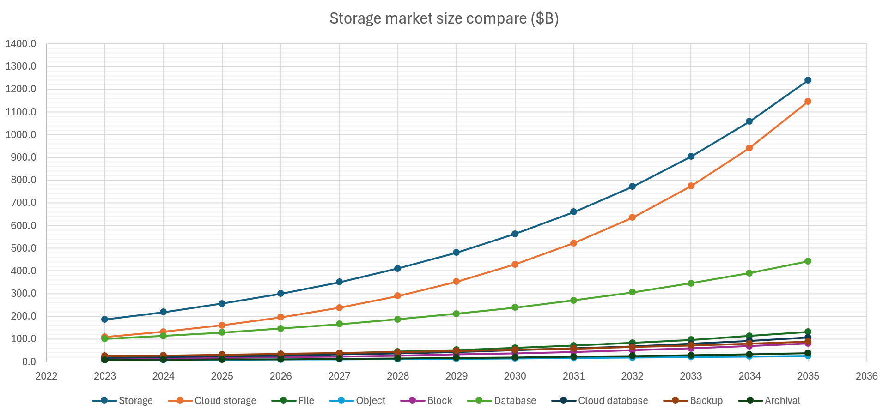
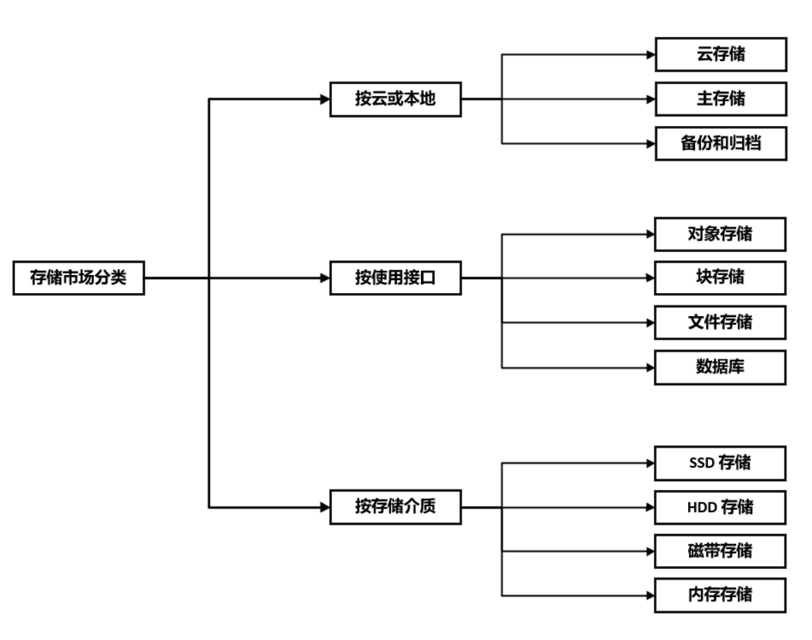

## 俯瞰存储市场

商业策略分析通常可以分解为客户、产品、公司、竞争对手层面，进一步深入（下图）。客户、产品、竞争对手可归结为“市场”格局（Landscape）。本章将纵览存储系统的市场，列举市场的主要分区、产品功能、参与者。之后章节将进一步深入。

在不断变化的市场格局中，我们处于什么位置？3~5 年、或 10 年之后，市场版图又会如何变化，我们应在何处？理解市场是 Vision 与 Strategy 的基础。围绕市场，可以逐步揭示其结构和发展空间，什么是价值，需求，演化周期，以及背后的驱动因素。

（详见下文）

### 分类

第一个问题是如何将存储市场分类？本章使用如下分类来组织内容。后面各小节标题前的字母对应分类组。

  * A. 经典的分类是 __云存储__ 和 __主存储__。云存储来自公有云。主存储（Primary Storage）[[49]](.) 一词多由 Gartner 使用，指部署在客户本地，服务关键数据的存储系统，通常为传统存储厂商。主存储也被称作“企业存储”（Enterprise Storage）。另外，企业本地使用的另一大类存储是 __备份和归档__ 系统。

  * B. 按使用接口，存储可分类为 __对象、块、文件__ 系统。对象存储服务由 Key 查询的不可变 BLOB，通常为图片、视频、虚拟机镜像、备份镜像等。块存储通常由虚拟机使用，作为其磁盘挂载。文件存储由来已久，存储目录和文件，可由用户直接使用，常见的是 HDFS、NFS、SMB 等。此外 __数据库__ 也可看作存储。

  * C. 按存储介质分类，存储可分类为 __SSD、HDD、磁带__ 系统。SSD 存储昂贵、高性能，常用于文件系统和块存储。HDD 存储廉价、通用，常用于对象存储，或存储冷数据。磁带存储一般用于归档存储。此外，还有全 __内存__ 的存储，一般用作缓存或分析型数据库。

上述对存储市场的分类是经典且常用的，也为本章讲解方便。但事实上，存储市场中的产品更为有机，为渗透对方市场、获得竞争优势，它们 __互相交缠__。例如：

  * A. __云存储__ 也售卖贴近客户的本地部署的 Edge 存储，如 AWS S3 Express。__主存储__ 也提供云端部署和云端卸载的版本，如 NetApp ONTAP。__备份和归档__ 也是云存储的一大卖点，如 AWS Glacier。

  * B. __对象存储__ 正变得越来越像文件系统，如按文件系统的 AWS S3 Mountpoint，如支持对象上的元数据和搜索，支持层级的对象路径。__数据库__ 有 Key-Value 接口的产品如 RocksDB，而 SQL 数据库也往往支持非结构化数据，类似对象存储。__块存储__ 不单用于虚拟机磁盘，也可为数据库提供 Page 存储。另外，各种存储系统的底层也可统一到 __共享日志存储__，如 Azure Storage，Apple FoundationDB、Log is Database 设计。

  * C. __SSD 存储__ 常常将冷数据卸载到 HDD 存储，以节省 SSD 的昂贵成本。__HDD 存储__ 常常将 SSD 作为缓存，或 Write Staging。__内存__ 被用作各种存储介质的缓存和索引，而内存存储系统也往往支持将冷数据或日志写到 SSD。

此外，为了简洁，本章省略了一些次要的分类。例如，

  * 按用户企业规模，可将市场分类为 SMB、大型企业、特殊领域。

  * 企业存储也常按 DAS、SAN、NAS 分类。这个分类与对象、块、文件存储部分重合。

  * 除磁带外，归档存储还可使用 DNA 技术，如今正在快速发展。

  * Cyberstorage 是在 Ransomware 背景下的新兴存储分类，不过更多地是作为安全功能集成在已有产品中。

  * 向量数据库是在 AI 背景下的新兴数据库类型，而传统数据库也往往集成向量支持。

### A. 云存储

关于预测市场未来的方向，咨询公司的分析报告是良好的信息来源（Gartner、IDC 等）。尽管报告付费，但通常有 __额外来源__：

  * 头部公司通常愿意提供免费的公开版本，作为公司的自我宣传。

  * 博客、报道尽管不是第一手资料，但也能反映主要内容。一些博主有专门渠道。

  * 在 Google 搜索前加入 `filetype:pdf`，可有效找到资料。

  * 在 Google 搜索后加入 `"Licensed for Distribution"`，可找到 Gartner 公开的文档。

  * 切换英文、中文搜索引擎、Scribd，可以找到不同内容。中文社区可能保存一些文档。

  * 此外，阅读主导产品的用户手册也可了解领域的主要功能和评估指标。

Fortune 预测全球云存储市场规模在 \$161B 左右，约 21.7% 年增长率 [[46]](.)。相比之下，全球数据存储市场规模在 \$218 左右，约 17.1% 年增长率 [[60]](.)。可以看到：

  * 云存储市场有 __极好的增长率__。结合 _[理解股价](.)_ 章节可以看到，该增长率十分有利于支撑股价，而不太需要从挤压竞争对手或削减成本方面下手。

  * 十年之后，数据存储有趋势完全 __被云存储取代__。这是由于云存储规模占比已经较高，且增长率快于数据存储整体。至少从预测来说如此。

从 Gartner 的云基础设施的魔力象限中 [[61]](.)（2024），可以找到市场的头部参与者：

  * __Amazon AWS__：持久的领导者。AWS 在全球拥有大规模的基础设施、良好的可靠性和生态系统。AWS 是寻求可扩展性和安全性的企业的首选。然而，其复杂的服务对于新用户来说可能有挑战。

  * __Microsoft Azure__：领导者。Azure 得力于混合云能力、与微软产品的深度集成，以及与 AI 领导者 OpenAI 的合作。Azure 的行业特定解决方案，以及协同战略，对企业有引力。然而，Azure 面临扩容挑战，也受到安全方面的批评。

  * __Google GCP__：领导者。在 AI/ML 创新领域领先，Vertex AI 平台备受好评，云原生技术独树一帜。在环境可持续、AI 服务方面，GCP 对数据为核心的组织很有吸引力。然而，GCP 不足于企业支持和传统工作负载迁移。

  * __Oracle OCI__：领导者。OCI 强于提供灵活的多云和主权云方案，吸引需要强大集成功能的企业。其在 AI 基础设施的投资、与 NVIDIA 的合作，巩固了市场地位。然而，OCI 的生成式 AI 服务和弹性架构仍不足。

  * __Alibaba Cloud__：挑战者。作为亚太区的主力，阿里云在国内市场的电子商务、AI 服务方面领先。尽管拥有出色的合作伙伴生态，阿里云在全球拓展方面受限于地缘政治和基础设施。

  * __IBM Cloud__：特定领域。IBM 借助混合云和面向企业解决方案的优势，与 Red Hat OpenShift 无缝集成。其解决方案对受监管行业有吸引力。但不足于产品组合分散，以及 Edge 战略不完善。

  * __Huawei Cloud__：特定领域参与者。华为是新兴市场的关键参与者，优势于电信领域的集成云解决方案。在 AI/ML 研究方面出色，并在高需求的企业环境中取得成功。然而，地缘政治紧张局势和制裁限制了其全球扩张。

  * __Tencent Cloud__：特定领域参与者。对可扩展和分布式应用优化，在社交网络集成方面独具优势。然而，其全球合作伙伴生态为有限，并且在成熟度上与全球同行存在差距。

云存储应该提供哪些 __主要功能__？Gartner 的云基础设施计分卡 [[62]](.)（2021）比较了各大公有云厂商，从中可以看到栏目列表，见下图。可以看到 AWS 的强劲实力。

另一方面，可将云存储看作逐步将传统存储的功能搬到云上，__用主存储对标云存储__。从这个角度来看，云存储应该具备哪些功能？哪些是主存储已有，而云存储未来可能发展的方向？有哪些衡量存储的关键指标？见下一节主存储。

### A. 主存储

本文将主存储对应于云下本地部署的企业存储，服务关键数据，这是存储由来已久的传统领域。其增长率大致对应存储市场的大盘，由 [[60]](.) 及其配图可见（上一节），年增长率在 17% 左右，正逐步被云存储侵蚀。当然，实际上主存储已经与云深度结合。

从 Gartner 的主存储魔力象限中 [[59]](.)（2024），可以找到该市场的头部参与者：

  * __Pure Storage__：持久的领导者。通过 Pure1，向用户提供主动 SLA，有利 IT 运维。融合的控制面无需外部云通信和 AIOps 的以来。DirectFlash Module 直接操作裸闪存，推动硬件、SLA、数据管理的创新。但是，Pure Storage 在美国外的用户多元化方面落后，生命周期管理计划增加了阵列的资产和支持成本，不支持计算、存储分离。

  * __NetApp__：领导者。NetApp 提供 Ransomware 恢复保证，不可变快照。通过 Keystone 策略和 Equinix Metal 服务简化 IT 运维。BlueXP 控制面提供 Sustainability 监控管理能耗和碳排放。但是，NetApp 不为块存储提供有竞争力的 Ransomware 检测保证，系列产品不支持更大的 60TB/75TB SSD 盘，不支持计算、存储分离。

  * __IBM__：领导者。IBM 消费计划提供产品生命周期、升级的统一定价，提供能耗效率的保证。Flash Grid 分区、迁移，持续优化负载，跨平台。但是，IBM 不提供容量优化型 QLC 阵列，不在块存储上提供文件服务，本地闪存部署不支持性能、容量分离。

  * __HPE__：领导者。HPE 的 Alletra 服务器允许用户独立扩展容量和性能，以节省成本。GreenLake 可以在本地和 AWS 相同地部署，混合管理。负载模拟可为用户提供整全局的关于性能和容量的负载放置建议。但是，HPE 供应商在 Sustainability 和 Ransomware 方面落后，不支持更大的 60TB/75TB SSD 盘，产品-负载组合存在混淆。

  * __Dell Technologies__：领导者。收购 EMC 后，Dell 拥有灵活的全线存储产品，APEX 提供跨本地和云的多云管理和编排。PowerMax 和 PowerStore 提供行业领先的 5:1 数据缩减和 SLA，与 Data Domain 数据备份整合。但是，Dell 不提供适用中端、高端的统一存储操作系统，这带来管理复杂度。

  * __华为__：挑战者。华为的多层 Ransomware 防护优秀，采用网络协作。闪存阵列提供三年的 100% 可靠性和 5:1 容量缩减保证。NVMe SSD FlashLink 支持高磁盘容量，由 ASIC 引擎加速。但是，华为在北美地区受限，不提供对 AWS、Azure、GCP 的多云扩展方案，客户集中于少数垂直领域而增加风险，多款存储产品许可过于复杂。

  * __Infinidat__：挑战者。Infinidat 在高端全球企业市场享有口碑，提供高质量的服务。SSA Express 能够将多个较小的闪存阵列整合成更经济的单台 InfiniBox 混合阵列。在遭受网络攻击后，可从不可变快照中恢复数据。但是，Infinidat 缺乏中端产品，InfuzeOS 云版本限制为单节点架构，SSD 仅支持 15TB 硬盘。

  * __Hitachi Vantara__：挑战者。Hitachi 允许用户在安装后五年内升级到下一代解决方案，以减少碳排放。EverFlex 简化用户订阅的流程，基于实际使用付费。EverFlex Control 将功能模块化，允许用户根据平台定制需求。但是，Hitachi 在 Ransomware 检测上落后，不提供计算存储的分离扩展，用于备份的 QLC SSD 方面落后。

  * __IEIT SYSTEMS__：特定领域参与者。IEIT 拥有独特背板和四控制器设计，自主负载均衡，可扩展至 48 控制器。提供在线反 Ransomware 功能，通过快照回滚。Infinistor AIOps 工具提供性能工作负载规划和模拟。但是，IEIT 在中国市场之外不为人知，在全球多云扩展方面落后，独立软件供应商（ISV）生态方面落后。

  * __Zadara__：特定领域参与者。Zadara 提供全球化的高技能的托管服务，基于低成本的对象存储和 Disaggregated 的 Key-Value 架构，利用灵活的生命周期管理来减少硬件浪费，多租户环境中的硬件可被动态重组。但是，Zadara 提供的 SLA 有限如 Ransomware 保护，商业规模和覆盖范围较小，第三方集成和 ISV 依赖于托管服务商。

主存储应该具备哪些功能？结合上文的魔力象限报告 [[59]](.)，Gartner 主存储关键能力报告 [[64]](.)（2023），企业存储主流趋势报告 [[66]](.)（2023），可以看到：

  * __Consumption-based 售卖模式__：与传统购买整套存储软硬件不同，而是类似云服务，按实际消耗量付费。相应地，SLA 按照用户端的指标重新定义，如 99.99% 可用性。Gartner 预测 2028 年将有 33% 企业投资采用 Consumption-based 模式，从 2024 年的 15% 迅速增长。关联概念：Storage as a Service（STaaS）。

  * __Cyber liability__：针对 Ransomware 的检测和保护正成为企业标配，例如文件锁、不可变存储、网络监测、主动行为分析、Zero Trust 等功能 [[65]](.)。关联 Cyberstorage。Gartner 预测 2028 年将有 2/3 企业采用 Cyber liability，从 2024 年的 5% 迅速增长。

  * __软件定义存储（Software-defined Storage，SDS）__：SDS 将用户从厂商专有硬件中解放，提供跨平台的、更灵活的管理方案，利用第三方基础设施，降低运维成本。另一方面，SDS 允许分离部署计算和存储资源、独立弹性地扩展，改善经济效益。__AIOps__ 功能变得重要，常与 SDS 结合。利用公有云的 __混合云__ 功能变得常见，该功能也常归于 SDS 名下。

  * __高级 AIOps__：例如实时事件流，主动的容量管理和负载均衡，持续优化成本和生产力，响应关键运维情形如 Cyber Resiliency 配合全局监控、报警、报告、支持。

  * __SSD / 闪存阵列__ 增长迅速。Gartner 预测 2028 年有 85% 的主存储是闪存阵列，从 2023 年的 63% 逐步增长，而闪存价格可能下降 40%。__QLC Flash__ 正普及，带来 60TB/75TB 的超大 SSD 盘，具有更好的能耗、空间、制冷效率。

  * __单平台支持文件和对象__（Single Platform for File and Object）。针对非结构化数据，同一存储平台同时支持文件和对象。融合的系统节约成本，Multiprotocol 使管理简化。文件和对象本身有相似性，图片、视频、AI 语料文件的使用方式近似对象，而对象加上元数据和层级路径后类似文件。

  * __混合云文件数据服务__（Hybrid Cloud File Data Services）。混合云为企业提供跨越 Edge、云、数据中心的统一访问和管理，命名空间一致，无需拷贝。企业能够在 Edge 对数据作低延迟访问、大批量的 Ingestion，在数据中心作复杂处理，在公有云存放冷数据和备份。可以看到传统存储产品纷纷上云，公有云纷纷开发 Edge 部署。

  * __数据管理服务__（Data Storage Management Services）。类似数据湖，数据管理服务读取元数据或文件内容，对数据进行分类（Classification）、洞察、优化。它跨越多协议，包括文件、对象，NFS、SMB、S3，跨越不同数据服务如 Box、Dropbox、Google、Microsoft 365。安全、权限、Data Governance、数据保护、Retention 也在议题中。在非结构数据快速增长的背景下，企业需要从数据中提取价值，并按重要性管理。

  * 其它常见特性，例如：__Multiprotocol__ 支持多种访问协议。__碳排放__ 的持续测量、报告、能耗控制。__无干扰的迁移服务__，从当前阵列到下一阵列，其间保证 100% 的数据可用性。__NVMoF__ NVMe over Fabric 是 NVMe 原生的 SAN 网络。__Container Native Storage__ 为容器和 Kubernetes 提供原生存储挂载。__Captive NVMe SSD__，类似 Direct Attached 盘，为专用场景定制，强化性能、耐用（Endurance）。

另外，

  * 主存储需要支持的 __关键用户场景__：OLTP 在线事务处理，虚拟化，容器，应用整合（Application Consolidation），混合云，虚拟桌面基础设施（VDI）。

  * 主存储的 __关键能力指标__：性能，存储效率，RAS（Reliability, availability and serviceability），Scalability，Ecosystem，Multitenancy and Security，Operations Management。

了解主存储所需功能的另一渠道是用户的反馈。[[67]](.) 列出了用户访谈中关于某个存储产品喜欢或不喜欢的反馈。[[68]](.) 列出了一份常见的用户招标文件。从中可以看到一些容易忽视的方面：

  * __易用性__。例如配置简单、管理便利，在用户心中占有重要地位，不亚于性能、成本因素。对于企业用户，权限管理，与其它常用系统、协议的集成也很重要，例如文件共享、Active Directory。客户服务和支持能换来真金白银。

  * __资源效率__。用户本地数据中心部署的存储常常面临闲置资源，或者部分资源耗尽而另一部分资源闲置的问题。扩容是常见需求，而又需要与老系统集成兼容。类似云的负载迁移、平衡、持续优化很有用处。Disaggregated 分离扩展、购买资源，避免捆绑，可为用户带来经济效益。

  * 截图只包括部分客户反馈，全文见 [[67]](.) [[68]](.) 原文。

主存储技术在未来的发展方向为何？可以从 Gartner 的 Hype Cycle 中获悉，下图来自 [[69]](.) [[70]](.) ，有不同的分类。可以看到：

  * __对象存储__、__分布式文件系统__、__超融合__ 已被验证。__DNA 存储__、__Edge 存储__、__Cyberstorage__、__Computational Storage__、__容器存储和备份__ 正在兴起。

  * __Distributed Hybrid Infrastructure (DHI)__ 和 __软件定义存储（SDS）__ 是即将带来变革的技术。DHI 为用户本地数据中心提供云级别的解决方案，如 Consumption-based 模式、弹性、资源效率，并与外部的公有云、Edge 云无缝连接（Hybrid Cloud）。

  * Hype Cycle of Storage and Data Protection 类似。Hybrid Cloud Storage 类似 DHI。Immutable Data Value 归于 Cyberstorage。Enterprise Information Archiving 归于归档存储，后者也是被验证的技术，在下一节讲述。

### A. 备份和归档存储

第一个问题是，备份和归档存储拥有多大的市场规模、多快的增长率？

  * Market Research Future 预测 [[72]](.) __企业备份存储__ 在 2024 年拥有约 \$27.6B 的市场规模，此后以约 11.2% 的年增长率增长。市场增长主要由数据量增长、数据保护、Ransomware 保护的需求驱动。

  * 作为企业备份存储的一部分，__归档存储__ 所占份额较小，但增长更快。Grand View Research 预测 [[73]](.) 其在 2024 年拥有约 \$8.6B 的市场规模，此后以约 14.1% 的年增长率增长。市场增长主要由数据量增长、更严格的合规需求、数据管理和安全驱动。

下一个问题是，备份和归档存储的主要市场参与者是谁？从 Gartner 的企业备份和恢复软件方案魔力象限中 [[74]](.)（2023）[[75]](.)（2024），可以找到该市场的头部参与者：

  * __Commonvault__：领导者。BaaS 覆盖广泛，包括 SaaS 应用、多云、本地部署，支持 Oracle OCI。Backup & Recovery 互操作性良好。Commonvault 将企业级功能带入有竞争力的价格。但是，Commonvault 的本地部署方面的创新落后于云端，部分用户反映体验不佳，HTML5 用户界面相比本地应用缺失功能。

  * __Rubrik__：领导者。Rubrik 在产品定价组合方面创新，例如为 Microsoft 365 提供有基于容量的用户 tiers。Rubrik 在 Ransomware 保护方面出色，例如机器学习、在备份数据中检查异常。Rubrik 的扩展能力和出色客服持续吸引大型企业。但是，Rubrik 需平衡在安全和备份的投资，SaaS 应用覆盖有限，可选云存储有限，主要在 Azure Storage。

  * __Veeam__：领导者。Veeam 拥有忠实的用户和 Veeam Community。Veeam 支持混合云和所有主要公有云。Veeam 在全球拥有大量合作伙伴。但是，Veeam 对 BaaS、SaaS、Ransomware 的市场需求反应缓慢，软件过于复杂，实现安全的平台部署需要仔细设计和配置。

  * __Cohesity__：领导者。Helios 是基于 SaaS 的集中控制面，为所用备份产品提供统一、直观的管理体验。DataProtect 和 FortKnox 允许用户选择多个公有云存储位置。Cohesity 积极与不同领域的供应商组成数据安全联盟（Data Security Alliance）。但是，Cohesity 的新投资引入第三方技术依赖，Backup as a Service（BaaS）能力不足，地理覆盖有限。

  * __Veritas__：领导者。Veritas 提供全面的备份产品，例如云和 scale-out & scale-up。NetBackup 和 Alta 服务支持云原生，在公有云运行 Kubernetes。服务和合作伙伴覆盖全球。但是，Veritas 的部分云产品仍处于早期，专注大企业而对中小企业不够友好，缺少 SaaS 应用支持（Microsoft Azure AD, Azure DevOps, Microsoft Dynamics 365 and GitHub）。

  * __Dell Technologies__：领导者。PowerProtect 提供数据保护和 Ransomware 保护，支持本地和云端部署。其允许用户结合多个 Appliance 的平衡容量。它提供跨多个公有云的一致管理，可在 Marketplace 获取。但是，Dell 缺少 SaaS 控制面，不支持选择其它备份存储方案，高级 Ransomware 分析需要专用环境。

  * 其它：挑战者、远见者、特定领域参与者。略，详见 [[74]](.) 报告原文。

接下来的问题是，备份和归档产品所需的主要功能是什么？从 [[74]](.) 可以看到一系列 Core Capabilities 和 Focus Areas：

  * __备份和恢复数据__：才此基础上，支持本地数据中心和公有云。支持 Point-in-time 备份、支持业务连续、容灾等场景。配置多种备份和 Retention 策略，并与公司政策对齐。Tier 冷热备份数据到不同地点，如公有云、第三方供应商、对象存储。全局去重、数据缩减。

  * __Cyberstorage__：备份数据到不可变存储中，Immutable Data Vault。检测和防御 Ransomware。支持灾难、攻击的恢复测试和演习。为容器、对象存储、Edge 等不同目标提供保护，保护应覆盖本地、云、混合云。快速可靠的恢复，恢复书库、虚拟机、文件系统、Bare-metal 机器，恢复不同的 Point-in-time。

  * __控制面__：集中的控制面，在不同产品见统一，在本地、混合云端统一。管理分布式的备份和恢复任务，管理测试和演习。管理公司合规，数据保护和 Retention 政策。与常见其它 SaaS 产品、BaaS 产品的整合。控制面应是基于 SaaS 的，类似云，而不是让用户自己管理安装升级。

  * __Cloud-native__：备份软件自身可以云原生部署，例如 Kunernetes。数据保护覆盖云原生负载，例如 DBaaS, IaaS and PaaS。与公有云服务结合，支持存放数据到云，支持在云端调度任务。备份产品以接近云的 BaaS 方式提供服务。按实际使用量付费（Consumption-based），而不是让强迫用户购买整台 Appliance。

  * __GenAI & ML__：支持生成式 AI，例如在任务管理、故障排查、客服支持中。支持机器学习，例如用于 Ransomware 检测，自动数据分类（Classification）。

最后的问题是，备份和归档技术未来的发展方向为何？可以从 Gartner 的 Hype Cycle 中获悉 [[69]](.)（2024），见下图。可以看到：

  * __数据归档__、__归档专用 Appliance__、__数据分类__ 已经被验证。__Cyberstorage__、__生成式 AI__、__云恢复（CIRAS）__ [[76]](.)、__备份数据重用分析__ 等正在兴起。

### B. 文件存储

文件存储在企业和云存储中占有重要地位。首先，文件存储拥有多大的市场规模、多快的增长率？VMR 的报告 [[78]](.) 指出，

  * 分布式文件系统 & 对象存储在 2023 年拥有约 \$26.6B 的市场规模，__年均增长率约 16%__。这个增长率大致和主存储相仿。略慢于云存储整体。

  * 许多报告中，__文件系统和对象存储被合并统计__。确实，这两种存储的用户场景相通，并且近年发展中也在吸收彼此特性。见本文 “[互相交缠](.)” 段落。

  * 另外，Market Research Future 报告 [[79]](.) 中给出了（云）对象存储单独的市场规模（对象存储主要是云）。对照可发现，对象存储 2024 年市场规模仅 \$7.6B ，__年增长率不及文件存储__，约 11.7% 。

  * VMR 的另一报告 [[81]](.) 中给出了 __块存储__ 的市场规模，可供对比。2023 年拥有约 \$12.8B，约 16.5% 年增长率。块存储市场规模的增长率快于对象存储，与文件存储相仿。

Gartner 的文件和对象存储平台魔力象限中 [[77]](.)（2024），可以看到该市场的主要参与者。注意，文件系统和对象存储仍然被被合并统计。注意，这里主要针对存储厂商，类似主存储，而不是公有云（公有云见 “[云存储](.)” 一节）。

  * __Dell Technologies__：领导者。收购 EMC 后，Dell 拥有最广泛的软硬件产品组合，包括非结构化数据和特定用途产品。Dell 拥有全球供应链和供应商。Dell 与 Nvidia 紧密合作并投资 AI 项目。但是，PowerScale 缺乏全局命名空间和 Edge 缓存，与拥有不同架构的现代闪存存储竞争加剧，依赖 ISV 解决关键需求。

  * __Pure Storage__：领导者。FlashBlade 采用 NVMe QLC SSD，拥有行业最高密度、最低 TB 功耗，价格相比 HDD 混合阵列具有竞争力。Evergreen//One 和 Pure1 的 AIOps 功能和监控确保用户 SLA 。FlashBlade 与 Equinix Metal 合作，将本地基础设施扩展到全球。但是，Evergreen//Forever 方案显著增加了资本支出，Ransomware 检测能力有限，混合云支持有限，如 AWS、Azure、GCP 中以虚拟机、容器部署。

  * __VAST Data__：领导者。VAST 的战略合作、营销大量增加大客户。VAST 使用 QLC 闪存、先进的数据缩减算法、高密度机架。终端用户认可其出色的客户服务，如知识、售前、架构，订购、部署。但是，VAST 缺乏品牌集成的 Appliance 因而难以吸引保守型全球企业，高频软件更新带来不稳定，缺少企业及功能如同步复制、Stretched Cluster、Geodistributed Erasure Coding、Active Cyber Defense，混合云吸引力有限。

  * __IBM__：领导者。IBM 在 HPC 市场处于领导地位，与 AI 结合。文件和对象提供全局命名空间，跨越数据中心、云或 Edge、非 IBM 存储。IBM 持续增强 Ceph 存储，受开源用户青睐，统一文件、块、对象存储。但是，IBM 产品组合复杂，云支持不足，文件存储倾向 HPC 而通用场景不足。

  * __Qumulo__：领导者。Qumulo 在 Azure 上提供 SaaS 的简便和云弹性。其软件在本地和云端部署提供一致的功能和性能。Qumulo 的全局命名空间提供跨越本地和多个云的访问。但是，Qumulo 缺乏 Ransomware 检测能力，不提供自己的硬件设备而依赖第三方，全球覆盖有限。

  * __华为__：挑战者。OceanStor Pacific 提供统一平台文件、块、对象的统一存储。从 AI 性能到数据管理，华为拥有专有硬件技术，包括芯片和闪存。客户支持和服务收到高度评价。但是，美国制裁和地缘政治限制全球扩张，对其它公有云如 AWS、Azure、GCP 的支持有限，不提供灵活的 SDS 方案。

  * __Nutanix__：远见者，远见程度超越所有领导者。NUS 平台可 Consolidate 各类用户存储负载，在混合云下集中管理。NUS 简化实施、运维、监控、扩展的管理。客户支持服务在可靠和响应方面受到认可。但是，超融合（Hyperconverged）平台不受只想购买存储的用户认可，文件和对象在混合云部署中认可有限，不支持 RDMA 访问 NFS 因而不适合低延迟场景。

  * __WEKA__：远见者。并行文件系统适用最苛刻的大规模 HPC 和 AI 负载。Converged 模式允许文件系统和应用运行于同一服务器上，并提高 GPU 利用率。混合云在各公有云、Oracle OCI 中广泛可用，但是，备份和归档方案不具备成本效益，S3 和对象支持有限，缺少 Ransomware 保护、AIOps、同步复制、数据效率保证、地理分布对象存储。

  * __Scality__：远见者。Scality 的 RING 架构支持 EB 级部署，独立扩展性能和容量。Scality 追求纯软件方案，能够运行在广泛的标准硬件上，无论 Edge 还是数据中心。RING 数据保护支持地理分布，跨多个可用区，零 RPO/RTO，极高 Availability 和 Durability。但是，作为 SDS 方案，其依赖外部供应商，不具备交付 Turnkey Appliance 的能力；文件由对象存储集成 POSIX 实现，因而不适用 HPC。

  * 其它：特定领域参与者。略，详见 [[77]](.) 报告原文。

文件和对象存储系统应该具有哪些主要功能？从 Gartner 魔力象限报告中可以看到一系列 Core Capabilities 和 Top Priorities，如下列出。另一方面，可以发现它们与主存储、备份和归档存储的主要功能 __皆相通相似__。

  * __统一命名空间__（Global Namespace）：文件跨本地数据中心、Edge、多个公有云统一管理和访问。支持地理分布、复制保护。支持 __混合云__、S3，以及多种文件访问协议。__统一存储__（Unified Storage），文件、块、对象由统一平台服务。单一平台处理高性能和数据湖。

  * __AIOps__：支持 AIOps、简化、统一的管理配置，自动化。拥有出色的客户服务，在知识和架构方案等方面。__数据管理__，如元数据分类、成本优化、数据迁移、分析、安全。数据生命周期管理。元数据索引、文件和对象 Labeling/Tagging 。软件定义存储 SDS。

  * __Cyberstorage__：提供 Ransomware 的检测和保护，在攻击中保持业务连续性。响应和恢复数据。当然，传统的数据加密、认证等安全功能必不可少。

  * __成本和性能__：采用具有容量、能耗优势的 QLC 闪存。提高机架存储密度。去重、压缩、纠删码等数据缩减技术，以及数据效率保证。使用闪存或 SSD 加速文件访问，提供缓存，并对闪存作数据缩减。RDMA 访问降低延迟，Edge 存储降低延迟。支持线性扩展，支持分离扩展性能和容量，妥善处理性能和容量的 Burst。__STaaS__ 模式 Consumption-based 付费。管理能耗和碳排放。

  * __不同用户场景__：通用文件系统、数据库、对象（或按对象的方式使用文件）、HPC 及 AI，是不同的用户场景，在功能和性能上各有取舍。或者见下面来自 Nasuni 的“企业文件-数据量”图 [[80]](.) 。

文件也是主存储功能之一，关于未来发展趋势、Hype Cycle，不再重复。参见 “[主存储](.)” 一节。

### B. 对象存储

对象存储和文件存储经常被合并统计，其功能相通，例如 Gartner 的文件和对象存储平台魔力象限中 [[77]](.)。上一节 “[文件存储](.)” 已经包含对象存储，本节不再复述。

另一方面，对象存储的经典场景是云存储，见前文 “[云存储](.)” 一节，本节不再复述。云存储所需功能也可与存储厂商对标而得，见 “[文件存储](.)” 一节。

### B. 块存储

VMR 的报告 [[81]](.) 中给出了块存储的市场规模和增长率，在 “[文件存储](.)” 一节中已经包含在图中。

块存储是主存储的核心功能之一，通常合并到主存储中统计，“[主存储](.)” 一节已经包含，不再复述。现代平台常常是统一存储，同时提供文件、块、对象服务。

另一方面，块存储是云存储的经典场景之一，见前文 “[云存储](.)” 一节，不再复述。

### B. 数据库

数据库的市场规模和增长率如何？从 Grand View Research 的预测可以看到：

  * __数据库__ 在 2023 年拥有约 \$100.8B 的市场规模，年增长率 13.1% [[82]](.) 。其中，全球 __云数据库__ 在 2022 年拥有约 \$15.05B 的市场规模，年增长率 16.3% [[83]](.) 。

  * 与前文 "__[云存储](.)__” 一节对比，可以发现：1）数据库的主要市场在非云。2）云数据比非云增长更快，但远不及云存储（21.7%）。3）云存储市场比数据库大得多。

综合前文各节的市场规模和增长率，这里可以绘制 __各存储类型并比较__，可以看到：

  * __云存储__ 拥有最大的市场规模和最快的增长率（21.7%），拥有良好的投资价值。其次是 __非云的数据库__ 市场，规模较大，增长率较低（13.1%）。

  * __文件存储__、__块存储__、__云数据库__ 市场规模较小，但增长率不错（16%~17%）。而 __对象存储__ 较弱，市场规模小，增长率较低（11.7%）。

  * 备份和归档存储中，__归档存储__（14.1%）增长快于 __备份存储__（11.21%）。前者增长快，后者存量大。

虽然数据库存储数据，但在市场划分上， 数据库一般不被分作“存储”市场。存储通常指文件、块、对象，而数据库运行在文件、块存储上。数据库拥有庞大复杂的内容、持久活力的市场，值得另一篇文章，而数据湖跨越数据库和存储两者属性（结构和非结构化数据）。

本文围绕存储，因而不再深入数据库。下面仅列出：

  * Gartner 云数据库魔力象限（2024）[[84]](.) 。

  * Gartner 数据管理技术 Hype Cycle（2023）[[71]](.) 。

### C. SSD 存储

Market Research Future 预测 [[85]](.)，企业闪存存储在 2025 年拥有约 \$67.17B 的市场规模，年增长率约 9.89% 。

闪存存储常用于主存储、文件存储、块存储，它们是分析报告中更常见的分类方式，在前文章节中已经讲述，本节不再复述。相比 SSD，闪存是存储介质，SSD 通常指加上控制器、封装好的存储盘。

### C. HDD 存储

Market Research Future 预测 [[87]](.)，HDD 市场规模在 2024 年有约 \$62.43B，年增长率约 6.1% 。注意，这是磁盘而不是存储的市场。HDD 市场面临衰退，主因是被 SSD 取代。

HDD 存储常用于主存储、混合（闪存）阵列，对象存储，备份系统。后者是分析报告中更常见的分类方式，而不是以 SSD/HDD 归类，存储也常常不是使用单一介质。它们在前文章节中已经讲述，本节不再复述。

### C. 磁带存储

Market Research Future 预测 [[86]](.)，磁带存储在 20202425 年拥有约 \$3.5B 的市场规模，年增长率约 5.82% 。相比 SSD 和 HDD，磁带的市场规模很小、增长率低。

磁带常用于归档存储。后者在前文章节中已经讲述，本节不再复述。

### C. 内存存储

内存存储一般用于数据库或缓存。存储通常不会是纯内存的，因为难以保证数据持久性，尤其在数据中心断电时。内存在存储系统中一般用于服务元数据或索引，并不独立于其它存储类别之外。因此，本节略过内存存储。
