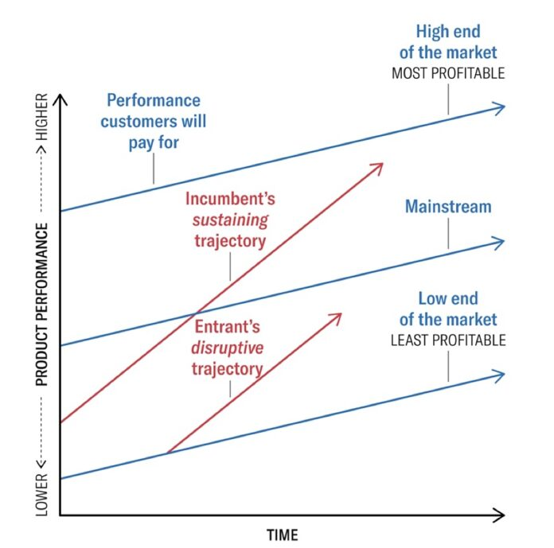

## 关于市场的分析

上一章遍历了存储市场的主要分区、其中的主要参与者、各自的产品、产品的核心需求、未来可能的方向。这一章将继续深入。围绕市场，可以揭示其结构和发展空间、驱动因素、核心价值。

在不断变化的市场格局中，我们处于什么位置？3~5 年、或 10 年之后，我们位于何处？通过对规律的把握，能够帮助 Vision 与 Strategy 分析，规划未来 3~5 年、甚至 10 年之后，我们应处的方位。

### 市场的结构

基本的市场分析包括市场分区、市场规模、用户场景、竞争格局（Competitive Landscape）、产品和功能等，在上一章已经讲述。对于存储市场，有更多维度需要考虑。首先，市场的“天然结构”是什么？其决定产品的上限和增长模式。

#### 客户组成

考虑开发新产品、功能， 其对应的市场由哪些客户组成？

典型地，__SMB、大型企业、专业领域__。作为客户类型，SMB（中小企业）、大型企业对产品的需求、营销策略显著不同。尽管大型企业能提供丰厚的销售利润，但 SMB __议价能力__（Buyer Power）的要求更低，避免带来大量定制需求。

如今，__政府采购__ 应被添加作客户类型。此外，__个人消费者__ 也应被添加，其常购买网盘存储（见下文 Empower Everyone）。在此之上，购买方 __垄断程度__ 应作为市场的结构的关键考量之一。而销售方，__开源__ 应被添加为竞争者。

这个话题进一步引导向 __Porter 五力分析__ [[88]](.)：竞争者、供应商议价能力（Supplier Power）、购买者议价能力（Buyer Power），替代品威胁、新进入者威胁。

相似的分类是，__低端、中端、高端__，覆盖不同偏好、规模的客户。低端走量、标准化。高端服务大型企业、定制需求，或特殊专业领域。

另一个关于客户的维度是 __粘性__，例如社交网络。详细内容见下文 _“[什么是价值](.)”_ 小节。

#### 市场的天然结构

有些市场天然具有 __规模效应__，例如水电、云计算。竞争最终导向参与者兼并，留存少数企业，而存活者享受营收和利润率的双重上升。

而另一些市场具有 __反规模效应__，例如教培、咨询、猎聘、投资。市场允许新小参与者不断加入，大型参与者导致分裂，而成熟的个人、团队倾向单干。

与此相配的市场维度是 __增长模式__。规模效应下，互联网产品的用户数量可以指数增长 。高 COGS 、人力成本占固定比例时，如制造、运维服务、外包定制，产品趋于线性增长。反规模效应下，产品增长甚至会递减，另一种递减是市场衰退。

#### 市场的天花板

在一轮市场生命周期（见下节）中，市场规模最终能够增长到多高？这和市场的天然结构相关。一个参考是 O(P)：调查每一个人，有 P 概率使用该产品。

__O(1) 规模的行业少见且珍贵__，例如社交 App 和支付应用，每人都用。而好莱坞电影虽然知名，却未必每人都看过。O(1) 的行业上限极高，渗透力强。反之，则天花板有限，往往走高端路线提高单价。

某种意义上，__Enable Everyone / Empower Everyone__ 的经济效益是增加 O(1) 级行业的数量，扩大 O(P<1) 行业的覆盖。

#### 对相邻市场的渗透

新兴、高速发展的技术不仅能够革新自身行业，往往也对临近行业进行渗透，进一步扩大市场和销售范围。

例如，云计算发起自售卖计算、存储资源，但逐渐取代了企业的本地运维。对象存储原本用于存储图片、视频，但统一存储平台（Unified Storage）有能力兼管文件、块服务。互联网平台对各行业的渗透显而易见。

除增长模式外，__渗透能力__ 是衡量市场潜力的另一维度。另一种说法是，__1+1>2__，多种产品形成逐步加强的循环反馈（__闭环__）。

反过来，__易被渗透__ 的市场是不利的，往往需要配套投资相邻市场，利用产品组合构筑护城河。

#### “推论”

从个人 __职业发展__ 角度考虑，所加入的市场分区也起重要作用。当产品具有规模效应时，企业倾向保留少量、尖端的人力，不吝惜给与高薪酬，因为成本不在此处。__人力是成本还是 Multiplier__？

当产品具有线性增长模式时，薪酬往往不高，但好在工作数量较多。__市场天然利润率预期工资水平__。见 _[理解股价](.)_ 章节。

大规模 __裁员__ 往往意味着市场处于递减、衰退阶段，此市场对职业发展非常不利，“被赶走” 至少避免主动处于不利市场。

### 市场的生命周期

从市场结构继续，下一个关键的维度是市场的生命周期。未来数年后，我们的团队和产品将处于什么位置？市场结构解释增长和上限，而市场生命周期预测其阶段。基于此制定策略，并为下一周期铺路。

#### 市场的阶段

市场阶段可以 __划分__ 为导入期（Introduction Stage）、成长期（Growth Stage）、成熟期（Maturity Stage）、衰退期（Decline Stage）。

新技术在导入期潜伏于小众爱好者，先进但增长缓慢。在成长期快速爆发，指数增长。在成熟期激烈竞争和兼并，比拼质量和客户留存。在衰退期被逐渐取代，营收、利润率双降。

更重要的是，通过市场分析预测 __什么时候__ 该市场进入成长期、衰退期等阶段，以计划策略转向。

#### 新市场的来源

新的市场往往来自 __规模增长__、__新技术__、__成熟度__、__商业模式变化__、__政策合规__。在下文 _“[驱动因素](.)”_ 一节详细讲解。颠覆式创新是市场更新的源动力。

### 颠覆式创新

本节仍属于 __市场的生命周期__ 一节，但因重要性独立。这可以说是最重要的概念。科技行业中，颠覆式创新（Disruptive Innovation）是市场更新的 __源动力__。颠覆式创新是市场周期的开始和终结。

（更多关于创新，见 [Accela推箱子 - 创新的技能和方法总结](https://mp.weixin.qq.com/s/v6ZRyIZOsyeR_X6wUXIYIw) / [https://mp.weixin.qq.com/s/v6ZRyIZOsyeR_X6wUXIYIw](.)）。

#### 渐进式创新

在未跳出单一市场生命周期前，企业增长一般依赖 __渐进式创新__。但随着复杂性积累，边际收益（Marginal Gain）降低，阻力增加。市场增长放缓，竞争加剧，陷入“__内卷__”或停滞。

另一方面可以看到，无论是渐进式创新还是颠覆式创新，__企业的日常工作离不开创新__。渐进式创新本身并不简单，其需要经验和洞察，以找到有效的“百尺竿头更进一步”，并带领团队成功实施。

#### 颠覆式创新

颠覆式创新带来新的技术和新的范式，__新一轮市场周期__ 由此开始，并替换、终结上一市场。

新技术在导入期潜伏于低端市场，往往不被原市场的成熟参与者发现。新技术进入成长期后，快速夺取大量用户，而原市场被迫进入衰退期。对于被替代的原市场参与者，此时 __规模大成为负面因素__（见 _[理解股价](.)_ 章节），往往难以自由应对。最终，新技术夺取高端市场的桂冠，完成市场替代。旧新交替，重复循环，行业在一轮轮叠浪式的周期中发展 [[90]](.) 。

颠覆式创新有很多例子。例如，云计算渗透企业存储、数据库、运维市场，NewSQL 将 Scale-out 分布式带入数据库，统一存储（Unified Storage）引入 SDS 并实现分布式文件系统，容器和 Kubernetes 革新集群管理。下图中有更多例子 [[90]](.) 。

#### 颠覆式创新的特性

颠覆式创新的 __“发展进步”__ 体现在多个方面。新技术相比旧技术有更高的生产力和效率，达到完全替换后，__市场天花板额外增高__。新技术更具活力，除替换原市场外，__对相邻市场进行渗透__，进一步拓宽市场规模。新技术需要翻新原有产品和上下游配套，导致 __重写代码__，带来新一轮劳动力需求，从“内卷”中解放。

“重写”意味着，颠覆式创新并不抛弃上一市场周期的产物。知识、经验、旧有路线被 __带入下一周期重用__，__螺旋上升__。例如，DPU 是存储领域的新近创新，但 ASIC 在交换机中使用已久 [[89]](.)，而 SDS 之前的存储本就是“专用硬件化”的。长期看，软硬互相 __交替摇摆__。上一周期、上上周期的经验有高重用价值。

近年来，__颠覆式创新在加速，市场周期在缩短__。曾经的传统行业，老技术可以干一辈子。存储、服务器等后端技术，大约可以工作十到二十年。而互联网的快速迭代、前端技术，也许五年就已经面目全非。生成式 AI 的快速发展更惊人，突破成果的发布以月记。加速趋势得益于生产效率的提高，全球协作便利，开源基础设施完善，金融投资的远见，以及对企业快速扩张的支持。

#### “推论”

颠覆式创新下的新市场周期，往往“重写”上个周期的产品，重复上上周期的路线，“螺旋上升”。这意味着 __老员工尤其重要__，因为他们经历了上一周期甚至上上周期，其经验和目睹的历史，可在下一市场周期复刻。

另一方面，__新手有特殊价值__。颠覆式创新要求跳出固有范式（Think out of box），新手是难得的屏蔽思维定势和切换视角的机会。向他们咨询，赶在其被团队“污染”之前。而成熟员工往往或多或少已被团队“污染”，沿袭 We always do this before，习惯“成熟”经验和视角，并将“污染”新人。

颠覆式创新意味着，__当前的工作一定会“完蛋”__。而现代的颠覆式创新在加速，市场周期在缩短。这意味着未来的个人 __职业生涯将更短__，可能在五到十年后面临技术换代，大规模裁员。而新一届毕业生更有竞争力，拥有针对新技术的系统完整的训练。

新技术换代的被驱逐者也是曾经的 __得利者__。快速换代意味着新人总有大量机会进入市场，超越老人，获得高薪。市场富于流动，不易形成“辈分”和壁垒，更加吸引新人加入。

### 驱动因素

是什么驱动源源不断的新需求，供各个市场参与者存活与成长，并周期性地开启新的市场周期？对于存储市场，驱动因素来自多个方面：__规模增长__、__新技术__、__成熟度__、__商业模式变化__、__政策合规__。掌握驱动因素帮助确定未来的发展空间和方向。

#### 规模增长

相比其它市场，存储市场的一大特点是  __天然的规模增长__。其不间断且速度不低，支持约 10%~20% 的市场规模增长。

为应对规模增长，__催生各式创新__。例如，软件层面上，分布式文件系统支持线性扩大数据规模。硬件层面上，多数硬件能力逐年指数增长，见 _[存储系统中的硬件](.)_ 章节，并伴随逐代技术升级，例如 QLC 闪存。运维管理上，SDS 允许更便利、弹性地管理大量、异构的存储设备。

数据增长同时伴随 __能力效率的提升__。一个人能管理多少数据？从旧时代的一个人管理一台机器，到运维中一个人管理 1PB 数据，再到云时代一个小团队管理全球数百数据中心。

#### 新技术

市场更新的源动力来自 __颠覆式创新__。技术换代、范式转移（Paradigm Shift），带来原产品的 __“重写”__、重建、上下游重配套需求，诞生大量工作岗位。新市场在 __替代__ 原市场的过程中，重新产生大量购买需求。新技术往往 __诞生__ 之前不存在的新场景，进一步催生需求。

新技术的另一增长来自 __硬件发展__，其能力往往逐年指数提高，见 _[存储系统中的硬件](.)_ 章节。更强、更快、更大、更便宜，使不可能的场景变成可能，使昂贵的产品变得可以购买。

随之而来的 __软件层面__ 的需求。软件需要 __整合__ 异构硬件、__适配__ 下一代，__优化__ SKU 组合甚至 Co-design 。软件需要 __集成__ 不同企业系统，并统一 __管理__ 大量设备。软件需要提升 __资源效率__，并尽可能地保留硬件的原生 __性能__。而为了应对 __复杂性__ 和 __易变性__，也催生更多技术。

#### 成熟度

随着市场走向成熟，客户期望产品提供更丰富细化的功能，这一过程伴随 __渐进式创新__。它们提供了参与者日复一日的工作。

对于存储系统，具体的期望是：更大规模的数据，更好的性能，更高的可靠性，更低的成本，更便利的管理，更安全，更丰富的功能，更强大的集成，客户服务和支持。

首先，__更大规模的数据__，催生一系列 Scale-out、Scale-up 相关的容量、性能技术。在容量的基础上，需要分布式一致性（如 Paxos）、分布式事务、数据组织（如列存）、索引技术（如 Mass-tree）。为管理大规模的数据，集群管理（如 K8S）、部署 Orchestration、运维自动化、监控和预警技术（如时间序列数据库），应运而生。

其次，__更好的性能__，催生多个维度的优化，简化调用路径（如 DPDK、SPDK），高速网络（如 RDMA），负载均衡（如 Hedged Request），动态迁移等。另一方面，与硬件发展整合（如 DPU、ZNS SSD）。

在 __更低的成本__ 需求驱动下，数据存储成本被持续降低，如冷热分层、纠删码、数据压缩、全局去重技术。另一方面，数据写入和读取的服务成本被降低，如 Foreground EC、芯片加速、分布式缓存技术。

接下来，__更便利的管理__ 包含多个方面。客户希望见到简单易用的图形化界面，并自动升级。管理需要统一，例如混合云，跨越本地、Edge、云的边界。命名空间需要统一，常用于跨多云的文件系统，并且全球化部署和访问。资源响应弹性快捷，如容器。

一大范畴的是 __更安全 Safety__。典型的需求是数据复制、校验、QoS、备份、快照、容灾。在全球化部署下，地理复制、可用区容灾日渐普及。保护级别逐渐提高，从 5min RPO 到 Zero RPO，从低频的手动快照到 Point-in-time 和 Time Travel。另一方面，形式化验证如 TLA+，也在存储中应用普及。

另一大范畴是 __更安全 Security__。一部分需求来自传统的存储加密、传输加密、认证、权限、防火墙、密钥管理，补丁升级。另一部分需求来自时新场景，如 Zero Trust、Ransomware 保护、不可变存储，以及隐私保护。

接下来，__更丰富的功能__，有多个方向。单一功能可以 __延伸至上下游__，例如。数据格式 -> 可视化表格 -> 自动 ETL -> BI 统计报表 -> 复杂数据查询 -> 大规模存储 -> 数据湖 -> 专用服务器，形成产品组合，构筑护城河。单一功能可以更 __完善、细化__，如文件系统支持更多格式、访问协议、提供各式工具。甚至支持 __定义外的功能__，如数据仓库支持修改数据和事务，“打开文件”窗口支持顺手编辑无关文件，数据库集成 BLOB、时间序列、向量。功能的丰富如同 __分形触手__，在需求矛盾下层层深入、细化。

最后，__更强大的集成__，是企业应用的常见需求。在上一章 _[俯瞰存储市场](.)_ 中，集成被反复提及，作为必要的竞争力。例如，办公软件集成数据库和 AI，存储平台集成第三方 ISV，数据管理集成通用的文件共享、Active Directory 等。集成也为产品跨界，__向相邻市场渗透__ 提供窗口。集成包括众多 __繁复__ 的工作，例如不兼容的 API、多样的数据格式、易变的业务流程、来自人的多样需求、报表和可视化、管理 Portal、持续花费的维护。

除此之外，__客户服务和支持__ 也是存储产品走向成熟的需求之一。客户服务不单指解决产品故障，还包括为客户场景架构解决方案、选择费用合理的购买组合、部署实施等，一系列要求大量知识和专业沟通的工作。此外还有专业完善的文档写作。

#### 商业模式变化

需求的驱动一端来自技术，另一端来自商业模式、来自客户。相比电商、社交网络、互联网，存储的商业模式变化相对缓慢，但近年来仍有一些变化。

大流行带来了 __居家办公__、__远程工作__ 的普及。企业借此削减办公室租赁费用，获利于全球招聘，跨州团队得以运作。远程办公催生 Zero Trust 的需求，以及办公软件（如 Office 365）、远程会议（如 Zoom）的增长。办公文档、文件共享、会议视频促进存储需求。

另一反复提及的趋势是 __STaaS__（Storage as a Service，存储即服务）。使用 Web 服务提供存储服务不仅便利，省去客户的升级管理负担，还使得按实际使用量付费（Consumption-based）变得可能。相比 upfront 购买机器，企业降低了成本。__云计算__ 也算作此趋势。

有更多趋势，例如，__生成式 AI__ 在用户界面和客户支持中的集成，客户变得青睐 __SDS 存储__，__容器__ 成为集群管理的基本模式，__归档存储__ 在 GDPR 下的普及。

数据库市场更加活跃，例如，数据库在 SQL、NoSQL、__NewSQL__ 间的变迁，数据仓库的 OLAP、OLTP、__HTAP__ 混合，以及 __数据湖__。

#### 政策合规

市场需求的另一变化来源是政策合规。近年来的变化有 __GDPR__、__数据主权__，以及相应的 __地理跨区存储__。

GDPR 强迫增加业务成本，也意味着增加了客户支出，从而增加市场规模。新政策规范催生新技术，以满足隐私管理、数据归档的需求，进一步扩大市场，驱动增长。

特别地，政策可以被市场的头部参与者 __主动推动__，以加快相对缓慢的商业模式变化。另一方面，严苛的合规要求增加行业准入门槛，排除体量较小的竞争者，加宽现存参与者的护城河。

### 什么是价值

// TODO Review market.md again
// TODO picture 评估矩阵
// TODO 标题用 ####

__定义__

价值资产需要
    难替代性
        技术 vs 关系
    溢价
        即使对手有同样强大的产品，我们仍可以卖出更高价格
        即使被对手完全泄密，我们仍可以卖出更高价格
    时间稳定
        不应迅速过时，不应迅速被取代

个人发展、资产的评估纬度，列举矩阵    // 搜百科查资产评估。 - 所以Vision的分析框架主要是follow资本家视角来进行的？真资本主义…… 敢于献身不利资产的人、甚至是大部分人，是真的勇士。
    1. 是否支持复利，增长是线性，还是指数
    2. 是否可迁移，例如公司内人际关系不宜在跳槽时迁移
    3. 是否自然垄断，规模效应、政策、传播
    4. 是否需要持续维护成本
    5. 是否持续折旧
    6. 广泛的联系类型的资产具有稳定性，最好是N对1的垄断型

关于差异化功能

8. Distinctive advantage, doesn’t show up at how disciplined your engineers are to be involution with each other. But at
    1) Distinctive way to organize engineering pipeline. E.g. SpaceX vs traditional rocket manufacturing. E.g. Chrome updating model vs MS office/OS update. E.g. Chrome plugin store vs Edge.
    2) Technology with large scale and complex engineering accumulation that made impossible possible. E.g. AWS cloud. E.g. Apple phone.
    3) Quality control, delivery control. Just to run faster than other competitors.
    4) Connections and trust with customers, partners, governments.
    5) Business model that deems to have advantage and made possible eventually. E.g. Alibaba Taobao selling vs traditional retails.
    6) Large amount of production data, many heavy users already been using the system for core usecases for many years. Especially for storage, filesystem, database vendors

__关系（Connection）__

  应该说，是连接（Connection）的数量和丰富程度。更多的连接带来健壮性是很自然的。
  这里指连接的数量和丰富程度，不单单指人际关系

  文化
  政府
  多重大量连接

  金融信任、贷款
  供应商培养，优惠拿货

  企业拥有全产业链，更多部门，可以聚焦投资于某个新产品以量突破，更具优势，相比只有单个产品的企业（当然，后者可以依靠发达的金融业）。

  广泛的联系类型的资产具有稳定性，最好是N对1的垄断型

  连接的数量，manager vs dev，大量连接带来的高替换成本
     // TODO 把涉及职业发展而不是公司策略的部份放到推论部份

__复杂性__

产品复杂性
经验

体系
交易成本

组织的复杂
人才组合

文化难以复制，见文化一节

大量的功能
全面的产品组合

大而全的企业，生产端互利高效帮助，另售卖产品组合

__速度（Velocity）__

拥有最好的“高速公路”，而功能集是健壮

2B 产品相对 2C 产品的天然问题。数据存储类产品尤甚，迭代太慢。

成熟的 CI 系统、全球协作、Github被收购的价值。
以及快速迭代的文化。

__数据__

能够复制功能，但难以复制数据。
在用户创作时代，还难以复制用户创作的积累，用户的社交关系
关联迁移成本、粘性

__粘性__

客户使用粘性、数据粘性、迁移成本，使用习惯粘性。
粘性，自身迁移粘性，和透过社交网络的外传粘性

另一个关于客户的维度是 __粘性__，例如社交网络。详细内容见下文 _“[什么是价值](.)”_ 小节。 内部地，客户退出或迁移自身数据具有难度。外部地，一个客户会导致与它关联的客户增加退出的难度。

__资产/资本__

利率
乘法
维护

__文化__

  企业文化
  品牌文化
  客户声望
  关系
  雇佣口碑，利用口碑削减工资，维护稳定
  执行力、工程能力

__垄断__

天然垄断，规模效益，独享排他。
巨大投资打造垄断性平台，然后巨大收益

And 政策垄断
资产专有性、专利专有性、市场准入排他性、牌照

And 商业模式追求垄断
巨大的市场体量，快速迭代周期，造车模式。贷款，上下游压货（金融利率），拿到政策。
关联 速度（Velocity）

__尖端技术__

被保护的
具有复杂性、体系，不易复制
多年沉淀

生成式 AI，贴近，即使尖端，但仍然不断接近被复制。反而是训练数据、人才积累、消费市场难以被复制。

__价值与市场周期__

当众多市场实体，企业、个人，将组合向价值资产靠拢
    资产粘性上升，垄断价值高端，编织关系
    流动性下降
    市场老化
     新入场者将处于劣势，选择
         卷
         开辟新的，不成熟的市场
         在旧市场进行革命
         退出躺平
        新人倾向进入未老化市场，高流动

市场老化、停滞，潜力走向开启新一轮市场周期（颠覆式创新）。颠覆式创新也叫破坏式创新，此时人们倾向于破坏原市场。

__“推论”__

粉丝经济和仇恨资产、可持续战争，放到并列段落
不幸的是，社会仇恨具有良好的资产特性。人们为保卫生命而激发的杀戮欲望，远超对普通消费品的购买需求。地缘政治获利空间巨大，可持续战争……word 出现……

功能之外的东西
无法复制的东西
更快的速度
风险中的稳定

资产
投资乘法
维护和折旧

连接（Connection）的数量

  中介
  社交网络
  渠道
  客户关系
  政府关系
  风险中的稳定，抗风险、风险转嫁。
  直接生产者往往不如关系联结者收入高，抗风险。例如产奶、肉的动物，收获是人。例如生产企业，和控制销售渠道，控制电商平台的企业。

资产

市场特质
  天然垄断
  政策垄断
  客户粘性、迁移难度

Connection based 、 trust vs technology based

  客户关系
  政府关系

品牌

Distinctive Advantage
  尖端技术，被保护的
  品牌、文化
  关系
  数据
  商业模式的规模效应

Advantage but not Distinctive
  良好体系管理，effort效益：以持续输出高质量、低成本、高服务、支持更多功能更多集成（不过不应算作 Distinctive advantage）
  复杂性
  不是产品的当前功能集合，而是其前进的速度 Velocity，甚至加速度 backed by 企业能力和文化

可迁移性

复杂性
  经验

// TODO
技术被复制后剩下的
越是核心的技术，越容易复制，因为同义词
大量复杂性
enterprise functionalities which is complex

// TODO 推论
  企业文化，雇佣口碑的价值，不易衰退，不易培养
  个人职业发展和产品市场管理相通，...
  知识是资产，因而程序员不应以输出体力为目标（996拼式工作）
  糟糕的企业文化、末位淘汰的问题。

// TODO 比较矩阵，以及插图
    Item、解释、典型产品

### 其它

值得一读的文章：

  * 腾讯 22 年前的神级 PPT 立项汇报：[https://zhuanlan.zhihu.com/p/684222828](.) 。Highlight：__市场分析__。

  * 硬核分享云产品定义 - 曹亚孟：[https://mp.weixin.qq.com/s/8sQINI40GZlXm8l9Wd6n-w](.) 。Highlight：__定义的能力__。

  * 技术 Leader 的思考方式 - 朱春茂：[https://developer.aliyun.com/article/940003](.) 。Highlight：__技术产品管理__。
