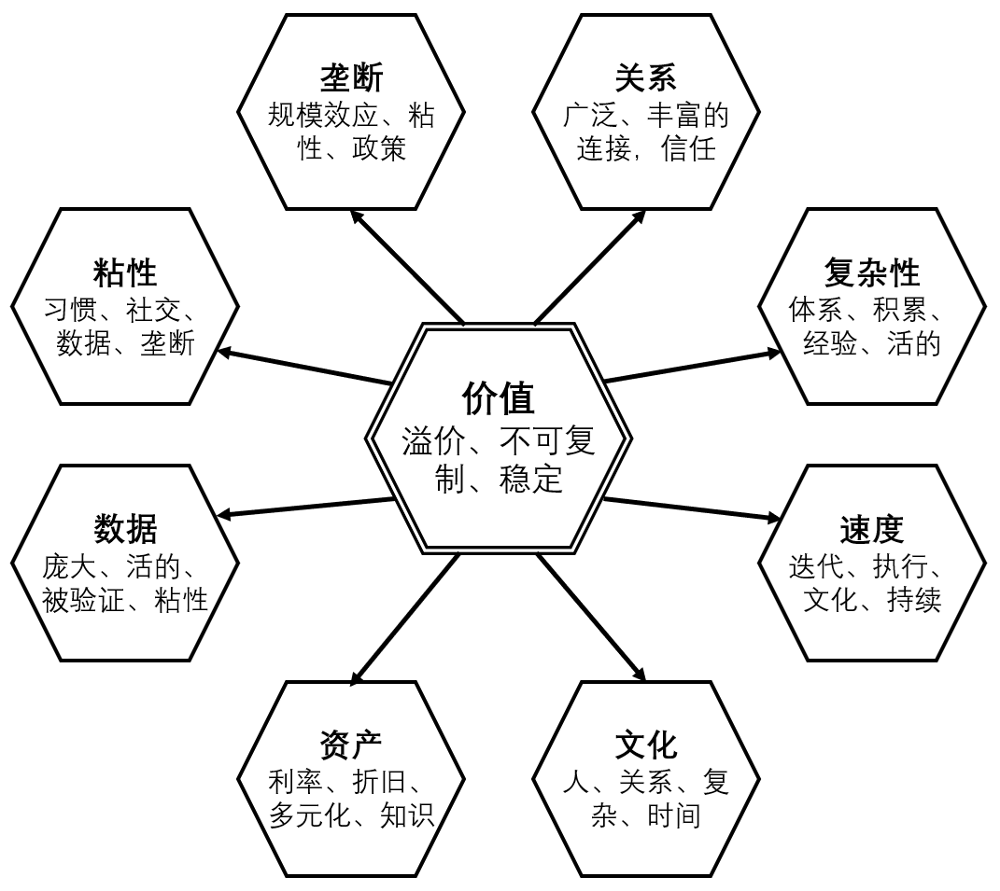

## 关于市场的分析

上一章遍历了存储市场的主要分区、其中的重要参与者、各自的产品、产品的核心需求、未来可能的方向。这一章将继续深入。围绕市场，可以揭示其结构和发展空间、驱动因素、核心价值。

在不断变化的市场格局中，我们处于什么位置？3~5 年、或 10 年之后，我们位于何处？通过对规律的把握，能够帮助 Vision 与 Strategy 分析，规划未来 3~5 年、甚至 10 年之后，我们应处的方位。

### 市场的结构

基本的市场分析包括市场分区、市场规模、用户场景、竞争格局（Competitive Landscape）、产品和功能等，在上一章已经讲述。对于存储市场，有更多维度需要考虑。例如，市场的“天然结构”是什么？其决定产品的上限和增长模式。

#### 客户组成

考虑开发新的产品、功能， 其对应的市场由哪些客户组成？

典型的划分是，__SMB、大型企业、专业领域__。作为客户类型，SMB（中小企业）、大型企业对产品的需求、营销策略显著不同。尽管大型企业能提供丰厚的销售利润，但 SMB __议价能力__（Buyer Power）的要求更低，避免带来大量定制需求，甚至把公司变成运维。

如今，__政府采购__ 应被添加作新的客户类型。此外，__个人消费者__ 也应被添加，其常购买网盘存储（见下文 Empower Everyone）。在此之上，购买方 __垄断程度__ 应作为市场的结构的关键考量之一。而销售方，__开源__ 应被添加为竞争者。

这个话题进一步引导向 __Porter 五力分析__ [[88]](.)：竞争者、供应商议价能力（Supplier Power）、购买者议价能力（Buyer Power），替代品威胁、新进入者威胁。

相似的分类是，__低端、中端、高端__，覆盖不同偏好、规模的客户。低端走量、标准化。高端服务大型企业、定制需求，或特殊专业领域。

另一个关于客户的维度是 __粘性__，例如社交网络。详细内容见下文 _“[什么是价值](.)”_ 小节。

#### 市场的天然结构

有些市场天然具有 __规模效应__，例如水电、云计算。竞争最终导向参与者兼并，留存少数企业，而存活者享受营收和利润率的双重上升。

而另一些市场具有 __反规模效应__，例如教培、咨询、猎聘、投资。市场允许新小参与者不断加入，大型参与者导致分裂，而成熟的个人、团队倾向单干。

与此相配的市场维度是 __增长模式__。规模效应下，互联网产品的用户数量可以 __指数__ 增长 。高 COGS 、人力成本占固定比例时，如制造、运维服务、外包定制，产品趋于 __线性__ 增长。反规模效应下，产品增长甚至会 __递减__，另一种递减是市场衰退。

#### 市场的天花板

在一轮市场生命周期（见下节）中，市场规模最终能增长到多高？这和市场的天然结构相关。一个参考是 O(P)：调查每一个人，有 P 概率使用该产品。

__O(1) 规模的行业少见且珍贵__，例如社交 App 和支付应用，每人都用。而好莱坞电影虽然知名，却未必每人都看过。O(1) 的行业上限极高，渗透力强。反之，则天花板有限，往往需走高端路线提高单价。

某种意义上，__Enable Everyone / Empower Everyone__ 的经济效益，是增加 O(1) 级行业的数量，扩大 O(P<1) 行业的覆盖。

#### 对相邻市场的渗透

新兴、高速发展的技术不仅能够革新自身行业，往往也对临近行业进行渗透，进一步扩大市场和销售范围。

例如，云计算发起自售卖计算、存储资源，但逐渐取代了企业的本地运维。对象存储原本用于存储图片、视频，但统一存储平台（Unified Storage）有能力兼管文件、块服务。互联网平台对各行业的渗透显而易见。

除增长模式外，__渗透能力__ 是衡量市场潜力的另一维度。另一种说法是，__1+1>2__，多种产品形成逐步加强的循环反馈（__闭环__）。

反过来，__易被渗透__ 的市场是不利的，往往需要配套投资相邻市场，利用产品组合构筑护城河。

#### “推论”

从个人 __职业发展__ 角度考虑，所加入的市场分区起到重要作用。当产品具有规模效应时，企业倾向保留少量、尖端的人力，不吝惜给予高薪酬，因为成本不在此处。__人力是成本还是 Multiplier__？

当产品具有线性增长模式时，薪酬往往不高，但好在工作数量较多。__市场天然利润率预期工资水平__。见 _[理解股价](.)_ 章节。

大规模 __裁员__ 往往意味着市场处于递减、衰退阶段，此市场对职业发展非常不利，“被赶走” 至少避免主动处于不利市场。

### 市场的生命周期

从市场结构继续，下一个关键的维度是市场的生命周期。未来数年后，我们的团队和产品将处于什么位置？市场结构解释增长和上限，而市场生命周期预测其阶段。基于此制定策略，并为下一周期铺路。

#### 市场的阶段

市场阶段可以 __划分__ 为导入期（Introduction Stage）、成长期（Growth Stage）、成熟期（Maturity Stage）、衰退期（Decline Stage）。

新技术在导入期潜伏于小众爱好者，先进但增长缓慢。在成长期快速爆发，指数增长。在成熟期激烈竞争和兼并，比拼质量和客户留存。在衰退期被逐渐取代，营收、利润率双降。

更重要的是，通过市场分析预测 __什么时候__ 该市场进入成长期、衰退期等阶段，以此计划策略转向。

#### 新市场的来源

新的市场往往来自 __规模增长__、__新技术__、__成熟度__、__商业模式变化__、__政策合规__。在下文 _“[驱动因素](.)”_ 一节详细讲解。颠覆式创新是市场更新的源动力。

### 颠覆式创新

本节仍属于 __市场的生命周期__ 一节，但因重要性独立。这可以说是最重要的概念。科技行业中，颠覆式创新（Disruptive Innovation）是市场更新的 __源动力__。颠覆式创新是市场周期的开始和终结。

（更多关于创新，见 [Accela推箱子 - 创新的技能和方法总结](https://mp.weixin.qq.com/s/v6ZRyIZOsyeR_X6wUXIYIw) / [https://mp.weixin.qq.com/s/v6ZRyIZOsyeR_X6wUXIYIw](.)）。

#### 渐进式创新

在未跳出单一市场生命周期前，企业增长一般依赖 __渐进式创新__。但随着复杂性积累，边际收益（Marginal Gain）降低，阻力增加。市场增长放缓，竞争加剧，陷入“__内卷__”或停滞。

另一方面可以看到，无论是渐进式创新还是颠覆式创新，__企业的日常工作离不开创新__。渐进式创新本身并不简单，其需要经验和洞察，以找到有效的“百尺竿头更进一步”，并带领团队成功实施。

#### 颠覆式创新

颠覆式创新带来新的技术和新的范式，__新一轮市场周期__ 由此开始，并替换、终结上一市场。

新技术在导入期潜伏于低端市场，往往不被原市场的成熟参与者发现。新技术进入成长期后，快速夺取大量用户，而原市场被迫进入衰退期。对于被替代的原市场参与者，此时 __规模大成为负面因素__（见 _[理解股价](.)_ 章节），往往难以自由应对。最终，新技术夺取高端市场的桂冠，完成市场替代。旧新交替，重复循环，行业在一轮轮叠浪式的周期中发展 [[90]](.) 。

颠覆式创新有很多例子。例如，云计算渗透企业存储、数据库、运维市场，NewSQL 将 Scale-out 分布式带入数据库，统一存储（Unified Storage）引入 SDS 并实现分布式文件系统，容器和 Kubernetes 革新集群管理。下图中有更多例子 [[90]](.) 。

#### 颠覆式创新的特性

颠覆式创新的 __“发展进步”__ 体现在多个方面。新技术比旧技术具有更高的生产力和效率，达到完全替换后，__市场天花板额外增高__。新技术更具活力，除替换原市场外，__对相邻市场进行渗透__，进一步拓宽市场规模。新技术需要翻新原有产品和上下游配套，导致 __重写代码__，带来新一轮劳动力需求，从“内卷”中解放。

“重写”意味着，颠覆式创新并不抛弃上一市场周期的产物。知识、经验、旧有路线被 __带入下一周期复用__，__螺旋上升__。例如，DPU 是存储领域的新近创新，但 ASIC 在交换机中使用已久 [[89]](.)，而 SDS 之前的存储本就是“专用硬件化”的。长期看，软硬互相 __交替摇摆__。上一周期、上上周期的经验有高重用价值。

近年来，__颠覆式创新在加速，市场周期在缩短__。曾经的传统行业，老技术可以干一辈子。存储、服务器等后端技术，大约可以续用十到二十年。而互联网的快速迭代、前端技术，也许五年就已经面目全非。生成式 AI 的快速发展更惊人，突破成果的发布以月记。加速趋势得益于生产效率的提高，全球协作便利，开源基础设施完善，金融投资的远见，以及对企业快速扩张的支持。

#### “推论”

颠覆式创新下的新市场周期，往往“重写”上个周期的产品，重复上上周期的路线，“螺旋上升”。这意味着 __老员工尤其重要__，因为他们经历了上一周期乃至上上周期，其经验和目睹的历史，可以在下一市场周期复刻。（这与如今职场的 35 岁淘汰风气相反。）

另一方面，__新手有特殊价值__。颠覆式创新要求跳出固有范式（Think out of box），新手是难得的屏蔽思维定势和切换视角的机会。向他们咨询，赶在其被团队“污染”之前。而成熟员工往往或多或少已被团队“污染”，沿袭 We always do this before，习惯“成熟”经验和视角，并将“污染”新人。

颠覆式创新意味着，__当前的工作一定会“完蛋”__。而现代的颠覆式创新在加速，市场周期在缩短。这意味着未来的个人 __职业生涯将更短__，可能在五到十年后面临技术换代，大规模裁员。而新一届毕业生更有竞争力，拥有针对新技术的系统完整的训练。

新技术换代的被驱逐者也是 __曾经的得利者__。快速换代的市场中，新人总有大量机会进入，超越老人，获取高薪。市场不易形成“辈分”和壁垒，更加吸引新人加入。

### 驱动因素

是什么驱动源源不断的新需求，供各个市场参与者存活与成长，并周期性地开启新的市场周期？对于存储市场，驱动因素来自多个方面：__规模增长__、__新技术__、__成熟度__、__商业模式变化__、__政策合规__。掌握驱动因素帮助确定未来的发展空间和方向。

#### 规模增长

相比其它市场，存储市场的一大特点是  __天然的规模增长__，不间断且速度不低，支持约 10%~20% 的市场规模增长。

为应对规模增长，__催生各式创新__。例如，软件层面上，分布式文件系统支持线性扩大数据规模，以及整个大数据生态。硬件层面上，多数硬件能力逐年指数增长，见 _[存储系统中的硬件](.)_ 章节，并伴随逐代技术升级，例如 PCIe、QLC 闪存。运维管理上，SDS 允许更便利、弹性地管理大量、异构的存储设备，以及云计算。

数据增长同时伴随 __能力效率的提升__。一个人能管理多少数据？从旧时代的一个人管理一台机器，到运维中一个人管理 1PB 数据，再到云时代一个小团队管理全球数百数据中心。

#### 新技术

市场更新的源动力来自 __颠覆式创新__。技术换代、范式转移（Paradigm Shift），带来原产品的 __“重写”__、重建、上下游重配套需求，诞生大量工作岗位。新市场在 __替代__ 原市场的过程中，重新产生大量购买需求。新技术往往诞生_之前不存在的 __新场景__，进一步催生需求。

新技术的另一增长来自 __硬件发展__，其能力指数提高。更强、更快、更大、更便宜，使不可能的场景变成可能，使昂贵的产品变得触手可及，奇迹被瓶装出售、打折甩卖。

随之而来的是 __软件层面__ 的需求。软件需要 __整合__ 异构硬件、__适配__ 下一代，__优化__ SKU 组合甚至 Co-design 。软件需要 __集成__ 不同企业系统，并统一 __管理__ 大量设备。软件需要提升 __资源效率__，并尽可能地保留硬件的原生 __性能__。而为了应对 __复杂性__ 和 __易变性__，也催生更多技术。见 _[存储系统中的硬件](.)_ 章节 - “软件的价值”。

#### 成熟度

随着市场走向成熟，客户期望产品提供更丰富细化的功能，这一过程伴随 __渐进式创新__。它们提供了参与者日复一日的工作。

对于存储系统，具体的期望是：更大规模的数据，更好的性能，更高的可靠性，更低的成本，更便利的管理，更安全，更丰富的功能，更强大的集成，客户服务和支持。

首先，__更大规模的数据__，催生一系列 Scale-out、Scale-up 相关的容量、性能技术。在容量的基础上，需要分布式一致性（如 Paxos）、分布式事务、数据组织（如列存）、索引技术（如 Mass-tree）。为管理大规模的数据，集群管理（如 K8S）、部署 Orchestration、运维自动化、监控和预警技术（如时间序列数据库），应运而生。

其次，__更好的性能__，催生多个维度的优化，简化调用路径（如 DPDK、SPDK），高速网络（如 RDMA），负载均衡（如 Hedged Request），动态迁移等。另一方面，与硬件发展整合（如 DPU、ZNS SSD）。

在 __更低的成本__ 需求驱动下，数据存储成本被持续降低，如冷热分层、纠删码、数据压缩、全局去重技术。另一方面，数据写入和读取的服务成本被降低，如 Foreground EC、芯片加速、分布式缓存技术。

接下来，__更便利的管理__ 包含多个方面。客户希望见到简单易用的图形化界面，并自动升级。管理需要统一，例如混合云，跨越本地、Edge、云的边界。命名空间需要统一，常用于跨多云的文件系统，并且全球部署和访问。资源响应弹性快捷，如容器。

一大范畴是 __更安全 Safety__。典型的需求是数据复制、校验、QoS、备份、快照、容灾。在全球化部署下，地理复制、可用区容灾日渐普及。保护级别逐渐提高，从 5min RPO 到 Zero RPO，从低频的手动快照到 Point-in-time 和 Time Travel。另一方面，形式化验证如 TLA+，也在存储中应用普及。

另一大范畴是 __更安全 Security__。一部分需求来自传统的存储加密、传输加密、认证、权限、防火墙、密钥管理，补丁升级等。另一部分需求来自时新场景，如 Zero Trust、Ransomware 保护、不可变存储、隐私保护。

接下来是 __更丰富的功能__，有多个方向。单一功能可以 __延伸至上下游__，例如。数据格式 -> 可视化表格 -> 自动 ETL -> BI 统计报表 -> 复杂数据查询 -> 大规模存储 -> 数据湖 -> 专用服务器，形成产品组合，构筑护城河。单一功能可以更 __完善、细化__，如文件系统支持更多格式、访问协议、提供各式工具。甚至支持 __定义外的功能__，如数据仓库支持修改数据和事务，“打开文件”窗口支持顺手编辑无关文件，数据库集成 BLOB、时间序列、向量。功能的丰富如同 __分形触手__，在需求矛盾下层层深入、细化。

最后，__更强大的集成__，是企业应用的常见需求。在上一章 _[俯瞰存储市场](.)_ 中，集成被反复提及，作为必要的竞争力。例如，办公软件集成数据库和 AI，存储平台集成第三方 ISV，数据管理集成通用的文件共享、Active Directory 等。集成也为产品跨界，__向相邻市场渗透__ 提供窗口。集成包括众多 __繁复__ 的工作，例如不兼容的 API、多样的数据格式、易变的业务流程、来自人的多样需求、报表和可视化、管理 Portal、持续花费的维护。

除此之外，__客户服务和支持__ 也是存储产品走向成熟的需求之一。客户服务不单指解决产品故障，还包括为客户场景架构解决方案、选择费用合理的购买组合、部署实施等，一系列要求大量知识和专业沟通的工作。此外还有专业完善的文档写作。

#### 商业模式变化

需求的驱动一端来自技术，另一端来自商业模式、来自客户。相比电商、社交网络、互联网，存储的商业模式变化相对缓慢，但近年来仍有一些变化。

大流行带来了 __居家办公__、__远程工作__ 的普及。企业借此削减办公室租赁费用，获利于全球招聘，跨州团队日常运作。远程办公催生 Zero Trust 的需求，以及办公软件（如 Office 365）、远程会议（如 Zoom）的增长。办公文档、文件共享、会议视频促进存储需求。

另一反复提及的趋势是 __STaaS__（Storage as a Service，存储即服务）。使用 Web 服务提供存储服务不仅便利，省去客户的升级管理负担，还使得按实际使用量付费（Consumption-based）变得可能。相比 upfront 购买机器，企业降低了成本。__云计算__ 也算作此趋势。

有更多趋势，例如，__生成式 AI__ 在用户界面和客户支持中的集成，客户变得青睐 __SDS 存储__，__容器__ 成为集群管理的基本模式，__归档存储__ 在 GDPR 下的普及。

数据库市场更加活跃，例如，数据库在 SQL、NoSQL、__NewSQL__ 间的变迁，数据仓库的 OLAP、OLTP、__HTAP__ 混合，以及 __数据湖__。

#### 政策合规

市场需求的另一变化来源是政策合规。近年来的变化有 __GDPR__、__数据主权__，以及相应的 __地理跨区存储__ 等。

GDPR 强迫增加业务成本，也意味着增加了客户支出，从而增加市场规模。新政策规范催生新技术，以满足隐私管理、数据归档的需求，进一步扩大市场，驱动增长。

特别地，政策可以被市场的头部参与者 __主动推动__，以加快相对缓慢的商业模式变化。另一方面，严苛的合规要求增加行业准入门槛，排除体量较小的竞争者，加宽现存参与者的护城河。

### 什么是价值

关于市场的分析中，最核心的问题是，什么才是历久弥新的真正价值。这里的“价值”要求很高：

  * __溢价__：即使对手出售拥有同样功能集的产品，我们仍能卖出更高价格。

  * __不可复制__：即使技术完全泄露（或开源），我们的产品仍能卖出更高的价格。

  * __稳定__：不随时间衰减，跨越市场周期，在风险中稳定。

__技术__ 能够提供良好的竞争优势，但“价值”的要求更高。技术容易被复制，专利可能被绕开。颠覆式创新注定瓦解现存技术的优势，市场周期确保这一定会发生。

__核心技术__ 具有同样的不利问题。“核心”意味着在“大量”地方可以“复用”。那么，它是容易迁移的，只要被对手复制，就可为其所用。对手大概率会遇到相似场景，并自发地开发类似技术。一人开发成功技术，即可复用到各处，导致所有人失业（例如，开源的天然垄断性）。相反，复杂性、垄断，反而更容易构筑护城河（见下文）。

技术带来进步的 __效率__，例如网购平台相比实体商店的决定性优势。但这并不能阻止竞争者入场，搭建新的网购平台。相反，护城河常常围绕信任关系、垄断、迭代速度构筑（见下文）。

下面，本文将真正的价值分解为多个方面，并逐一讲解：关系、复杂性、速度、文化、资产、数据、粘性、垄断。

#### 关系

这里的关系指连接（Connection），更接近图论，而不仅仅指人际关系。自然地，拥有广泛而丰富的连接的实体，更加健壮和稳定。连接组成链条，形成网络。

关系的例子有哪些？良好的 __政府关系__ 帮助大型企业拿到高额的采购订单，甚至有能力影响政策，制定行业准入门槛。__社交网络__ 构建于人际关系，广泛、粘性、挖掘价值巨大。网购平台与 __大量客户连接__，建立信任，获取流量。企业与 __金融信任__ 的关系（Credit），帮助其拿到成本更低、更灵活的融资贷款。企业对 __供应链__ 的培养，与众多供应商的紧密合作，帮助提高产品质量并稳定风险。拥有 __全产业链__ 的企业，能够聚焦投资于单个产品以量突破，相比只有单个产品的企业更具优势。

广泛的连接让居中者成为 __中介__，往往比其连接的单个生产者更具优势，而 __1 对 N 构成垄断优势__。顺风时期，利用关系的弹性，快速扩展规模。面对风险时，中介方容易通过多重连接转嫁风险，而单一生产者则需刚性应对。中介方的优势并不依赖 __技术__ 获得，广泛的连接易于获取 __信息优势__，甚至能够通过与技术端的连接，分享其利润。遍身罗绮者，不是养蚕人；牧畜产肉奶，收获却是人。

对于人而言，在能够自由选择的情况下，关系的根本是 __信任__（Trust）。信任是 __资产__、是价值，需要时间积累、维护，并且随时间增值。

#### 复杂性

上文提到，单一核心技术难以匹配真正的价值。而持久的竞争优势往往来自众多技术组成的复杂性的 __技术体系__。它来自先发优势、常年的积累。其中的单个人极难完整讲述，亦或理清整个体系，乃至复制。

并且，技术体系是是 __活的__：拥有真实活跃的市场、竞争者、客户、销量，在持续的 __反馈循环__ 中改进。其中有人和经验。复制活物更加困难。

如何加快技术体系的积累？持续的高速是真正的价值之一，在下节 __“[速度](.)”__ 中讲解。它需要维持高质量的企业 __组织关系__、__[文化](.)__，维持大规模、复杂 __成熟__ 的产品、产品组合，维持高效的 __执行力__、人才组合、工程实践，维持部门、客户、供应链的 __[关系](.)网络__，并努力降低沟通和交易成本。它们关联到本文的各章节。这些 __无形资产__ 所体现的复杂性，需要长时间的建设，并且极难复制。

复杂性有更多的例子。典型的是 __经验__，其难以通过讲述、书本直接学习，其中混合大量零散片段、错乱交织，以及直觉。必须亲身经历、时间积累，正是“难以复制”。另一方面，其往往难以迁移复用，导致疏于传播、造成稀缺，反而加强在本地企业中的价值。

另一个例子是 __数据__，将在下文讲解。数据是现代企业的核心竞争力之一，庞大、复杂、有待挖掘，并源源不断注入。

#### 速度

速度的英文 Velocity 更应景，指企业产品或技术体系 __快速迭代__ 的能力。如果将产品的功能集比作城市建筑，那么速度类似 __高速公路__，虽然不对应直接产品功能，但对建设速度至关重要。

企业 __持续__ 地高速迭代产品的能力，是真正的价值之一。即使被对手 __完全复制__ 产品和技术（如开源），仍能够通过未来的速度赢得客户。例如 SpaceX 对传统航天机构的决定性优势，例如 Chrome 浏览器的频繁更新 vs IE 浏览器曾经的“年度”更新。此外，速度之外，__加速度__ 甚至更为强大。

企业如何维持速度优势？上一节 “__[复杂性](.)__” 已经列举。企业需要良好的 __管理体系__，控制成本收益，输出高质量产品和服务，并在 __成熟度__（见前文小节）上持续前进，背后是企业 __[文化](.)__。另一方面，企业需着力 __投资__ 和创新孵化，以应对周期性的 __颠覆式创新__ 和原市场衰退。

从系统开发角度，成熟的 __Continuous Integration（CI）系统__、全球协作、GitHub 颇具价值。这里可见为何 GitHub 被 Microsoft 收购。另一方面，2C 产品在迭代速度上，天然对 2B 产品具有优势，后者的数据存储类产品尤其慢（数据不容损坏）。常见的策略是，__用 2C 产品带动 2B__，例如，公有云供应商 Amazon、Google、Microsoft、Alibaba 都兼具两类产品。

从速度作为“价值”的角度看，可以理解互联网公司普遍追求的 __996__、加班文化，此“价值”甚至超越核心技术。尽管对公司的价值与对个人的价值往往并不一致，见下文 “__[推论](.)__” 部分。

#### 文化

企业文化在前文多已提及。根植于人于人 __[关系](.)__ 的无形资产，往往最难以复制。企业文化涉及 __[复杂](.)__ 的组织建设，历经多年积累。__[速度](.)__ 需要企业文化支持，以维持强大的执行力和创新精神。

在与客户的关系中，__品牌文化__ 在消费品市场中极具价值，例如众多的奢侈品。即使对手复制同样的商品，文化加持的产品也能卖出更高的价格。

在企业内部，良好的 __雇佣文化__ 有利于维持员工稳定，以更优惠的价格招揽同样的人才。__末位淘汰制__ 往往以危害文化为代价，牺牲真正的价值以节省开支。管理者的权利来源于裁员；重新招聘类似再抽签，而未修复任何问题。

#### 资产

简单直接地，大量的钱就是“价值”。资产通过利率增值，是乘法，按照 __指数增长__，能在你 __睡觉__ 时为你赚钱，并 __持续__ 下去。而劳动力是加法，“时间-收入”是 __线性__ 的，必须有你在场劳动，一次付出换取薪酬后便消失，并随年龄 __折旧__。

个人开发者与体力劳动者的区别在于，__知识是资产__。知识能够提供额外工资回报，随着经验和更多知识的积累而增值，付出后可重复使用，并得到 __复杂性__ 的保护。知识容量可获得十倍增长，而很难想象体能获得十倍提升，如 100 米短跑从 12 秒变成 1.2 秒。况且，体育竞赛只有一个冠军，其 “__内卷__” 比知识工作更为严苛。类似地，__996__ 式纯体力输出的工作方式并不明智，人无法每天工作十倍多的时间。

相应地，__技术__ 对于公司而言，类似知识资产。公司还能大量拥有 __其它类型的资产__，如现金、证券、存款、品牌、用户、房地产、机器、产权、专利。众多资产需要有效 __管理__（见下文“管理者”），确保每一份资产的产出都至少达到 __市场利率__ 水平。反例是，付出开发成本的项目被取消。另一方面，资产管理需要考虑 __维护和折旧__、__税收__ 成本，以及 __政策风险__。折旧是资产的一大成本。

类似折旧，知识资产 __随时间贬值__（Expiring Asset），对个人开发者影响更大。而普通资产，往往能稳定产生利息，随时间增值，并通过变现阻止折旧。更重要的是，普通资产受私产 __法律保护__，而这并不直接适用于脑中的知识。

快速贬值的资产更需要管理。投资管理的准则之一是 __多元化__。而个人开发者的专精单一技术的 __专家路线__，可以说是背道而驰。尽管专精的技术专家在招聘中受到青睐，但对于公司，从前文看，销售 __产品组合__ 更具竞争力。（同理，个人能力组合是否更利于招聘？）

多元化类似 __众多的连接__，见前文 “[关系](.)” 一节，公司部分已经覆盖。对于个人开发者而言，一种选择是在公司内积累经验并建立广泛的人脉（人脉是互惠的，而非资产排他），另一种选择是在公司外建立连接，确保知识和工作的 __可迁移性__（例如开源技术），第三种选择是 __管理者__。

公司经营的重要一环是管理者，__管理者的工作本质是投资__（前文提到资产管理的“市场利率”）。例如选择项目方向、雇用人员，对应的是工资等的投资。管理者使用 __公司的资金__ 进行投资，并从投资回报中支付自己的工资。相比个人开发者，管理者的工作天然具有 __多元化__（也常常“多线程”）。例如同时运作多个项目、孵化多个创新、雇佣多名员工。管理者与员工满足 __1 对 N 的 [关系](.)__，前者在风险中更加稳定，并可分发裁员名额。管理者并不直接依赖 __技术__ 获取竞争优势，但极具价值。

此外，许多工作岗位不具备资产的特性，却是社会运转的必要工作，献身其中的人是真正的勇士。

#### 数据

数据是现代企业的核心竞争力之一。数据通常拥有 __庞大__ 的体量，多维度的复杂结构，有待挖掘的价值，受到产权保护，并且是“活的”。容易复制产品功能，但难以复制背后的数据。

__活的__ 数据意味着被大量真实客户使用、被维护、并不断地更新。更重要的是，__被验证__，尤其对于存储产品。在用户创作时代，活的数据积累了大量客户创作、社交关系、使用习惯和历史。用户、数据、产品构成不断演进的 __反馈循环__。

另一方面，数据往往具有 __[粘性](.)__（见下文小节）。客户迁出数据的成本高昂，和数据量成正比，随着数据积累增加。迁移数据往往带来格式不兼容、功能不匹配、高昂的传输费用等问题。

公司的 __[速度](.)__（见前文小节）依赖数据。现代项目管理、产品评估、创新，构筑于 __数据驱动__ 之上。例如，评估某新存储功能带来的成本收益，并实时监控上线后的运行反馈。

#### 粘性

粘性与产品的场景和特性有关。粘性提高用户迁出或放弃产品时的成本，例如积累的大量 __数据__，培养的 __用户习惯__。

另一种情况是 __外部粘性__，例如社交网络，一个用户使用产品，导致社交圈下的其他用户也倾向使用同一产品。另一个例子是企业产品组合的互相捆绑，俗称“全家桶”，优化同家产品互联，并劣化与竞争产品的兼容性。

在技术和功能之外，粘性提高了产品的价格，甚至帮助企业走向 __垄断__。即使对手完全复制产品，也难以赢得客户。

#### 垄断

垄断为企业提供决定性的竞争优势，极具价值。垄断能够以高价出售产品，并影响政策以维护自身地位。垄断并不一定依赖技术，甚至常常减缓技术发展。

常见的垄断来自高度的 __规模效应__，例如水电基础设施、云计算、互联网平台。参与者常在早期赤巨资扩展规模，在达成垄断地位后获取超额收益。最终，在反垄断的政策限制下，通常市场上会留下两家企业，形成 __寡头__ 局面。

另一种垄断来自 __粘性__（见前文小节），例如社交网络。第三种来自 __政策性垄断__，常见于公共事业和国家安全，例如石油产业。

此外，一种类似的企业行为是快速 __扩大市场体量__，增幅营收、压低利润率、加速迭代产品。其利用巨大体量获取银行融资的便利，在供应链上下游压货、压款以获取金融利差，并以巨量雇佣岗位获取政策优惠。例如新能源造车行业。

#### 关于：有价值的技术

什么样的技术能够接近“价值”的要求？一则是见前文提及的，具有 __[复杂性](.)__ 和 __[速度](.)__ 的技术体系。或者，尖端技术并且 __被保护__，以对抗可复制性。

生成式 AI 是新近的尖端技术，同时也具有复杂性，但仍难以阻挡众多竞争者入场，并在各国复制和传播该技术。持有该技术不足以使企业生存，要么跑得足够快，见 [速度](.) 一节，要么配合其它产品，意味着企业还持有其它的“价值”。

#### 关于：价值与市场周期

虽然“价值”有利于企业获得竞争优势，但长远来看，许多“价值”追求会降低市场活性，加速市场老化。例如，对 __垄断__ 的追求和设置政策门槛，有意制造产品 __粘性__ 以捆绑客户，编织特殊待遇的政商 __关系__。

最终，价值被排他地锁定在头部参与者中，新人进入市场将处于劣势。要么选择 “__卷__”、激烈竞争、996 式劳动输出，要么选择 “__躺平__”、跟随市场老化。

或者，在旧市场中革命，开辟新的世界。由此，__颠覆式创新__ 到来，开启新一轮市场周期。颠覆式创新的另一个名字是破坏式创新。

#### “推论”

有许多关于个人 __职业发展__ 的讨论，见前文 “[资产](.)” 一节。另一方面，在 __粉丝经济__ 中，粉丝更接近于资产，其价值远超单纯劳动力输出。这解释了为什么“宁可做主播也不进厂”，尽管粉丝并不像普通资产一样受法律保护。

关于 __[关系](.)__ 有进一步的思考。技术链条也是关系的网络，单一技术只是产业链条上下游定义的语言（不可迁移性），部分反映物理世界（__可迁移性__）。薪酬的回报取决于 __上下游__ 市场，技术艰深并不确保之。相反，__虚拟__ 的往往更值钱，因为满足 1 对 N 的关系，例如软件管理硬件、老板管理员工、金融投资实业。虚拟部分掌握资源分配、沟通渠道、信息流通等更具 __价值__ 的部分，乃至法律、政策。

对 __[资产](.)__ 有更多深入的思考。训练有素的分析者看 __一切事物都标记着利率__，__金钱正在无声嘶喊__，比人的嘴更值得信赖。法律、政策同理。社交网络的喧闹信息，其重要性可以按照背后流动的金钱排序。现代社会中，无法听到金钱的声音，无异于盲人聋哑。

通过对金钱的建模也可还原个人乃至社会的真实偏好。人们为保卫生命而激发的杀戮欲望，远超对普通消费品的购买需求。社会仇恨具有良好的资产特性，地缘政治冲突的获利空间巨大，可持续战争光华毕现（不幸）。

### 总结

在前文列举存储市场的基础上，本文分析了市场的诸多特性。例如天然结构、生命周期、颠覆式创新等。接下来，本文分析了背后的驱动因素，它们是预测未来、寻找需求的引导。最后，本文揭示了什么是真正的价值。在技术之上，其为企业和个人带来不可复制的竞争优势。

另外，其它值得一读的文章：

  * 腾讯 22 年前的神级 PPT 立项汇报：[https://zhuanlan.zhihu.com/p/684222828](.) 。Highlight：__市场分析__。

  * 硬核分享云产品定义 - 曹亚孟：[https://mp.weixin.qq.com/s/8sQINI40GZlXm8l9Wd6n-w](.) 。Highlight：__定义的能力__。

  * 技术 Leader 的思考方式 - 朱春茂：[https://developer.aliyun.com/article/940003](.) 。Highlight：__技术产品管理__。
