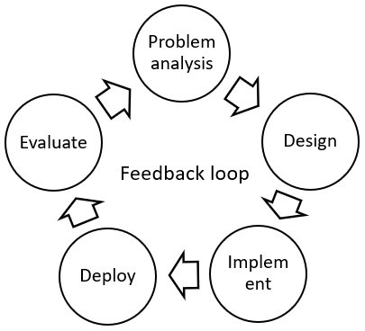
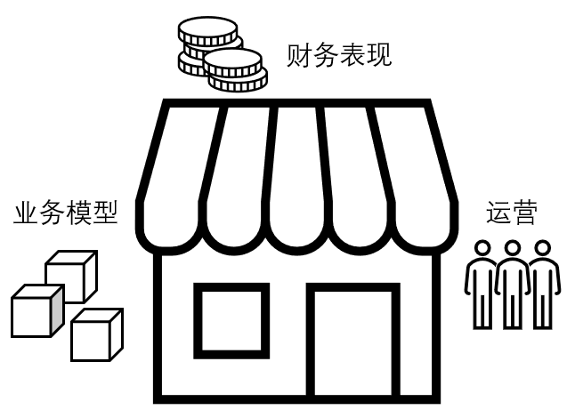

## 一些方法论

Vision 与 Strategy 涉及一系列对未来和趋势的深度思考，以及对企业架构的理解，以使项目获得确实的投资回报。更重要的是，它需要用系统的分析和数据支持预测的结论。总的来说，其思考方式更接近于 __产品经理__、__商业分析__（Business Analytics）、__市场调研__（Market Research），而不是技术开发工作。

本章介绍关于 Vision 与 Strategy 的方法论（Methodologies）。将依次介绍 Critical Thinking、Case Interview、Strategic Thinking、Business Acumen、信息收集。介绍内容更多是大体框架，重要的是思考、实践、经验。

### Critical Thinking

Critical Thinking 和批判性思考关系不大，更接近于 Problem Solving。“Critical” 更接近于 Critical Path。之所以用英文名，是因为强行翻译成中文后，含义一定程度发生曲解，下同。LinkedIn 的 Critical Thinking 课程 [[91]](.) 是不错的学习来源。课程包含完整知识，本文仅列出有趣或重要的点，下同。

Critical Thinking 的（部分）重点：

  * __解决根因（Root Cause）而不是症状__。不要直接开始做老板交给你的任务。首先，在上下游、利益人（Stakeholder）中追索，找到真正的、根因的、需要解决的问题。接下来是 __定义问题__，其中最重要的是 Problem Statement 和定义目标。在开始前，将你的定义讲述给其它团队和成员，看是否合理。

  * __高效开展工作__。你需要在 High Road 和 Low Road 中反复切换，Zoom-in/out 视角。High Road 是俯瞰视角，在 20/80 Rule 中，找到有效用的 20%，__Don't Boil the Ocean__。Low Road 在地面视角，例如分析具体数据。其关键是需要时不时返回 High Road，检验其业务价值（Business Impact），__Don't Polish the Dirt__。

  * __“Critical” Path__（关键路径）。你解决问题所走过的路程应该是一条关键路径（图论），每个任务节点必要且不多余（关联下文 MECE）。做老板不关心的工作没有意义。你提供的是 __专业服务__，购买你的服务很昂贵，不要浪费客户的资金。个人开发者不应只有 Low Road。最后，仔细思考任务的 __优先级__。

  * __一些工具__。例如，“__5 Whys__” 用来追索根因。“__Seven So-whats__” 用来推测行动的结果。“__我们过去也这么做__” 是触发 Critical Thinking 的“坏味道”，昨天的策略适合今天吗？__第一性原理__，更直白地说，是将问题分解（Top-down），然后累加（Bottom-up），以合理计算。这类似系统分析的方法。__模仿训练__（Shadow Practice），例如 Gartner 报告，你能否独立分析并得出同样的结果。__切换角度__，例如向另一人讲述，看其如何 Reframe 你的问题。启发式问题，例如，回顾过去 10 年，__如果重新开始__，你会做哪些不同。另一个 __启发式问题__，如何使你的产出指标（Performance Metrics）翻倍？

  * 某种程度上，对 __高层次__（High Level）的关注和对 __细节__ 的关注都是必要的。高层抽象的思考方式具有强大的力量，但如果长期生活在“云端”，则容易陷于思维定势（Stereotype）而无法自拔（如管理者需避免）。从陷阱中走出需要进入细节层面，重新检验已有假设，换句话说是 __第一性原理__。

### Case Interview

Case Interview [[92]](.) 属于商业分析（Business Analytics）或商业咨询（Business Consultant）领域，是面试商业咨询公司如 McKinsey 的一道环节。但实际上，如 Case Interview Secret（Victor Cheng 著）的书中，讲了大量分析业务问题的框架和范例，十分有益，“面试”反倒在其次。

Case Interview 的一些要点：

  * __用 Proxy 估算__。快速估算和口算是商业咨询的基础要求。估算有一系列方法，其中 Proxy 方法较为有趣，例如用街道人流计数、附近门店上座率，估算新开门店的营业额。Proxy 方法可以更进一步，如按照人口统计分层、确定 Proxy 变量、分解问题，并用不同 Proxy 验算。

  * __Mindset__。商业咨询的思考方法和 __Critical Thinking__ 有很多重合，例如 Don't Boil the Ocean，时间昂贵，专业服务。另一方面是 Independent Problem Solver：把你独自一人丢到 Fortune 500 企业的某部门中，你能够说服客户（如上文的 Conclusiveness），解决问题，并维护雇主的形象吗？极强的 Soft Skill 是必须的。

  * __Issue Tree Framework__。Case Interview 的经典分析方法是 Issue Tree Framework，例如 Profitability 框架。其要求首先确定假设（Hypothesis），然和将问题逐层分解。分解需要满足 __MECE__ 测试和 __Conclusiveness__ 测试，前者指不重不漏，后者指如果所有分支为 True，那么父节点的结论无法否定。分析过程沿着树逐层深入，然后反向汇总回树根，过程中常常动态调整树的结构。Issue Tree Framework 有大量模板，但使用时常常根据问题定制。

### Strategic Thinking

Strategic Thinking 用于制定公司策略，尤其是长期策略，其也往往与 Decision Making 捆绑。它是公司在未来 3~5 年后、乃至 10 年后应处位置的行动计划和导航地图。LinkedIn 的 Strategic Thinking 课程 [[93]](.) 有更多讲解。

Strategic Thinking 的一些重点：

  * __Win the Game__。相比 __Critical Thinking__ 中只有“我”和“问题”，Strategic Thinking 更进一步，要求必须赢得“游戏”。“对手”被放到图景中。在市场分析的上下文中，其图景更接近 __Porter 五力分析__。

  * __观察__。Strategic Thinking 首先要求观察人和对手，除了趋势，还要注意 Micro-trends。一个要点是 __坏味道__（Bad Small），不仅适用于编程，也适用于组织和文化，例如听到 “我们从未这么做”、“我们过去也这么做”。另一个要点是 __Not be Surprised__，Surprise 是管理中的术语，如果你感到 Surprise，那说明观察未到位。观察之后是思考（Reflection），__It doesn't take time, it takes space__（Course section: Embrace the strategic thinking mindset）。

  * __行动__。首先决定做某件事，意味着决定 __不__ 做另一件事。什么都不做，__也__ 是一个决定。需要注意价值链中的 __乘法__ 效用：你的时间 -> 在任务上的投资 -> 你的策略 -> 在公司级别的成效。问自己，__3~5 年后__，“我”如何 Win the Game，“我”会在哪里。行动意味着建立从长期到短期的任务 __分解__（关联 Issue Tree Framework），最终映射到 Tactics，即每年可具体执行的任务。在执行中，不时 __切换__ High Road 和 Low Road（关联 Critical Thinking）。

  * __Making Informed Strategy__。好的 Strategy 不需要是创新的，Strategy __重点在决策__（Decision Making）。首先是市场 __趋势__、经典的 Porter 五力分析。注意从不同 __来源__ 收集看法，包括新老群体，尤其是不同视角的。绘制（Map Out）你的 __资产__（Assets）和 __盟友__（Allies）的图谱。绘制你的 __限制__（Constraints），特别是 __结构性障碍__（Structural Obstacles）的图谱。以及 __SWOT__ 分析。把它们放到上一条 __行动__ 的地图上，需要是现实的（Realistic）、可达到的（Attainable）。

  * __赢得支持__。如何从老板、同事、雇员中赢得支持？不要急于在会议中发布你的 Strategy，此前有大量工作。首先，系统性地 __与利益人会面__，探讨你的计划，得到反馈并解决疑问。可以预见一定有大量反对，重点是你需要 __预见所有可能的反对__（关联 Not be Surprised），用合适的让步和谈判技巧在 __会议前__ 达成一致（关联 BATNA）。最后，确保所有决定和任务 __Accountable__，例如邮件会议小结、定期复查 Timeline。

  * __监测执行进度__（Measure Execution Progress）。常见的 __项目管理__ 被用于 Strategy 的执行过程。更为重要的是，设立 __预期__（Expectations）和 __假设__（Assumptions）。环境是不断变化的，时常 __重新检验假设__，并问有没有更好的 __选择__（Alternative）。在项目开始前（Upfront）、结束后（Retro）应该 __复查__。高风险的部分需要 __更早、更频繁__ 地执行。

### Business Acumen

Business Acumen 从公司的视角，讲解生意是如何开展的，以及如何推进和优化各部分（Pull the Lever）。其覆盖阅读财报、业务模型、Strategy、经营等方面。LinkedIn 的 Developing Business Acumen 课程 [[94]](.) 有更多展开。

Business Acumen 中一些和本文有关的要点：

  * __财务报告__：对应公司财报，__损益表__（P&L statement）可以被逐层分解：营收（Revenue）-> 扣除 COGS -> 毛利（Gross Profit）-> 扣除经营费用（Operating Expense、SG&A）-> 营业利润（Operating Profit）-> 扣除利率、税收、折旧等 -> 净利润（Net income）。围绕财务表现有很多可调节的 “__杠杆__”（Pull the Lever），对应上文 Profitability 的 Issue Tree Framework。一些是长期的，例如技术研发、设施兴建，一些是短期的，如减产、裁员。你可以尝试从历届财报中得出结论，并与公司发布的管理层报告（Financial Brief）__对比__。

  * __业务模型__（Business Model）：业务模型定义如何从生产商品中盈利，从原料加工角度有 __价值链__（Value Chain），从业务增长角度有 __增长策略__（Growth Strategy），从投资角度有 __ROI__，从成本角度有 __CapEx__、__固定成本__（Fixed Cost）、__可变成本__（Variable Cost）等概念。

  * __运营__（Operation）：业务模型 __驱动__ 公司策略和人员配置，人员驱动运营，导致财务表现在财报上显现。围绕运营，首先是 __Strategy__，在前文中已提及。公司的投资组合构成 __Initiative Pipeline__，其逐次展开成为公司的未来。__营销策略__ 选择并帮助公司掌控客户。__R&D__ 常与 __并购__ 合并考虑，后者节省上市时间，并可以占有对方市场。在竞争中 __保护产品__ 需要策略，例如快速发布，或者专利。__人员策略__ 涉及如何寻找人员、培训、组织架构、流失率等。观察公司在各个职级中开放招聘的岗位，可以了解其人员策略，以 __推测__ 其业务策略。

### 信息收集

本节简单讲述如何收集市场信息，以支持 Vision 与 Strategy 分析。

  * __“水下”的信息__（Underwater）。许多前沿的、有价值的信息，常常并未发表。例如论文作者往往提前一年已经知道某有价值的研究方向，并开始研究。而如果只阅读论文的话，一年后才能获知此信息。同理地，各高校实验室、企业研究院、开源社区。获取“水下”信息更多依赖 __社交__，参与各式会议、面对面交流、寻找合作者、互惠互利。另一方面，公司拥有真实的的 __客户__ 和 __供应链__，从这些关系更容易获得潜在的市场动向，甚至决定市场动向。

  * __投资__。从投资新闻中可以获得新技术的动向。相比阅读论文，获得投资的技术是被“金钱”验证过的，并可以根据投资多少衡量其强度。投资新闻常见的有 Startup、融资、收购等等，或者看到某个新公司开始“有钱”在各媒体撰写文章，推广自己了。另一方面，有潜力的论文经常会迅速获得融资并创立 Startup。

  * __研究报告__。许多市场研究乐于预测未来方向，例如 Gartner、IDC。虽然企业可能会付费进行推广，但资金充裕的企业至少说明此方向确有发展前景。_[俯瞰存储市场](.)_ 章节中，将看到更多例子。
