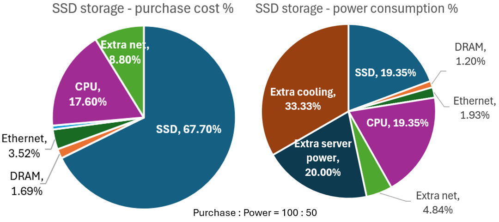

为什么需要 Vision 与 Strategy？有许多方面的原因。

Vision 与 Strategy 始于提问，1 年、3~5 年后、乃至 10 年后，我们应该处于什么位置，团队和部门应该在做什么，应该以什么样的方式工作。Vision 并不是指寻找最新技术趋势，并学习和应用它们。Vision 是“当事者”需要预测正确的技术趋势，确定投资方向，并用数据驱动和系统分析支持其的结论。

总的来说，其思考方式更接近于 __产品经理__、__商业分析__（Business Analytics）、__市场调研__（Market Research），而不是技术开发工作。当然，向内，其也需要良好的技术基础（见 [Accela推箱子 - 存储架构空间 - 全文](https://mp.weixin.qq.com/s/h_TcizzlgELBF1wqmZI-fA) / [https://mp.weixin.qq.com/s/h_TcizzlgELBF1wqmZI-fA](.)）。向外，其需要勘测市场和竞争对手，以及我们的位置。向前，其需要对趋势和规模（Scale）的预测。

// TODO Insert why link

### 一些方法论

Vision 与 Strategy 涉及一系列对未来和趋势的思考，以及对企业架构的理解，以使项目获得确实的投资回报。更重要的是，它需要用系统的分析和数据支持预测的结论。总的来说，其思考方式更接近于 __产品经理__、__商业分析__（Business Analytics）、__市场调研__（Market Research），而不单单是技术开发工作。

本章介绍关于 Vision 与 Strategy 的方法论（Methodologies）。将依次介绍 Critical Thinking、Case Interview、Strategic Thinking、Business Acumen、信息收集。介绍内容更多是大体框架，重要的是思考、实践、经验。

// TODO Insert link

### 理解股价

从公司角度，极为重要的目标是股价的增长（甚至是全部目标）。什么样的股价增长是合理的？如何将股价的增长映射到实际产品？对于部门或团队，需要完成什么样的目标以支撑股价？

这个目标进一步分解为团队 3~5 年的计划，映射到 Vision 与 Strategy。换句话说，股价的分析可以告诉团队，应该做到多好。股价看似和 Vision 与 Strategy 无关，却是极好的切入点。

// TODO Insert link

### 存储系统的市场

商业策略分析通常可以分解为客户、产品、公司、竞争对手层面，进一步深入（下图）。客户、产品、竞争对手可归结为“市场”格局（Landscape）。本章将纵览存储系统的市场，列举市场的主要分区、产品功能、参与者。之后章节将进一步深入。

在不断变化的市场格局中，我们处于什么位置？3~5 年、或 10 年之后，市场版图又会如何变化，我们应在何处？理解市场是 Vision 与 Strategy 的基础。围绕市场，可以逐步揭示其结构和发展空间，什么是价值，需求，演化周期，以及背后的驱动因素。

// TODO Insert link

### 关于市场的分析

上一章遍历了存储市场的主要分区、其中的重要参与者、各自的产品、产品的核心需求、未来可能的方向。这一章将继续深入。围绕市场，可以揭示其结构和发展空间、驱动因素、核心价值。

在不断变化的市场格局中，我们处于什么位置？3~5 年、或 10 年之后，我们位于何处？通过对规律的把握，能够帮助 Vision 与 Strategy 分析，规划未来 3~5 年、甚至 10 年之后，我们应处的方位。

// TODO Insert link

### 存储系统中的硬件

相比软件层面优化所需的人力成本和漫长周期，硬件性能往往指数增长。硬件的快速发展、模式的转变，是存储系统演进的持久动力之一，并向上重塑用户和市场。硬件能提供什么，是思考系统架构和未来策略的基石。

本章讨论存储系统相关的硬件，从数据层面评估，围绕它们的性能、成本、和未来增长。本文之后思考它们对存储系统的影响。（关于存储中的软件，见 [Accela推箱子 - 存储架构空间 - 全文](https://mp.weixin.qq.com/s/h_TcizzlgELBF1wqmZI-fA) / [https://mp.weixin.qq.com/s/h_TcizzlgELBF1wqmZI-fA](.)）。

// TODO Insert link

### 案例分析：EBOX

本章用一个案例来展示如何使用前文的框架进行分析。它能够帮助团队寻找前瞻性的投资方向，将技术创新映射到财务指标，规划未来 3~5 年的发展策略。EBOX 是个有趣的技术创新。

本章首先介绍什么是 EBOX，它的创新点，可能的收益与风险。接下来，本章从存储系统角度分析成本和收益、未来预期。然后，本章分析研发成本如何摊薄。最后，本章从供应商角度分析售卖 EBOX 是否有利可图。

// TODO Insert link

