

# Vision & Strategy 洞察、远见与策略

Vision and Strategy begin with questions: where should we be in 1 year, 3 to 5 years, and even 10 years from now? What should teams and departments be doing, and in what manner should they work? Vision does not refer to finding the latest technology trends and learning and applying them. Vision is about the "stakeholders" needing to accurately predict the right technology trends, determine investment directions, and support their conclusions with data-driven and systematic analysis.

Overall, its way of thinking is closer to __product management__, __business analytics__ (Business Analytics), __market research__ (Market Research), rather than technical development work. Of course, internally, it also requires a solid technical foundation (see [A Holistic View of Distributed Storage Architecture and Design Space](https://accelazh.github.io/my%20book/A-Holistic-View-of-Distributed-Storage-Architecture-and-Design-Space)). Externally, it needs to survey the market and competitors, as well as our position. Moving forward, it requires predictions about trends and scale.

Why do we need Vision and Strategy? There are many reasons:

  * __Career Development__: As levels increase, job expectations gradually shift from receiving __input__ to providing __output__. For example, __junior individual developers__ focus on completing assigned tasks, receiving input from managers. In contrast, __experienced individual developers__ often need to formulate project strategies (including technical ones) and regularly provide input to managers, such as possible innovation directions and team development opportunities. The work of __managers__ is closer to investment (see _[Analysis of the Market](.)_ section), where insight into future trends and executing the right strategies is one of their primary responsibilities. See [[95]](.)

  * __Long-term planning__: Higher position expectations can __manage longer time spans__. For example, __junior developers__ typically need to plan for the next 3 months, while __experienced individual developers__ often need to plan for the next year. __Managers__ look even further ahead, often needing to see 3 to 5 years into the future, focusing more on the vision and strategy for team development beyond project management plans. See [[95]](.).

  * __Leadership__: Leadership refers to attracting followers through vision and charisma under equal communication (__Manage by influence not authority__). The development towards Leadership requires individuals to become __Visionary__ or __Thought Leader__. When others communicate with the individual, they should always be able to feel __inspired__ and __motivated__ (Inspired). Leadership is also one of the position requirements for a manager (Manager). See [[96]](.).

  * __System Architecture__: A good system architecture can often work for over 10 years, and considering the slow iteration speed of storage systems (data cannot be damaged), development may take 5 years (to reach maturity and stability). Architects are essentially __working towards the future__, needing to understand future market demands and make decisions based on future technological developments. In particular, the development of hardware capabilities is exponential. On the other hand, architectural decisions need to be mapped to __financial metrics__.

  * __Innovation__: Innovation is part of __daily work__ (see the section on _[market analysis](.)_), and it is also about finding __development space__ for the team. Innovation includes identifying technological development trends and analyzing changes in market demand, which involves __insights__ that go "a step further" from existing systems, as well as questioning what the best storage system should look like (Gap Analysis). Finding innovation requires Vision, and implementing innovation requires Strategy.

  This article mainly revolves around storage systems, unfolding in the context of the (cloud) storage industry. The following sections will successively explain "some methodologies," "understanding stock prices," "the market for storage systems," "analysis of the market," "hardware in storage systems," and "case study: EBOX."

  * The __Methodology__ section will build a thinking framework for Vision and Strategy.

  * The __Stock Price__ section will analyze its principles, understand the company's goals, and map them to the team.

  * The __Market__ provides an overview of the competitive landscape of storage systems and analyzes the key characteristics, disruptive innovations, and value of the market.

  * The __Hardware__ section models its capabilities and development speed, and delves into its key points.

  * The __Case Study__ section will use an example to practice the analytical methods of this article, leading to many interesting conclusions.

## Table of Contents

* [Some Methodologies](.)
  * [Critical Thinking](.)
  * [Case Interview](.)
  * [Strategic Thinking](.)
  * [Business Acumen](.)
  * [Information Gathering](.)
* [Understanding Stock Prices](.)
  * [What Composes Stock Prices](.)
  * [How Fast Should Stock Prices Rise](.)
  * [What Drives Stock Price Growth](.)
  * [Team Goals](.)
  * [Remarks](.)
* [Market of Storage Systems](.)
  * [Classification](.)
  * [A. Cloud Storage](.)
  * [A. Primary Storage](.)
  * [A. Backup and Archival Storage](.)
  * [B. File Storage](.)
  * [B. Object Storage](.)
  * [B. Block Storage](.)
  * [B. Database](.)
  * [C. SSD Storage](.)
  * [C. HDD Storage](.)
  * [C. Tape Storage](.)
  * [C. Memory Storage](.)
* [Market Analysis](.)
  * [Market Structure](.)
    * [Customer Composition](.)
    * [Natural Structure of the Market](.)
    * [Market Ceiling](.)
    * [Penetration of Adjacent Markets](.)
    * [“Inference”](.)
  * [Market Lifecycle](.)
    * [Market Stages](.)
    * [Sources of New Markets](.)
  * [Disruptive Innovation](.)
    * [Incremental Innovation](.)
    * [Disruptive Innovation](.)
    * [Characteristics of Disruptive Innovation](.)
    * [“Inference”](.)
  * [Driving Factors](.)
    * [Scale Growth](.)
    * [New Technologies](.)
    * [Maturity](.)
    * [Changes in Business Models](.)
    * [Policy Compliance](.)
  * [What is Value](.)
    * [Relationships](.)
    * [Complexity](.)
    * [Speed](.)
    * [Culture](.)
    * [Assets](.)
    * [Data](.)
    * [Stickiness](.)
    * [Monopoly](.)
    * [About: Valuable Technologies](.)
    * [About: Value and Market Cycles](.)
    * [“Inference”](.)
  * [Summary](.)
* [Hardware in Storage Systems](.)
  * [Data Sheets](.)
  * [Additional Costs](.)
  * [Comparison with Public Cloud Prices](.)
  * [Choosing HDD and SSD](.)
  * [Driving Factors of Hardware Development](.)
  * [Observations and Key Points](.)
  * [Where is the Value of Software](.)
* [Case Study: EBOX](.)
  * [What is EBOX](.)
  * [Cost-Benefit of Storage Systems](.)
  * [Dilution of R&D Costs](.)
  * [Vendors and Market](.)
* [Summary](.)
* [References](.)

## Some Methodologies

Vision and Strategy involve a series of thoughts about the future and trends, as well as an understanding of the business architecture, to ensure that projects achieve tangible returns on investment. More importantly, it requires systematic analysis and data to support the conclusions of predictions. Overall, its way of thinking is closer to __product management__, __business analytics__, and __market research__, rather than just technical development work.

This chapter introduces the methodologies of Vision and Strategy. It will successively cover Critical Thinking, Case Interview, Strategic Thinking, Business Acumen, and information gathering. The content presented is more of a general framework; what is important is thinking, practice, and experience.

### Critical Thinking

Critical Thinking is not closely related to critical thinking; it is more akin to Problem Solving. "Critical" is closer to Critical Path. The reason for using the English name is that direct translation into Chinese leads to a certain degree of distortion in meaning, and the same applies here. LinkedIn's Critical Thinking course [[91]](.) is a good learning resource. The course contains complete knowledge; this article only lists interesting or important points, and the same applies here.

Key points (partially) of Critical Thinking:

  * __Solve the root cause instead of the symptoms__. Do not start directly on the tasks assigned by your boss. First, trace back through the upstream, downstream, and stakeholders to find the real, root causes that need to be addressed. Next is __defining the problem__, where the most important aspects are the Problem Statement and defining the goals. Before starting, share your definitions with other teams and members to see if they are reasonable.

  * __Efficiently carry out work__. You need to switch back and forth between the High Road and Low Road, zooming in/out perspectives. The High Road is an overview perspective, finding the effective 20% in the 20/80 Rule, __Don't Boil the Ocean__. The Low Road is a ground-level perspective, such as analyzing specific data. The key is to occasionally return to the High Road to check its business value (Business Impact), __Don't Polish the Dirt__.

  * "Critical" Path. The path you take to solve problems should be a critical path (graph theory), where each task node is necessary and not excessive (related to MECE below). Doing work that the boss doesn't care about is meaningless. What you provide is __professional services__, and purchasing your services is expensive, so don't waste the client's funds. Individual developers should not only take the Low Road. Finally, carefully consider the __priority__ of tasks.

  * __Some tools__. For example, "__5 Whys__" is used to trace root causes. "__Seven So-whats__" is used to speculate on the outcomes of actions. "__We used to do this__" is a "bad smell" that triggers Critical Thinking; is yesterday's strategy suitable for today? __First principles__, more straightforwardly, involve breaking down problems (Top-down) and then aggregating (Bottom-up) for reasonable calculations; this is similar to systematic analysis methods. __Shadow Practice__, for example, Gartner reports, can you independently analyze and reach the same conclusions? __Switching perspectives__, for instance, telling another person and seeing how they reframe your question. Heuristic questions, for example, looking back over the past 10 years, if you were to __start over__, what would you do differently? Another __heuristic question__, how can you double your performance metrics?

  * To some extent, both attention to the __high level__ and attention to __details__ are necessary. High-level abstract thinking has great power, but if one lives in the "cloud" for a long time, it is easy to fall into a stereotype and become unable to self-correct (which managers need to avoid). Self-correction requires re-entering the level of details, examining existing assumptions, in other words, __first principles__.

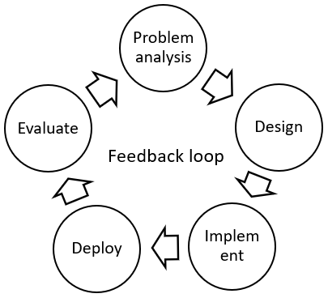

### Case Interview

Case Interview [[92]](.) belongs to the field of Business Analytics or Business Consulting, and is a part of the interview process for consulting firms like McKinsey. However, in reality, as discussed in the book Case Interview Secrets (by Victor Cheng), there are many frameworks and examples for analyzing business problems that are very beneficial, making the "interview" secondary.

Key points of the Case Interview:

  * __Estimating with Proxy__. Quick estimates and mental calculations are fundamental requirements in business consulting. There are a variety of methods for estimation, among which the Proxy method is particularly interesting, such as estimating the revenue of a new store based on street foot traffic counts, nearby store occupancy rates, etc. The Proxy method can be further refined by stratifying by demographics, identifying Proxy variables, breaking down the problem, and switching to another Proxy for verification.

  * __Mindset__. The thinking methods of business consulting overlap significantly with __Critical Thinking__, such as Don't Boil the Ocean, time is expensive, and professional services. On the other hand, there is __Independent Problem Solver__: if you are thrown alone into a department of a Fortune 500 company, can you persuade clients (like the Conclusiveness below), solve problems, and maintain the employer's image? Strong __Soft Skills__ are essential.

  * __Issue Tree Framework__. The classic analytical method in Case Interviews is the Issue Tree Framework, such as the Profitability framework. It requires first determining the hypothesis, and then breaking down the problem layer by layer. The breakdown must satisfy the __MECE__ test and the __Conclusiveness__ test, the former meaning no overlap or gaps, and the latter meaning that if all branches are True, then the conclusion of the parent node cannot be denied. The analysis process goes deeper along the tree layer by layer, and then summarizes back to the root of the tree, often dynamically adjusting the structure of the tree during the process. The Issue Tree Framework has a large number of templates, but is often customized according to the problem when used.

### Strategic Thinking

Strategic Thinking is used to formulate company strategies, especially long-term strategies, which are often tied to Decision Making. It is an action plan and navigation map for where the company should be in the next 3 to 5 years, or even 10 years. LinkedIn's Strategic Thinking course [[93]](.) has more explanations.

Some key points of Strategic Thinking:

  * __Win the Game__. Compared to __Critical Thinking__ which only involves "me" and "the problem", Strategic Thinking requires winning the "game", with the "opponent" added to the picture. In the context of market analysis, its picture is closer to __Porter's Five Forces Analysis__.

  * __Observation__. Strategic Thinking first requires observing people and competitors, paying attention not only to trends but also to micro-trends. One key point is __bad smell__, which applies not only to programming but also to organization and culture, such as hearing "we've never done it this way" or "we used to do it this way." Another key point is __not to be surprised__; surprise is a term in management, and if you feel surprised, it indicates that observation has not been adequate. After observation comes reflection; it doesn't take time, it takes space (see course section "Embrace the strategic thinking mindset").

  * __Action__. Deciding to do something means deciding __not to do__ something else. Doing nothing is __also__ a decision. Pay attention to the __multiplicative__ utility in the value chain: your time -> investment in tasks -> your strategy -> effectiveness at the company level. Ask yourself, "How will I win the game __in 3-5 years__, and where will I be?" Action means establishing a __breakdown of tasks__ from long-term to short-term (related to Issue Tree Framework), ultimately mapping to tactics, which are tasks that can be specifically executed daily. In execution, occasionally __switch__ between the High Road and Low Road (related to Critical Thinking).

  * __Making Informed Strategy__. A good strategy does not need to be innovative; the focus of the strategy is on __Decision Making__. First, consider market __trends__, classic Porter’s Five Forces analysis. Pay attention to gathering opinions from different __sources__, including both new and old groups, especially from different perspectives. __Map Out__ your __Assets__ and __Allies__. Map your __Constraints__, particularly the __Structural Obstacles__. And conduct a __SWOT__ analysis. Place them on the previous __Action__ map, which needs to be __Realistic__ and __Attainable__.

  * __Gaining Support__. How to gain support from bosses, colleagues, and employees? Do not rush to present your strategy or plan in meetings; there is a lot of work to be done beforehand. First, systematically __meet with stakeholders__ to discuss your plan, gather feedback, and address questions. It is foreseeable that there will be a lot of opposition, and the focus is on your need to __anticipate all possible objections__ (related to Not be Surprised), reaching consensus with appropriate concessions and negotiation skills __before the meeting__ (related to BATNA). Finally, ensure that all decisions and tasks are __Accountable__, such as email meeting summaries and regular reviews of the Timeline.

  * __Monitor execution progress__. Common __project management__ is used in the strategy execution process. More importantly, establish __expectations__ and __assumptions__. The environment is constantly changing, often __re-examine assumptions__ and ask if there are better __alternatives__. Before the project starts (Upfront) and after it ends (Retro), it should be __reviewed__. High-risk parts need to be executed __earlier and more frequently__.

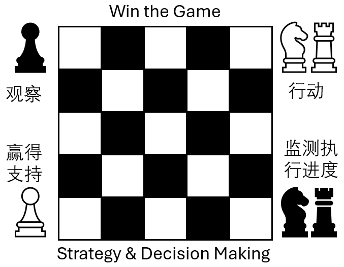

### Business Acumen

Business Acumen explains how business is conducted from the company's perspective, as well as how to advance and optimize various parts (Pull the Lever). It covers aspects such as reading financial reports, business models, strategies, and operations. LinkedIn's Developing Business Acumen course [[94]](.) has more details.

Key points related to this article in Business Acumen:

  * __Financial Report__: Corresponding to the company's financial report, the __Profit and Loss Statement__ (P&L statement) can be broken down layer by layer: Revenue -> less COGS -> Gross Profit -> less Operating Expenses (Operating Expense, SG&A) -> Operating Profit -> less interest, taxes, depreciation, etc. -> Net Income. There are many adjustable " __levers__" (Pull the Lever) around financial performance, corresponding to the Profitability Issue Tree Framework mentioned above. Some are long-term, such as technology research and development, facility construction, while others are short-term, like production cuts and layoffs. You can try to draw conclusions from past financial reports and __compare__ them with the management reports (Financial Brief) released by the company.

  * __Business Model__: The business model defines how to profit from the production of goods, with a __value chain__ from the perspective of raw material processing, a __growth strategy__ from the perspective of business growth, __ROI__ from the investment perspective, and concepts such as __CapEx__, __fixed cost__, and __variable cost__ from the cost perspective.

  * __Operation__: The business model __drives__ the company's strategy and personnel allocation, personnel drives operations, and ultimately financial performance is reflected in the financial statements. Around operations, first is __Strategy__, which has been mentioned earlier. The company's portfolio constitutes the __Initiative Pipeline__, which unfolds successively to realize the company's future. Marketing strategy selects and helps the company control customers. __R&D__ is often considered in conjunction with __mergers and acquisitions__, the latter saving time to market and potentially capturing the other party's market. __Protecting products__ in competition requires strategy, such as rapid releases, or copyrights and patents. __Personnel strategy__ involves how to find personnel, training, organizational structure, turnover rate, etc. Observing the open recruitment positions at various levels within the company can provide insights into its personnel strategy, allowing one to infer its business strategy.

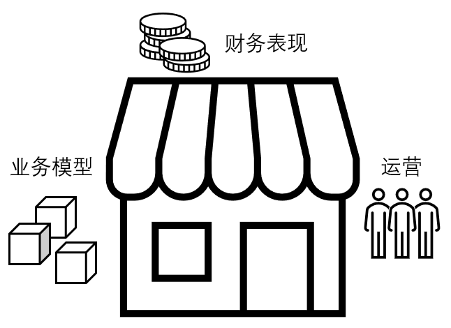

### Information Collection

This section briefly discusses how to collect market information to support Vision and Strategy analysis.

  * __"Underwater" information__. Many cutting-edge and valuable pieces of information are often unpublished. For example, authors of papers often know about a valuable research direction a year in advance and begin their research. If one only reads the papers, they will only learn about this information a year later. The same applies to university laboratories, corporate research institutes, open-source communities, etc. Obtaining "underwater" information relies more on __social interactions__, participating in various conferences, face-to-face communication, seeking collaborators, and mutual benefits. On the other hand, companies have real __customers__ and __supply chains__, making it easier to obtain potential market trends from these relationships, or even to decide them.

  * __Investment__. Investment news can provide insights into the trends of new technologies. Compared to reading papers, technologies that have received investment are __validated by "money"__ and can be measured in terms of the amount of investment to gauge their strength. Common types of investment news include startups, financing, acquisitions, etc., or seeing a new company starting to "have money" and getting articles written about it in various media to promote itself. On the other hand, promising papers often quickly receive funding and establish startups, at least launching a website.

  * __Research Report__. Many market research firms are eager to predict future directions, such as Gartner and IDC. Although companies may pay for promotion, well-funded companies at least indicate that this direction has development prospects. More examples will be seen in the chapter on _[storage systems market](.)_.

## Understanding Stock Prices

From the company's perspective, a very important goal is the growth of stock prices (even the only goal). What kind of stock price growth is reasonable? How can the growth of stock prices be mapped to actual products? What kind of goals need to be achieved by departments or teams to support stock prices?

This goal is further broken down into a 3-5 year plan for the team, mapped to Vision and Strategy. In other words, the analysis of stock prices can tell the team how well they should perform. Stock prices may seem unrelated to Vision and Strategy, but they are an excellent entry point.

### What is the composition of stock prices?

The key to understanding stock prices is the __price-earning ratio (P/E)__ . The original English text is easier to understand: the ratio of stock price vs earnings.

  * Imagine stocks as a savings book, the reciprocal of the price-to-earnings ratio is its __interest rate__. Among them, the stock price is Share price.

Among them, the earnings correspond to __earnings per share__ (EPS, Earning per share). The original English text is straightforward: the earnings per share. It is obtained by dividing the company's __net income__ (Net income) by the total number of shares (Average common shares).

  * In the formula, preferred dividends are the dividends of preferred stock. They can be __ignored__, usually the total amount is relatively small, and they are even rarely used [[48]](.).

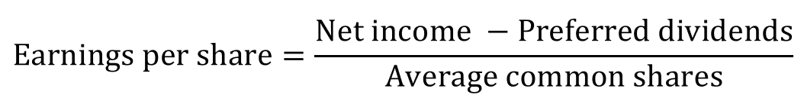

By substituting the earnings per share into the price-to-earnings ratio formula, it can be found that:

  * The reciprocal of the price-to-earnings ratio is the company's earnings divided by the company's market value (the sum of all stocks). Imagine the company as a huge savings account; the reciprocal of the price-to-earnings ratio is the __interest rate__ of the "company's savings account."

  * In another understanding, the calculation of the price-to-earnings ratio indicates how many years the "company's savings account" needs for its "interest" to pay off the market value. That is, the price-to-earnings ratio refers to how many years the company will __"break even"__.

What is the actual interest rate of the "company passbook" mentioned above? Taking MSFT [[49]](.) as an example:

  * Interest rate = 1 / P/E = 1 / 37.32 = __2.68%__.

  * In comparison, the thirty-year U.S. Treasury bond yield is __4.6%__ [[50]](.) (During the same period, the three-month U.S. Treasury yield was higher, around 5.3%).

The interest rates on U.S. Treasury bonds are even much higher than the rates of the aforementioned "company savings accounts." Compared to stock prices, the company's profitability is not as good as purchasing risk-free government bonds. Why?

  * Traders believe that although the company currently lacks profitability, __the stock price may appreciate in the future__, leading to continued buying, which causes the stock price to rise and the price-to-earnings ratio to increase.

  * In other words, the expectation of stock price appreciation is reflected in the price-to-earnings ratio. In other words, __the price-to-earnings ratio reflects the company's future expectations__, that is, the expectation of stock price increase [[52]](.).

  * If the company's expectations improve, the stock will be bought more, and the price-to-earnings ratio will rise. Conversely, if the company performs poorly, the price-to-earnings ratio will decline. If the company hopes to maintain its current performance, __the price-to-earnings ratio should remain stable__.

On the other hand, net profit can continue to be broken down and mapped to market size:

  * Net profit equals the company's __revenue__ multiplied by the **net profit margin**.

  * Revenue can continue to be broken down into **market size** and **market share**.

Thus, the composition of the stock price can be summarized:

  * First, the company's __profitability__ depends on market size, market share, and net profit margin. Profit compared to the company's market value is reflected in the form of interest rates, corresponding to the inverse of the price-to-earnings ratio.

  * Then there are the traders' expectations for the __company's future__, which are also reflected by the price-to-earnings ratio. Its comparison with the risk-free government bond interest rate can reflect the strength of belief.

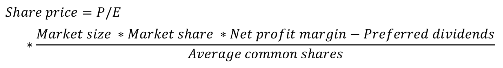

### How fast should stock prices rise?

How fast should stock prices rise? They should be able to cover opportunity costs and risk premiums; otherwise, traders will choose to sell the stocks and buy risk-free government bonds. In addition to stock price increases, another benefit for holders of stocks is dividends.

  * **Opportunity cost** corresponds to the risk-free rate, which is usually measured by the short-term government bond rate.

  * **Dividend yield**, the dividend income given to holders per share as a proportion of the stock price.

  * **Risk premium**, the risk of stocks is higher than that of government bonds, traders demand additional returns.

First, let's look at how the dividend yield is calculated. Dividends come from the company's net profit, which is distributed proportionally to each share after being extracted.

  * If you only seek simplicity, the dividend yield can generally be **directly queried** from stock trading websites [[51]](.).

  * The __dividend yield__ can be broken down into the earnings per share (EPS payout ratio) divided by the price-to-earnings ratio. The higher the price-to-earnings ratio, the lower the stock yield.

  * __Dividend payout ratio__ refers to the proportion of a company's net profit that is distributed as dividends; it is also equal to the proportion of earnings per share that is distributed as dividends. The dividend payout ratio is generally not affected by stock price fluctuations. It can also be checked on stock trading websites.

Next, let's look at the calculation of risk premium, using the common CAPM asset pricing model [[55]](.).

  * __风险溢价__ 可由 Beta 系数乘以股权风险溢价（ERP，Equity risk premium）得到。
  * **Risk premium** can be obtained by multiplying the Beta coefficient by the equity risk premium (ERP).

  * __Beta coefficient__ reflects the price fluctuations of a particular stock relative to the market average [[53]](.) and can usually be directly queried on stock trading websites [[49]](.) .

  * The __equity risk premium__ is obtained by subtracting the risk-free rate from the expected market return. The expected market return can be obtained from index funds, commonly using the S&P 500 [[56]](.). The risk-free rate has been mentioned earlier.

  * The __cost of equity__ in CAPM is exactly the risk-free rate mentioned earlier, combined with the risk premium here. The cost of equity does not depend on the stock price, but is determined by the market context.

Using the previous formula, we can now calculate how fast the stock price should rise. Taking MSFT stock as an example:

  * The risk-free interest rate is taken from the thirty-year U.S. Treasury bond, 4.6%. The dividend yield is directly queried, taken as 0.72%. The beta coefficient is directly queried, taken as 0.89. The expected market return is the average growth rate of the US S&P 500 over the past five years, 12.5% (amazing).

  * **Share price growth** = 0.046 - 0.0072 + 0.89 * (0.125 - 0.046) = 10.9%. It can be seen that the share price needs to **increase by 10.9%** in one year to meet the cost-benefit balance for traders.

  * The relatively high demand for stock price increases comes, on one hand, from the higher interest rates on U.S. Treasury bonds that year, and on the other hand, from the upward trend of the U.S. stock market.

We can see that in a high-interest bull market, traders have strict requirements for company profits. If the stock price does not meet expectations, traders will incur losses due to opportunity costs or risk premiums, leading them to sell stocks, which lowers the price-to-earnings ratio and stock price. Where is the final __stock price equilibrium__? Assuming the stock price no longer changes:

  * Continuing from the previous values, the stock price is set at \$420. The others remain the same. Assuming the dividend yield remains unchanged (26.9%) and earnings per share remain unchanged (\$11.25). A decrease in stock price and price-to-earnings ratio will increase the dividend yield, thereby balancing opportunity cost and risk premium.

  * __Stable point share price__ Share price = (0.0072 * 420) / (0.046 + 0.89 * (0.125 - 0.046)) = 26.0. At this time, the price-to-earnings ratio is 2.31, and the dividend yield is 11.6%. At this time, the dividend yield is exactly equal to the __cost of equity__, 11.6%.

  * Besides the low stock price, this seems to be a good stock. Indeed, there are many similar real stocks [[57]](.), with low stock prices, high dividend yields, and low price-to-earnings ratios. Note that this article is for theoretical analysis only and does not constitute any predictions of stock price fluctuations or any investment advice.

There are also some additional inferences:

  * **The expectation of stock price increase is unrelated to the company's market value**, assuming the dividend yield is ignored, which is usually very low for technology companies. As can be seen from the formula above, the required stock price increase demanded by traders depends on the market background interest rate and risk. The company's stock price and market value are not even included in the formula (ignoring the dividend yield).

  * **High stock prices have a negative effect**; now consider the dividend yield. It depends on company factors, determined by earnings per share and the stock payout ratio. The stock price appears in the denominator, which lowers the dividend yield, making it harder to meet expectations for stock price increases.

  * __High price-to-earnings ratio has a negative effect__. Similarly, because it appears in the denominator of the dividend yield formula. A high price-to-earnings ratio means that the company's profitability is insufficient, but the stock price is high.

This section has shown that, from the trader's perspective, the expected speed at which stock prices should rise to maintain the stability of the price-to-earnings ratio and stock price. So, from the company's perspective, how should it promote the rise in stock prices to meet expectations?

### What drives stock price growth

The previous text mentioned that the price-to-earnings ratio reflects traders' expectations for the company's future. To maintain the stability of the company's price-to-earnings ratio and stock price, how can we encourage the stock price to rise as expected? This can be seen from the formula of stock composition:

  * First, the stock price needs to rise sufficiently to outperform the risk-free rate and the risk premium, namely __cost of equity__. Technology companies usually have very low dividend yields.

  * The driving force behind the rise in stock prices comes from the company's net profit, __net profit needs to rise in proportion to the stock price__ to support the stock price.

  * Net profit is expanded into __market size, market share, net profit margin__, which are the directions for seeking growth.

  * **Dream-making**. Even if the company's profitability remains unchanged, weaving traders' optimistic expectations for the future can raise the price-to-earnings ratio, thereby boosting the stock price.

从公司角度，上策是寻找高增长的新兴市场：  From the company's perspective, the best strategy is to seek high-growth emerging markets:

  * For example, the **global cloud storage market** is growing at a rate of over 20% per year [[46]](.). Just entering this market is expected to meet the previously mentioned 11.6% cost of equity. There is no need to be better than peers, it's similar to riding on the coattails.

  * Compared to mature large enterprises, **small emerging companies** (SMB) do not have the burden of an existing market. Instead, they have a better momentum for stock price increases.

  * Technology, innovation, and new markets are essential for maintaining stock prices.

Secondly, the company can seek to increase market share:

  * Increasing market share means __competing with rivals__, and the company's performance must be better than its peers. This is a difficult direction.

  * On the other hand, this means that in a low-growth stock market, it is more difficult for companies to meet stock price growth expectations. **Being large and mature is not necessarily an advantage**.

The next direction is to improve the net profit margin:

  * A good strategy is to sell **high value-added products**, leverage comparative advantages, enhance technological standards, and improve market recognition, among others.

  * Another approach is to seek __economies of scale__. As the scale increases, fixed costs decrease, and net profit margins improve.

  * A common approach is __cost reduction and efficiency improvement__. When the net profit margin is low, cost reduction and efficiency improvement are more effective. See the figure below.

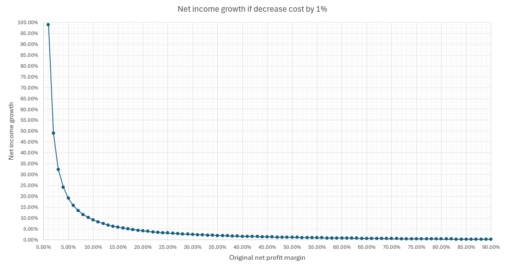

In addition, the company can improve its price-to-earnings ratio through dream-making:

  * The price-to-earnings ratio reflects traders' expectations of the stock market, __dream-making__ raises expectations and sells concepts without requiring an improvement in the company's profitability.

  * This method is suitable for businesses with large initial investments that have __scale effects__ or __technological accumulation__. However, once the dream shatters, stock prices can quickly plummet.

Finally, what does the rise in the stock price of a real company look like? Let's take MSFT [[58]](.) as an example:

  * The company's overall revenue grew by 17% year-on-year, while **net profit** grew even faster, reaching 20%. Outstanding performance.

  * Xbox revenue growth reached 62%, Azure cloud services grew by 31%, Dynamics 365 increased by 23%, and intelligent cloud grew by 21%. They __far exceeded the cost of equity__ by 11.6%.

  * In addition, Office, Windows, search, and LinkedIn all have good growth, between 10% and 15%.

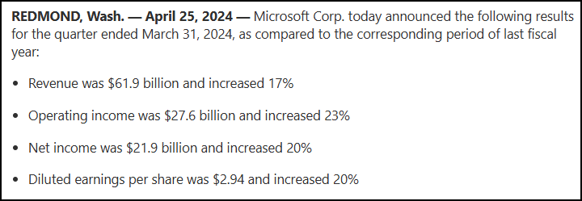

### Team Goals

Stock price analysis helps build a framework from top to bottom, from the company's top level to specific teams, clarifying what goals to work towards:

  * **The company** needs the stock price increase to meet traders' expectations and cover the cost of equity (how fast the stock price should rise).

  * Growth targets __decomposed__ into market size, market share, net profit margin, and dream-making (what drives stock price growth).

  * For specific __teams__, plans need to be developed to achieve the aforementioned growth.

  * Corresponding to a certain __product__ in team management, its market size, market share, net profit margin, etc. must meet growth targets.

What are the specific growth targets?

  * From the previous analysis, taking MSFT as an example, the growth target is an annual __10.9%__.

  * For other companies, calculate according to the previous formula `4.6% - dividend yield + Beta coefficient * (12.5% - 4.6%)`. The dividend yield and Beta coefficient are related to the stock and can be directly queried [[49]](.). The calculation result is usually around __11%__ (internet technology companies).

  * For products occupying emerging markets, it is even required that their growth __exceeds__ the aforementioned growth targets to compensate for products that are in a market decline period for the company.

  * Ordinary products should achieve the above goals, serving as the company's __average__. They constitute the majority of the company. However, the average requirement of 11% is not low.

  * Products that are __below__ the average are possible. This means they are in a market recession, employees face the risk of layoffs, and career development opportunities are limited.

  * Essentially, the growth target is to outperform the stock market index and government bond yields.

The last question:

  * For **individual employees**, how to achieve an annual average growth requirement of at least 11%? Note that this is the case every year. (**Have you held the company back today?**)

  * For the __team__, how to formulate a 3 to 5-year plan to ensure an annual growth of 11% or more? This is where __Vision and Strategy__ come into play.

### Remarks

This article is a personal non-professional analysis, and all articles only express the author's personal views and do not constitute any investment advice regarding the assets mentioned.

## Storage System Market

Business strategy analysis can usually be broken down into the levels of customers, products, companies, and competitors, further delving into each (see the figure below). Customers, products, and competitors can be summarized as the "market" landscape. This chapter will provide an overview of the storage systems market, listing the main segments, product features, and participants. Subsequent chapters will delve deeper.

In the constantly changing market landscape, where do we stand? How will the market map change in 3-5 years or 10 years, and where should we be? Understanding the market is the foundation of Vision and Strategy. Around the market, we can gradually reveal its structure and development space, what constitutes value, demand, evolution cycles, and the driving factors behind them.

(See below)

### Classification

The first question is how to classify the storage market? This chapter uses the following classification to organize the content. The letters before the titles of the subsequent sections correspond to the classification groups.

  * A. The classic classification is __cloud storage__ and __primary storage__. Cloud storage comes from the public cloud. The term primary storage [[49]](.) is often used by Gartner and refers to storage systems deployed on the customer's premises that serve critical data, usually from traditional storage vendors. Primary storage is also referred to as "enterprise storage." Additionally, another major category of storage used locally by enterprises is __backup and archiving__ systems.

  * B. According to the usage interface, storage can be classified as __object, block, and file__ systems. Object storage services consist of immutable BLOBs queried by keys, typically images, videos, virtual machine images, backup images, etc. Block storage is usually used by virtual machines as their disk mounts. File storage has a long history, storing directories and files, which can be directly used by users, commonly seen in HDFS, NFS, SMB, etc. In addition, __databases__ can also be considered as storage.

  * C. According to the storage medium classification, storage can be categorized as __SSD, HDD, tape__ systems. SSD storage is expensive and high-performance, often used for file systems and block storage. HDD storage is cheap and versatile, commonly used for object storage or storing cold data. Tape storage is generally used for archival storage. In addition, there is __in-memory__ storage, typically used as cache or for analytical databases.

The classification of the storage market mentioned above is classic and commonly used, and it is convenient for the explanation in this chapter. However, in fact, the products in the storage market are more organic, and to penetrate each other's markets and gain competitive advantages, they are **intertwined**. For example:

  * A. __云存储__ 也售卖客户近端部署的 Edge 存储，如 AWS S3 Express。__主存储__ 也提供云端部署和云端卸载（Offloading）的版本，如 NetApp ONTAP。__备份和归档__ 在云存储中尤其具有性价比，如 AWS Glacier。
  * A. **Cloud storage** also sells customer on-premises Edge storage, such as AWS S3 Express. **Primary storage** also offers cloud deployment and cloud offloading versions, such as NetApp ONTAP. **Backup and archiving** are particularly cost-effective in cloud storage, such as AWS Glacier.

  * B. __Object storage__ is becoming increasingly similar to file systems, such as the AWS S3 Mountpoint that simulates a file system, supports metadata and search on objects, and supports hierarchical object paths. __Databases__ have products with Key-Value interfaces like RocksDB, while SQL databases often support unstructured data, similar to object storage. __Block storage__ is not only used for virtual machine disks but can also provide Page storage for databases. Additionally, the underlying various storage systems can be unified into __shared log storage__, such as Azure Storage, Apple FoundationDB, and Log is Database design.

  * C. __SSD storage__ often offloads cold data to HDD storage to save on the expensive costs of SSDs. __HDD storage__ often uses SSDs as a cache or Write Staging. __Memory__ is used as a cache and index for various storage media, and memory storage systems often support writing cold data or logs to SSDs.

In addition, for the sake of brevity, this chapter omits some minor classifications. For example,

  * According to the size of user enterprises, the market can be classified into SMB, large enterprises, and special fields. This classification is based on the customer side.

  * Enterprise storage is often classified as DAS, SAN, and NAS. This classification overlaps with object, block, and file storage.

  * In addition to tape, archival storage can also use DNA technology, which is rapidly developing today.

  * Cyberstorage is an emerging storage category in the context of ransomware, but more as a security feature integrated into existing products.

  * Vector databases are an emerging type of database in the context of AI, while traditional databases often also integrate vector support.

### A. Cloud Storage

Regarding predicting the future direction of the market, analysis reports from consulting firms are good sources of information (Gartner, IDC, etc.). Although the reports are paid, there are usually __additional sources__:

  * Leading companies are usually willing to provide free public versions as a form of self-promotion.

  * Blogs and reports, although not primary sources, can still reflect the main content. Some bloggers have specialized channels.

  * Adding `filetype:pdf` before a Google search can effectively find information.

  * After searching on Google, add `"Licensed for Distribution"` to find publicly available documents from Gartner.

  * Switching between English and Chinese search engines, Scribd, can find different content. The Chinese community may have some documents saved.

  * Additionally, reading the user manual of the leading products can help understand the main features and evaluation metrics of the field.

Fortune predicts that the global cloud storage market size is around \$161B, with an annual growth rate of approximately 21.7% [[46]](.). In contrast, the global data storage market size is around \$218B, with an annual growth rate of approximately 17.1% [[60]](.). It can be seen that:

  * The cloud storage market has __excellent growth rates__. Combined with the _[Understanding Stock Prices](.)_ section, it can be seen that this growth rate is very favorable for supporting stock prices, without needing to focus on squeezing competitors or cutting costs.

  * In the long term, data storage trends are mostly __being replaced by cloud storage__. This is due to the high proportion of cloud storage and its growth rate being faster than that of overall data storage. At least, this is the case from a predictive standpoint.

From Gartner's Magic Quadrant for Cloud Infrastructure [[61]](.) (2024), the leading market participants can be found:

  * __Amazon AWS__: A lasting leader. AWS has a large-scale infrastructure, good reliability, and ecosystem worldwide. AWS is the preferred choice for enterprises seeking scalability and security. However, its complex services can be challenging for new users.

  * __Microsoft Azure__: Leader. Azure benefits from hybrid cloud capabilities, deep integration with Microsoft products, and collaboration with AI leader OpenAI. Azure's industry-specific solutions and collaborative strategy are attractive to enterprises. However, Azure faces scalability challenges and has been criticized for security issues.

  * __Google GCP__: Leader. Leading in AI/ML innovation, the Vertex AI platform is highly praised, and cloud-native technology is unique. GCP is very attractive to data-centric organizations in terms of environmental sustainability and AI services. However, GCP falls short in enterprise support and traditional workload migration.

  * __Oracle OCI__: Leader. OCI excels in providing flexible multi-cloud and sovereign cloud solutions, attracting enterprises that require robust integrated features. Its investments in AI infrastructure and collaboration with NVIDIA have solidified its market position. However, OCI's generative AI services and resilient architecture are still lacking.

  * __Alibaba Cloud__: Challenger. As a major player in the Asia-Pacific region, Alibaba Cloud leads in e-commerce and AI services in the domestic market. Despite having an excellent partner ecosystem, Alibaba Cloud is limited in its global expansion due to geopolitical factors and infrastructure.

  * __IBM Cloud__: Specific domain. IBM leverages the advantages of hybrid cloud and enterprise-focused solutions, seamlessly integrating with Red Hat OpenShift. Its solutions are attractive to regulated industries. However, the product portfolio is fragmented, and the Edge strategy is underdeveloped.

  * __Huawei Cloud__: A participant in specific fields. Huawei is a key player in emerging markets, with advantages in integrated cloud solutions in the telecommunications sector. It excels in AI/ML research and has achieved success in high-demand enterprise environments. However, geopolitical tensions and sanctions have limited its global expansion.

  * __Tencent Cloud__: A participant in specific fields. Optimizes for scalable and distributed applications, with unique advantages in social network integration. However, its global partner ecosystem is limited, and there is a gap in maturity compared to global peers.

What are the __main functions__ that cloud storage should provide? Gartner's Cloud Infrastructure Scorecard [[62]](.) (2021) compared major public cloud vendors, from which a column list can be seen, as shown in the figure below. It can be seen that AWS has strong capabilities.

On the other hand, cloud storage can be seen as gradually moving the functions of traditional storage to the cloud, __comparing primary storage with cloud storage__. From this perspective, what functions should cloud storage have? Which ones are already present in primary storage, and what are the potential future directions for cloud storage? What are the key metrics for measuring storage? See the next section on primary storage.

### A. Main Storage

This article corresponds main storage to enterprise storage deployed locally under the cloud, serving critical data, which is a long-standing traditional field of storage. Its growth rate roughly corresponds to the overall storage market, as can be seen from [[60]](.) and its accompanying graphics (previous section), with an annual growth rate of around 17.1%, which is gradually being eroded by cloud storage. Of course, in reality, main storage has already been deeply integrated with the cloud.

From Gartner's Magic Quadrant for Primary Storage [[59]](.) (2024), the leading participants in this market can be found:

  * __Pure Storage__: A lasting leader. Through Pure1, it provides users with proactive SLAs, benefiting IT operations. The integrated control plane does not require external cloud communication and AIOps. The DirectFlash Module directly operates raw flash memory, driving innovation in hardware, SLAs, and data management. However, Pure Storage lags behind in diversifying its user base outside the United States, and the lifecycle management program increases the asset and support costs of the arrays, not supporting the separation of compute and storage.

  * __NetApp__: Leader. NetApp offers Ransomware recovery guarantees and immutable snapshots. It simplifies IT operations through Keystone strategy and Equinix Metal services. The BlueXP control panel provides sustainability monitoring to manage energy consumption and carbon emissions. However, NetApp does not provide competitive Ransomware detection guarantees for block storage, and its product line does not support larger 60TB/75TB SSDs, nor does it support compute-storage separation.

  * __IBM__: Leader. IBM's consumption plan offers unified pricing for product lifecycle and upgrades, providing guarantees for energy efficiency. Flash Grid partitioning, migration, and continuous load optimization across platforms. However, IBM does not offer capacity-optimized QLC arrays, does not provide file services on block storage, and local flash deployments do not support performance and capacity separation.

  * __HPE__: Leader. HPE's Alletra servers allow users to independently scale capacity and performance to save costs. GreenLake can be deployed locally and on AWS in the same way, with hybrid management. Load simulation can provide users with comprehensive global load placement recommendations regarding performance and capacity. However, HPE vendors lag behind in Sustainability and Ransomware, do not support larger 60TB/75TB SSD drives, and there is confusion in the product-load combination.

  * __Dell Technologies__: Leader. After acquiring EMC, Dell has a flexible full line of storage products, and APEX provides multi-cloud management and orchestration across on-premises and cloud. PowerMax and PowerStore offer industry-leading 5:1 data reduction and SLAs, integrated with Data Domain data backup. However, Dell does not provide a unified storage operating system suitable for mid-range and high-end, which brings management complexity.

  * Huawei: Challenger. Huawei's multi-layer ransomware protection is excellent, utilizing network collaboration. The flash array offers three years of 100% reliability and a 5:1 capacity reduction guarantee. NVMe SSD FlashLink supports high disk capacity, accelerated by an ASIC engine. However, Huawei is restricted in North America and does not provide multi-cloud expansion solutions for AWS, Azure, and GCP, with customers concentrated in a few verticals, increasing risk, and the licensing for multiple storage products is overly complex.

  * __Infinidat__: Challenger. Infinidat has a good reputation in the high-end global enterprise market, providing high-quality services. SSA Express can consolidate multiple smaller flash arrays into a more cost-effective single InfiniBox hybrid array. After suffering a cyber attack, data can be recovered from immutable snapshots. However, Infinidat lacks mid-range products, and the InfuzeOS cloud version is limited to a single-node architecture, with SSD support only for 15TB hard drives.

  * __Hitachi Vantara__: Challenger. Hitachi allows users to upgrade to the next-generation solution within five years of installation to reduce carbon emissions. EverFlex simplifies the subscription process for users, paying based on actual usage. EverFlex Control modularizes functionalities, allowing users to customize according to platform needs. However, Hitachi lags behind in ransomware detection and does not offer separate scaling for compute storage, falling behind in QLC SSDs for backup.

  * __IEIT SYSTEMS__: A participant in a specific field. IEIT has a unique backplane and four-controller design, autonomous load balancing, and can scale up to 48 controllers. It offers online anti-ransomware capabilities through snapshot rollback. The Infinistor AIOps tool provides performance workload planning and simulation. However, IEIT is not well-known outside the Chinese market, is lagging in global multi-cloud expansion, and is behind in the independent software vendor (ISV) ecosystem.

  * __Zadara__: A participant in a specific field. Zadara provides global high-skilled managed services based on low-cost object storage and a disaggregated key-value architecture, utilizing flexible lifecycle management to reduce hardware waste, with hardware in a multi-tenant environment being dynamically reconfigurable. However, the SLAs provided by Zadara are limited, such as ransomware protection, and the scale and coverage are smaller, with third-party integration and ISV relying on managed service providers.

What functions should primary storage have? Combining the previous Magic Quadrant report [[59]](.), Gartner's Key Capabilities for Primary Storage report [[64]](.) (2023), and the Mainstream Trends in Enterprise Storage report [[66]](.) (2023), we can see:

  * __Consumption-based selling model__: Unlike traditional purchases of complete storage hardware and software, it is similar to cloud services, where payment is based on actual consumption. Accordingly, the SLA is redefined based on user-side metrics, such as 99.99% availability. Gartner predicts that by 2028, 33% of enterprises will invest in the Consumption-based model, rapidly increasing from 15% in 2024. Related concept: Storage as a Service (STaaS).

  * __Cyberstorage__: Detection and protection against ransomware is becoming a standard for enterprises, with features such as file locking, immutable storage, network monitoring, proactive behavior analysis, and Zero Trust [[65]](.). Gartner predicts that by 2028, two-thirds of enterprises will adopt cyber liability, rapidly increasing from 5% in 2024.

  * __Software-defined Storage (SDS)__: SDS liberates users from vendor-specific hardware, providing cross-platform and more flexible management solutions, utilizing third-party infrastructure to reduce operational costs. On the other hand, SDS allows for the separate deployment of computing and storage resources, independently and elastically scaling, improving economic efficiency. __AIOps__ functionality becomes important and is often combined with SDS. Utilizing the __hybrid cloud__ capabilities of public clouds has become common, which is also often attributed to SDS.

  * __Advanced AIOps__: For example, real-time event streams, proactive capacity management and load balancing, continuous optimization of costs and productivity, responding to critical operational scenarios such as Cyber Resiliency in conjunction with global monitoring, alerts, reports, and support.

  * __SSD / Flash Array__ is growing rapidly. Gartner predicts that by 2028, 85% of primary storage will be flash arrays, gradually increasing from 63% in 2023, while flash prices may drop by 40%. __QLC Flash__ is becoming popular, bringing ultra-large SSDs of 60TB/75TB with better energy consumption, space, and cooling efficiency.

  * **Single Platform for File and Object**. For unstructured data, the **Unified Storage** platform supports both file and object simultaneously. The integrated system saves costs, and Multiprotocol simplifies management. Files and objects have similarities; the usage of images, videos, and AI corpus files is similar to objects, while objects, when combined with metadata and hierarchical paths, resemble files.

  * Hybrid Cloud File Data Services. Hybrid cloud provides enterprises with unified access and management across Edge, cloud, and data centers, with a consistent namespace and no need for copying. Enterprises can perform low-latency access and large-scale ingestion of data at the Edge, complex processing in data centers, and store cold data and backups in the public cloud. It can be seen that traditional storage products are increasingly moving to the cloud, and public clouds are actively developing Edge deployments.

  * Data Storage Management Services. Similar to data lakes, data management services read metadata or file content to classify (Classification), gain insights, and optimize data. It spans multiple protocols, including file, object, NFS, SMB, S3, across different data services such as Box, Dropbox, Google, Microsoft 365. Security, permissions, Data Governance, data protection, and retention are also on the agenda. In the context of the rapid growth of unstructured data, enterprises need to extract value from data and manage it according to its importance.

  * Other common features include: __Multiprotocol__ support for multiple access protocols. __Carbon emissions__ continuous measurement, reporting, and energy consumption control. __Non-disruptive migration services__, ensuring 100% data availability during the transition from the current array to the next array. __NVMoF__ (NVMe over Fabric) is a SAN network native to NVMe. __Container Native Storage__ provides native storage mounts for containers and Kubernetes. __Captive NVMe SSD__, similar to Direct Attached disks, customized for dedicated scenarios, enhancing performance and durability (Endurance).

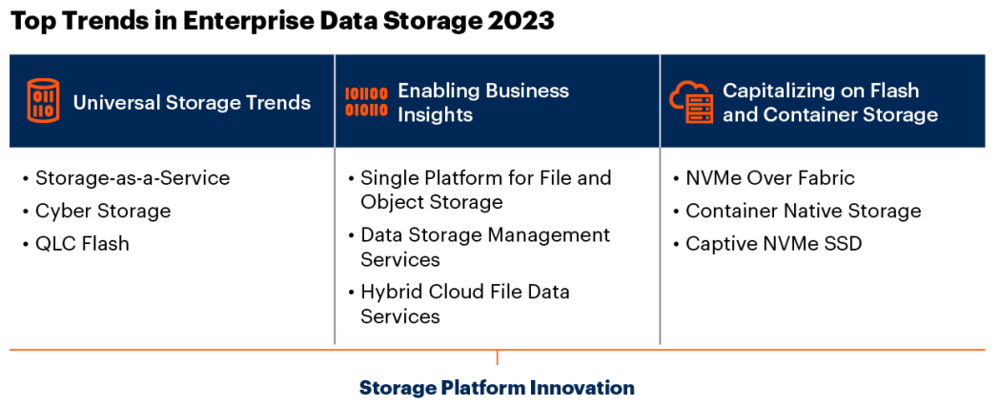

Additionally,

  * **Key user scenarios** that primary storage needs to support: OLTP online transaction processing, virtualization, containers, application consolidation, hybrid cloud, virtual desktop infrastructure (VDI).

  * **Key capability** indicators of primary storage: performance, storage efficiency, RAS (Reliability, availability and serviceability), scalability, ecosystem, multitenancy and security, operations management.

Another channel for understanding the required functions of primary storage is user feedback. How do users perceive our products? [[67]](.) Lists feedback from user interviews regarding what they like or dislike about a certain storage product. [[68]](.) Lists a common user tender document. From this, some easily overlooked aspects can be seen:

  * __Usability__. For example, simple configuration and convenient management hold an important position in the minds of users, comparable to performance and cost factors. For enterprise users, permission management and integration with other commonly used systems and protocols, such as file sharing and Active Directory, are also very important. Customer service and support can translate into real monetary value.

  * __Resource Efficiency__. Storage deployed in users' local data centers often faces issues of idle resources or the depletion of some resources while others remain unused. Expansion is a common need, which must also be compatible with legacy systems. Cloud-like load migration, balancing, and continuous optimization are very useful. Disaggregated scaling, purchasing resources, and avoiding bundling can bring economic benefits to users.

  * The screenshot only includes part of the user feedback, the full text can be found in [[67]](.) [[68]](.) original text.

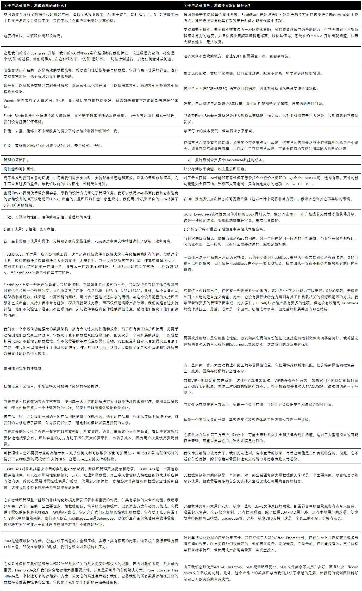

What is the future development direction of main storage technology? It can be learned from Gartner's Hype Cycle. The following image comes from [[69]](.) [[70]](.), which has different classifications. It can be seen:

  * **Object storage**, **distributed file systems**, **hyper-convergence** have been validated. **DNA storage**, **edge storage**, **cyberstorage**, **computational storage**, **container storage and backup** are on the rise.

  * __Distributed Hybrid Infrastructure (DHI)__ and __Software-Defined Storage (SDS)__ are transformative technologies on the horizon. DHI provides cloud-level solutions for users' local data centers, such as consumption-based models, elasticity, resource efficiency, and seamless connectivity with external public clouds and edge clouds. It is associated with __Hybrid Cloud__.

  * The Hype Cycle of Storage and Data Protection chart is similar. Hybrid Cloud Storage is similar to DHI. Immutable Data Value belongs to Cyberstorage. Enterprise Information Archiving belongs to archiving storage, which is also a validated technology, discussed in the next section.

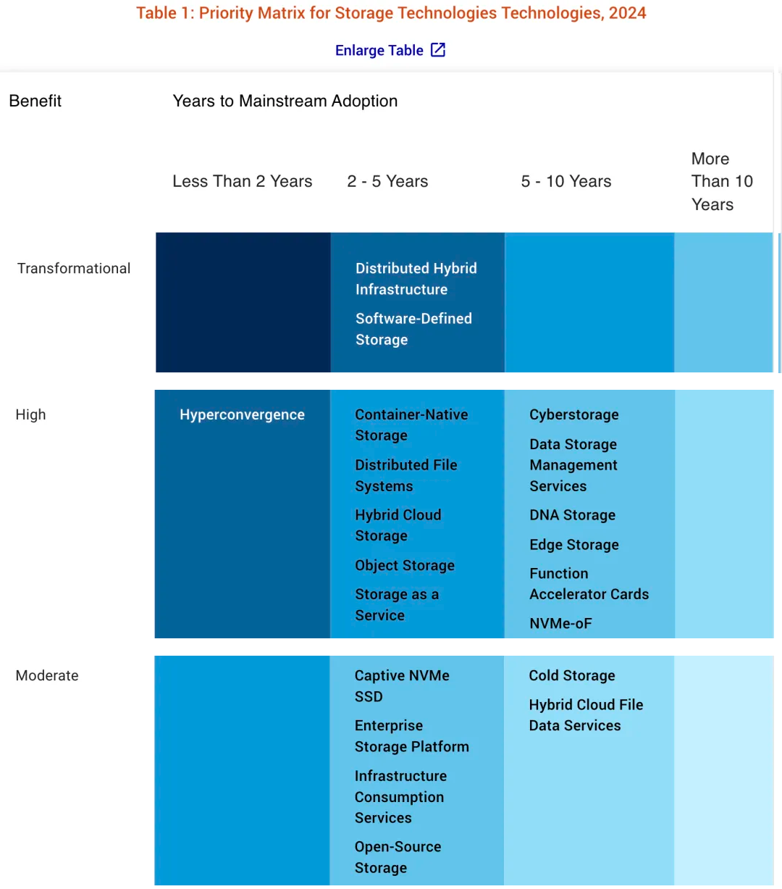

### A. Backup and Archive Storage

The first question is, what is the market size of backup and archiving storage, and what is the growth rate?

  * Market Research Future predicts [[72]](.) that t**he enterprise backup storage** market will have a market size of approximately \$27.6B in 2024, and will grow at an annual growth rate of about 11.2% thereafter. The market growth is primarily driven by the increase in data volume, the need for data protection, and ransomware protection.

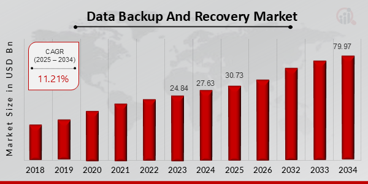

  * As part of enterprise backup storage, __archival storage__ has a smaller share but is growing faster. Grand View Research predicts that it will have a market size of approximately \$8.6B in 2024, and will then grow at an annual rate of about 14.1%. Market growth is primarily driven by the increase in data volume, stricter compliance requirements, data management, and security.

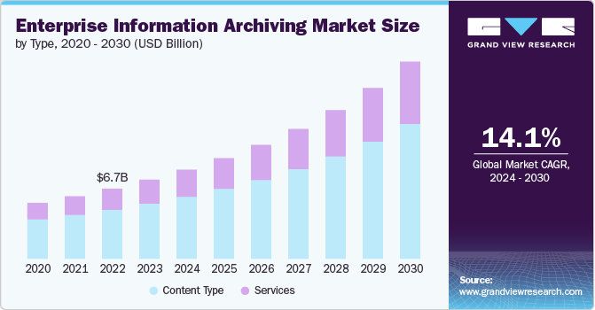

The next question is, who are the main market participants in backup and archiving storage? The leading participants in this market can be found in Gartner's Magic Quadrant for Enterprise Backup and Recovery Software Solutions [[74]](.) (2023) [[75]](.) (2024):

  * __Commonvault__: Leader. BaaS has a wide coverage, including SaaS applications, multi-cloud, and on-premises, supporting Oracle OCI. Backup & Recovery interoperability is good. Commonvault brings enterprise-level features at competitive prices. However, Commonvault's innovation in on-premises deployment lags behind the cloud, with some users reporting a poor experience, and the HTML5 user interface lacks features compared to the on-premises application.

  * __Rubrik__: Leader. Rubrik innovates in product pricing models, such as offering capacity-based user tiers for Microsoft 365. Rubrik excels in ransomware protection, utilizing machine learning and checking for anomalies in backup data. Rubrik's scalability and excellent customer service continue to attract large enterprises. However, Rubrik needs to balance investments in security and backup, has limited coverage of SaaS applications, and offers limited optional cloud storage, primarily in Azure Storage.

  * __Veeam__: Leader. Veeam has a loyal user base and Veeam Community. Veeam supports hybrid cloud and all major public clouds. Veeam has a large number of partners worldwide. However, Veeam is slow to respond to market demands for BaaS, SaaS, and Ransomware, and the software is overly complex, requiring careful design and configuration for secure platform deployment.

  * __Cohesity__: Leader. Helios is a SaaS-based centralized control platform that provides a unified and intuitive management experience for all backup products used. DataProtect and FortKnox allow users to choose multiple public cloud storage locations. Cohesity actively forms data security alliances with vendors from different fields. However, Cohesity's new investments introduce third-party technology dependencies, insufficient Backup as a Service (BaaS) capabilities, and limited geographic coverage.

  * __Veritas__: Leader. Veritas offers comprehensive backup products, such as cloud and scale-out & scale-up. NetBackup and Alta services support cloud-native operations running Kubernetes in public clouds. Services and partners cover the globe. However, some of Veritas's cloud products are still in the early stages, focusing on large enterprises and not being friendly enough to small and medium-sized enterprises, lacking support for SaaS applications (Microsoft Azure AD, Azure DevOps, Microsoft Dynamics 365 and GitHub).

  * __Dell Technologies__: Leader. PowerProtect provides data protection and ransomware protection, supporting both on-premises and cloud deployments. It allows users to balance capacity across multiple appliances. It offers consistent management across multiple public clouds, available in the marketplace. However, Dell lacks a SaaS control panel, does not support the selection of other backup storage solutions, and advanced ransomware analysis requires a dedicated environment.

  * Others: challengers, visionaries, participants in specific fields. For details, see the original report [[74]](.)

The next question is, what are the main features required for backup and archiving products? From [[74]](.) we can see a range of Core Capabilities and Focus Areas:

  * __Backup and Recovery of Data__: Based on this, support local data centers and public clouds. Support point-in-time backups, business continuity, disaster recovery, and other scenarios. Configure various backup and retention strategies, aligning with company policies. Tier cold and hot backup data to different locations, such as public clouds, third-party vendors, and object storage. Global deduplication and data reduction.

  * __Cyberstorage__: Backup data to immutable storage, Immutable Data Vault. Detect and defend against Ransomware. Support disaster recovery, attack recovery testing, and exercises. Provide protection for different targets such as containers, object storage, Edge, etc., covering on-premises, cloud, and hybrid cloud. Fast and reliable recovery, restore libraries, virtual machines, file systems, bare-metal machines, and recover different points-in-time.

  * __Control Plane__: A centralized control plane that is unified across different products, both on-premises and in hybrid cloud environments. It manages distributed backup and recovery tasks, as well as testing and drills. It oversees company compliance, data protection, and retention policies. Integration with common other SaaS products and BaaS products. The control plane should be SaaS-based, similar to the cloud, rather than requiring users to manage installations and upgrades themselves.

  * __Cloud-native__: Backup software can be deployed in a cloud-native manner, such as Kubernetes. Data protection covers cloud-native workloads, such as DBaaS, IaaS, and PaaS. Combined with public cloud services, it supports storing data in the cloud and scheduling tasks in the cloud. Backup products provide services in a BaaS manner close to the cloud. Pay based on actual usage (Consumption-based), rather than forcing users to purchase an entire appliance.

  * __GenAI & ML__: Supports generative AI, such as in task management, troubleshooting, and customer support. Supports machine learning, such as for ransomware detection and automatic data classification.

The final question is, what is the future development direction of backup and archiving technologies? This can be learned from Gartner's Hype Cycle [[69]](.) (2024), see the figure below. It can be seen:

  * **Data archiving**, **archiving dedicated appliance**, **data classification** have been validated. **Cyberstorage**, **generative AI**, **cloud recovery (CIRAS)** [[76]](.), **backup data reuse analysis**, etc. are on the rise.

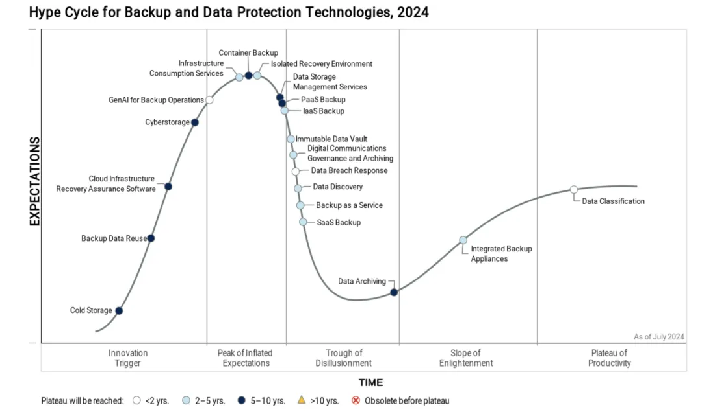

### B. File Storage

File storage plays an important role in enterprises and cloud storage. First, what is the market size of file storage and how fast is its growth rate? VMR's report [[78]](.) points out,

  * The distributed file system and object storage had a market size of approximately \$26.6B in 2023, with an **average annual growth rate of about 16%**. This growth rate is roughly comparable to that of primary storage, slightly slower than the overall cloud storage.

  * In many reports, __file systems and object storage are combined in statistics__. Indeed, the user scenarios for these two types of storage are interconnected, and in recent years, they have been absorbing each other's characteristics. See the section "[Intertwined](.)" in this article.

  * Additionally, the Market Research Future report [[79]](.) provides the market size for (cloud) object storage separately (object storage is primarily cloud). In comparison, it can be found that the market size for object storage in 2024 is only \$7.6B, with an annual growth rate **lower than** that of file storage, approximately 11.7%.

  * VMR's other report [[81]](.) provides the market size of __block storage__ for comparison. In 2023, it is approximately \$12.8B, with an annual growth rate of about 16.5%. The growth rate of the block storage market is faster than that of object storage and similar to that of file storage.

In Gartner's Magic Quadrant for File and Object Storage Platforms [[77]](.) (2024), the main participants in this market can be seen. Note that file systems and object storage are still combined in statistics. It is important to note that this mainly targets storage vendors, similar to primary storage, rather than public cloud (for public cloud, see the "[Cloud Storage](.)" section).

  * __Dell Technologies__: Leader. After acquiring EMC, Dell has the most extensive hardware and software product portfolio, including unstructured data and purpose-built products. Dell has a global supply chain and suppliers. Dell works closely with Nvidia and invests in AI projects. However, PowerScale lacks a global namespace and edge caching, intensifying competition with modern flash storage that has different architectures, relying on ISVs to address critical needs.

  * __Pure Storage__: Leader. FlashBlade uses NVMe QLC SSDs, offering the highest density and lowest TB power consumption in the industry, with competitive pricing compared to HDD hybrid arrays. The AIOps features and monitoring of Evergreen//One and Pure1 ensure user SLAs. FlashBlade collaborates with Equinix Metal to extend on-premises infrastructure globally. However, the Evergreen//Forever solution significantly increases capital expenditure, has limited ransomware detection capabilities, and offers limited hybrid cloud support, such as deploying virtual machines and containers in AWS, Azure, and GCP.

  * __VAST Data__: Leader. VAST's strategic partnerships and marketing have significantly increased large customer acquisition. VAST uses QLC flash memory, advanced data reduction algorithms, and high-density racks. End users recognize its excellent customer service, such as knowledge, pre-sales, architecture, ordering, and deployment. However, VAST lacks a brand-integrated appliance, making it difficult to attract conservative global enterprises. Frequent software updates lead to instability, and it lacks enterprise features such as synchronous replication, stretched clusters, geodistributed erasure coding, and active cyber defense, resulting in limited appeal for hybrid cloud.

  * __IBM__: Leader. IBM is a leader in the HPC market, combined with AI. File and object storage provide a global namespace across data centers, clouds, or Edge, and non-IBM storage. IBM continues to enhance Ceph storage, favored by open-source users, unifying file, block, and object storage. However, IBM's product portfolio is complex, with insufficient cloud support, and file storage tends to favor HPC rather than general scenarios.

  * __Qumulo__: Leader. Qumulo offers ease of use and cloud elasticity for SaaS on Azure. Its software provides consistent functionality and performance both on-premises and in the cloud. Qumulo's global namespace provides access across on-premises and multiple clouds. However, Qumulo lacks ransomware detection capabilities, does not provide its own hardware and relies on third parties, and has limited global coverage.

  * Huawei: Challenger. OceanStor Pacific provides a unified storage platform for files, blocks, and objects. From AI performance to data management, Huawei has proprietary hardware technology, including chips and flash memory. Customer support and services are highly rated. However, U.S. sanctions and geopolitical restrictions limit global expansion, with limited support for other public clouds like AWS, Azure, and GCP, and no flexible SDS solutions offered.

  * __Nutanix__: A visionary, with a level of foresight that surpasses all leaders. The NUS platform can consolidate various user storage workloads and centrally manage them under a hybrid cloud. NUS simplifies the management of implementation, operations, monitoring, and scaling. Customer support services are recognized for their reliability and responsiveness. However, hyperconverged platforms are not recognized by users who only want to purchase storage, and file and object storage have limited recognition in hybrid cloud deployments, lacking support for RDMA access to NFS, making them unsuitable for low-latency scenarios.

  * __WEKA__: Visionary. A parallel file system suitable for the most demanding large-scale HPC and AI workloads. The converged mode allows the file system and applications to run on the same server, improving GPU utilization. Hybrid cloud is widely available across public clouds and Oracle OCI; however, backup and archiving solutions are not cost-effective, S3 and object support is limited, and there is a lack of ransomware protection, AIOps, synchronous replication, data efficiency guarantees, and geographically distributed object storage.

  * __Scality__: Visionary. Scality's RING architecture supports EB-level deployments, independently scaling performance and capacity. Scality pursues a pure software solution that can run on a wide range of standard hardware, whether at the Edge or in data centers. RING data protection supports geographic distribution across multiple availability zones, with zero RPO/RTO, and extremely high availability and durability. However, as an SDS solution, it relies on external vendors and does not have the capability to deliver a Turnkey Appliance; files are integrated with object storage using POSIX implementation, making it unsuitable for HPC.

  * Others: Participants in specific fields. For details, see the original report [[77]](.)

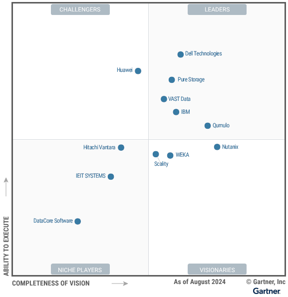

What are the main features that file and object storage systems should have? A series of Core Capabilities and Top Priorities can be seen from the Gartner Magic Quadrant report, as listed below. On the other hand, it can be found that they are **all similar** to the main functions of primary storage, backup, and archiving storage.

  * **Global Namespace**: Unified management and access of files across local data centers, Edge, and multiple public clouds. Supports geographic distribution and replication protection. Supports hybrid cloud, S3, and various file access protocols. **Unified Storage**, where files, blocks, and objects are served by a unified platform. A single platform handles high performance and data lakes.

  * __AIOps__: Supports AIOps, simplified, unified management configuration, and automation. Excellent customer service in areas such as knowledge and architectural solutions. __Data management__, such as metadata classification, cost optimization, data migration, analysis, and security. Data lifecycle management. Metadata indexing, file and object labeling/tagging. Software-defined storage (SDS).

  * __Cyberstorage__: Provides detection and protection against Ransomware, maintaining business continuity during attacks. Response and data recovery. Of course, traditional security features such as data encryption and authentication are essential.

  * __Cost and Performance__: Use QLC flash memory with advantages in capacity and energy consumption. Increase rack storage density. Data reduction technologies such as deduplication, compression, and erasure coding, as well as data efficiency guarantees. Use flash memory or SSDs to accelerate file access, provide caching, and perform data reduction on flash memory. RDMA access reduces latency, and Edge storage reduces latency. Support linear scaling, support separate scaling of performance and capacity, and properly handle performance and capacity bursts. __STaaS__ model Consumption-based payment. Manage energy consumption and carbon emissions.

  * __Different user scenarios__: General file systems, databases, objects (or using files in an object-oriented way), HPC and AI are different user scenarios, each with its own trade-offs in functionality and performance. Alternatively, see the "Enterprise File-Data Volume" chart from Nasuni below [[80]](.) .

Files are also one of the main storage functions, and there is no need to repeat the future development trends and Hype Cycle. See the section "[Main Storage](.)".

### B. Object Storage

Object storage and file storage are often combined in statistics, as their functions are similar, such as in Gartner's Magic Quadrant for File and Object Storage Platforms [[77]](.). The previous section "[File Storage](.)" has already included object storage, so this section will not repeat it.

On the other hand, the classic scenario for object storage is cloud storage, as mentioned in the previous section "[Cloud Storage](.)", which will not be repeated here. The functions required for cloud storage can also be aligned with those of storage vendors, as seen in the section "[File Storage](.)".

### B. Block Storage

The report from VMR [[81]](.) provides the market size and growth rate of block storage, which has already been included in the figure in the "[File Storage](.)" section.

Block storage is one of the core functions of primary storage, usually aggregated into primary storage statistics; the section on "[primary storage](.)" has already been included and will not be repeated. Modern platforms are often unified storage, providing file, block, and object services simultaneously.

On the other hand, block storage is one of the classic scenarios of cloud storage, as mentioned in the previous section "[Cloud Storage](.)", and will not be repeated here.

### B. Database

What is the market size and growth rate of the database? According to the forecast from Grand View Research:

  * The **database** had a market size of approximately \$100.8B in 2023, with a year-on-year growth rate of 13.1% [[82]](.). Among them, the **global cloud database** had a market size of approximately \$15.05B in 2022, with a year-on-year growth rate of 16.3% [[83]](.).

  * Compared to the previous section "__[cloud storage](.)__", it can be observed that: 1\) the main market for databases is non-cloud. 2\) Cloud data is growing faster than non-cloud, but still far behind cloud storage (21.7%). 3\) The cloud storage market is much larger than that of databases.

Based on the market size and growth rates discussed in the previous sections, we can draw __various storage types and compare__ them, and we can see:

  * **Cloud storage** has the largest market size and the fastest growth rate (21.7%), with good investment value. Next is the **non-cloud database** market, which is larger but has a lower growth rate (13.1%).

  * **File storage**, **block storage**, and **cloud database** market sizes are relatively small, but the growth rates are good (16%~17%). On the other hand, **object storage** is weaker, with a small market size and lower growth rate (11.7%).

  * In backup and archive storage, __archive storage__ (14.1%) is growing faster than __backup storage__ (11.21%). The former is growing rapidly, while the latter has a large stock.

Enlarge the part of the lower market scale in the image:

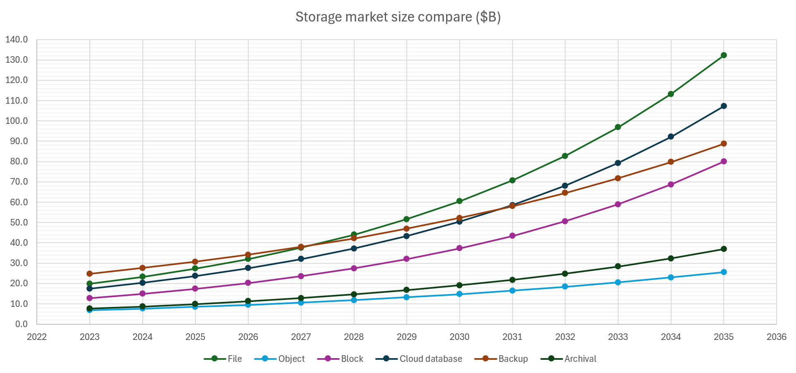

Although databases store data, they are generally not classified as part of the "storage" market in market segmentation. Storage typically refers to files, blocks, and objects, while databases operate on file and block storage. Databases have a vast and complex content, a persistently vibrant market, which deserves another article, while data lakes span the attributes of both databases and storage (structured and unstructured data).

This article focuses on storage, so it will not delve deeper into databases. The following is a list:

  * Gartner Cloud Database Magic Quadrant (2024) [[84]](.) .

  * Gartner Data Management Technology Hype Cycle (2023) [[71]](.) .

### C. SSD Storage

Market Research Future predicts [[85]](.) that the enterprise flash storage market will reach approximately \$67.17B by 2025, with an annual growth rate of about 9.89%.

Flash storage is commonly used for primary storage, file storage, and block storage, which are more common classification methods in analysis reports, as discussed in the previous sections and will not be repeated here. Compared to SSD, flash memory is the storage medium, while SSD usually refers to the storage disk that includes a controller and is packaged.

### C. HDD Storage

Market Research Future predicts [[87]](.) that the HDD market size will be approximately \$62.43B in 2024, with an annual growth rate of about 6.1%. Note that this refers to the disk market, not the storage market. The HDD market is facing a decline, primarily due to being replaced by SSDs.

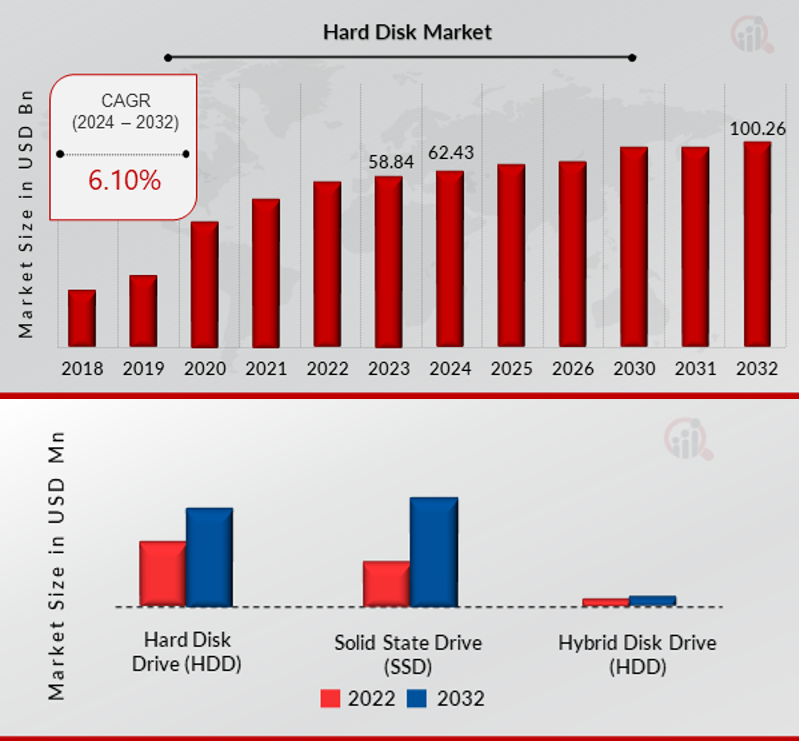

HDD storage is commonly used for primary storage, hybrid (flash) arrays, object storage, and backup systems. The latter is a more common classification method in analytical reports, rather than categorizing by SSD/HDD, and storage is often not using a single medium. This has already been discussed in the previous sections, and will not be repeated in this section.

### C. Tape Storage

Market Research Future predicts [[86]](.) that tape storage will have a market size of approximately \$3.5B in 2024, with an annual growth rate of about 5.82%. Compared to SSDs and HDDs, the market size of tape is small and the growth rate is low.

Tape is commonly used for archival storage. The latter has been discussed in the previous section, and will not be repeated in this section.

### C. Memory Storage

Memory storage is generally used for databases or caching. Storage is usually not purely memory-based, as it is difficult to ensure data persistence, especially in the event of a power failure in data centers. Memory is generally used in storage systems to serve metadata or indexes and is not independent of other storage categories. Therefore, this section skips over memory storage.

## Analysis of the Market

The previous chapter explored the main segments of the storage market, the important participants within it, their respective products, the core demands of those products, and possible future directions. This chapter will continue to delve deeper. Around the market, it can reveal its structure and development space, driving factors, and core values.

In the constantly changing market landscape, where do we stand? Where will we be in 3 to 5 years, or 10 years? By grasping the patterns, we can assist in the analysis of Vision and Strategy, planning the direction we should be in for the next 3 to 5 years, or even 10 years.

### Market Structure

Basic market analysis includes market segmentation, market size, user scenarios, competitive landscape, products and features, which have been discussed in the previous chapter. For the storage market, there are more dimensions to consider. For example, what is the "natural structure" of the market? It determines the upper limits and growth patterns of products.

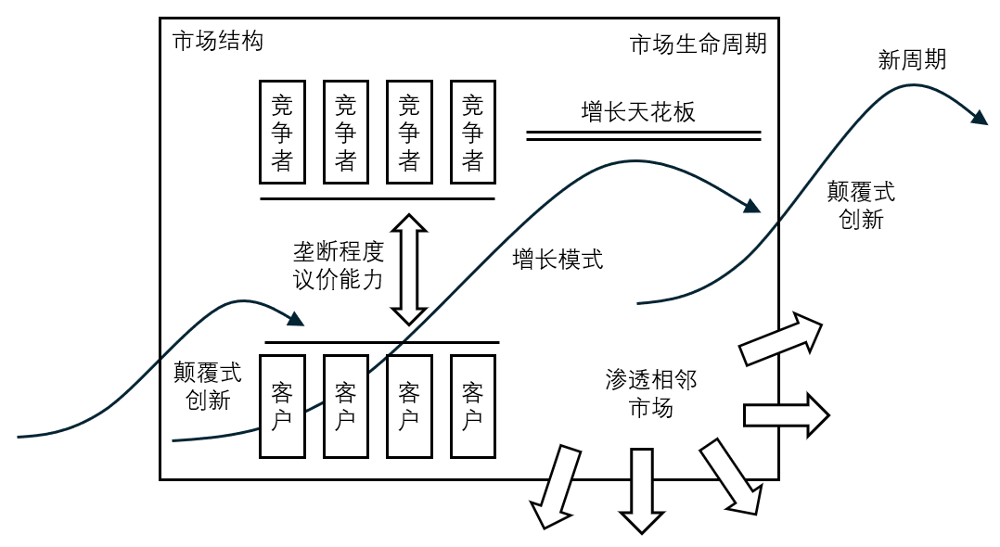

#### Customer Composition

What customers make up the corresponding market for developing new products and features?

A typical division is __SMB, large enterprises, and specialized fields__. As customer types, the demands and marketing strategies of SMBs (small and medium-sized businesses) and large enterprises are significantly different. Although large enterprises can provide substantial sales profits, the requirements for SMBs' __bargaining power__ are lower, avoiding the creation of a large number of customization demands, and even turning the company into operations and maintenance.

Today, __government procurement__ should be added as a new customer type. In addition, __individual consumers__ should also be added, as they often purchase cloud storage (see below Empower Everyone). On top of this, the __degree of monopoly__ of buyers should be considered as one of the key considerations of market structure. As for sellers, __open source__ should be added as a competitor.

This topic further leads to __Porter's Five Forces Analysis__ [[88]](.): competitors, supplier bargaining power, buyer bargaining power, threat of substitutes, threat of new entrants.

Similar classifications are __low-end, mid-range, and high-end__, covering customers with different preferences and scales. Low-end focuses on volume and standardization. High-end serves large enterprises, custom needs, or specialized fields.

Another dimension regarding customers is __stickiness__, such as social networks. For details, see the section _“[What is Value](.)”_.

// TODO

#### 市场的天然结构  The natural structure of the market

有些市场天然具有 __规模效应__，例如水电、云计算。竞争最终导向参与者兼并，留存少数企业，而存活者享受营收和利润率的双重上升。
Some markets naturally have __economies of scale__, such as hydropower and cloud computing. Competition ultimately leads to mergers among participants, leaving a few companies, while the survivors enjoy a dual increase in revenue and profit margins.

而另一些市场具有 __反规模效应__，例如教培、咨询、猎聘、投资。市场允许新小参与者不断加入，大型参与者导致分裂，而成熟的个人、团队倾向单干。
On the other hand, some markets have __anti-scale effects__, such as education and training, consulting, recruitment, and investment. The market allows new small participants to continuously join, while large participants lead to fragmentation, and mature individuals and teams tend to work independently.

与此相配的市场维度是 __增长模式__。规模效应下，互联网产品的用户数量可以 __指数__ 增长 。高 COGS 、人力成本占固定比例时，如制造、运维服务、外包定制，产品趋于 __线性__ 增长。反规模效应下，产品增长甚至会 __递减__，另一种递减是市场衰退。
The corresponding market dimension is __growth model__. Under scale effects, the number of users of internet products can grow __exponentially__. When high COGS and labor costs account for a fixed proportion, such as in manufacturing, operations services, and outsourced customization, products tend to grow __linearly__. Under anti-scale effects, product growth may even __decrease__, and another type of decrease is market recession.

#### 市场的天花板  The ceiling of the market

在一轮市场生命周期（见下节）中，市场规模最终能增长到多高？这和市场的天然结构相关。一个参考是 O(P)：调查每一个人，有 P 概率使用该产品。
In a round of the market lifecycle (see the next section), how high can the market size ultimately grow? This is related to the natural structure of the market. One reference is O(P): survey each person, with a probability of P using the product.

__O(1) 规模的行业少见且珍贵__，例如社交 App 和支付应用，每人都用。而好莱坞电影虽然知名，却未必每人都看过。O(1) 的行业上限极高，渗透力强。反之，则天花板有限，往往需走高端路线提高单价。
Industries of scale O(1) are rare and precious, such as social apps and payment applications, which everyone uses. Although Hollywood movies are well-known, not everyone has seen them. The upper limit of O(1) industries is extremely high, with strong penetration. In contrast, industries with limited ceilings often need to take a high-end route to increase unit prices.

某种意义上，__Enable Everyone / Empower Everyone__ 的经济效益，是增加 O(1) 级行业的数量，扩大 O(P<1) 行业的覆盖。
In a sense, the economic benefit of __Enable Everyone / Empower Everyone__ is to increase the number of O(1) level industries and expand the coverage of O(P<1) industries.

#### 对相邻市场的渗透  #### Penetration into adjacent markets

新兴、高速发展的技术不仅能够革新自身行业，往往也对临近行业进行渗透，进一步扩大市场和销售范围。
Emerging and rapidly developing technologies not only have the potential to revolutionize their own industries but often also penetrate adjacent industries, further expanding market and sales reach.

例如，云计算发起自售卖计算、存储资源，但逐渐取代了企业的本地运维。对象存储原本用于存储图片、视频，但统一存储平台（Unified Storage）有能力兼管文件、块服务。互联网平台对各行业的渗透显而易见。
For example, cloud computing originated from selling computing and storage resources, but gradually replaced the local operations of enterprises. Object storage was originally used for storing images and videos, but a unified storage platform has the capability to manage file and block services. The penetration of internet platforms into various industries is evident.

除增长模式外，__渗透能力__ 是衡量市场潜力的另一维度。另一种说法是，__1+1>2__，多种产品形成逐步加强的循环反馈（__闭环__）。
In addition to growth models, __penetration capability__ is another dimension for measuring market potential. Another way to say it is that __1+1>2__, where multiple products create a progressively strengthening feedback loop (__closed loop__).

反过来，__易被渗透__ 的市场是不利的，往往需要配套投资相邻市场，利用产品组合构筑护城河。
Conversely, a market that is easily penetrated is unfavorable and often requires supporting investments in adjacent markets to build a moat through product combinations.

#### “推论”  "Inference"

从个人 __职业发展__ 角度考虑，所加入的市场分区起到重要作用。当产品具有规模效应时，企业倾向保留少量、尖端的人力，不吝惜给予高薪酬，因为成本不在此处。__人力是成本还是 Multiplier__？
From the perspective of personal career development, the market segment one joins plays an important role. When a product has economies of scale, companies tend to retain a small number of top talents and are willing to offer high salaries, as costs are not a concern here. Is talent a cost or a multiplier?

当产品具有线性增长模式时，薪酬往往不高，但好在工作数量较多。__市场天然利润率预期工资水平__。见 _[理解股价](.)_ 章节。
When a product has a linear growth pattern, compensation is often not high, but fortunately, there is a larger amount of work. __Market natural profit margin expected wage level__. See _[Understanding Stock Prices](.)_ chapter.

大规模 __裁员__ 往往意味着市场处于递减、衰退阶段，此市场对职业发展非常不利，“被赶走” 至少避免主动处于不利市场。
Large-scale layoffs often indicate that the market is in a declining or recessionary phase, which is very unfavorable for career development. Being "pushed out" at least avoids being actively in an unfavorable market.

### 市场的生命周期  ### Market Lifecycle

从市场结构继续，下一个关键的维度是市场的生命周期。未来数年后，我们的团队和产品将处于什么位置？市场结构解释增长和上限，而市场生命周期预测其阶段。基于此制定策略，并为下一周期铺路。
Continuing from the market structure, the next key dimension is the market lifecycle. Where will our team and products be in the coming years? Market structure explains growth and limits, while market lifecycle predicts its stages. Based on this, strategies are formulated and the groundwork is laid for the next cycle.

#### 市场的阶段  #### Stages of the Market

市场阶段可以 __划分__ 为导入期（Introduction Stage）、成长期（Growth Stage）、成熟期（Maturity Stage）、衰退期（Decline Stage）。
The market stage can be divided into the Introduction Stage, Growth Stage, Maturity Stage, and Decline Stage.

新技术在导入期潜伏于小众爱好者，先进但增长缓慢。在成长期快速爆发，指数增长。在成熟期激烈竞争和兼并，比拼质量和客户留存。在衰退期被逐渐取代，营收、利润率双降。
New technologies lurk among niche enthusiasts during the introduction phase, advanced but growing slowly. They experience rapid outbreaks and exponential growth during the growth phase. In the maturity phase, there is intense competition and mergers, competing on quality and customer retention. In the decline phase, they are gradually replaced, with revenue and profit margins both declining.

更重要的是，通过市场分析预测 __什么时候__ 该市场进入成长期、衰退期等阶段，以此计划策略转向。
More importantly, through market analysis, predict __when__ the market will enter the growth phase, decline phase, and other stages, in order to plan strategic shifts.

#### 新市场的来源  #### Sources of New Markets

新的市场往往来自 __规模增长__、__新技术__、__成熟度__、__商业模式变化__、__政策合规__。在下文 _“[驱动因素](.)”_ 一节详细讲解。颠覆式创新是市场更新的源动力。
New markets often arise from __scale growth__, __new technologies__, __maturity__, __changes in business models__, and __policy compliance__. The following section _“[Driving Factors](.)”_ explains this in detail. Disruptive innovation is the driving force behind market renewal.

### 颠覆式创新  Disruptive Innovation

本节仍属于 __市场的生命周期__ 一节，但因重要性独立。这可以说是最重要的概念。科技行业中，颠覆式创新（Disruptive Innovation）是市场更新的 __源动力__。颠覆式创新是市场周期的开始和终结。
This section still belongs to the __market lifecycle__ section, but is independent due to its importance. It can be said to be the most important concept. In the technology industry, disruptive innovation is the __driving force__ behind market renewal. Disruptive innovation marks the beginning and end of market cycles.

（更多关于创新，见 [Methodologies for Skilled Innovation](https://accelazh.github.io/experience/Methodologies-For-Skilled-Innovation)）。
(More about innovation, see [Methodologies for Skilled Innovation](https://accelazh.github.io/experience/Methodologies-For-Skilled-Innovation)).

#### 渐进式创新  Incremental Innovation

在未跳出单一市场生命周期前，企业增长一般依赖 __渐进式创新__。但随着复杂性积累，边际收益（Marginal Gain）降低，阻力增加。市场增长放缓，竞争加剧，陷入“__内卷__”或停滞。
Before breaking out of a single market lifecycle, enterprise growth generally relies on __incremental innovation__. However, as complexity accumulates, marginal gains decrease and resistance increases. Market growth slows down, competition intensifies, leading to __involution__ or stagnation.

另一方面可以看到，无论是渐进式创新还是颠覆式创新，__企业的日常工作离不开创新__。渐进式创新本身并不简单，其需要经验和洞察，以找到有效的“百尺竿头更进一步”，并带领团队成功实施。
On the other hand, it can be seen that whether it is incremental innovation or disruptive innovation, __the daily work of enterprises is inseparable from innovation__. Incremental innovation itself is not simple; it requires experience and insight to find effective ways to "take a step further" and lead the team to successful implementation.

#### 颠覆式创新  Disruptive Innovation

颠覆式创新带来新的技术和新的范式，__新一轮市场周期__ 由此开始，并替换、终结上一市场。
Disruptive innovation brings new technologies and new paradigms, thus starting a new round of market cycles, replacing and ending the previous market.

新技术在导入期潜伏于低端市场，往往不被原市场的成熟参与者发现。新技术进入成长期后，快速夺取大量用户，而原市场被迫进入衰退期。对于被替代的原市场参与者，此时 __规模大成为负面因素__（见 _[理解股价](.)_ 章节），往往难以自由应对。最终，新技术夺取高端市场的桂冠，完成市场替代。旧新交替，重复循环，行业在一轮轮叠浪式的周期中发展 [[90]](.) 。
New technologies often lurk in the low-end market during their introduction phase, often going unnoticed by mature participants in the original market. Once new technologies enter the growth phase, they quickly capture a large number of users, forcing the original market into a decline phase. For the original market participants being replaced, at this point, __large scale becomes a negative factor__ (see _[Understanding Stock Prices](.)_ chapter), making it difficult for them to respond freely. Ultimately, new technologies seize the crown of the high-end market, completing the market replacement. The old and new alternate, repeating the cycle, and the industry develops through a series of overlapping cycles [[90]](.) .

颠覆式创新有很多例子。例如，云计算渗透企业存储、数据库、运维市场，NewSQL 将 Scale-out 分布式带入数据库，统一存储（Unified Storage）引入 SDS 并实现分布式文件系统，容器和 Kubernetes 革新集群管理。下图中有更多例子 [[90]](.) 。
There are many examples of disruptive innovation. For instance, cloud computing has penetrated the enterprise storage, database, and operations and maintenance markets; NewSQL has brought scale-out distributed systems into databases; unified storage has introduced SDS and achieved distributed file systems; containers and Kubernetes have revolutionized cluster management. There are more examples in the figure below [[90]](.) .

#### 颠覆式创新的特性  Characteristics of Disruptive Innovation

颠覆式创新的 __“发展进步”__ 体现在多个方面。新技术比旧技术具有更高的生产力和效率，达到完全替换后，__市场天花板额外增高__。新技术更具活力，除替换原市场外，__对相邻市场进行渗透__，进一步拓宽市场规模。新技术需要翻新原有产品和上下游配套，导致 __重写代码__，带来新一轮劳动力需求，从“内卷”中解放。
Disruptive innovation's __"development progress"__ is reflected in multiple aspects. New technologies have higher productivity and efficiency than old technologies, and once fully replaced, the __market ceiling is raised even higher__. New technologies are more dynamic, not only replacing the original market but also __penetrating adjacent markets__, further expanding market size. New technologies require the renovation of existing products and upstream and downstream support, leading to __rewriting code__, resulting in a new round of labor demand, liberating from "involution."

“重写”意味着，颠覆式创新并不抛弃上一市场周期的产物。知识、经验、旧有路线被 __带入下一周期复用__，__螺旋上升__。例如，DPU 是存储领域的新近创新，但 ASIC 在交换机中使用已久 [[89]](.)，而 SDS 之前的存储本就是“专用硬件化”的。长期看，软硬互相 __交替摇摆__。上一周期、上上周期的经验有高重用价值。
"Rewrite" means that disruptive innovation does not discard the products of the previous market cycle. Knowledge, experience, and old routes are brought into the next cycle for reuse, spiraling upwards. For example, DPU is a recent innovation in the storage field, but ASIC has been used in switches for a long time, and the storage before SDS was originally "dedicated hardware." In the long run, software and hardware alternate and sway with each other. The experiences of the previous cycle and the cycle before that have high reuse value.

近年来，__颠覆式创新在加速，市场周期在缩短__。曾经的传统行业，老技术可以干一辈子。存储、服务器等后端技术，大约可以续用十到二十年。而互联网的快速迭代、前端技术，也许五年就已经面目全非。生成式 AI 的快速发展更惊人，突破成果的发布以月记。加速趋势得益于生产效率的提高，全球协作便利，开源基础设施完善，金融投资的远见，以及对企业快速扩张的支持。
In recent years, disruptive innovation has accelerated, and market cycles have shortened. Traditional industries, where old technologies could last a lifetime, are changing. Backend technologies like storage and servers could be used for about ten to twenty years. However, the rapid iteration of the internet and frontend technologies may change completely in just five years. The rapid development of generative AI is even more astonishing, with breakthroughs being reported monthly. This acceleration trend is attributed to increased production efficiency, convenient global collaboration, improved open-source infrastructure, visionary financial investment, and support for rapid business expansion.

#### “推论”  "Inference"

颠覆式创新下的新市场周期，往往“重写”上个周期的产品，重复上上周期的路线，“螺旋上升”。这意味着 __老员工尤其重要__，因为他们经历了上一周期乃至上上周期，其经验和目睹的历史，可以在下一市场周期复刻。（这与如今职场的 35 岁淘汰风气相反。）
In a new market cycle driven by disruptive innovation, products from the previous cycle are often "rewritten," following the path of the cycle before that, creating a "spiral upward." This means that __experienced employees are especially important__ because they have gone through the previous cycle and even the one before that; their experience and the history they have witnessed can be replicated in the next market cycle. (This is contrary to the current trend of eliminating employees at the age of 35 in the workplace.)

另一方面，__新手有特殊价值__。颠覆式创新要求跳出固有范式（Think out of box），新手是难得的屏蔽思维定势和切换视角的机会。向他们咨询，赶在其被团队“污染”之前。而成熟员工往往或多或少已被团队“污染”，沿袭 We always do this before，习惯“成熟”经验和视角，并将“污染”新人。
On the other hand, __novices have special value__. Disruptive innovation requires thinking outside the box, and novices provide a rare opportunity to break free from established mindsets and switch perspectives. Consult them before they are "contaminated" by the team. In contrast, experienced employees are often more or less "contaminated" by the team, adhering to "We always do this before," relying on "mature" experiences and perspectives, and "contaminating" newcomers.

颠覆式创新意味着，__当前的工作一定会“完蛋”__。而现代的颠覆式创新在加速，市场周期在缩短。这意味着未来的个人 __职业生涯将更短__，可能在五到十年后面临技术换代，大规模裁员。而新一届毕业生更有竞争力，拥有针对新技术的系统完整的训练。
Disruptive innovation means that __current jobs will definitely be "doomed"__. Modern disruptive innovation is accelerating, and market cycles are shortening. This means that future individuals' __careers will be shorter__, potentially facing technological upgrades and large-scale layoffs in five to ten years. New graduates will be more competitive, having systematic and comprehensive training for new technologies.

新技术换代的被驱逐者也是 __曾经的得利者__。快速换代的市场中，新人总有大量机会进入，超越老人，获取高薪。市场不易形成“辈分”和壁垒，更加吸引新人加入。
The displaced by the new technology upgrade are also the once beneficiaries. In a rapidly changing market, newcomers always have plenty of opportunities to enter, surpass the old, and earn high salaries. The market is not easy to form "seniority" and barriers, making it more attractive for newcomers to join.

### 驱动因素  ### Driving Factors

是什么驱动源源不断的新需求，供各个市场参与者存活与成长，并周期性地开启新的市场周期？对于存储市场，驱动因素来自多个方面：__规模增长__、__新技术__、__成熟度__、__商业模式变化__、__政策合规__。掌握驱动因素帮助确定未来的发展空间和方向。
What drives the continuous new demands that allow various market participants to survive and grow, and periodically open new market cycles? For the storage market, the driving factors come from multiple aspects: __scale growth__, __new technologies__, __maturity__, __changes in business models__, __policy compliance__. Understanding the driving factors helps determine the future development space and direction.

#### 规模增长  #### Scale Growth

相比其它市场，存储市场的一大特点是  __天然的规模增长__，不间断且速度不低，支持约 10%~20% 的市场规模增长。
Compared to other markets, a major characteristic of the storage market is __natural scale growth__, which is continuous and at a considerable speed, supporting approximately 10% to 20% market scale growth.

为应对规模增长，__催生各式创新__。例如，软件层面上，分布式文件系统支持线性扩大数据规模，以及整个大数据生态。硬件层面上，多数硬件能力逐年指数增长，见 _[存储系统中的硬件](.)_ 章节，并伴随逐代技术升级，例如 PCIe、QLC 闪存。运维管理上，SDS 允许更便利、弹性地管理大量、异构的存储设备，以及云计算。
To cope with the growth in scale, various innovations have emerged. For example, at the software level, distributed file systems support linear scaling of data size and the entire big data ecosystem. At the hardware level, most hardware capabilities grow exponentially year by year, as seen in the _[Hardware in Storage Systems](.)_ section, accompanied by generational technology upgrades, such as PCIe and QLC flash memory. In terms of operations and management, SDS allows for more convenient and flexible management of large, heterogeneous storage devices, as well as cloud computing.

数据增长同时伴随 __能力效率的提升__。一个人能管理多少数据？从旧时代的一个人管理一台机器，到运维中一个人管理 1PB 数据，再到云时代一个小团队管理全球数百数据中心。
Data growth is accompanied by an improvement in capability efficiency. How much data can one person manage? From the old days of one person managing one machine, to one person managing 1PB of data in operations, and now in the cloud era, a small team manages hundreds of data centers globally.

#### 新技术  #### New Technology

市场更新的源动力来自 __颠覆式创新__。技术换代、范式转移（Paradigm Shift），带来原产品的 __“重写”__、重建、上下游重配套需求，诞生大量工作岗位。新市场在 __替代__ 原市场的过程中，重新产生大量购买需求。新技术往往诞生_之前不存在的 __新场景__，进一步催生需求。
The driving force behind market updates comes from __disruptive innovation__. Technological upgrades and paradigm shifts lead to the __"rewriting"__ and reconstruction of original products, as well as the reconfiguration of upstream and downstream supporting demands, creating a large number of job opportunities. In the process of the new market __replacing__ the original market, a significant amount of purchasing demand is generated anew. New technologies often give rise to __new scenarios__ that did not exist before, further stimulating demand.

新技术的另一增长来自 __硬件发展__，其能力指数提高。更强、更快、更大、更便宜，使不可能的场景变成可能，使昂贵的产品变得触手可及，奇迹被瓶装出售、打折甩卖。
Another source of growth for new technologies comes from hardware development, which has seen an increase in capability. Stronger, faster, larger, and cheaper make previously impossible scenarios possible, making expensive products accessible, and miracles are sold in bottles and discounted.

随之而来的是 __软件层面__ 的需求。软件需要 __整合__ 异构硬件、__适配__ 下一代，__优化__ SKU 组合甚至 Co-design 。软件需要 __集成__ 不同企业系统，并统一 __管理__ 大量设备。软件需要提升 __资源效率__，并尽可能地保留硬件的原生 __性能__。而为了应对 __复杂性__ 和 __易变性__，也催生更多技术。见 _[存储系统中的硬件](.)_ 章节 - “软件的价值”。
With it comes the demand for software. Software needs to integrate heterogeneous hardware, adapt to the next generation, optimize SKU combinations, and even co-design. Software needs to integrate different enterprise systems and unify the management of a large number of devices. Software needs to improve resource efficiency while retaining the native performance of the hardware as much as possible. In order to cope with complexity and variability, more technologies are also emerging. See the chapter on "The Value of Software" in [Hardware in Storage Systems](.).

#### 成熟度  Maturity

随着市场走向成熟，客户期望产品提供更丰富细化的功能，这一过程伴随 __渐进式创新__。它们提供了参与者日复一日的工作。
As the market matures, customers expect products to offer more rich and refined features, a process accompanied by __incremental innovation__. They provide participants with daily work.

对于存储系统，具体的期望是：更大规模的数据，更好的性能，更高的可靠性，更低的成本，更便利的管理，更安全，更丰富的功能，更强大的集成，客户服务和支持。
For storage systems, the specific expectations are: larger scale data, better performance, higher reliability, lower costs, more convenient management, greater security, richer features, stronger integration, and customer service and support.

首先，__更大规模的数据__，催生一系列 Scale-out、Scale-up 相关的容量、性能技术。在容量的基础上，需要分布式一致性（如 Paxos）、分布式事务、数据组织（如列存）、索引技术（如 Mass-tree）。为管理大规模的数据，集群管理（如 K8S）、部署 Orchestration、运维自动化、监控和预警技术（如时间序列数据库），应运而生。
First, __larger-scale data__ has given rise to a series of capacity and performance technologies related to Scale-out and Scale-up. Based on capacity, distributed consistency (such as Paxos), distributed transactions, data organization (such as column storage), and indexing technologies (such as Mass-tree) are needed. To manage large-scale data, cluster management (such as K8S), deployment orchestration, operational automation, monitoring, and early warning technologies (such as time series databases) have emerged.

其次，__更好的性能__，催生多个维度的优化，简化调用路径（如 DPDK、SPDK），高速网络（如 RDMA），负载均衡（如 Hedged Request），动态迁移等。另一方面，与硬件发展整合（如 DPU、ZNS SSD）。
Secondly, __better performance__ has led to optimizations in multiple dimensions, simplifying the call path (such as DPDK, SPDK), high-speed networks (such as RDMA), load balancing (such as Hedged Request), dynamic migration, etc. On the other hand, it integrates with hardware development (such as DPU, ZNS SSD).

在 __更低的成本__ 需求驱动下，数据存储成本被持续降低，如冷热分层、纠删码、数据压缩、全局去重技术。另一方面，数据写入和读取的服务成本被降低，如 Foreground EC、芯片加速、分布式缓存技术。
Under the demand for __lower costs__, data storage costs have been continuously reduced, such as through cold and hot tiering, erasure coding, data compression, and global deduplication technologies. On the other hand, the service costs for data writing and reading have been reduced, such as through Foreground EC, chip acceleration, and distributed caching technologies.

接下来，__更便利的管理__ 包含多个方面。客户希望见到简单易用的图形化界面，并自动升级。管理需要统一，例如混合云，跨越本地、Edge、云的边界。命名空间需要统一，常用于跨多云的文件系统，并且全球部署和访问。资源响应弹性快捷，如容器。
Next, __more convenient management__ includes multiple aspects. Customers want to see a simple and easy-to-use graphical interface, with automatic upgrades. Management needs to be unified, such as in hybrid clouds, spanning on-premises, Edge, and cloud boundaries. The namespace needs to be unified, commonly used in multi-cloud file systems, and globally deployed and accessed. Resource response should be elastic and quick, like containers.

一大范畴是 __更安全 Safety__。典型的需求是数据复制、校验、QoS、备份、快照、容灾。在全球化部署下，地理复制、可用区容灾日渐普及。保护级别逐渐提高，从 5min RPO 到 Zero RPO，从低频的手动快照到 Point-in-time 和 Time Travel。另一方面，形式化验证如 TLA+，也在存储中应用普及。
One major category is __more secure Safety__. Typical requirements include data replication, verification, QoS, backup, snapshots, and disaster recovery. Under global deployment, geographic replication and availability zone disaster recovery are becoming increasingly common. The level of protection is gradually increasing, from 5-minute RPO to Zero RPO, from infrequent manual snapshots to Point-in-time and Time Travel. On the other hand, formal verification methods like TLA+ are also being widely applied in storage.

另一大范畴是 __更安全 Security__。一部分需求来自传统的存储加密、传输加密、认证、权限、防火墙、密钥管理，补丁升级等。另一部分需求来自时新场景，如 Zero Trust、Ransomware 保护、不可变存储、隐私保护。
Another major category is __more secure Security__. Part of the demand comes from traditional storage encryption, transmission encryption, authentication, permissions, firewalls, key management, patch upgrades, etc. Another part of the demand comes from new scenarios, such as Zero Trust, Ransomware protection, immutable storage, and privacy protection.

接下来是 __更丰富的功能__，有多个方向。单一功能可以 __延伸至上下游__，例如。数据格式 -> 可视化表格 -> 自动 ETL -> BI 统计报表 -> 复杂数据查询 -> 大规模存储 -> 数据湖 -> 专用服务器，形成产品组合，构筑护城河。单一功能可以更 __完善、细化__，如文件系统支持更多格式、访问协议、提供各式工具。甚至支持 __定义外的功能__，如数据仓库支持修改数据和事务，“打开文件”窗口支持顺手编辑无关文件，数据库集成 BLOB、时间序列、向量。功能的丰富如同 __分形触手__，在需求矛盾下层层深入、细化。
Next is __richer functionality__, with multiple directions. A single function can __extend upstream and downstream__, for example. Data format -> Visualization table -> Automatic ETL -> BI statistical report -> Complex data query -> Large-scale storage -> Data lake -> Dedicated server, forming a product portfolio and building a moat. A single function can be more __complete and refined__, such as file systems supporting more formats, access protocols, and providing various tools. It can even support __out-of-definition functions__, such as data warehouses supporting data modification and transactions, the "open file" window supporting convenient editing of unrelated files, and databases integrating BLOB, time series, and vectors. The richness of functionality is like __fractal tentacles__, delving deeper and refining under the contradictions of demand.

最后，__更强大的集成__，是企业应用的常见需求。在上一章 _[存储系统的市场](.)_ 中，集成被反复提及，作为必要的竞争力。例如，办公软件集成数据库和 AI，存储平台集成第三方 ISV，数据管理集成通用的文件共享、Active Directory 等。集成也为产品跨界，__向相邻市场渗透__ 提供窗口。集成包括众多 __繁复__ 的工作，例如不兼容的 API、多样的数据格式、易变的业务流程、来自人的多样需求、报表和可视化、管理 Portal、持续花费的维护。
Finally, __stronger integration__ is a common requirement for enterprise applications. In the previous chapter _[Market of Storage Systems](.)_, integration was repeatedly mentioned as a necessary competitive edge. For example, office software integrates databases and AI, storage platforms integrate third-party ISVs, and data management integrates common file sharing, Active Directory, etc. Integration also provides a window for products to cross boundaries and __penetrate adjacent markets__. Integration involves numerous __complex__ tasks, such as incompatible APIs, diverse data formats, changing business processes, varied human demands, reporting and visualization, management portals, and ongoing maintenance costs.

除此之外，__客户服务和支持__ 也是存储产品走向成熟的需求之一。客户服务不单指解决产品故障，还包括为客户场景架构解决方案、选择费用合理的购买组合、部署实施等，一系列要求大量知识和专业沟通的工作。此外还有专业完善的文档写作。
In addition, __customer service and support__ is also one of the demands for the maturity of storage products. Customer service not only refers to solving product failures but also includes architecting solutions for customer scenarios, selecting cost-effective purchasing combinations, deployment implementation, and other tasks that require a wealth of knowledge and professional communication. Additionally, there is also the need for well-written professional documentation.

#### 商业模式变化  #### Changes in Business Models

需求的驱动一端来自技术，另一端来自商业模式、来自客户。相比电商、社交网络、互联网，存储的商业模式变化相对缓慢，但近年来仍有一些变化。
The demand is driven on one end by technology and on the other by business models and customers. Compared to e-commerce, social networks, and the internet, the business model changes in storage are relatively slow, but there have still been some changes in recent years.

大流行带来了 __居家办公__、__远程工作__ 的普及。企业借此削减办公室租赁费用，获利于全球招聘，跨州团队日常运作。远程办公催生 Zero Trust 的需求，以及办公软件（如 Office 365）、远程会议（如 Zoom）的增长。办公文档、文件共享、会议视频促进存储需求。
The pandemic has brought about the popularity of remote work and telecommuting. Companies have taken this opportunity to reduce office rental costs, benefit from global recruitment, and facilitate the daily operations of cross-state teams. Remote work has created a demand for Zero Trust, as well as growth in office software (such as Office 365) and remote meetings (such as Zoom). Office documents, file sharing, and meeting videos have driven the demand for storage.

另一反复提及的趋势是 __STaaS__（Storage as a Service，存储即服务）。使用 Web 服务提供存储服务不仅便利，省去客户的升级管理负担，还使得按实际使用量付费（Consumption-based）变得可能。相比 upfront 购买机器，企业降低了成本。__云计算__ 也算作此趋势。
Another repeatedly mentioned trend is __STaaS__ (Storage as a Service). Using web services to provide storage services not only makes it convenient and relieves customers of the burden of upgrade management, but also makes consumption-based payment possible. Compared to upfront purchases of machines, companies reduce costs. __Cloud computing__ is also considered part of this trend.

有更多趋势，例如，__生成式 AI__ 在用户界面和客户支持中的集成，客户变得青睐 __SDS 存储__，__容器__ 成为集群管理的基本模式，__归档存储__ 在 GDPR 下的普及。
There are more trends, such as the integration of __generative AI__ in user interfaces and customer support, customers favoring __SDS storage__, __containers__ becoming the fundamental model for cluster management, and the popularity of __archival storage__ under GDPR.

数据库市场更加活跃，例如，数据库在 SQL、NoSQL、__NewSQL__ 间的变迁，数据仓库的 OLAP、OLTP、__HTAP__ 混合，以及 __数据湖__。
The database market is becoming more active, for example, the transition of databases between SQL, NoSQL, NewSQL, the hybrid of OLAP, OLTP, HTAP in data warehouses, and data lakes.

#### 政策合规  #### Policy Compliance

市场需求的另一变化来源是政策合规。近年来的变化有 __GDPR__、__数据主权__，以及相应的 __地理跨区存储__ 等。
Another change in market demand comes from policy compliance. Recent changes include __GDPR__, __data sovereignty__, and corresponding __geographical cross-region storage__, etc.

GDPR 强迫增加业务成本，也意味着增加了客户支出，从而增加市场规模。新政策规范催生新技术，以满足隐私管理、数据归档的需求，进一步扩大市场，驱动增长。
GDPR forces an increase in business costs, which also means an increase in customer spending, thereby expanding the market size. New policy regulations give rise to new technologies to meet the demands of privacy management and data archiving, further expanding the market and driving growth.

特别地，政策可以被市场的头部参与者 __主动推动__，以加快相对缓慢的商业模式变化。另一方面，严苛的合规要求增加行业准入门槛，排除体量较小的竞争者，加宽现存参与者的护城河。
In particular, policies can be __actively promoted__ by leading market participants to accelerate relatively slow changes in business models. On the other hand, stringent compliance requirements increase industry entry barriers, excluding smaller competitors and widening the existing participants' moat.

### 什么是价值  ### What is value

关于市场的分析中，最核心的问题是，什么才是历久弥新的真正价值。这里的“价值”要求很高：
The core question in market analysis is, what is the enduring true value. The "value" here has high requirements:

  * __溢价__：即使对手出售拥有同样功能集的产品，我们仍能卖出更高价格。
  * __Premium__: Even if competitors sell products with the same feature set, we can still sell at a higher price.

  * __不可复制__：即使技术完全泄露（或开源），我们的产品仍能卖出更高的价格。
  * __Non-replicable__: Even if the technology is completely leaked (or open-sourced), our products can still be sold at a higher price.

  * __稳定__：不随时间衰减，跨越市场周期，在风险中稳定。
  * __Stability__: Not diminishing over time, transcending market cycles, remaining stable amidst risks.

__技术__ 能够提供良好的竞争优势，但“价值”的要求更高。技术容易被复制，专利可能被绕开。颠覆式创新注定瓦解现存技术的优势，市场周期确保这一定会发生。
Technology can provide a good competitive advantage, but the demands for "value" are higher. Technology is easy to replicate, and patents can be circumvented. Disruptive innovation is destined to undermine the advantages of existing technologies, and market cycles ensure that this will happen.

__核心技术__ 具有同样的不利问题。“核心”意味着在“大量”地方可以“复用”。那么，它是容易迁移的，只要被对手复制，就可为其所用。对手大概率会遇到相似场景，并自发地开发类似技术。一人开发成功技术，即可复用到各处，导致所有人失业（例如，开源的天然垄断性）。相反，复杂性、垄断，反而更容易构筑护城河（见下文）。
Core technology has the same adverse issues. "Core" means it can be "reused" in "many" places. Therefore, it is easily transferable, and once copied by competitors, it can be used by them. Competitors are likely to encounter similar scenarios and spontaneously develop similar technologies. If one person successfully develops a technology, it can be reused everywhere, leading to unemployment for everyone (for example, the natural monopoly of open source). In contrast, complexity and monopoly make it easier to build a moat (see below).

技术带来进步的 __效率__，例如网购平台相比实体商店的决定性优势。但这并不能阻止竞争者入场，搭建新的网购平台。相反，护城河常常围绕信任关系、垄断、迭代速度构筑（见下文）。
The efficiency brought by technology, such as the decisive advantage of online shopping platforms over physical stores. However, this does not prevent competitors from entering the market and building new online shopping platforms. On the contrary, moats are often built around trust relationships, monopolies, and iteration speed (see below).

下面，本文将真正的价值分解为多个方面，并逐一讲解：关系、复杂性、速度、文化、资产、数据、粘性、垄断。
Below, this article will break down the true value into multiple aspects and explain them one by one: relationships, complexity, speed, culture, assets, data, stickiness, monopoly.

#### 关系  #### Relationship

这里的关系指连接（Connection），更接近图论，而不仅仅指人际关系。自然地，拥有广泛而丰富的连接的实体，更加健壮和稳定。连接组成链条，形成网络。
The relationship here refers to connections, which is closer to graph theory, rather than just interpersonal relationships. Naturally, entities with extensive and rich connections are more robust and stable. Connections form chains and create networks.

关系的例子有哪些？良好的 __政府关系__ 帮助大型企业拿到高额的采购订单，甚至有能力影响政策，制定行业准入门槛。__社交网络__ 构建于人际关系，广泛、粘性、挖掘价值巨大。网购平台与 __大量客户连接__，建立信任，获取流量。企业与 __金融信任__ 的关系（Credit），帮助其拿到成本更低、更灵活的融资贷款。企业对 __供应链__ 的培养，与众多供应商的紧密合作，帮助提高产品质量并稳定风险。拥有 __全产业链__ 的企业，能够聚焦投资于单个产品以量突破，相比只有单个产品的企业更具优势。
What are some examples of relationships? Good government relations help large enterprises secure high-value procurement orders and even have the ability to influence policies and set industry entry thresholds. Social networks are built on interpersonal relationships, which are extensive, sticky, and have enormous value. E-commerce platforms connect with a large number of customers, build trust, and gain traffic. The relationship between enterprises and financial trust (Credit) helps them obtain financing loans at lower costs and with more flexibility. The cultivation of supply chains by enterprises and close cooperation with numerous suppliers help improve product quality and stabilize risks. Enterprises with a complete industrial chain can focus their investments on a single product to achieve breakthroughs in volume, giving them an advantage over enterprises with only a single product.

广泛的连接让居中者成为 __中介__，往往比其连接的单个生产者更具优势，而 __1 对 N 构成垄断优势__。顺风时期，利用关系的弹性，快速扩展规模。面对风险时，中介方容易通过多重连接转嫁风险，而单一生产者则需刚性应对。中介方的优势并不依赖 __技术__ 获得，广泛的连接易于获取 __信息优势__，甚至能够通过与技术端的连接，分享其利润。遍身罗绮者，不是养蚕人；牧畜产肉奶，收获却是人。
Widespread connections allow intermediaries to become __mediators__, often more advantageous than the individual producers they connect, while __1 to N constitutes a monopoly advantage__. During favorable times, they quickly scale up by leveraging the elasticity of relationships. In the face of risks, intermediaries can easily transfer risks through multiple connections, while single producers must respond rigidly. The advantages of intermediaries do not rely on __technology__ for acquisition; widespread connections make it easy to obtain __information advantages__, and they can even share profits through connections with the technology side. Those adorned in finery are not the silk farmers; livestock produce meat and milk, but the harvest is for humans.

对于人而言，在能够自由选择的情况下，关系的根本是 __信任__（Trust）。信任是 __资产__、是价值，需要时间积累、维护，并且随时间增值。
For humans, when there is the freedom to choose, the foundation of relationships is __trust__ (Trust). Trust is __an asset__, it is value, requiring time to accumulate, maintain, and appreciate over time.

#### 复杂性  Complexity

上文提到，单一核心技术难以匹配真正的价值。而持久的竞争优势往往来自众多技术组成的复杂性的 __技术体系__。它来自先发优势、常年的积累。其中的单个人极难完整讲述，亦或理清整个体系，乃至复制。
The above text mentions that a single core technology is difficult to match true value. Instead, lasting competitive advantages often come from the complexity of a __technology system__ composed of numerous technologies. It arises from first-mover advantages and years of accumulation. It is very difficult for an individual to fully articulate or clarify the entire system, let alone replicate it.

并且，技术体系是是 __活的__：拥有真实活跃的市场、竞争者、客户、销量，在持续的 __反馈循环__ 中改进。其中有人和经验。复制活物更加困难。
Moreover, the technology system is __alive__: it has a truly active market, competitors, customers, and sales, improving through a continuous __feedback loop__. It involves people and experience. Copying living things is more difficult.

如何加快技术体系的积累？持续的高速是真正的价值之一，在下节 __“[速度](.)”__ 中讲解。它需要维持高质量的企业 __组织关系__、__[文化](.)__，维持大规模、复杂 __成熟__ 的产品、产品组合，维持高效的 __执行力__、人才组合、工程实践，维持部门、客户、供应链的 __[关系](.)网络__，并努力降低沟通和交易成本。它们关联到本文的各章节。这些 __无形资产__ 所体现的复杂性，需要长时间的建设，并且极难复制。
How to accelerate the accumulation of technological systems? Continuous high speed is one of the true values, which will be explained in the next section "[Speed]". It requires maintaining high-quality corporate organizational relationships, [culture], large-scale, complex mature products and product portfolios, efficient execution, talent combinations, engineering practices, maintaining departmental, customer, and supply chain [relationship] networks, and striving to reduce communication and transaction costs. They are related to various chapters of this article. The complexity represented by these intangible assets requires long-term construction and is extremely difficult to replicate.

复杂性有更多的例子。典型的是 __经验__，其难以通过讲述、书本直接学习，其中混合大量零散片段、错乱交织，以及直觉。必须亲身经历、时间积累，正是“难以复制”。另一方面，其往往难以迁移复用，导致疏于传播、造成稀缺，反而加强在本地企业中的价值。
Complexity has more examples. A typical one is __experience__, which is difficult to learn directly through storytelling or books, as it involves a mix of numerous fragmented pieces, chaotic interweaving, and intuition. It must be personally experienced and accumulated over time, which is precisely "difficult to replicate." On the other hand, it is often difficult to transfer and reuse, leading to a lack of dissemination and creating scarcity, which in turn enhances its value within local enterprises.

另一个例子是 __数据__，将在下文讲解。数据是现代企业的核心竞争力之一，庞大、复杂、有待挖掘，并源源不断注入。
Another example is __data__, which will be explained below. Data is one of the core competitive advantages of modern enterprises, vast, complex, waiting to be mined, and continuously injected.

#### 速度  Speed

速度的英文 Velocity 更应景，指企业产品或技术体系 __快速迭代__ 的能力。如果将产品的功能集比作城市建筑，那么速度类似 __高速公路__，虽然不对应直接产品功能，但对建设速度至关重要。
The English word for 速度 is Velocity, which is more relevant and refers to the ability of a company's products or technology system to __iterate quickly__. If we compare the product's feature set to urban architecture, then speed is akin to __highways__, which, although not directly corresponding to product functions, is crucial for the speed of construction.

企业 __持续__ 地高速迭代产品的能力，是真正的价值之一。即使被对手 __完全复制__ 产品和技术（如开源），仍能够通过未来的速度赢得客户。例如 SpaceX 对传统航天机构的决定性优势，例如 Chrome 浏览器的频繁更新 vs IE 浏览器曾经的“年度”更新。此外，速度之外，__加速度__ 甚至更为强大。
The ability of enterprises to continuously and rapidly iterate products is one of the true values. Even if competitors completely replicate products and technologies (such as open source), they can still win customers through future speed. For example, SpaceX's decisive advantage over traditional space agencies, or the frequent updates of the Chrome browser compared to the once "annual" updates of IE browser. Moreover, beyond speed, acceleration is even more powerful.

企业如何维持速度优势？上一节 “__[复杂性](.)__” 已经列举。企业需要良好的 __管理体系__，控制成本收益，输出高质量产品和服务，并在 __成熟度__（见前文小节）上持续前进，背后是企业 __[文化](.)__。另一方面，企业需着力 __投资__ 和创新孵化，以应对周期性的 __颠覆式创新__ 和原市场衰退。
How can enterprises maintain a speed advantage? The previous section "Complexity" has already listed this. Enterprises need a good management system to control cost and benefit, deliver high-quality products and services, and continuously advance in maturity (see previous subsection), supported by the enterprise culture. On the other hand, enterprises need to focus on investment and innovation incubation to cope with periodic disruptive innovation and the decline of the original market.

从系统开发角度，成熟的 __Continuous Integration（CI）系统__、全球协作、GitHub 颇具价值。这里可见为何 GitHub 被 Microsoft 收购。另一方面，2C 产品在迭代速度上，天然对 2B 产品具有优势，后者的数据存储类产品尤其慢（数据不容损坏）。常见的策略是，__用 2C 产品带动 2B__，例如，公有云供应商 Amazon、Google、Microsoft、Alibaba 都兼具两类产品。
From the perspective of system development, a mature Continuous Integration (CI) system, global collaboration, and GitHub are quite valuable. This shows why GitHub was acquired by Microsoft. On the other hand, 2C products naturally have an advantage in iteration speed over 2B products, especially in the case of data storage products, which are particularly slow (data cannot be damaged). A common strategy is to drive 2B with 2C products, for example, public cloud providers like Amazon, Google, Microsoft, and Alibaba all have both types of products.

从速度作为“价值”的角度看，可以理解互联网公司普遍追求的 __996__、加班文化，此“价值”甚至超越核心技术。尽管对公司的价值与对个人的价值往往并不一致，见下文 “__[推论](.)__” 部分。
From the perspective of speed as "value," it is understandable why internet companies generally pursue the __996__ and overtime culture, as this "value" even surpasses core technology. Although the value for the company and the value for the individual often do not align, see the following section "__[inference](.)__."

#### 文化  Culture

企业文化在前文多已提及。根植于人于人 __[关系](.)__ 的无形资产，往往最难以复制。企业文化涉及 __[复杂](.)__ 的组织建设，历经多年积累。__[速度](.)__ 需要企业文化支持，以维持强大的执行力和创新精神。
Corporate culture has been mentioned many times in the previous text. Rooted in the intangible assets of human relationships, it is often the hardest to replicate. Corporate culture involves complex organizational development, accumulated over many years. Speed requires support from corporate culture to maintain strong execution and innovative spirit.

在与客户的关系中，__品牌文化__ 在消费品市场中极具价值，例如众多的奢侈品。即使对手复制同样的商品，文化加持的产品也能卖出更高的价格。
In the relationship with customers, __brand culture__ is extremely valuable in the consumer goods market, such as many luxury goods. Even if competitors replicate the same products, those enhanced by culture can sell at a higher price.

在企业内部，良好的 __雇佣文化__ 有利于维持员工稳定，以更优惠的价格招揽同样的人才。__末位淘汰制__ 往往以危害文化为代价，牺牲真正的价值以节省开支。管理者的权利来源于裁员；重新招聘类似再抽签，而未修复任何问题。
Within the enterprise, a good hiring culture is conducive to maintaining employee stability and attracting the same talent at a better price. The elimination of the bottom performers often comes at the cost of harming the culture, sacrificing true value to save costs. The power of managers comes from layoffs; re-hiring similar candidates is like drawing lots again, without addressing any issues.

#### 资产  #### Assets

简单直接地，大量的钱就是“价值”。资产通过利率增值，是乘法，按照 __指数增长__，能在你 __睡觉__ 时为你赚钱，并 __持续__ 下去。而劳动力是加法，“时间-收入”是 __线性__ 的，必须有你在场劳动，一次付出换取薪酬后便消失，并随年龄 __折旧__。
Simply put, a lot of money is "value." Assets appreciate through interest rates, which is multiplication, growing according to __exponential growth__, making money for you while you __sleep__, and __continuing__ to do so. Labor is addition, "time-income" is __linear__, requiring your presence to work, disappearing after a one-time effort in exchange for compensation, and __depreciating__ with age.

个人开发者与体力劳动者的区别在于，__知识是资产__。知识能够提供额外工资回报，随着经验和更多知识的积累而增值，付出后可重复使用，并得到 __复杂性__ 的保护。知识容量可获得十倍增长，而很难想象体能获得十倍提升，如 100 米短跑从 12 秒变成 1.2 秒。况且，体育竞赛只有一个冠军，其 “__内卷__” 比知识工作更为严苛。类似地，__996__ 式纯体力输出的工作方式并不明智，人无法每天工作十倍多的时间。
The difference between individual developers and manual laborers is that __knowledge is an asset__. Knowledge can provide additional wage returns, appreciating with the accumulation of experience and more knowledge, can be reused after being invested, and is protected by __complexity__. The capacity for knowledge can grow tenfold, while it is hard to imagine physical ability achieving a tenfold increase, such as a 100-meter sprint changing from 12 seconds to 1.2 seconds. Moreover, in sports competitions, there is only one champion, and its "__involution__" is more severe than that of knowledge work. Similarly, the __996__ style of pure physical output work is not wise, as a person cannot work ten times more hours every day.

相应地，__技术__ 对于公司而言，类似知识资产。公司还能大量拥有 __其它类型的资产__，如现金、证券、存款、品牌、用户、房地产、机器、产权、专利。众多资产需要有效 __管理__（见下文“管理者”），确保每一份资产的产出都至少达到 __市场利率__ 水平。反例是，付出开发成本的项目被取消。另一方面，资产管理需要考虑 __维护和折旧__、__税收__ 成本，以及 __政策风险__。折旧是资产的一大成本。
Accordingly, technology is similar to knowledge assets for companies. Companies can also possess a large number of other types of assets, such as cash, securities, deposits, brands, users, real estate, machinery, property rights, and patents. Numerous assets require effective management (see below "Managers") to ensure that the output of each asset reaches at least the level of market interest rates. A counterexample is when projects with development costs are canceled. On the other hand, asset management needs to consider maintenance and depreciation, tax costs, and policy risks. Depreciation is a significant cost of assets.

类似折旧，知识资产 __随时间贬值__（Expiring Asset），对个人开发者影响更大。而普通资产，往往能稳定产生利息，随时间增值，并通过变现阻止折旧。更重要的是，普通资产受私产 __法律保护__，而这并不直接适用于脑中的知识。
Similar to depreciation, knowledge assets __devalue over time__ (Expiring Asset), which has a greater impact on individual developers. Ordinary assets, on the other hand, can often generate stable interest, appreciate over time, and prevent depreciation through monetization. More importantly, ordinary assets are protected by __property law__, which does not directly apply to the knowledge in one's mind.

快速贬值的资产更需要管理。投资管理的准则之一是 __多元化__。而个人开发者的专精单一技术的 __专家路线__，可以说是背道而驰。尽管专精的技术专家在招聘中受到青睐，但对于公司，从前文看，销售 __产品组合__ 更具竞争力。（同理，个人能力组合是否更利于招聘？）
Rapidly depreciating assets require more management. One of the principles of investment management is __diversification__. However, the __expert path__ of individual developers specializing in a single technology can be said to be contrary to this. Although specialized technical experts are favored in recruitment, for companies, as seen in the previous text, selling a __product portfolio__ is more competitive. (Similarly, is a combination of individual skills more beneficial for recruitment?)

多元化类似 __众多的连接__，见前文 “[关系](.)” 一节，公司部分已经覆盖。对于个人开发者而言，一种选择是在公司内积累经验并建立广泛的人脉（人脉是互惠的，而非资产排他），另一种选择是在公司外建立连接，确保知识和工作的 __可迁移性__（例如开源技术），第三种选择是 __管理者__。
Diversification is similar to __numerous connections__, as mentioned in the previous section “[Relationships](.)”, which has been partially covered by the company. For individual developers, one option is to accumulate experience within the company and build a wide network (where connections are reciprocal rather than asset-exclusive), another option is to establish connections outside the company to ensure the __transferability__ of knowledge and work (such as open-source technology), and the third option is __management__.

公司经营的重要一环是管理者，__管理者的工作本质是投资__（前文提到资产管理的“市场利率”）。例如选择项目方向、雇用人员，对应的是工资等的投资。管理者使用 __公司的资金__ 进行投资，并从投资回报中支付自己的工资。相比个人开发者，管理者的工作天然具有 __多元化__（也常常“多线程”）。例如同时运作多个项目、孵化多个创新、雇佣多名员工。管理者与员工满足 __1 对 N 的 [关系](.)__，前者在风险中更加稳定，并可分发裁员名额。管理者并不直接依赖 __技术__ 获取竞争优势，但极具价值。
An important aspect of company management is the manager; the essence of a manager's work is investment (as mentioned earlier regarding the "market interest rate" in asset management). For example, choosing project directions and hiring personnel correspond to investments such as salaries. Managers use the company's funds for investment and pay their own salaries from the investment returns. Compared to individual developers, a manager's work inherently involves diversification (often referred to as "multithreading"). For instance, operating multiple projects simultaneously, incubating multiple innovations, and hiring multiple employees. Managers and employees satisfy a 1 to N relationship, where the former is more stable in risk and can distribute layoff quotas. Managers do not directly rely on technology to gain a competitive advantage, but it is highly valuable.

此外，许多工作岗位不具备资产的特性，却是社会运转的必要工作，献身其中的人是真正的勇士。
In addition, many jobs do not possess the characteristics of assets, yet they are necessary for the functioning of society, and those who dedicate themselves to them are the true warriors.

#### 数据  #### Data

数据是现代企业的核心竞争力之一。数据通常拥有 __庞大__ 的体量，多维度的复杂结构，有待挖掘的价值，受到产权保护，并且是“活的”。容易复制产品功能，但难以复制背后的数据。
Data is one of the core competitive advantages of modern enterprises. Data often has a __large__ volume, a complex structure with multiple dimensions, untapped value, is protected by property rights, and is "alive." It is easy to replicate product functions, but difficult to replicate the underlying data.

__活的__ 数据意味着被大量真实客户使用、被维护、并不断地更新。更重要的是，__被验证__，尤其对于存储产品。在用户创作时代，活的数据积累了大量客户创作、社交关系、使用习惯和历史。用户、数据、产品构成不断演进的 __反馈循环__。
Active data means being used by a large number of real customers, being maintained, and continuously updated. More importantly, it is verified, especially for storage products. In the era of user creation, active data accumulates a large amount of customer creations, social relationships, usage habits, and history. Users, data, and products form an evolving feedback loop.

另一方面，数据往往具有 __[粘性](.)__（见下文小节）。客户迁出数据的成本高昂，和数据量成正比，随着数据积累增加。迁移数据往往带来格式不兼容、功能不匹配、高昂的传输费用等问题。
On the other hand, data often has __[stickiness](.)__ (see the section below). The cost for customers to migrate data is high and is proportional to the amount of data, increasing with data accumulation. Migrating data often brings issues such as format incompatibility, functionality mismatch, and high transmission costs.

公司的 __[速度](.)__（见前文小节）依赖数据。现代项目管理、产品评估、创新，构筑于 __数据驱动__ 之上。例如，评估某新存储功能带来的成本收益，并实时监控上线后的运行反馈。
The company's __[speed](.)__ (see previous section) relies on data. Modern project management, product evaluation, and innovation are built on __data-driven__ principles. For example, assessing the cost benefits brought by a new storage feature and monitoring operational feedback in real-time after it goes live.

#### 粘性  #### Viscosity

粘性与产品的场景和特性有关。粘性提高用户迁出或放弃产品时的成本，例如积累的大量 __数据__，培养的 __用户习惯__。
Stickiness is related to the scenarios and characteristics of the product. Stickiness increases the cost for users to migrate away from or abandon the product, such as the accumulation of a large amount of __data__ and the developed __user habits__.

另一种情况是 __外部粘性__，例如社交网络，一个用户使用产品，导致社交圈下的其他用户也倾向使用同一产品。另一个例子是企业产品组合的互相捆绑，俗称“全家桶”，优化同家产品互联，并劣化与竞争产品的兼容性。
Another situation is __external stickiness__, such as social networks, where one user using a product leads other users in their social circle to also tend to use the same product. Another example is the bundling of enterprise product portfolios, commonly known as "family bucket," which optimizes the interconnection of products from the same family and degrades compatibility with competing products.

在技术和功能之外，粘性提高了产品的价格，甚至帮助企业走向 __垄断__。即使对手完全复制产品，也难以赢得客户。
In addition to technology and functionality, stickiness increases the price of products and even helps companies move towards __monopoly__. Even if competitors completely replicate the product, it is difficult to win over customers.

#### 垄断  Monopoly

垄断为企业提供决定性的竞争优势，极具价值。垄断能够以高价出售产品，并影响政策以维护自身地位。垄断并不一定依赖技术，甚至常常减缓技术发展。
Monopoly provides companies with a decisive competitive advantage and is highly valuable. Monopolies can sell products at high prices and influence policies to maintain their position. Monopoly does not necessarily rely on technology and often slows down technological development.

常见的垄断来自高度的 __规模效应__，例如水电基础设施、云计算、互联网平台。参与者常在早期赤巨资扩展规模，在达成垄断地位后获取超额收益。最终，在反垄断的政策限制下，通常市场上会留下两家企业，形成 __寡头__ 局面。
Common monopolies arise from high __economies of scale__, such as hydropower infrastructure, cloud computing, and internet platforms. Participants often invest heavily in expanding scale in the early stages, and after achieving monopoly status, they obtain excess profits. Ultimately, under the constraints of antitrust policies, there are usually two companies left in the market, forming an __oligopoly__ situation.

另一种垄断来自 __粘性__（见前文小节），例如社交网络。第三种来自 __政策性垄断__，常见于公共事业和国家安全，例如石油产业。
Another type of monopoly comes from __stickiness__ (see previous section), such as social networks. The third comes from __policy monopoly__, commonly seen in public utilities and national security, such as the oil industry.

此外，一种类似的企业行为是快速 __扩大市场体量__，增幅营收、压低利润率、加速迭代产品。其利用巨大体量获取银行融资的便利，在供应链上下游压货、压款以获取金融利差，并以巨量雇佣岗位获取政策优惠。例如新能源造车行业。
In addition, a similar corporate behavior is to rapidly expand market size, increase revenue, lower profit margins, and accelerate product iteration. It takes advantage of its large scale to obtain bank financing easily, pressures suppliers and customers in the supply chain to gain financial spreads, and hires a large number of positions to obtain policy benefits. For example, the new energy vehicle manufacturing industry.

#### 关于：有价值的技术  #### About: Valuable Technology

什么样的技术能够接近“价值”的要求？一则是见前文提及的，具有 __[复杂性](.)__ 和 __[速度](.)__ 的技术体系。或者，尖端技术并且 __被保护__，以对抗可复制性。
What kind of technology can meet the requirements of "value"? One is the technology system with __[complexity](.)__ and __[speed](.)__ mentioned earlier. Alternatively, cutting-edge technology that is __protected__ against replicability.

生成式 AI 是新近的尖端技术，同时也具有复杂性，但仍难以阻挡众多竞争者入场，并在各国复制和传播该技术。持有该技术不足以使企业生存，要么跑得足够快，见 [速度](.) 一节，要么配合其它产品，意味着企业还持有其它的“价值”。
Generative AI is a recent cutting-edge technology that also has complexity, yet it is still difficult to prevent numerous competitors from entering the market and replicating and spreading the technology in various countries. Holding this technology is not enough for a business to survive; it must either run fast enough, see the section on [speed](.), or combine it with other products, which means the business also holds other "values."

#### 关于：价值与市场周期  #### About: Value and Market Cycles

虽然“价值”有利于企业获得竞争优势，但长远来看，许多“价值”追求会降低市场活性，加速市场老化。例如，对 __垄断__ 的追求和设置政策门槛，有意制造产品 __粘性__ 以捆绑客户，编织特殊待遇的政商 __关系__。
Although "value" is beneficial for companies to gain a competitive advantage, in the long run, many pursuits of "value" will reduce market vitality and accelerate market aging. For example, the pursuit of __monopoly__ and the establishment of policy thresholds intentionally create product __stickiness__ to bundle customers, weaving special treatment in the political and business __relationship__.

最终，价值被排他地锁定在头部参与者中，新人进入市场将处于劣势。要么选择 “__卷__”、激烈竞争、996 式劳动输出，要么选择 “__躺平__”、跟随市场老化。
Ultimately, value is exclusively locked in the hands of the leading participants, and newcomers to the market will be at a disadvantage. They can either choose to "roll up their sleeves," engage in fierce competition, and work 996-style, or choose to "lie flat" and follow the market's aging.

或者，在旧市场中革命，开辟新的世界。由此，__颠覆式创新__ 到来，开启新一轮市场周期。颠覆式创新的另一个名字是破坏式创新。
Alternatively, revolutionize the old market and open up a new world. Thus, disruptive innovation arrives, initiating a new round of market cycles. Another name for disruptive innovation is destructive innovation.

#### “推论”  "Inference"

有许多关于个人 __职业发展__ 的讨论，见前文 “[资产](.)” 一节。另一方面，在 __粉丝经济__ 中，粉丝更接近于资产，其价值远超单纯劳动力输出。这解释了为什么“宁可做主播也不进厂”，尽管粉丝并不像普通资产一样受法律保护。
There are many discussions about personal __career development__, as mentioned in the previous section “[assets](.)”. On the other hand, in the __fan economy__, fans are closer to assets, their value far exceeds simple labor output. This explains why "it's better to be a streamer than to work in a factory," even though fans are not legally protected like ordinary assets.

关于 __[关系](.)__ 有进一步的思考。技术链条也是关系的网络，单一技术只是产业链条上下游定义的语言（不可迁移性），部分反映物理世界（__可迁移性__）。薪酬的回报取决于 __上下游__ 市场，技术艰深并不确保之。相反，__虚拟__ 的往往更值钱，因为满足 1 对 N 的关系，例如软件管理硬件、老板管理员工、金融投资实业。虚拟部分掌握资源分配、沟通渠道、信息流通等更具 __价值__ 的部分，乃至法律、政策。
Further thoughts on __[relationships](.)__. The technology chain is also a network of relationships, and a single technology is merely a language defined by the upstream and downstream of the industry chain (non-transferability), partially reflecting the physical world (__transferability__). The return on compensation depends on the __upstream and downstream__ markets, and complex technology does not guarantee it. On the contrary, the __virtual__ is often more valuable because it satisfies 1 to N relationships, such as software managing hardware, bosses managing employees, and financial investments in real enterprises. The virtual part controls more __valuable__ aspects such as resource allocation, communication channels, and information flow, as well as laws and policies.

对 __[资产](.)__ 有更多深入的思考。训练有素的分析者看 __一切事物都标记着利率__，__金钱正在无声嘶喊__，比人的嘴更值得信赖。法律、政策同理。社交网络的喧闹信息，其重要性可以按照背后流动的金钱排序。现代社会中，无法听到金钱的声音，无异于盲人聋哑。
More in-depth thinking about __[assets](.)__. Trained analysts see __everything marked by interest rates__, __money is silently screaming__, more trustworthy than human mouths. The same goes for laws and policies. The noisy information on social networks can be ranked according to the money flowing behind it. In modern society, being unable to hear the voice of money is no different from being blind and deaf.

通过对金钱的建模也可还原个人乃至社会的真实偏好。人们为保卫生命而激发的杀戮欲望，远超对普通消费品的购买需求。社会仇恨具有良好的资产特性，地缘政治冲突的获利空间巨大，可持续战争光华毕现（不幸）。
Modeling money can also restore the true preferences of individuals and even society. The desire to kill, driven by the defense of life, far exceeds the demand for ordinary consumer goods. Social hatred has good asset characteristics, and the profit potential of geopolitical conflicts is enormous, with the brilliance of sustainable war becoming apparent (unfortunately).

### 总结  ### Summary

在前文列举存储市场的基础上，本文分析了市场的诸多特性。例如天然结构、生命周期、颠覆式创新等。接下来，本文分析了背后的驱动因素，它们是预测未来、寻找需求的引导。最后，本文揭示了什么是真正的价值。在技术之上，其为企业和个人带来不可复制的竞争优势。
Building on the previous discussion of the storage market, this article analyzes many characteristics of the market, such as natural structure, lifecycle, and disruptive innovation. Next, the article examines the underlying driving factors, which are predicting the future and identifying demand. Finally, the article reveals what true value is. Beyond technology, it brings irreplaceable competitive advantages to businesses and individuals.

另外，其它值得一读的文章：  In addition, other articles worth reading:

  * 腾讯 22 年前的神级 PPT 立项汇报：[https://zhuanlan.zhihu.com/p/684222828](.) 。Highlight：__市场分析__。
  * Tencent's legendary PPT project report from 22 years ago: [https://zhuanlan.zhihu.com/p/684222828](.) Highlight: __Market Analysis__.

  * 硬核分享云产品定义 - 曹亚孟：[https://mp.weixin.qq.com/s/8sQINI40GZlXm8l9Wd6n-w](.) 。Highlight：__定义的能力__。
  * Hardcore Sharing Cloud Product Definition - Cao Yameng: [https://mp.weixin.qq.com/s/8sQINI40GZlXm8l9Wd6n-w](.) . Highlight: __Ability of Definition__.

  * 技术 Leader 的思考方式 - 朱春茂：[https://developer.aliyun.com/article/940003](.) 。Highlight：__技术产品管理__。
  * The Thinking Style of Technical Leaders - Zhu Chunmao: [https://developer.aliyun.com/article/940003](.) . Highlight: __Technical Product Management__.

## 存储系统中的硬件  ## Hardware in Storage Systems

相比软件层面优化所需的人力成本和漫长周期，硬件性能往往指数增长。硬件的快速发展、模式的转变，是存储系统演进的持久动力之一，并向上重塑用户和市场。硬件能提供什么，是思考系统架构和未来战略的基石。
Compared to the manpower costs and long cycles required for software-level optimization, hardware performance often grows exponentially. The rapid development of hardware and the shift in models are one of the enduring driving forces behind the evolution of storage systems, reshaping users and the market. What hardware can provide is the cornerstone for thinking about system architecture and future strategies.

本章讨论存储系统相关的硬件，从数据层面评估，围绕它们的性能、成本、和未来增长。本文之后思考它们对存储系统的影响。
This chapter discusses the hardware related to storage systems, evaluating them from a data perspective, focusing on their performance, cost, and future growth. The article then reflects on their impact on storage systems.

（关于存储中的软件，见 [A Holistic View of Distributed Storage Architecture and Design Space](https://accelazh.github.io/my%20book/A-Holistic-View-of-Distributed-Storage-Architecture-and-Design-Space)）。
(Regarding software in storage, see [A Holistic View of Distributed Storage Architecture and Design Space](https://accelazh.github.io/my%20book/A-Holistic-View-of-Distributed-Storage-Architecture-and-Design-Space)).

### 数据表  ### Data Table

下表展示常见存储、网络、计算硬件的容量、带宽、能耗数据，并比较单位价格。数据均来自互联网，力求反映大致规模。准确的数据往往需要专业市场团队，受品牌和采购组合的影响，规模供应商甚至能提供折扣。
The table below shows the capacity, bandwidth, and energy consumption data of common storage, network, and computing hardware, and compares the unit prices. The data is sourced from the internet and aims to reflect the approximate scale. Accurate data often requires a professional market team and is influenced by brand and procurement combinations; large suppliers can even offer discounts.

  * __HDD__ 吞吐量增长较慢。HDD的容量成本随新技术 SMR、HAMR 等逐步下降，导致单位容量性能缓慢下降。大致上，十年来 HDD 的容量增加了十倍，但吞吐量仅增加两倍。下表使用吞吐量（带宽），忽略IOPS，前者更反映综合性能。
  * __HDD__ throughput growth is slow. The cost of HDD capacity has gradually decreased with new technologies such as SMR and HAMR, leading to a slow decline in performance per unit of capacity. Overall, HDD capacity has increased tenfold over the past decade, but throughput has only doubled. The table below uses throughput (bandwidth), ignoring IOPS, as the former better reflects overall performance.

  * __SSD__ 在 NVMe 技术下，近年来吞吐量呈指数增长，延迟接近原生闪存，瓶颈变成 PCIe。ZNS 等技术进一步改善容量和成本，大容量闪存利用并发通道提升性能。大吞吐量下，闪存磨损仍然是问题。近年 SSD 的单位容量成本快速下降，甚至有低于 HDD 的趋势。反直觉地，尽管单价昂贵，SSD 的单位带宽成本和能耗反而低于 HDD。
  * __SSD__ under NVMe technology has seen exponential growth in throughput in recent years, with latency approaching that of native flash memory, making PCIe the bottleneck. Technologies like ZNS further improve capacity and cost, while high-capacity flash utilizes concurrent channels to enhance performance. Despite high throughput, flash wear remains an issue. In recent years, the unit capacity cost of SSDs has rapidly decreased, even trending below that of HDDs. Paradoxically, despite the high unit price, the unit bandwidth cost and energy consumption of SSDs are lower than those of HDDs.

  * __DRAM__ 带宽随 DDR 技术换代呈指数增长，能耗随降低的电压逐步降低。Amazon 可采样容量和价格，下表以 DDR4 为基准。现代服务器常配备双通道、四通道以进一步提高带宽。DRAM 的能耗常分为静态刷新部分和读写传输部分，总体上与电压平方成正比。
  * __DRAM__ bandwidth increases exponentially with the evolution of DDR technology, while energy consumption gradually decreases with lower voltage. Amazon can sample capacity and price, with the table based on DDR4. Modern servers are often equipped with dual-channel and quad-channel configurations to further enhance bandwidth. The energy consumption of DRAM is generally divided into static refresh and read/write transmission parts, and is overall proportional to the square of the voltage.

  * __HBM__（High-bandwidth memory）常用于 GPU 或片上内存。相比 DRAM，它采用大接口宽度和堆叠提高带宽到极高水平，读写传输能耗很低。HBM 是随 GPU 变得广为人知的新技术之一，目前缺点是昂贵，单位容量价格是 DRAM 的约十五倍。
  * HBM (High-bandwidth memory) is commonly used in GPUs or on-chip memory. Compared to DRAM, it uses a large interface width and stacking to increase bandwidth to very high levels, with low energy consumption for read and write transfers. HBM is one of the new technologies that has become widely known with GPUs, and its current drawback is that it is expensive, with a unit capacity price about fifteen times that of DRAM.

  * __Ethernet__ 是近年发展最快的技术之一，带宽呈指数增长，几乎每两年翻倍，成本呈指数下跌。今天 100Gbps 网卡已经常见，200Gbps 正被部署，400Gbps 逐步出现。存储系统架构正被快速提高的网络带宽重塑。相比服务器中的 DPU，ASIC 是交换机中广泛使用的技术。
  * __Ethernet__ is one of the fastest-growing technologies in recent years, with bandwidth increasing exponentially, nearly doubling every two years, and costs decreasing exponentially. Today, 100Gbps network cards are common, 200Gbps is being deployed, and 400Gbps is gradually emerging. Storage system architecture is being reshaped by rapidly increasing network bandwidth. Compared to the DPU in servers, ASIC is a widely used technology in switches.

  * __PCIe__ 带宽随 PCIe Gen 换代呈指数增长，几乎每隔几年翻倍。其延迟取决于频率（100Mhz）。下表使用 PCIe Gen5.0 16x 作为基准。PCIe 价格绑定在主板上，Amazon 可采样主板售价，近年来基本维持稳定。尽管 PCIe 带宽较高，但远不及 GPU/NVLink，也仅勉强跟上 SSD（一机多盘）、Ethernet。
  * __PCIe__ bandwidth grows exponentially with each generation of PCIe, almost doubling every few years. Its latency depends on the frequency (100MHz). The table below uses PCIe Gen5.0 16x as a benchmark. PCIe prices are tied to the motherboard, and the sample motherboard prices on Amazon have remained relatively stable in recent years. Although PCIe bandwidth is high, it is far from that of GPU/NVLink and barely keeps up with SSDs (multiple drives per machine) and Ethernet.

  * __CXL__ 由 Intel 主推，将原来集成到 CPU 的内存桥归还主板控制，整合 PCIe，并实现远程访问的缓存一致性。尽管被热烈讨论，但明确的产品不多。CXL 1.1 和 2.0 使用 PCIe Gen5.0 作为物理层，本文基于 PCIe 推测其性能和成本。
  * CXL, promoted by Intel, returns the memory bridge originally integrated into the CPU to motherboard control, integrates PCIe, and achieves cache coherence for remote access. Although it has been widely discussed, there are not many clear products. CXL 1.1 and 2.0 use PCIe Gen5.0 as the physical layer, and this article speculates on its performance and cost based on PCIe.

  * __NVLink__ 可替代 PCIe 实现 GPU 互联，相比 PCIe 拥有极高的带宽和相近的延迟。今年 NVLink 带宽呈指数提高，鉴于生成式 AI 的革命性和投资热度，其发展甚至可能加快。结合 AI 对高带宽和 All-to-All 通信的需求，NVLink 正在重塑 AI 集群架构。下表以 NVLink Gen4.0 为基准（ A100 使用 Gen3.0 ）。价格上，NVLink 与 Nvidia GPU 捆绑出售。
  * __NVLink__ can replace PCIe for GPU interconnection, offering significantly higher bandwidth and similar latency compared to PCIe. This year, NVLink's bandwidth has increased exponentially, and given the revolutionary nature and investment enthusiasm for generative AI, its development may even accelerate. With AI's demand for high bandwidth and All-to-All communication, NVLink is reshaping AI cluster architecture. The table below uses NVLink Gen4.0 as a benchmark (A100 uses Gen3.0). In terms of pricing, NVLink is bundled with Nvidia GPUs.

  * __CPU__ 性能可分解为核心数 X 频率 X IPC 。IPC 由单线程性能反映，逐年缓慢提高。核心数近年提高较快，尤其是服务器 CPU，甚至有 Manycore 研究方向。而频率的增长受限于芯片散热和服务器能耗。CPU 总体性能常用 Linux 内核编译时间，或网络通信吞吐量来衡量。下表以 AMD EPYC 7702P 64-Core 为基准。
  * CPU performance can be decomposed into the number of cores X frequency X IPC. IPC is reflected by single-thread performance, which has been slowly improving year by year. The number of cores has increased rapidly in recent years, especially in server CPUs, with even Manycore research directions. The growth of frequency is limited by chip cooling and server power consumption. Overall CPU performance is commonly measured by Linux kernel compilation time or network communication throughput. The table below uses AMD EPYC 7702P 64-Core as a benchmark.

  * __GPU__ 提供极高的 FLOPS 计算性能，核心数和并发数远胜 CPU。相比 CPU 受限于 DRAM 带宽内存墙，GPU 的 NVLink 和 HBM 带宽极高。今天 GPU 售价昂贵且一卡难求，未来预期单位成本的计算能力呈指数提高，并能耗下降。下表以 Nvidia A100 为基准。
  * __GPU__ provides extremely high FLOPS computing performance, with a number of cores and concurrency far exceeding that of CPUs. Compared to CPUs, which are limited by the DRAM bandwidth memory wall, GPUs have extremely high NVLink and HBM bandwidth. Today, GPUs are expensive and hard to obtain, but in the future, the expected unit cost of computing power will increase exponentially, and energy consumption will decrease. The table below is based on the Nvidia A100.

注意上表中 Projection 列即使 10% 的差异，因为指数，都可导致翻倍/半衰年数的显著不同。可与下表对比：
Note that even a 10% difference in the Projection column of the above table can lead to significant differences in doubling/halving time due to the exponential nature. This can be compared with the table below:

数据来源及引用：  Data sources and citations:

  * HDD: [[1]](.) [[2]](.) [[3]](.)
  * SSD: [[4]](.) [[5]](.) [[22]](.) [[23]](.)
  * DRAM: [[6]](.) [[7]](.) [[8]](.) [[24]](.) [[27]](.)
  * HBM: [[9]](.) [[10]](.) [[11]](.) [[28]](.) [[29]](.)

  * Ethernet: [[12]](.) [[17]](.) [[24]](.)
  * PCIe: [[13]](.) [[14]](.) [[15]](.)
  * CXL: [[30]](.)
  * NVLink: [[16]](.)

  * CPU: [[18]](.) [[19]](.) [[25]](.) [[26]](.) [[41]](.)
  * GPU: [[20]](.) [[21]](.) [[31]](.)

[[1]](.)

[[3]](.)

[[6]](.)

[[8]](.)

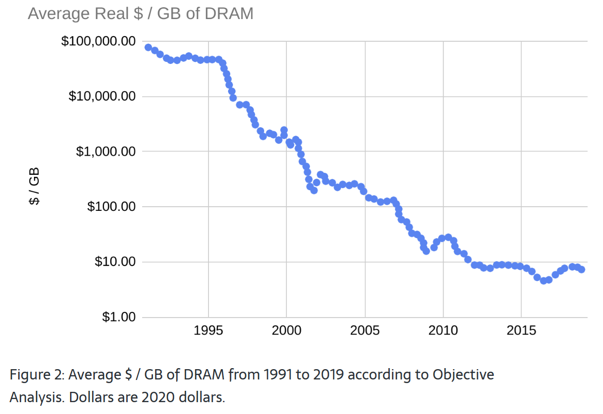

[[12]](.)

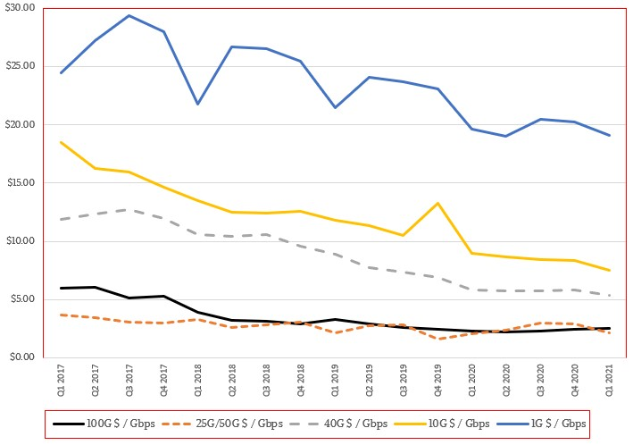

[[19]](.)

[[26]](.)

[[31]](.)

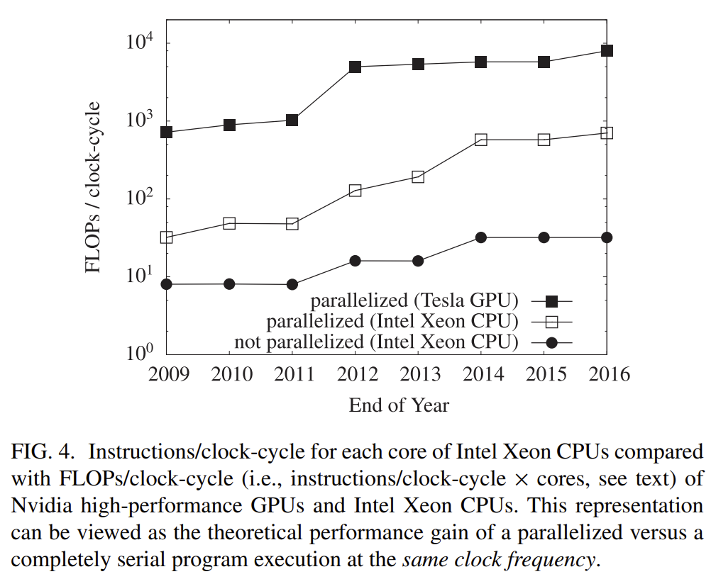

[[32]](.)

[[33]](.)

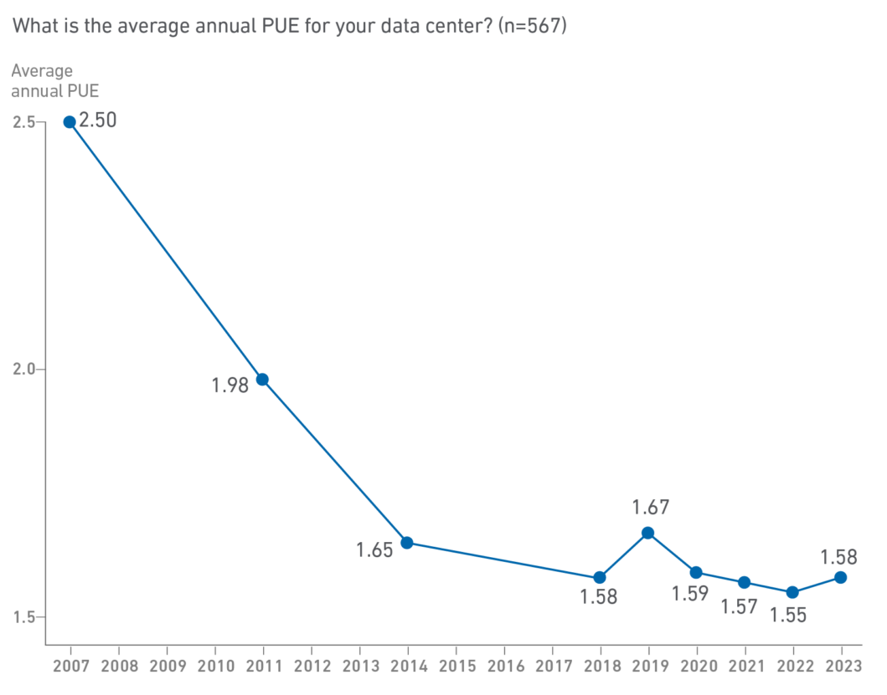

[[34]](.)

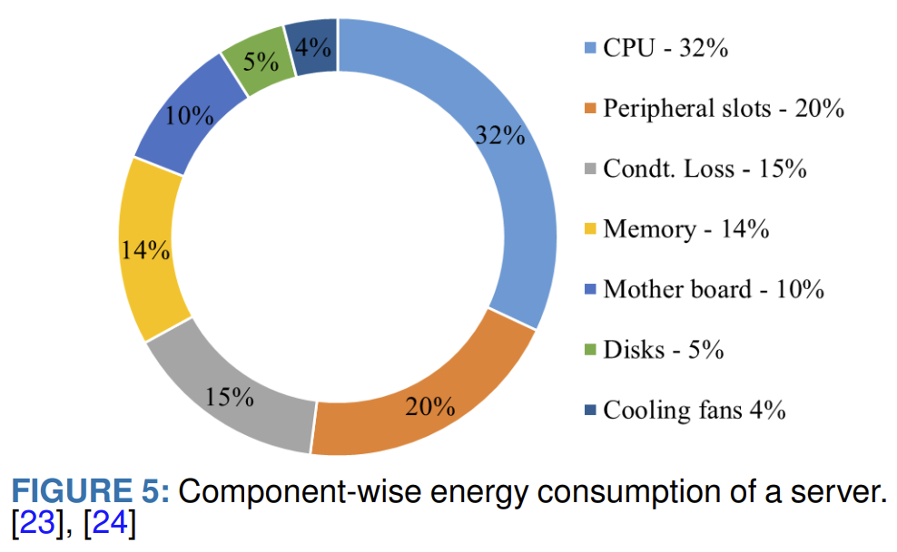

上述数据可以用来计算不同架构下的存储成本，以及未来竞争力。特别地，容量、带宽价格反映购买成本，而能耗反映反映运营成本（TCO）。
The above data can be used to calculate storage costs under different architectures, as well as future competitiveness. In particular, capacity and bandwidth prices reflect purchase costs, while energy consumption reflects operating costs (TCO).

### 额外成本  Additional costs

首先是能耗及制冷成本，一份能耗同时带来对应的制冷成本，两者加总为数据中心电费开销，几年后电费甚至超过购买成本。
First is energy consumption and cooling costs. Energy consumption brings corresponding cooling costs, and the sum of the two constitutes the electricity expenses of the data center, which may even exceed the purchase cost after a few years.

  * __PUE__: 数据中心能耗效率。假如服务器能耗是 500W ，数据中心的 PUE 是 1.5x，则这台服务器包括制冷需要耗能 500W * 1.5 = 0.75KW 。假设电费是 \$0.1 每 KWh ，则一年耗电 \$657，五年电费甚至超过服务器购买成本。
  * __PUE__: Data center energy efficiency. If the server power consumption is 500W and the data center's PUE is 1.5x, then this server, including cooling, requires 500W * 1.5 = 0.75KW. Assuming the electricity cost is \$0.1 per KWh, the annual electricity consumption is \$657, and the electricity cost over five years even exceeds the server purchase cost.

  * 常见数据中心 PUE 在 1.5x 左右，并基本维持稳定 [[33]](.) 。Google 数据中心甚至能将其压缩到 1.1x [[32]](.) 。
  * Common data center PUE is around 1.5x and remains relatively stable [[33]](.) . Google data centers can even compress it to 1.1x [[32]](.) .

然后是网络带宽，一份服务器带宽需要配套对应的 T0（TOR）、T1、T2 等交换机带宽。
Then there is network bandwidth, a server's bandwidth needs to be matched with corresponding T0 (TOR), T1, T2, etc. switch bandwidth.

  * 假设 100Gbps 服务器网卡，T0、T1 层使用 100% 带宽 Full-provisioning ，T2 层使用 50% 带宽 provisioning，忽略更高层次 T*。加起来额外带宽配比有 __2.5x__ 。
  * Assuming a 100Gbps server network card, the T0 and T1 layers use 100% bandwidth full-provisioning, while the T2 layer uses 50% bandwidth provisioning, ignoring higher levels T*. The total additional bandwidth ratio is __2.5x__.

除存储、网络、计算组件外，服务器在额外组件上花费的能耗数量可观。约 __30%__ 的额外能耗花费在电力传输（15%）、主板（10%）、冷却风扇上（4%） [[34]](.) 。
In addition to storage, network, and computing components, the amount of energy consumption spent on additional components in servers is considerable. About __30%__ of the additional energy consumption is spent on power transmission (15%), motherboards (10%), and cooling fans (4%) [[34]](.) .

### 与公有云价格的比较  ### Comparison with Public Cloud Prices

如今的公有云价格是作成本评估的良好参考，除非需要重新思考存储系统的架构，和硬件提供的可能性。本节以公有云存储 Azure Storage [[35]](.) 为基准，比较上文计算的存储成本数据。
The current public cloud prices are a good reference for cost assessment, unless there is a need to rethink the architecture of the storage system and the possibilities provided by the hardware. This section uses public cloud storage Azure Storage as a benchmark to compare the storage cost data calculated above.

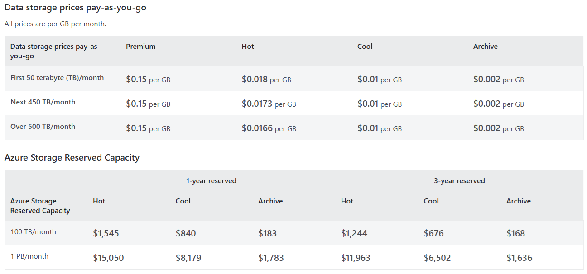

除前文提到的额外成本外，需要计算对于 1GB 存储应配套的 DRAM、Ethernet、PCIe 等。DRAM 涉及被缓存的数据比例。HDD 和 SSD 往往价格显著不同。CPU 需要依带宽处理能力配置。数据复制、压缩、纠删码可显著影响物理数据体积。冷数据可以极低带宽成本存储。
In addition to the extra costs mentioned earlier, it is necessary to calculate the DRAM, Ethernet, PCIe, etc., that should be matched for 1GB of storage. DRAM involves the proportion of cached data. HDDs and SSDs often have significantly different prices. The CPU needs to be configured according to bandwidth processing capabilities. Data replication, compression, and erasure coding can significantly affect the physical data volume. Cold data can be stored at very low bandwidth costs.

  * 单位全文统一，容量 GB，带宽 GBps，货币 \$。
  * Unit text unified, capacity GB, bandwidth GBps, currency \$.

下表计算了 __1GB 的 HDD 存储所需成本__，考虑了主要服务器组件、额外网络交换机配套、数据中心制冷等，也考虑了数据复制、压缩，以及部分是冷数据。购买成本和能耗成本都包含，购买成本按 60 个月摊还。可以发现：
The table calculates the cost required for __1GB of HDD storage__, taking into account major server components, additional network switch support, data center cooling, etc., as well as data replication, compression, and some cold data. Both purchase costs and energy consumption costs are included, with purchase costs amortized over 60 months. It can be found:

  * 相比 Azure Storage Reserved Capacity ，计算出的数据成本是 Cool 的约 1/22x，是 Archival 的约 1/4.5x 。
  * Compared to Azure Storage Reserved Capacity, the calculated data cost is about 1/22x of Cool and about 1/4.5x of Archival.

  * 当然，文中的计算力求简单清晰，比实际 __忽略了诸多开销__。例如互联网带宽费用、数据中心建设、研发费用、销售费用、读写 IO 放大、SSD 磨损、跨区复制、备份和容灾等等。
  * Of course, the calculations in the text strive for simplicity and clarity, ignoring many expenses in reality, such as internet bandwidth costs, data center construction, research and development expenses, sales expenses, read/write IO amplification, SSD wear, cross-region replication, backup, and disaster recovery, etc.

  * 除存储外，Azure Storage 对数据读写额外收费。持续的高 IOPS ，或对冷数据的大带宽访问，费用高昂。而计算出的数据成本已经将 1GB 对应带宽纳入。
  * In addition to storage, Azure Storage charges extra for data read and write. Continuous high IOPS or high bandwidth access to cold data is expensive. The calculated data cost has already included the bandwidth corresponding to 1GB.

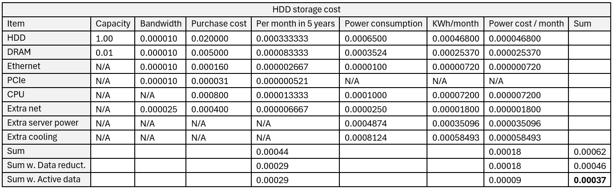

  * 计算出的 HDD 存储中，显著的购买成本从高到低分别是 HDD、DRAM。显著的能耗成本从高到低分别是数据中心制冷、HDD、服务器额外、DRAM。总能耗成本约占购买成本的 40%。
  * In the calculated HDD storage, the significant purchase costs from high to low are HDD and DRAM. The significant energy consumption costs from high to low are data center cooling, HDD, additional servers, and DRAM. The total energy consumption cost accounts for about 40% of the purchase cost.

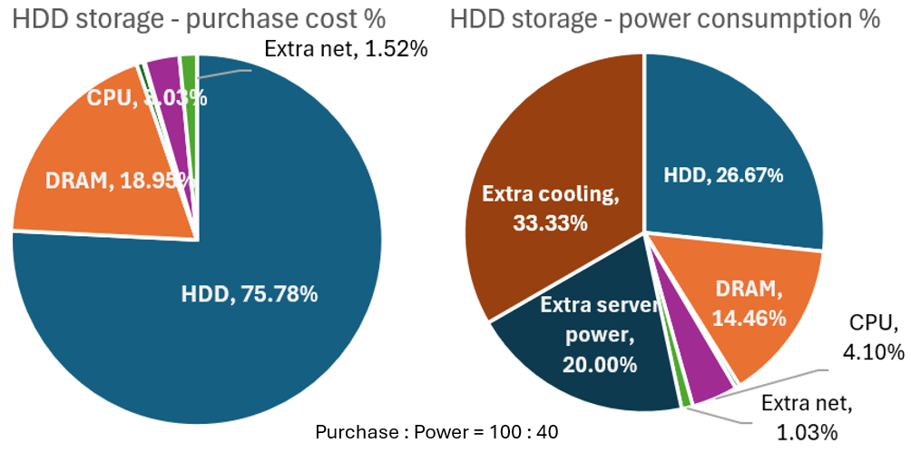

  * 同理计算出 5 年后的数据，各成本组分变化不大。主要因为各组件成本都在下降。但总能耗成本占购买成本上升到约 60%。（虽然 1GB 容量对应的 HDD 带宽在下降，计算时假定配套带宽不变。）
  * Similarly, calculate the data for 5 years later, where the changes in each cost component are not significant. This is mainly because the costs of each component are decreasing. However, the total energy cost as a percentage of purchase cost rises to about 60%. (Although the HDD bandwidth corresponding to 1GB capacity is decreasing, it is assumed that the supporting bandwidth remains unchanged during the calculation.)

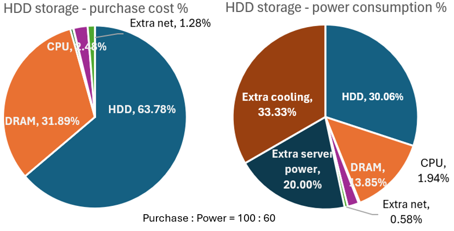

下表是 __1GB 的 SSD 存储所需成本__，与 HDD 版本对比，可以发现：
The table below shows the cost required for __1GB of SSD storage__, compared to the HDD version, it can be found:

  * 相比 Azure Storage Pay-as-you-go ，计算出的数据成本是 Premium 的约 1/34x。当然，文中的计算相比实际忽略了诸多成本。
  * Compared to Azure Storage Pay-as-you-go, the calculated data cost is about 1/34x of Premium. Of course, the calculations in the text ignore many costs compared to reality.

  * 计算出的 SSD 存储成本是 HDD 的 12x 左右，与 Azure Storage 类似，Premium 是 cool 的 15x 左右。
  * The calculated SSD storage cost is about 12 times that of HDD, similar to Azure Storage, with Premium being about 15 times that of cool.

  * 计算出的 SSD 单位带宽的成本比 HDD 更低，这与 Azure Storage 相符，Premium 的读写价格比 Hot 更低，数据越冷读写成本越高。
  * The calculated cost of SSD unit bandwidth is lower than that of HDD, which is consistent with Azure Storage, where the read and write prices for Premium are lower than for Hot, and the colder the data, the higher the read and write costs.

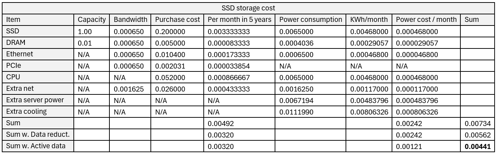

  * 计算出的 SSD 存储中，显著的购买成本从高到低分别是 SSD、CPU。显著的能耗成本从高到低分别是数据中心制冷、服务器额外、SSD、CPU。总能耗成本约占购买成本的 50%。
  * In the calculated SSD storage, the significant purchase costs from high to low are SSD and CPU. The significant energy consumption costs from high to low are data center cooling, additional servers, SSD, and CPU. The total energy consumption cost accounts for about 50% of the purchase cost.

  * 同理计算出 5 年后的数据，各成本组分变化不大。主要因为各组件成本都在下降。但总能耗成本占购买成本上升到约 58%。（虽然 1GB 容量对应的 SSD 带宽在上升，计算时假定配套带宽不变。）
  * Similarly, calculate the data for 5 years later, where the changes in each cost component are not significant. This is mainly because the costs of each component are decreasing. However, the total energy consumption cost rises to about 58% of the purchase cost. (Although the SSD bandwidth corresponding to 1GB capacity is increasing, it is assumed that the supporting bandwidth remains unchanged during the calculation.)

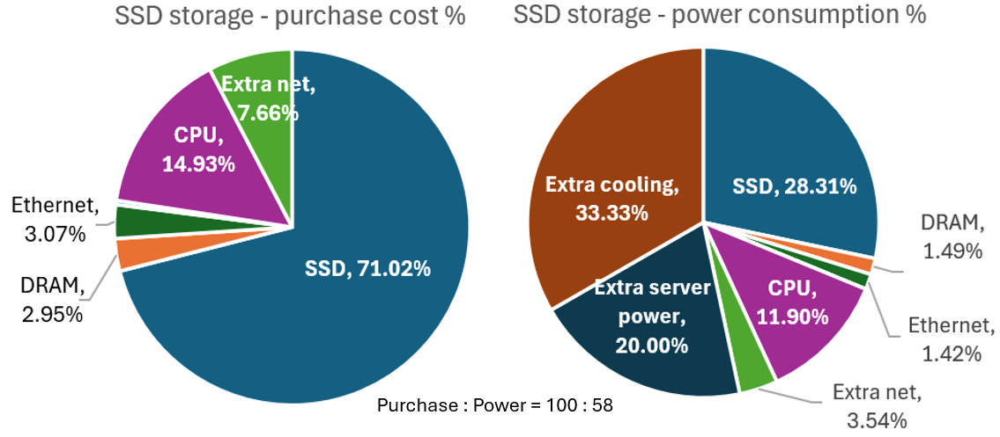

可以推想，对于 SSD 存储，如果数据热度高、操作频繁、传输带宽大，并且功能简单，使用本地数据中心可能有成本优势。而对于冷数据，公有云是理想的存储地点，利用 Reserved Capacity 能进一步降低成本。
It can be inferred that for SSD storage, if the data is hot, operations are frequent, the transmission bandwidth is large, and the functions are simple, using a local data center may have cost advantages. For cold data, public cloud is the ideal storage location, and utilizing Reserved Capacity can further reduce costs.

### 选择 HDD 和 SSD
### Choosing HDD and SSD

基于需要的容量和带宽，可以将上文数据表中购买 HDD 或 SSD 的成本绘出，比较不同选择。加上能耗开销后结果类似。可以看到：
Based on the required capacity and bandwidth, the costs of purchasing HDDs or SSDs in the above data table can be plotted to compare different options. The results are similar when adding energy consumption costs. It can be seen:

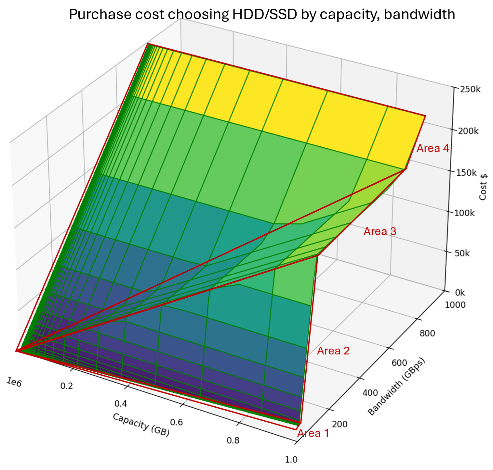

  * __Area 1__ 和 __Area 2__ 分别对应1）低带宽高容量需求，使用 HDD ；2）高带宽低容量需求，使用 SSD。相比 SSD，HDD 的带宽很低，因而 Area 1 面积较小。
  * __Area 1__ and __Area 2__ correspond to 1) low bandwidth high capacity demand, using HDD; 2) high bandwidth low capacity demand, using SSD. Compared to SSD, the bandwidth of HDD is very low, thus the area of Area 1 is smaller.

  * __Area 2__ 全部使用 HDD，但带宽需求较高，需要为带宽额外购买 HDD 容量。__Area 3__ 全部使用 SSD，但带宽需求较低，给定容量的 SSD 有带宽闲置。
  * __Area 2__ uses all HDDs, but the bandwidth demand is high, requiring additional HDD capacity for bandwidth. __Area 3__ uses all SSDs, but the bandwidth demand is low, resulting in idle bandwidth for the given capacity of SSDs.

  * 作为改进，__Area 2__ 和 __Area 3__ 适合使用 HDD 和 SSD 的混合存储，或者使用 SSD 作为 HDD 的缓存。
  * As an improvement, __Area 2__ and __Area 3__ are suitable for hybrid storage using HDD and SSD, or using SSD as a cache for HDD.

### 硬件发展的推动因素  ### Factors Driving Hardware Development

硬件性能如此高速发展，它受何推动？推动因素可以从技术层面和市场层面分析。
The hardware performance is developing at such a high speed; what is driving it? The driving factors can be analyzed from both the technical and market perspectives.

技术层面，总体上，更小的制程、更高的集成度、专用设计的芯片、更高的频率、新型物理介质，__摩尔定律__ 推动硬件性能指数提高。在各个组件上，近年来都有一系列技术创新：
On the technical level, overall, smaller processes, higher integration, specially designed chips, higher frequencies, and new physical media have driven the improvement of hardware performance indices under Moore's Law. In recent years, there have been a series of technological innovations in various components:

  * __HDD__: 不断提高的存储密度，近年来逐渐推广的 SMR 技术，以及未来将采用的 MAMR、HAMR 等 [[36]](.) 更复杂但密度更高的存储技术。
  * __HDD__: Continuously increasing storage density, the gradually promoted SMR technology in recent years, and the more complex but higher density storage technologies such as MAMR and HAMR that will be adopted in the future.

  * __SSD__: 一系列技术从不同层面提高 SSD 性能。接口协议如 NVMe、NVMoF。简化 FTL 层如 ZNS、FDP [[37]](.) 。闪存架构如 3D NAND 。提高闪存密度，使用新型物理介质如 TLC、QLC、PLC 。
  * __SSD__: A series of technologies that improve SSD performance from different levels. Interface protocols such as NVMe, NVMoF. Simplified FTL layers such as ZNS, FDP [[37]](.) . Flash architectures such as 3D NAND. Increasing flash density, using new types of physical media such as TLC, QLC, PLC.

  * __DRAM__: 每一代 DDR 不断提高时钟频率，改进架构，降低电压。DRAM 的密度、封装也在改进，如 3D Stacking 技术。
  * __DRAM__: Each generation of DDR continuously increases clock frequency, improves architecture, and reduces voltage. The density and packaging of DRAM are also being improved, such as with 3D Stacking technology.

  * __HBM__: 与 DRAM 一道，HBM 的堆叠技术在持续改进，允许更多层数和更高的跨层传输速度。线路的信号传输速率、接口宽度也在提高。
  * __HBM__: Along with DRAM, the stacking technology of HBM is continuously improving, allowing for more layers and higher inter-layer transmission speeds. The signal transmission rate of the lines and the interface width are also increasing.

  * __Ethernet__: 以太网协议不断换代，大幅提高传输带宽。近年来 RDMA RoCEv2 普遍被采用，服务器使用 ASIC 芯片替代 CPU 处理高速网络。光纤交换机也在数据中心采用。
  * __Ethernet__: The Ethernet protocol is continuously evolving, significantly increasing transmission bandwidth. In recent years, RDMA RoCEv2 has been widely adopted, with servers using ASIC chips instead of CPUs to handle high-speed networks. Fiber optic switches are also being used in data centers.

  * __PCIe__: 每一代 PCIe 的不断提速得益于编码协议和同步效率的改进，更多数据在一个时钟周期内传输。传输介质的改进容许更高的速率。然后，Lane 乘数加倍，并行传输。
  * __PCIe__: The continuous speed increase of each generation of PCIe is due to improvements in encoding protocols and synchronization efficiency, allowing more data to be transmitted in one clock cycle. Improvements in transmission media permit higher rates. Then, the lane multiplier doubles, enabling parallel transmission.

  * __CPU__: 性能在不同层面得到改进。更多的晶体管数量、集成度，更小的制程。多核、Manycore 集成于一个处理器中。频率的小幅提高。微架构的改进、更高的 IPC 。新型向量处理指令 SIMD 。集成专用任务的加速器。能耗优化、DVFS 等技术。
  * __CPU__: Performance improvements at different levels. More transistors, higher integration, smaller process nodes. Multi-core and Manycore integrated into a single processor. Slight frequency increases. Improvements in microarchitecture, higher IPC. New vector processing instructions SIMD. Accelerators for integrated specialized tasks. Energy consumption optimization, DVFS, and other technologies.

  * __NVLink__: 类似于 PCIe ，PCIe 本身也在高速发展。NVLink 的提速额外受益于与 GPU 的高度集成、更大的连线宽度等，以及 AI 热度带来的投资。
  * __NVLink__: Similar to PCIe, PCIe itself is also rapidly developing. The acceleration of NVLink benefits additionally from its high integration with GPUs, larger connection widths, and investments driven by the popularity of AI.

  * __GPU__: 得益于生成式 AI 的工业革命式的投资热度，GPU 领域快速发展。每一代新 Nvidia GPU 更新架构，更多核数、执行单元，集成更多更大容量的组件，并减小制程。Tensor Core 和 RT Core 为专用任务优化。相比于 CPU ，GPU 将内存、总线集成于自身板上。HBM、PCIe、NVLink 本身也在高速发展。相比于 CPU ，GPU 的时钟频率较低，近年来持续提高。
  * __GPU__: Benefiting from the industrial revolution-level investment enthusiasm in generative AI, the GPU field is rapidly developing. Each new generation of Nvidia GPUs updates the architecture, increases the number of cores and execution units, integrates more and larger capacity components, and reduces the process size. Tensor Cores and RT Cores are optimized for specific tasks. Compared to CPUs, GPUs integrate memory and buses on their own boards. HBM, PCIe, and NVLink are also rapidly developing. Compared to CPUs, GPUs have lower clock frequencies, which have been steadily increasing in recent years.

硬件发展的另一方面推动力来自于市场需求。可以从衡量存储性能的常见指标上理解：
Another driving force behind hardware development comes from market demand. This can be understood from common metrics used to measure storage performance:

  * __容量__: 经典的大数据 3V [[38]](.) 理论 - volume, velocity and variety 。对比其它行业如彩电、冰箱、汽车，很少有市场能像数据一般贪婪地增长。__热数据量总是有限的__，正比于业务活跃周期 X 事务频率，意味着冷数据有广阔的优化空间；而政策合规进一步推高需求。用户乐于为基于容量的额外需求付费，如安全加密、备份容灾、分析挖掘等。
  * __Capacity__: The classic big data 3V theory - volume, velocity, and variety. Compared to other industries such as color TVs, refrigerators, and automobiles, few markets can grow as greedily as data. __The amount of hot data is always limited__, proportional to the business activity cycle X transaction frequency, which means there is ample room for optimizing cold data; meanwhile, policy compliance further increases demand. Users are willing to pay for additional capacity-based needs, such as security encryption, backup disaster recovery, and analytical mining.

  * __吞吐量__: 更丰富的媒体体验，图片、视频、流媒体，AI 训练和服务，近年来仍在驱动需求增长。
  * __Throughput__: A richer media experience, images, videos, streaming, AI training and services have continued to drive demand growth in recent years.

  * __IOPS__: 事务处理偏向 IOPS 需求，数据库是少见的成熟但经久不衰的市场，近年来仍持续孵化创业公司。另一方面，Web、移动应用、互联网触及并深入每一个人。__O(1)__ 规模的业务极其少见，即使好莱坞大片也难以达到（O(P) 指调查每一个人，有 P 概率使用该产品）。
  * __IOPS__: Transaction processing is biased towards IOPS demand, and databases are a rare mature yet enduring market that continues to incubate startups in recent years. On the other hand, the web, mobile applications, and the internet reach and penetrate everyone. Businesses of __O(1)__ scale are extremely rare, even Hollywood blockbusters find it difficult to achieve (O(P) refers to surveying every person, with a P probability of using the product).

  * __延迟__: 相对于人的感知，如今的硬件速度已经极快，延迟低于阈值后变得不再重要。但量化交易仍不竭地追求更低延迟；计算复杂的 AI、自动驾驶的延迟需求未被满足；以及物联网、机器人等接入物理的领域。另一方面，软件正变得日益复杂，意味着延迟优化被持续需要。
  * __Latency__: Compared to human perception, today's hardware speeds are extremely fast, and latency becomes unimportant once it falls below a threshold. However, quantitative trading continues to relentlessly pursue lower latency; the latency demands of complex AI and autonomous driving remain unmet; as well as in fields like the Internet of Things and robotics that connect to the physical world. On the other hand, software is becoming increasingly complex, which means that latency optimization is continuously needed.

### 观察和要点  ### Observations and Key Points

仔细观察上文的硬件数据表，可以发现许多值得思考的要点：
Careful observation of the hardware data table above reveals many points worth considering:

  * __延迟无法购买__。从上文数据表可以看到，带宽、容量均有价格，更多的钱可以购买更多，技术上横向扩展。但延迟例外，甚至不像带宽和容量有逐年的显著提升。改进延迟往往需要技术换代（无法预期），或从头替换存储介质（成本、迁移巨大）。延迟是最昂贵的。
  * __Latency cannot be purchased__. From the data table above, it can be seen that bandwidth and capacity have prices; more money can buy more, and technically, horizontal scaling is possible. But latency is an exception, and it does not show significant annual improvements like bandwidth and capacity. Improving latency often requires technological upgrades (which cannot be anticipated) or completely replacing storage media (which involves huge costs and migration). Latency is the most expensive.

  * __数据容量对应的成本仍然昂贵__。从上文数据表可以看出，无论是购买成本还是能耗成本，无论是 HDD 还是 SSD 存储，硬盘都占据显著位置。可以想见，任何 Data Reduction 技术，如压缩、去重、纠删码，都有显著改进存储系统成本收益的潜力。
  * __The cost corresponding to data capacity is still expensive__. As can be seen from the data table above, whether it is the purchase cost or the energy consumption cost, both HDD and SSD storage occupy a significant position. It is conceivable that any Data Reduction technology, such as compression, deduplication, or erasure coding, has significant potential to improve the cost-benefit of storage systems.

  * __DRAM 占有显著的购买和能耗成本__。相比 SSD，DRAM 购买成本昂贵。即使带宽未实际使用，DRAM 的静态刷新也持续耗能。尤其是 HDD 存储，DRAM 成本相比廉价的硬盘更加显著。一些新技术有利成本，如利用 SSD 而不是 DRAM 管理元数据，将冷（元）数据从 DRAM 卸载到 SSD。
  * __DRAM has significant purchasing and energy consumption costs__. Compared to SSDs, the purchasing cost of DRAM is expensive. Even when the bandwidth is not actually used, the static refresh of DRAM continues to consume energy. Especially in HDD storage, the cost of DRAM is more significant compared to cheap hard drives. Some new technologies are cost-effective, such as using SSDs instead of DRAM to manage metadata and offloading cold (meta) data from DRAM to SSDs.

  * __DRAM 带宽在未来可能成为瓶颈__。一台服务器不会有太多 DRAM 通道，但可以安装几十盘 SSD 。Ethernet 带宽增长速度也远超 DRAM 。GPU/NVLink 带宽远超 DRAM 。而 DRAM 容量昂贵、能耗高。作为 CPU-IO 的桥梁，DRAM 带宽会被一份数据多次消耗。CPU 内存墙问题今天已经显著。有一些勉强的解决方案，如为服务器插入额外的小容量 DRAM ，使用 DDIO [[39]](.) 技术让短命数据跳过 DRAM 。
  * __DRAM bandwidth may become a bottleneck in the future__. A server will not have too many DRAM channels, but it can install dozens of SSDs. The growth rate of Ethernet bandwidth far exceeds that of DRAM. GPU/NVLink bandwidth far exceeds that of DRAM. Moreover, DRAM capacity is expensive and has high energy consumption. As a bridge for CPU-IO, DRAM bandwidth will be consumed multiple times by a single piece of data. The CPU memory wall problem is already significant today. There are some forced solutions, such as inserting additional small-capacity DRAM into the server and using DDIO [[39]](.) technology to allow short-lived data to bypass DRAM.

  * __SSD 尽管昂贵，但单位带宽价格远好于 HDD__。这意味着用 SSD 作 Write Staging ，用廉价 SSD 为云存储作普适加速，是自然趋势。另一方面，在 SSD 普及到 HDD 存储后，存储系统需要支持适度混合 SSD/HDD 来适配各级别的“带宽/容量比”需求。类似地，NVDIMM-N 使用 DRAM 作 Write Staging ，闪存作断电存储。
  * __Although SSDs are expensive, the price per unit bandwidth is much better than that of HDDs__. This means that using SSDs for Write Staging and using cheap SSDs for universal acceleration in cloud storage is a natural trend. On the other hand, after SSDs become popular in HDD storage, storage systems need to support a moderate mix of SSDs and HDDs to accommodate various levels of "bandwidth/capacity ratio" requirements. Similarly, NVDIMM-N uses DRAM for Write Staging and flash memory for power loss storage.

  * __在 SSD 存储中，CPU 的购买和能耗成本显著__。这来自于高带宽的配套要求。由此可以看到 DPU 和专用网络芯片在改善成本上的巨大潜力。近年来，ARM CPU 被越来越多的采用，AWS Nitro 芯片取得巨大成功，压缩、加密专用卡已不少见。
  * __The purchase and energy consumption costs of the CPU in SSD storage are significant__. This is due to the high bandwidth requirements. This shows the great potential of DPUs and dedicated network chips in improving costs. In recent years, ARM CPUs have been increasingly adopted, and AWS Nitro chips have achieved great success, with dedicated cards for compression and encryption becoming quite common.

  * __CPU 的性能提升较慢，跟不上 SSD 和 Ethernet__ ，CPU 的能耗开销显著。这催生今年来的一系列技术路线：1）使用 DPDK、SPDK 跳过操作系统内核；2）使用 DPU、加速卡替代 CPU 处理负载；3）使用 ARM 替代 Intel CPU ；4）绕过 CPU-DRAM-PCIe 生态，如 GPU，使用 GPU-HBM-NVLink 替代。
  * The performance improvement of the CPU is slow, unable to keep up with SSD and Ethernet, and the energy consumption overhead of the CPU is significant. This has led to a series of technological routes this year: 1) using DPDK and SPDK to bypass the operating system kernel; 2) using DPU and accelerator cards to replace CPU for processing loads; 3) using ARM instead of Intel CPU; 4) bypassing the CPU-DRAM-PCIe ecosystem, such as GPU, using GPU-HBM-NVLink as a replacement.

  * __Ethernet 和 PCIe 的带宽和价格达到相近水平__，两者也在指数改进。合理的推想是，__能否用 Ethernet 替代 PCIe__，简化计算机体系结构？Ethernet 更容易横向扩展，互联多台机器，池化额外带宽。但相比 PCIe ，Ethernet 延迟更高，难以解决无损传输和一致性问题。CXL 在此路线上。
  * __The bandwidth and price of Ethernet and PCIe have reached similar levels__, and both are improving exponentially. A reasonable speculation is, __can Ethernet replace PCIe__, simplifying computer architecture? Ethernet is easier to scale horizontally, interconnecting multiple machines and pooling additional bandwidth. However, compared to PCIe, Ethernet has higher latency and faces challenges in achieving lossless transmission and consistency. CXL is on this path.

  * __反过来推想，能否用 PCIe 替代 Ethernet__？集群架构很大程度上取决于机器的互联方式，例如 Hyper-converged、Disaggregated、Geo-replicated 等。鉴于生成式 AI 对 TB 级互联带宽的需求，未来的集群架构可能分化为不同路线：1）大规模、GB 级互联带宽的存储系统；2）小规模、TB 级互联带宽的 HPC-GPU 集群。（1）计算存储分离，而（2）计算存储融合 Co-locating 。公有云需要针对（1）、（2）售卖新型产品。
  * __Conversely, can PCIe replace Ethernet__? The architecture of clusters largely depends on the interconnection method of machines, such as Hyper-converged, Disaggregated, Geo-replicated, etc. Given the demand for TB-level interconnection bandwidth from generative AI, future cluster architectures may diverge into different paths: 1) large-scale, GB-level interconnection bandwidth storage systems; 2) small-scale, TB-level interconnection bandwidth HPC-GPU clusters. (1) Computing and storage are separated, while (2) computing and storage are co-located. Public clouds need to sell new types of products for (1) and (2).

  * __Ethernet 发展极快，超过所有其它硬件__。这与存储系统和数据库向 Disaggregated 架构、Shared-nothing 架构、存算分离、Shared-logging、Log is database 等方向发展相符。另一方面，__只有 HDD 单位容量的带宽持续下降__，对未来的存储设计提出挑战 [[40]](.) 。主要原因是机械硬盘技术已经十分成熟，性能提升受机械物理的限制，而 SMR、HAMR 等提升存储密度的技术还有空间。
  * __Ethernet is developing rapidly, surpassing all other hardware__. This aligns with the development of storage systems and databases towards Disaggregated architecture, Shared-nothing architecture, storage-compute separation, Shared-logging, and Log is database. On the other hand, __the bandwidth of HDD per unit capacity continues to decline__, posing challenges for future storage design [[40]](.) . The main reason is that mechanical hard drive technology has become very mature, and performance improvements are limited by mechanical physics, while technologies like SMR and HAMR that enhance storage density still have room for growth.

  * __高性能硬件并不一定意味着昂贵的价格，甚至单位带宽成本反而更低__，例如 DRAM < SSD < HDD 。Ethernet 也有类似趋势，单位带宽成本 100 Gbps < 40 Gbps < 10 Gbps 。这暗示共享和池化有利可图，具有规模效应，云存储可率先采用高端硬件。
  * __High-performance hardware does not necessarily mean expensive prices, and the cost per unit bandwidth can even be lower__, for example, DRAM < SSD < HDD. Ethernet also shows a similar trend, with the cost per unit bandwidth being 100 Gbps < 40 Gbps < 10 Gbps. This suggests that sharing and pooling are profitable, with economies of scale, and cloud storage can take the lead in adopting high-end hardware.

  * __数据中心制冷的能耗成本显著__。如果把 PUE 从平均水准 1.5x 下降到 Google 数据中心的 1.1x 水准，收益巨大；或者，直接使用云计算服务。能耗并不是数据中心制冷的唯一问题，制冷系统损坏（如雷暴、过热）并不少见。如何向高密度的机架输送足够电力，并配套足够制冷，也有挑战。__服务器能耗是巨大的问题__，甚至可能超过存储系统对性能的关注度，在云存储中尤其显著。反之，高度规模化的云存储比私有数据中心更容易找到优化能耗的办法，例如建设选址和 Free Cooling 。另一方面，公有云厂商可利用规模优势，要求定制的服务器设计，以进一步节约能耗。
  * The energy consumption cost of data center cooling is significant. If the PUE is reduced from an average level of 1.5x to the 1.1x level of Google data centers, the benefits are enormous; alternatively, directly using cloud computing services. Energy consumption is not the only issue with data center cooling; cooling system failures (such as thunderstorms and overheating) are not uncommon. How to deliver sufficient power to high-density racks while providing adequate cooling is also a challenge. Server energy consumption is a huge problem, and it may even surpass the focus on performance in storage systems, especially in cloud storage. Conversely, highly scalable cloud storage is more likely to find ways to optimize energy consumption than private data centers, such as site selection and Free Cooling. On the other hand, public cloud vendors can leverage economies of scale to demand customized server designs to further save energy consumption.

### 软件的价值在哪里  ### What is the value of software?

从上文的数据表可以发现，硬件普遍存在性能的 __指数增长__，或成本的指数下降。而通过软件改善性能，不仅研发成本昂贵，一年可能也只有 30% 的提升。那么，软件的价值在哪里？
From the data table above, it can be seen that hardware generally exhibits __exponential growth__ in performance or exponential decline in cost. However, improving performance through software is not only expensive in R&D costs, but may only achieve a 30% improvement in a year. So, where is the value of software?

  * __为用户暴露裸硬件延迟__：上文提到“延迟无法购买”，这就是软件的价值之一，尽可能为用户提供裸硬件的原生延迟水平（而不是带宽）。同时，软件层需要对抗系统的复杂性、物理组件的距离、动态负载的变动。许多架构技术来源于此。
  * __Exposing raw hardware latency to users__: As mentioned above, "latency cannot be purchased," which is one of the values of software, to provide users with the native latency level of raw hardware as much as possible (rather than bandwidth). At the same time, the software layer needs to combat system complexity, the distance of physical components, and fluctuations in dynamic loads. Many architectural technologies stem from this.

  * __管理大量硬件__：只有软件能做到，而硬件本身难以要求一块 SSD 盘去管理另一块 SSD 盘。以此衍生出管理分布式系统、管理复杂性、管理资源效率等方向。相关联的需求是 __系统集成__，企业对集成打通、统一管理不同品牌系统的需求非常常见，见 _[存储系统的市场](.)_ 一章。
  * __Managing a large amount of hardware__: Only software can do this, while hardware itself finds it difficult to require one SSD to manage another SSD. This leads to directions such as managing distributed systems, managing complexity, and managing resource efficiency. A related demand is __system integration__, where enterprises commonly require integration to connect and manage different brand systems uniformly, as seen in the chapter on _[the storage system market](.)_.

  * __分布式系统__：软件层将大量硬件联合成为分布式系统，其间运转复杂的技术。虚拟化、调度、故障恢复、容灾、复制等等。只有软件层能够为硬件带来横向扩展、高可靠、负载均衡、地理复制等功能。直至云计算。
  * __Distributed Systems__: The software layer combines a large amount of hardware into a distributed system, operating complex technologies in between. Virtualization, scheduling, fault recovery, disaster recovery, replication, and so on. Only the software layer can provide hardware with features such as horizontal scaling, high reliability, load balancing, and geographic replication. Until cloud computing.

  * __复杂性__：在系统内部，软件层管理复杂的用户需求和复杂的系统需求。跨系统，软件层提供互操作性、兼容性、跨硬件协议接口。在产品和市场层面，软件维护多方参与的生态系统。统一命名空间、文件系统、数据库、访问协议等被设计出来，软件使本地的硬件能力走向全球化。软件受益于复杂非标准的功能带来的差异化竞争，而硬件的接口趋向标准化，激烈的性能、成本竞争削减利润空间。另一种说法是，软件提供 __大量功能__、__统一性__、__简化管理__。
  * __Complexity__: Within the system, the software layer manages complex user needs and complex system requirements. Across systems, the software layer provides interoperability, compatibility, and cross-hardware protocol interfaces. At the product and market level, the software maintains a multi-participant ecosystem. Unified naming spaces, file systems, databases, access protocols, etc., are designed, allowing software to globalize local hardware capabilities. Software benefits from differentiated competition brought by complex non-standard functions, while hardware interfaces tend toward standardization, and intense performance and cost competition reduces profit margins. Another way to say it is that software provides __a large number of functions__, __uniformity__, and __simplified management__.

  * __资源效率__：软件层通过负载均衡、拥塞控制、池化共享、并行处理等方式，提高硬件的资源利用效率。软件使统计大量硬件提供监控数据成为可能。软件可以在高低性能硬件间搭配迁移，以最佳成本配比。软件可以预测未来，调度负载和冷热。更重要的是，软件可以管理能耗这一数据中心头等成本。另外，需要减少软件自身带来的额外 __管理成本__。
  * __Resource Efficiency__: The software layer improves the resource utilization efficiency of hardware through load balancing, congestion control, pooling and sharing, and parallel processing. Software makes it possible to collect monitoring data from a large number of hardware. Software can facilitate migration between high and low-performance hardware for optimal cost ratios. Software can predict the future, schedule loads, and manage hot and cold data. More importantly, software can manage energy consumption, which is a top cost for data centers. Additionally, it is necessary to reduce the extra __management costs__ brought by the software itself.

另一方面，这意味着在选择存储系统架构，或者作为程序开发人员的职业发展上，需要仔细思考何为高价值方向。例如，将开发工资想象为投资投入，软件层性能优化的回报率是否足够高？
On the other hand, this means that careful consideration is needed when choosing storage system architecture or in the career development of program developers regarding what constitutes a high-value direction. For example, if we think of development salaries as an investment, is the return on investment for software layer performance optimization high enough?

## 案例分析：EBOX  ## Case Study: EBOX

本章用一个案例来展示如何使用前文的框架进行分析。它能够帮助团队寻找前瞻性的投资方向，将技术创新映射到财务指标，规划未来 3~5 年的发展策略。EBOX 是个有趣的技术创新。
This chapter uses a case study to demonstrate how to analyze using the framework mentioned earlier. It can help the team identify forward-looking investment directions, map technological innovations to financial metrics, and plan development strategies for the next 3 to 5 years. EBOX is an interesting technological innovation.

本章首先介绍什么是 EBOX，它的创新点，可能的收益与风险。接下来，本章从存储系统角度分析成本和收益、未来预期。然后，本章分析研发成本如何摊薄。最后，本章从供应商角度分析售卖 EBOX 是否有利可图。
This chapter first introduces what EBOX is, its innovations, and the potential benefits and risks. Next, the chapter analyzes costs and benefits from the perspective of storage systems and future expectations. Then, the chapter examines how R&D costs can be amortized. Finally, the chapter analyzes whether selling EBOX is profitable from the vendor's perspective.

### 什么是 EBOX  ### What is EBOX

EBOX 是存储系统的一个有趣的可能的创新方向。它将传统的存储服务器进一步分解为 __硬盘框服务器 EBOX__ 和 仅剩计算功能的存储服务器。两者均可独立优化，在此基础上有一些列技术创新。有一系列来源提到了 EBOX 技术，同时介绍了 EBOX 如何工作：
EBOX is an interesting potential innovative direction for storage systems. It further breaks down traditional storage servers into __hard disk frame servers EBOX__ and storage servers that only retain computing functions. Both can be independently optimized, and based on this, there are a series of technological innovations. A number of sources have mentioned EBOX technology while introducing how EBOX works:

  * __zStorage__ [[42]](.) : 下层存储使用双控的 EBOF 全闪存硬盘框，上层业务运行在标准服务器节点。所有业务节点共享访问 EBOF 存储节点。Vast Data 自己并不生产 EBOF 硬盘框，委托其它厂商生产，目标是让 EBOF 硬盘框变成像标准服务器一样廉价，发展生态。
  * __zStorage__ [[42]](.) : The lower layer storage uses a dual-control EBOF all-flash disk enclosure, while the upper layer business runs on standard server nodes. All business nodes share access to the EBOF storage nodes. Vast Data does not produce EBOF disk enclosures itself, but commissions other manufacturers to produce them, aiming to make EBOF disk enclosures as inexpensive as standard servers and to develop an ecosystem.

  * __Vast Data__ [[43]](.) : 未找到 Vast Data 直接提及 EBOF 或 EBOX （同名但不同意，Vast Data 的指 Everything Box）。但如 zStorage 所总结，Vast Data 使用 DBox （NVMe JBOF）存储数据，CNode 计算管理集群，两者通过 NVMoF 联接。任何 CNode 可访问任何 DBox，这种共享架构大幅提高数据节点的可靠性（Availability，不是 Durability）。超长纠删码被允许使用，降低数据副本开销到 1.0x~1.1x 。
  * __Vast Data__ [[43]](.) : No direct mention of EBOF or EBOX was found in Vast Data (the same name but different meaning, Vast Data refers to Everything Box). However, as summarized by zStorage, Vast Data uses DBox (NVMe JBOF) for data storage, and CNode manages the computing cluster, with both connected via NVMoF. Any CNode can access any DBox, and this shared architecture significantly improves the reliability of data nodes (Availability, not Durability). Ultra-long erasure codes are allowed, reducing the overhead of data copies to 1.0x~1.1x.

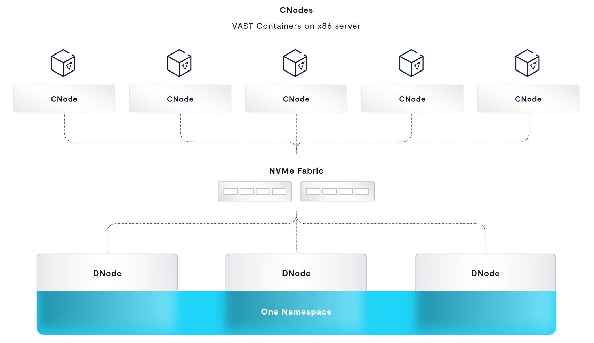

  * __NVMoF for Disaggregated Storage__ [[44]](.) : 见下图，NVMoF 带来的诸多存储架构的创新，如果数据服务器足够简单和标准化，那么可以通过 Direct Access 的方法访问 SSD，不再需要 CPU。甚至 PCIe 也可以省去，与 Ethernet 合二为一。
  * __NVMoF for Disaggregated Storage__ [[44]](.) : As shown in the figure below, the many innovations in storage architecture brought by NVMoF allow for accessing SSDs through Direct Access methods if the data server is simple and standardized enough, eliminating the need for a CPU. Even PCIe can be omitted, merging with Ethernet.

  * __HammerSpace NFS-eSSD__ [[45]](.) : HammerSpace 的网络文件系统首先利用 NFS4.2 协议，允许客户端跳过元数据服务器，直接访问存储节点。进一步，存储节点不再需要 CPU、DRAM、PCIe，将 SSD 直接接入 Ethernet，用定制芯片控制。
  * __HammerSpace NFS-eSSD__ [[45]](.) : HammerSpace's network file system first utilizes the NFS4.2 protocol, allowing clients to bypass the metadata server and directly access storage nodes. Furthermore, storage nodes no longer require CPU, DRAM, or PCIe, connecting SSDs directly to Ethernet and controlling them with custom chips.

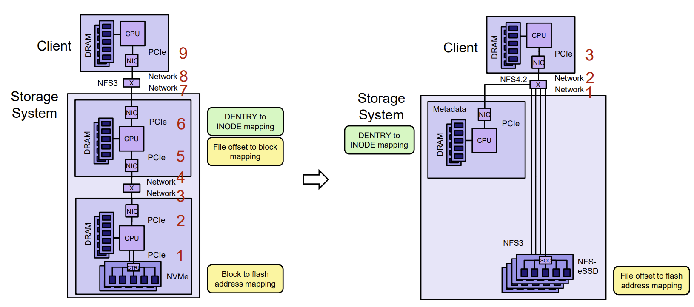

可以看到，EBOX 有一系列优势，本文基于它们分析成本收益：
It can be seen that EBOX has a series of advantages, and this article analyzes the cost-benefit based on them:

  * __存储服务器与数据节点的全联接（Shared Everything）__。不同于以往数据硬盘被单一存储服务器独占，全联接架构可以将数据盘的可靠性（Availability）提高多个数量级。在此基础上，__超长纠删码__ 进一步降低数据副本开销。Fan-out 的联接有助于负载均衡。从 EBOX 到客户端的 DSR（Direct Server Return）有助于降低延迟。
  * __Shared Everything between storage servers and data nodes__. Unlike the past where data disks were monopolized by a single storage server, the shared everything architecture can increase the reliability (Availability) of data disks by several orders of magnitude. On this basis, __ultra-long erasure codes__ further reduce the overhead of data replicas. Fan-out connections help with load balancing. DSR (Direct Server Return) from EBOX to the client helps reduce latency.

  * __标准化的 EBOX 可将 CPU 替换为定制芯片或 DPU__。从 _[存储系统中的硬件](.)_ 章节可以看到，CPU 占有显著的购买开销和能耗开销。将 CPU 替换为定制芯片有助于大幅降低对应的成本。另一方面，相比传统存储服务器，定制芯片代劳了巨大的数据流量处理，从而使存储服务器 CPU 可以专注元数据层面工作，转而使用更廉价的 CPU。
  * The standardized EBOX can replace the CPU with custom chips or DPUs. As seen in the _[hardware in storage systems](.)_ section, the CPU accounts for significant purchasing and energy costs. Replacing the CPU with custom chips helps to greatly reduce the corresponding costs. On the other hand, compared to traditional storage servers, custom chips handle a massive amount of data traffic, allowing the storage server CPU to focus on metadata-level work, thereby using a cheaper CPU.

  * __Ethernet SSD 替换 PCIe__。如果对 EBOX 的任何访问都来远程的服务器，来自于 Ethernet，那么其 PCIe 可以被省去，整合进 Ethernet。除了简化 EBOX 体系结构，将 PCIe 替代为 Ethernet 还可受益于近年来 Ethernet 在带宽和成本上的飞速进步。
  * __Ethernet SSD replaces PCIe__. If any access to EBOX comes from a remote server via Ethernet, then its PCIe can be eliminated and integrated into Ethernet. In addition to simplifying the EBOX architecture, replacing PCIe with Ethernet can also benefit from the rapid advancements in bandwidth and cost of Ethernet in recent years.

  * __存储服务器和数据盘的 Disaggregation__。Disaggregation 设计常常有助于提高资源效率， 独立横向扩展。想象一个基于 HDD 的集群，如果数据持续变冷，则可以在保持 HDD EBOX 在线的情况下，逐步关闭配套的存储服务器，节省能耗开销。而传统服务器却无法解耦存储服务器和硬盘，单独关闭服务器而保持硬盘在线。
  * __Disaggregation of storage servers and data disks__. Disaggregation design often helps improve resource efficiency and allows for independent horizontal scaling. Imagine a cluster based on HDDs; if the data continues to cool, the associated storage servers can be gradually shut down while keeping the HDD EBOX online, saving energy costs. Traditional servers, however, cannot decouple storage servers and hard disks, making it impossible to shut down the server while keeping the hard disk online.

  * __EBOX 间的 Direct Access__。EBOX 可以和另一个（些）EBOX 直接通信，搬迁数据。数据传输过程中不需要存储服务器参与，除了启动阶段。这非常有利于实现存储系统常见的数据修复和数据迁移功能，类似于 EBOX 层面的 RDMA，存储服务器自身的带宽和 CPU 得以节省。
  * __Direct Access between EBOX__. EBOX can communicate directly with another EBOX to transfer data. During the data transfer process, there is no need for the storage server to participate, except during the initiation phase. This is very beneficial for achieving common data repair and data migration functions in storage systems, similar to RDMA at the EBOX level, saving the bandwidth and CPU of the storage server itself.

另一方面，EBOX 也有一系列额外成本和风险：  On the other hand, EBOX also has a series of additional costs and risks:

  * __EBOX 没有成熟方案，没有供应商和生态__。不成熟的制造意味着早期的高成本。虽然公有云可以提供大批量的订单，供应商需要思考为何参与。当然，低起点也意味着股票的高增长率、高投资回报。
  * __EBOX has no mature solutions, no suppliers and ecosystem__. Immature manufacturing means high early costs. Although public clouds can provide large volume orders, suppliers need to think about why to participate. Of course, a low starting point also means a high growth rate and high return on investment.

  * __全联接提高数据可靠性基于假设__：EBOX 拥有比存储服务器高得多的可靠性。这是有理由的，完整的存储服务器比 EBOX 复杂得多，需要频繁升级软件、操作系统、重启。而 EBOX 足够简单，能够标准化操作。已知单独硬盘的可靠性往往远高于整台服务器。此外，双控需要额外的硬件成本。
  * __Full connectivity improves data reliability based on assumptions__: EBOX has much higher reliability than storage servers. This is justified, as complete storage servers are much more complex than EBOX and require frequent software upgrades, operating system updates, and reboots. EBOX is simple enough to standardize operations. It is known that the reliability of individual hard drives is often much higher than that of an entire server. In addition, dual control requires additional hardware costs.

  * __用 Ethernet 替代 PCIe 基于假设__：Ethernet 拥有比 PCIe 更低的成本，更高的带宽，并且未来增长更快。这不一定正确，PCIe 是为单服务器内传输特化的，特化很可能优于需要兼顾远近传输的 Ethernet 。更重要的是，额外的 Ethernet 建设成本。
  * __Replacing PCIe with Ethernet based on assumptions__: Ethernet has lower costs than PCIe, higher bandwidth, and is expected to grow faster in the future. This is not necessarily correct; PCIe is specialized for intra-server transmission, and specialization is likely to outperform Ethernet, which needs to accommodate both short and long-distance transmission. More importantly, the additional construction costs for Ethernet.

  * __额外 Ethernet 建设成本__。存储服务器和硬盘被解耦，之间需要新的 Ethernet 联接，新的交换机、新的端口。但有办法规避，例如，将 EBOX 联接到已有网络，而不需构建新网。用 DSR 返回客户数据，存储服务器与 EBOX 只有元数据交流，甚至不需扩容带宽。
  * __Additional Ethernet construction costs__. Storage servers and hard drives are decoupled, requiring new Ethernet connections, new switches, and new ports. However, there are ways to avoid this, such as connecting the EBOX to the existing network without the need to build a new one. Customer data is returned using DSR, and the storage server only exchanges metadata with the EBOX, even without the need to expand bandwidth.

  * __研发成本，数据迁移成本__。基于全新硬件架构研发新系统并不容易，但有办法规避。例如，设计软硬件隔离层并力求只替换低层组件，或利用大规模用户摊薄成本。类似地，数据迁移成本可以摊薄，或设计价格策略引导用户自行迁移。
  * __R&D costs, data migration costs__. Developing new systems based on a completely new hardware architecture is not easy, but there are ways to avoid this. For example, designing a software-hardware isolation layer and striving to only replace lower-level components, or using large-scale user bases to dilute costs. Similarly, data migration costs can be diluted, or pricing strategies can be designed to guide users to migrate on their own.

新技术的哪些优势有巨大潜力，哪些优势不如看上去重要，优势劣势如何映射到成本收益并系统地比较，需要更进一步的分析。
Which advantages of new technologies have great potential, which advantages are not as important as they seem, and how do the advantages and disadvantages map to cost-benefit and compare systematically require further analysis.

### 存储系统的成本收益  ### Cost-Benefit of Storage Systems

首先，可以定性地分析 EBOX 是否适用于现今的不同存储场景：
First, we can qualitatively analyze whether EBOX is suitable for today's different storage scenarios:

  * __高容量、低吞吐__：通常为 HDD 存储系统。适用。EBOX 带来诸多有利特性：超长纠删码降低冷数据的副本开销，将 CPU 替换为专用芯片以降低成本，关闭部分存储服务器以省电，EBOX 直接访问有利数据迁移平衡。
  * __High capacity, low throughput__: Typically for HDD storage systems. Applicable. EBOX brings many advantageous features: ultra-long erasure codes reduce the overhead of cold data copies, replacing CPUs with dedicated chips to lower costs, shutting down some storage servers to save power, and EBOX directly accesses beneficial data migration balance.

  * __低容量、高吞吐__：通常为 SSD 存储系统。适用。EBOX 除带来上述的有利特性外，数据链路省去 CPU，DSR 可提升吞吐量，降低延迟。
  * __Low capacity, high throughput__: Typically for SSD storage systems. Applicable. In addition to the aforementioned advantageous features, EBOX eliminates the CPU in the data link, and DSR can enhance throughput and reduce latency.

  * __高容量、高吞吐__：可以合并到“低容量、高吞吐”。
  * __High capacity, high throughput__: Can be merged into "low capacity, high throughput."

  * __低容量、低吞吐__：此场景不现实，并可以合并到“高容量、低吞吐”。
  * __Low capacity, low throughput__: This scenario is unrealistic and can be merged into "high capacity, low throughput."

针对存储系统最昂贵的属性——延迟（_[存储系统中的硬件](.)_ 章节），EBOX 能否提供优势：
Can EBOX provide advantages regarding the most expensive attribute of storage systems—latency (in the section on hardware in storage systems)?

  * __有利因素__：将 CPU 替换为专用芯片，并且省去操作系统等复杂软件。虽然专用芯片的频率往往低于 CPU（能耗和稳定性约束），但延迟得益于更高并行处理能力，降低等待队列长度。
  * __Favorable factors__: Replacing the CPU with dedicated chips and eliminating complex software such as operating systems. Although the frequency of dedicated chips is often lower than that of CPUs (due to energy consumption and stability constraints), latency benefits from higher parallel processing capabilities, reducing the length of waiting queues.

  * __不利因素__：将存储服务器与硬盘解耦，原本的 PCIe 联接被替换为 Ethernet。PCIe 的延迟在 100ns 级别，而 Ethernet 的延迟在 10us 级别，况且网络包途经额外的交换机。
  * __Disadvantages__: Decoupling storage servers from hard drives, the original PCIe connection is replaced by Ethernet. The latency of PCIe is at the 100ns level, while the latency of Ethernet is at the 10us level, and network packets pass through additional switches.

接下来，针对存储系统的主要指标——容量、带宽、能耗、成本，可以基于 _[存储系统中的硬件](.)_ 章节的成本数据表进行分析。__下面展示 SSD 存储__：
Next, we can analyze the main indicators of storage systems—capacity, bandwidth, energy consumption, and cost—based on the cost data table in the _[hardware in storage systems](.)_ section. __The following shows SSD storage__:

  * __参数设置__：为比较 EBOX ，根据前文提到的潜在优势和额外成本，设定相应的参数。“全联接”带来的可靠性提升将纠删码冗余度从 1.3x 降低到 1.1x 。PCIe 被替换为 Ethernet。CPU 成本因替换为专用芯片而降低。分离的 EBOX 带来额外网卡开销。因早期不成熟，供应商生产成本有额外惩罚，惩罚每年递减 5% 。第 5 年因成熟标准化，没有惩罚，而成本下降 5%。
  * __Parameter Settings__: To compare EBOX, set the corresponding parameters based on the potential advantages and additional costs mentioned earlier. The reliability improvement brought by "full connectivity" will reduce the redundancy of erasure codes from 1.3x to 1.1x. PCIe is replaced by Ethernet. CPU costs are reduced due to the replacement with dedicated chips. The separate EBOX incurs additional network card expenses. Due to early immaturity, there is an additional penalty on the supplier's production costs, which decreases by 5% each year. In the 5th year, due to mature standardization, there is no penalty, and costs decrease by 5%.

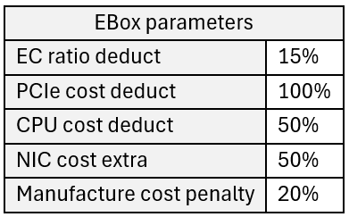

  * 其它参数复用 _[存储系统中的硬件](.)_ 章节。__单位全文统一，容量 GB，带宽 GBps，货币 \$__。
  * Other parameters reuse the _[hardware in storage systems](.)_ section. __The entire text is unified, capacity in GB, bandwidth in GBps, currency \$__.

  * __购买和能耗成本表__：下表显示采用 EBOX 后，第 0 年 1GB SSD 存储对应的各组件的购买成本和能耗成本。与 _[存储系统中的硬件](.)_ 章节中 SSD 存储成本比较，可以看到成本相仿。CPU 的购买和能耗开销下降，SSD 购买成本下降，但节省的开支被供应商制造惩罚抵消。
  * __Purchase and Energy Consumption Cost Table__: The table below shows the purchase costs and energy consumption costs of each component corresponding to 1GB SSD storage in Year 0 after adopting EBOX. Compared to the SSD storage costs in the _[Hardware in Storage Systems](.)_ section, the costs are similar. The purchase and energy expenses for the CPU have decreased, and the purchase cost of SSDs has decreased, but the savings are offset by penalties imposed by suppliers.

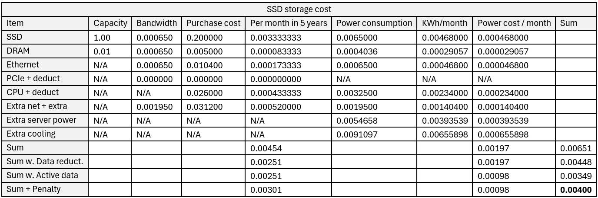

  * __购买和能耗成本比例__：下表显示采用 EBOX 后，第 0 年的购买和能耗成本中，各组分的比例。与 _[存储系统中的硬件](.)_ 章节对比，可以看到能耗占购买成本比例下降。各组件大致比例相仿，但 CPU 的购买和能耗占比下降，对应 SSD 占比上升，DRAM 占比也上升。
  * __Purchase and Energy Cost Ratio__: The table below shows the ratio of each component in the purchase and energy costs in Year 0 after adopting EBOX. Compared to the _[Hardware in Storage Systems](.)_ section, it can be seen that the proportion of energy consumption in the purchase cost has decreased. The ratios of each component are roughly similar, but the purchase and energy cost ratio of the CPU has decreased, corresponding to an increase in the ratio of SSDs and DRAM.

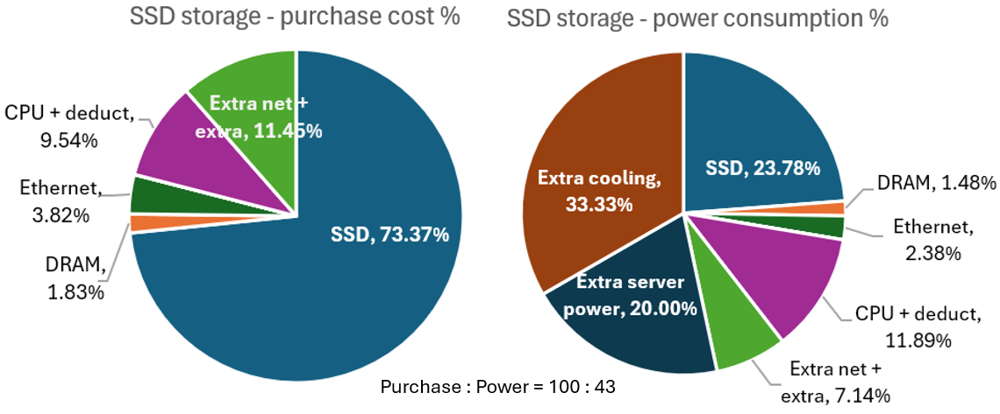

下面考虑 __未来 5 年__ 硬件的性能成本变化，以 _[存储系统中的硬件](.)_ 章节的存储成本计算作为基准，比较 EBOX 的收益。__首先展示 SSD 存储__。下图分别展示不同特性对成本的影响，纵轴是节省成本的比例（越高越好）。
The following considers the changes in performance and cost of hardware over the next 5 years, using the storage cost calculations in the section on _[hardware in storage systems](.)_ as a benchmark to compare the benefits of EBOX. __First, we present SSD storage__. The figure below shows the impact of different features on cost, with the vertical axis representing the proportion of cost savings (the higher, the better).

  * 各图例从左到右依次叠加更多特性，如 "++++ NIC cost extra" 表示开启了纠删码冗余度下降、PCIe 成本下降、CPU 成本下降、额外网卡成本，共 4 个特性（4 个 + 号）。
  * Each legend adds more features from left to right, such as "++++ NIC cost extra," which indicates the activation of reduced erasure code redundancy, reduced PCIe costs, reduced CPU costs, and additional NIC costs, totaling 4 features (4 plus signs).

  * __主要成本节省来自纠删码和 CPU__。纠删码带来了 SSD 购买成本的下降，SSD 占总体成本较高，因而收益显著。另一方面，SSD 存储的高带宽带来高 CPU 成本，因而 CPU 上的改进效果明显。
  * __The main cost savings come from erasure coding and CPU__. Erasure coding has led to a decrease in the purchase cost of SSDs, which account for a high proportion of overall costs, resulting in significant benefits. On the other hand, the high bandwidth of SSD storage brings high CPU costs, so improvements on the CPU are particularly noticeable.

  * __PCIe 替换为 Ethernet 的收益为负，但不显著__。Ethernet 成本仍然比 PCIe 高。PCIe 原本所占成本比例极小。额外网卡开销相对较小，这也是因为 Ethernet 开销原本所占成本比例相对较小。这也说明，Disaggregated 架构并不会因网络离散而引入过高的成本。
  * __The benefits of replacing PCIe with Ethernet are negative, but not significant__. The cost of Ethernet is still higher than that of PCIe. The cost proportion originally occupied by PCIe was very small. The additional network card overhead is relatively small, which is also because the overhead of Ethernet originally occupied a relatively small cost proportion. This also indicates that a disaggregated architecture does not introduce excessively high costs due to network disaggregation.

  * __总体成本节省在 20% 左右__，这需要 5 年后供应商制造成熟。5 年 20%，即年均 4% 的成本下降，可支撑多少股价上涨？结合 _[理解股价](.)_ 章节的计算，假设公司营收不变，初始利润率为 20%，则可支撑首年大致 __16% 左右的股价增长__。
  * __Overall cost savings are around 20%__, which requires the vendor to mature in 5 years. A 20% reduction over 5 years, or an average annual cost decrease of 4%, can support how much stock price increase? Combining the calculations in the _[Understanding Stock Prices](.)_ section, assuming the company's revenue remains unchanged and the initial profit margin is 20%, it can support approximately __16% stock price growth in the first year__.

  * __总成本节省比例逐年略微下降__，如果除去制造惩罚的影响，尽管下降非常轻微。主要原因是能耗占购买成本比例的上升，而纠删码冗余度下降不算进能耗节省。不能逐年下降的成本组分会逐渐增加占比，从而拖低节总节省，如 SSD 能耗、DRAM 购买成本。
  * The proportion of total cost savings has slightly decreased year by year, although the decline is very slight when excluding the impact of manufacturing penalties. The main reason is the increase in the proportion of energy consumption in purchasing costs, while the decrease in the redundancy of erasure codes does not count towards energy savings. Cost components that cannot decrease year by year will gradually increase their proportion, thereby dragging down the total savings, such as SSD energy consumption and DRAM purchasing costs.

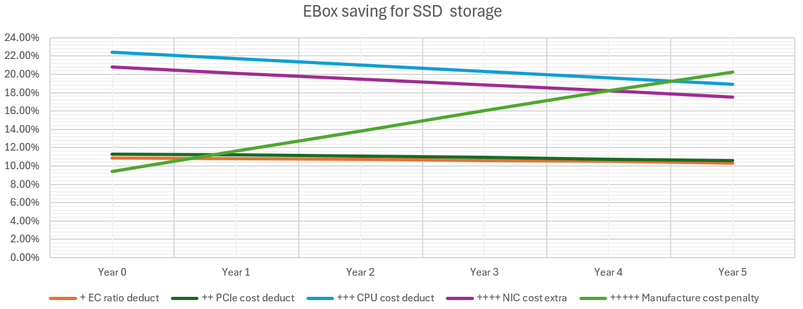

__HDD 的版本__ 类似，略过相似的图表。下面展示其未来 5 年的成本变化，以 _[存储系统中的硬件](.)_ 章节的 HDD 存储计算表作为基准，进行比较。
The version of __HDD__ is similar, skipping similar charts. Below shows the cost changes over the next 5 years, using the HDD storage calculation table in the _[hardware in storage systems](.)_ section as a benchmark for comparison.

  * __主要成本节省来自纠删码__。原因类似 SSD 存储，即使 HDD 廉价，其成本也占存储的显著比例。而 CPU 改进带来的节省不显著，因为其原本占比较小。类似地，PCIe 替换为 Ethernet 的收益不显著，额外网卡也开销不显著。
  * __The main cost savings come from erasure coding__. The reason is similar to SSD storage; even though HDDs are inexpensive, their cost still accounts for a significant proportion of storage. The savings from CPU improvements are not significant because their original proportion is small. Similarly, the benefits of replacing PCIe with Ethernet are not significant, and the additional network card costs are also not significant.

  * __PCIe 替换为 Ethernet 的收益不显著__。趋势与 SSD 存储类似。但在 HDD 存储中，PCIe 或 Ethernet 的开销更大，因为 SSD 带来的高带宽。
  * __The benefits of replacing PCIe with Ethernet are not significant__. The trend is similar to SSD storage. However, in HDD storage, the overhead of PCIe or Ethernet is greater due to the high bandwidth provided by SSDs.

  * __采用 EBOX 后，各组件成本的比例变化不大__。值得注意的是，DRAM 的购买与能耗是 HDD 存储的显著成本，但 EBOX 并未对此提供改进。
  * __After adopting EBOX, the proportion of costs for each component has not changed significantly__. It is worth noting that the purchase and energy consumption of DRAM are significant costs for HDD storage, but EBOX has not provided improvements in this regard.

  * __总体成本节省在 10% 左右__，这需要 5 年后供应商制造成熟。相比 SSD 存储，节省比例较低，原因在于 HDD 存储中 CPU 成本并不高。按相同方式换算，5 年 10% 对应年均 2% 的成本下降。可支撑首年大致 8% 左右的股价增长。
  * __Overall cost savings are around 10%__, which requires the vendor to mature in 5 years. Compared to SSD storage, the savings ratio is lower, as the CPU cost in HDD storage is not high. Converted in the same way, 10% over 5 years corresponds to an annual cost reduction of 2%. This can support a stock price increase of approximately 8% in the first year.

可以看到，对于 SSD 存储，EBOX 有不错的收益。最有效的改进来自于纠删码和 CPU。意料之外的是，Ethernet 替换 PCIe 并没有太多收益，EBOX 分离引入的额外网络成本也不高。
It can be seen that EBOX has good returns for SSD storage. The most effective improvements come from erasure codes and CPU. Unexpectedly, replacing PCIe with Ethernet does not yield much benefit, and the additional network costs introduced by EBOX separation are not high.

### 研发成本的摊薄  ### Dilution of R&D Costs

继续前文，下一个问题是，EBOX 需要多少研发成本？EBOX 需要销售多少 PB 的存储以摊薄其成本？首先，可以合理推测 __成本相关的参数__：
Continuing from the previous text, the next question is, how much R&D cost does EBOX need? How much PB of storage does EBOX need to sell to amortize its costs? First, it is reasonable to speculate on the __cost-related parameters__:

  * 单位 GB 的存储成本数据来自 _[存储系统中的硬件](.)_ 章节的计算。这个成本是较低的，参考此章节的公有云存储的售价对比，下面按 10x 设置销售价格（markup）。
  * The storage cost data per unit GB comes from the calculations in the _[hardware in storage systems](.)_ section. This cost is lower, and referring to the price comparison of public cloud storage in this section, the sales price is set at a 10x markup below.

  * 从不同国家雇佣开发者的大致月薪数据来自互联网，以美国最高。可以假设开发 EBOX 同时维持原产品运转需要 200 人。相比月薪，公司需付出 2x 的雇佣成本。
  * The approximate monthly salary data for hiring developers from different countries comes from the internet, with the highest in the United States. It can be assumed that developing EBOX while maintaining the operation of the original product requires 200 people. Compared to the monthly salary, the company needs to pay 2x the hiring cost.

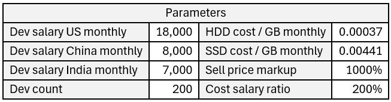

这个规模的研发团队需要销售多少 PB 的存储以 __足够支付自己的月薪__ 呢？这可以被计算出来，见下图：
How many PB of storage does a research and development team of this scale need to sell to be able to pay their own monthly salaries? This can be calculated, see the figure below:

  * 以最贵的美国雇佣为例，__销售 HDD 存储需要达到约 1.8K PB__。而销售 SSD 存储利润较好，只需约 1/10x PB 即可支付薪水。
  * Taking the most expensive American employment as an example, __selling HDD storage needs to reach about 1.8K PB__. In contrast, selling SSD storage has better profits, requiring only about 1/10x PB to pay salaries.

  * 如果从其它国家雇佣，有希望立即将 __所需销售的存储 PB 削减一半__，而另一半将变为利润。可见跨国雇佣有巨大的潜在收益。
  * If hiring from other countries, there is hope to immediately reduce the __required sales of storage PB by half__, while the other half will turn into profit. It is evident that multinational hiring has huge potential benefits.

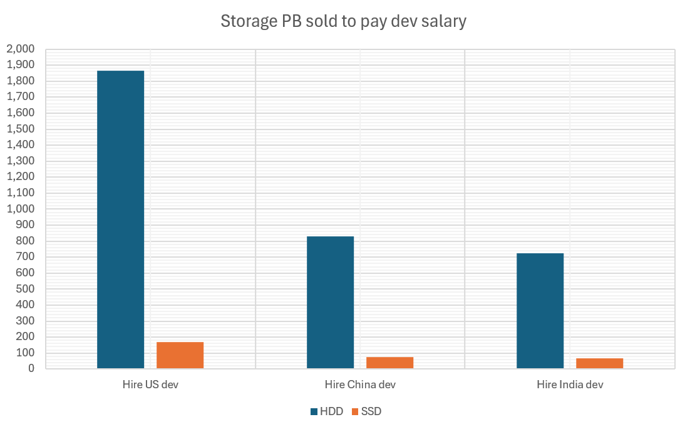

一个有趣的发现是，996 可以显著提升员工产出，从而削减员工数量，减少开支。见下图。当然，后文分析仍然是以正常工作时间制为准（周 40 小时）。
An interesting finding is that 996 can significantly enhance employee output, thereby reducing the number of employees and cutting costs. See the figure below. Of course, the subsequent analysis is still based on the normal working hours system (40 hours a week).

  * 一周 40 小时工作制下，__实际开发产出只有 40 小时的 31%__。这是因为开发工作的固定成本很高，例如已有 20% 时间用于开会，20% 时间用于运维和故障修复，20% 时间用于学习。此外，公共假日和带薪年假也占用约 9% 时间。
  * Under a 40-hour work week, __the actual development output is only 31% of the 40 hours__. This is because the fixed costs of development work are very high, for example, 20% of the time is spent in meetings, 20% of the time is spent on operations and troubleshooting, and 20% of the time is spent on learning. In addition, public holidays and paid annual leave also account for about 9% of the time.

  * 相对于 40 小时工作制，__996 工作制可迅速将产出提高到 2.6 倍__，对应每周工作 60 小时。这是因为额外加入的工作时间不改变固定成本，直接转变为开发产出，边际效应显著。这里没有考虑长期 996 造成的疲乏。
  * Compared to the 40-hour work system, the __996 work system can quickly increase output to 2.6 times__, corresponding to a 60-hour work week. This is because the additional working hours do not change fixed costs and directly translate into development output, with significant marginal effects. Long-term fatigue caused by 996 is not considered here.

  * 更加激进的是 早7-晚10-7天 工作制，可将产出进一步提高到 5 倍，对应每周工作 90 小时。这允许资金紧张的 Startup 显著压缩成本，等待后期规模的回报。注意，__每周工作 90 小时是 SpaceX 的常见水准__ [[63]](.)。
  * More radical is the 7am to 10pm, 7 days a week work schedule, which can further increase output to 5 times, corresponding to 90 hours of work per week. This allows cash-strapped startups to significantly reduce costs while waiting for returns from later scaling. Note that __working 90 hours a week is a common standard at SpaceX__ [[63]](.)

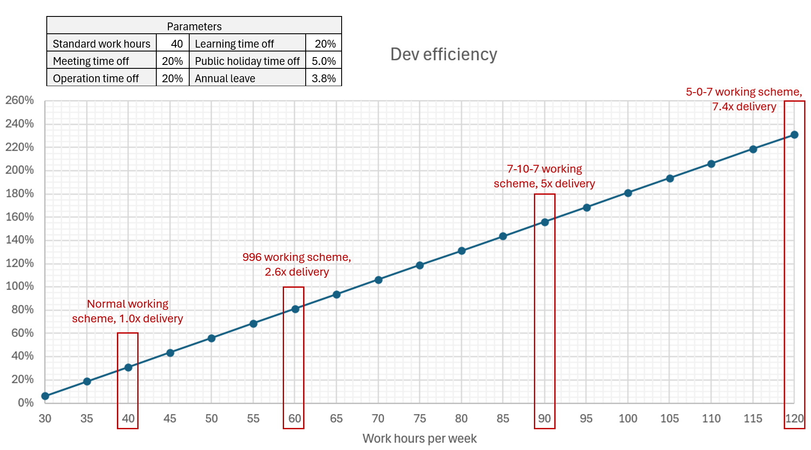

随着销售的存储规模增长，研发成本如何摊薄呢？下图展示随销售存储 PB 增长，__营收的变化__。单位是 \$M，周期是年度。
As the scale of storage sales grows, how can R&D costs be diluted? The chart below shows the changes in __revenue__ as sales storage PB increases. The unit is \$M, and the period is annual.

  * 随着销售存储 PB 增长，营收增长呈 __线性__，一分钱一分货。同样的销售存储 PB，SSD 的营收约为 HDD 的 __十倍__。
  * With the growth of sales storage PB, revenue growth is __linear__, you get what you pay for. For the same sales storage PB, the revenue from SSD is about __ten times__ that of HDD.

  * 如果营收过 __\$1B__，HDD 需销售约 __20K PB__ 存储，SSD 需销售约 __2K PB__ 存储。如果营收过 \$10B，HDD 需销售约 200K PB 存储，SSD 需销售约 20K PB 存储。
  * If revenue exceeds \$1B, HDD needs to sell about 20K PB of storage, and SSD needs to sell about 2K PB of storage. If revenue exceeds \$10B, HDD needs to sell about 200K PB of storage, and SSD needs to sell about 20K PB of storage.

  * 对于全球约 \$160B 的云存储市场大小 [[46]](.)，可以推测，__\$1B__ 对应小型公有云水准，约 __1%__ 全球份额。\$10B 对应顶级公有云水准，约 10% 全球份额。
  * For the global cloud storage market size of approximately \$160B, it can be inferred that \$1B corresponds to a small public cloud level, about 1% of the global share. \$10B corresponds to a top public cloud level, about 10% of the global share.

下面是关键，__净利润率__ 如何随着销售的存储 PB 变化？净利润率由营收扣除存储成本和研发成本计算。下面的计算以人力成本最贵的美国雇佣为例。下图中，可以看到剧烈的规模效应。
The key is how the __net profit margin__ changes with the sales storage PB. The net profit margin is calculated by subtracting storage costs and R&D costs from revenue. The following calculation takes the example of hiring in the United States, where labor costs are the highest. In the figure below, you can see the dramatic scale effect.

  * __何时开始盈利__。HDD 存储销售超过 2K PB 的临界点时开始盈利，SSD 则只需超过 200PB。尽管销售规模较小时，受研发成本拖累，亏损严重。HDD 亏损甚至能到约 -700%，SSD 能到约 -60% 。
  * __When to start making a profit__. HDD storage starts to be profitable when sales exceed the critical point of 2K PB, while SSD only needs to exceed 200 PB. Despite the smaller sales scale, heavy losses are incurred due to R&D costs. HDD losses can even reach about -700%, while SSD can reach about -60%.

  * __超过临界点后，不仅营收上涨，净利润率也迅速上涨__，这是极好的规模效应。普通业务往往在营收上涨的同时，净利润率下降。
  * After exceeding the critical point, not only does revenue increase, but the net profit margin also rises rapidly, which is an excellent scale effect. Ordinary businesses often see a decrease in net profit margin while revenue increases.

  * __净利润率迅速上涨到 90%__。这是极为赚钱的业务水准。通常的经验是，制造业的净利润率在 5% 左右，尖端制造能到 15%~20%，优秀的软件业务可以达到 30% [[47]](.)。
  * __The net profit margin has rapidly risen to 90%__. This is an extremely profitable business level. The usual experience is that the net profit margin in manufacturing is around 5%, cutting-edge manufacturing can reach 15% to 20%, and excellent software businesses can achieve 30% [[47]](.).

  * __净利润率达到 80%~90% 只需约 \$1B 营收__。结合上一段，__\$1B__ 营收对应约 __1%__ 全球份额，小型公有云供应商。这意味着超高利润的规模效应，实际上并不要求很大的规模。而 10% 全球份额的顶级公有云供应商，可以稳赚巨大营收和极高净利润率。
  * __Net profit margin reaches 80%~90% with only about \$1B in revenue__. Combined with the previous paragraph, __\$1B__ in revenue corresponds to about __1%__ of the global market share for small public cloud providers. This means that the super high profit scale effect does not actually require a large scale. Meanwhile, top public cloud providers with a 10% global market share can earn huge revenue and extremely high net profit margins.

  * __净利润率对成本不敏感__。下图额外展示了研发成本 X2、X4 后的净利润率。可以看到，具有一定规模后，翻倍的研发成本几乎不影响净利润率，后者仍然保持在 80%~90% 。业务非常健壮。
  * __Net profit margin is not sensitive to costs__. The chart below additionally shows the net profit margin after R&D costs are doubled to X2 and X4. It can be seen that after reaching a certain scale, doubling the R&D costs has almost no impact on the net profit margin, which remains at 80% to 90%. The business is very robust.

可以看到，对于具有一定规模的存储业务，负担 EBOX 的研发成本是足够的，甚至有余。当然，本文的分析相比实际作了许多简化，力求简单清晰，表明思路。
It can be seen that for storage businesses of a certain scale, bearing the R&D costs of EBOX is sufficient, even surplus. Of course, the analysis in this article simplifies many aspects compared to reality, striving for simplicity and clarity to convey the thought process.

### 供应商和市场  ### Vendors and Market

Strategic 思考意味着不仅思考存储方自身，也思考对方一侧，这里是销售 EBOX 的供应商。成功的云存储策略需要供应商配合，尤其是新型硬件。假设供应商原本销售硬盘给公有云，本节的问题是，从供应商角度，供应商是否应该推出 EBOX 新产品销售？
Strategic thinking means not only considering the storage side itself but also the other side, which is the vendors selling EBOX. A successful cloud storage strategy requires cooperation from vendors, especially with new hardware. Assuming the vendor originally sold hard drives to public clouds, the question in this section is whether the vendor should launch new EBOX products for sale from the vendor's perspective.

作为思考的基础，可以借用 __Issue Tree Framework__（见前文 _[分析方法](.)_ 章节），将问题分解：
As a basis for thinking, we can borrow the __Issue Tree Framework__ (see the previous _[Analysis Methods](.)_ section) to decompose the problem:

  * 市场需求
    * 公有云需求
    * 竞争性产品
  * Market demand * Public cloud demand * Competitive products

  * 产品可行性
    * 技术可行性
    * 制造可行性
  * Product feasibility * Technical feasibility * Manufacturing feasibility

  * 财务能力
    * 潜在营收
    * 研发成本
  * Financial capability * Potential revenue * R&D costs

  * 风险
    * 客户采用
    * 供应链
  * Risk * Customer adoption * Supply chain

首先看 __市场需求__ 方面：  First, let's look at the __market demand__ aspect:

  * 从前文分析来看，可以和公有云联合生产设计，从而确保需求。公有云方有意通过 EBOX 获取成本优势，寻找供应商。
  * From the analysis above, it can be designed in conjunction with public cloud to ensure demand. The public cloud side intends to obtain cost advantages through EBOX and seek suppliers.

  * 如果抢先推出产品，则有利于超过竞争对手，扩大现有市场占有率。而公有云更可能大批量采购。
  * If products are launched ahead of time, it is beneficial to surpass competitors and expand the existing market share. Public clouds are more likely to make bulk purchases.

  * 从售卖硬盘到售卖 EBOX 整机，扩大了销售范围，有利于提高营收，以及附加利润。
  * From selling hard drives to selling EBOX complete systems, the sales range has expanded, which is beneficial for increasing revenue and additional profits.

然后看 __产品可行性__ 方面：  Then look at the aspect of __product feasibility__:

  * 技术可行性方面，EBOX 类似简化定制的服务器，并不是全新技术，关键在有整合和控制成本，具有可行性。
  * In terms of technical feasibility, EBOX is similar to a simplified custom server and is not a brand new technology; the key lies in integration and cost control, making it feasible.

  * 制造方面，前期因不成熟引入额外成本，但可以通过售价转嫁。前文的计算可以看出，公有云方能够接受此价格的制造惩罚。
  * In manufacturing, the initial immaturity incurs additional costs, but these can be passed on through the selling price. The calculations mentioned earlier show that the public cloud side can accept this price penalty in manufacturing.

接下来看 __财务能力__ 方面：  Next, let's look at __financial capability__ aspects:

  * 前提提到云存储市场规模 \$160B ，数据表中硬盘约占 80% 成本，假设供应商现已占有 10% 市场份额。则供应商的 __当前营收约为 \$13B__。
  * The premise mentions that the cloud storage market size is \$160B, with hard drives accounting for about 80% of the cost in the data table. Assuming the supplier currently holds a 10% market share, the supplier's __current revenue is approximately \$13B__.

  * 抢先推出 EBOX 产品可扩大市场占有率。假设市场占有率从 10% 增长到到 20%，则 __营收增长为约 \$26B__。
  * Launching the EBOX product ahead of competitors can expand market share. Assuming market share increases from 10% to 20%, then __revenue growth would be approximately \$26B__.

  * 从售卖硬盘到售卖 EBOX，扩大了销售范围，进一步提高营收。从前文数据表中估算，营收提高在 13% 左右，__营收进一步增长为约 \$29B__。
  * From selling hard drives to selling EBOX, the sales range has expanded, further increasing revenue. Based on the previous data table, the revenue increase is estimated to be around 13%, __with revenue further growing to approximately \$29B__.

  * 相比售卖硬盘，EBOX 更复杂，可提供更高的附加利润。假设净利润率从原先的 10% 提搞到 12%。供应商的 __净利润从约 \$1.3B 增长为约 \$3.5B__。
  * Compared to selling hard drives, EBOX is more complex and can provide higher additional profits. Assuming the net profit margin increases from the original 10% to 12%. The supplier's __net profit grows from about \$1.3B to about \$3.5B__.

  * 从 \$1.3B 到 \$3.5B，净利润增长为 270%。假如该增长发生在 10 年间，结合 _[理解股价](.)_ 章节的计算，可支持 __平均每年 10% 的股价增长__。收益良好。
  * From \$1.3B to \$3.5B, net profit growth is 270%. If this growth occurs over 10 years, combined with the calculations in the _[Understanding Stock Prices](.)_ section, it can support __an average annual stock price growth of 10%__. The earnings are good.

  * 研发成本方面，公有云带来的大批量采购能够摊薄成本。并且，EBOX 不是全新技术，其成本大头的硬盘是供应商经验成熟的领域。即使 200 人的研发成本，利用前文数据表计算，也 __只占 \$13B 的不到 1%__ 。
  * In terms of R&D costs, the large-scale procurement brought by public cloud can dilute costs. Moreover, EBOX is not a brand new technology; the main cost, hard drives, is a field where suppliers have mature experience. Even with an R&D cost for 200 people, calculated using the data table mentioned earlier, it __accounts for less than 1% of \$13B__.

最后是 __风险__ 方面：  Finally, in terms of __risk__:

  * 公有云是否愿意持续大批量采购 EBOX 产品是一大风险。从供应商角度，最好避免绑定大客户，同时也向私有云销售 EBOX，并根据实际营收逐步提高投入。
  * Whether public clouds are willing to continue large-scale procurement of EBOX products is a significant risk. From the supplier's perspective, it is best to avoid being tied to large customers, while also selling EBOX to private clouds and gradually increasing investment based on actual revenue.

  * EBOX 相比单纯售卖硬盘多出许多组件，其中 CPU 占第二大硬件成本。可从较通用的如 ARM CPU 开始推出产品，在之后几代才考虑更定制化的 DPU 或专用芯片。可以在“允许定制”之名下，把软件成本转嫁给公有云客户。
  * EBOX has many more components compared to simply selling hard drives, with the CPU being the second largest hardware cost. Products can start with more general options like ARM CPUs, and only consider more customized DPUs or dedicated chips in later generations. Under the guise of "allowing customization," software costs can be passed on to public cloud customers.

通过以上浅显的分析，可以看出从供应商角度也能从推出 EBOX 产品中获利，甚至收益良好。
Through the above simple analysis, it can be seen that from the supplier's perspective, there can also be profits from launching the EBOX product, and even good returns.

## 总结  ## Summary

全文完。本文在（云）存储的技术和行业背景下，依次讲解 __方法论__，__理解股价__，__市场__，__市场的分析__，__硬件__，__EBOX 案例分析__。方法论部分搭建 Vision 与 Strategy 的思考框架。股价部分分析其原理，理解公司的目标，并映射到团队。市场部分纵览存储系统的竞争格局，并分析市场的关键特性、颠覆式创新、以及价值。硬件部分建模其能力和发展速度，深入观察其要点。最后，案例分析部分用 EBOX 实例实践本文的分析方法，有许多有趣的结论。
The full text is complete. This article explains the __methodology__, __understanding stock prices__, __market__, __market analysis__, __hardware__, and __EBOX case study__ in the context of (cloud) storage technology and industry background. The methodology section builds a thinking framework for Vision and Strategy. The stock price section analyzes its principles, understands the company's goals, and maps them to the team. The market section provides an overview of the competitive landscape of storage systems and analyzes the key characteristics, disruptive innovations, and value of the market. The hardware section models its capabilities and development speed, delving into its key points. Finally, the case study section practices the analysis methods of this article using the EBOX example, leading to many interesting conclusions.

## 引用  ## Quote

[1] Hard Drive Performance Over the Years : https://goughlui.com/the-hard-disk-corner/hard-drive-performance-over-the-years/

[2] Disk Prices: https://diskprices.com/

[3] Enterprise SSDs cost ten times more than nearline disk drives : https://blocksandfiles.com/2020/08/24/10x-enterprise-ssd-price-premium-over-nearline-disk-drives/
Enterprise SSDs cost ten times more than nearline disk drives: https://blocksandfiles.com/2020/08/24/10x-enterprise-ssd-price-premium-over-nearline-disk-drives/

[4] Next-generation Information Technology Systems for Fast Detectors in Electron Microscopy : https://arxiv.org/ftp/arxiv/papers/2003/2003.11332.pdf

[5] SSDs Have Become Ridiculously Fast, Except in the Cloud : https://databasearchitects.blogspot.com/2024/02/ssds-have-become-ridiculously-fast.html

[6] A Modern Primer on Processing in Memory : https://arxiv.org/pdf/2012.03112

[7] Wikipedia DDR SDRAM : https://en.wikipedia.org/wiki/DDR_SDRAM

[8] Trends in DRAM price per gigabyte : https://aiimpacts.org/trends-in-dram-price-per-gigabyte/

[9] Bandwidth and latency of DRAM and HBM : https://www.researchgate.net/figure/Bandwidth-and-latency-of-DRAM-and-HBM-and-the-impact-of-latency-on-application_fig2_329551516

[10] High-bandwidth memory (HBM) options for demanding compute : https://www.embedded.com/high-bandwidth-memory-hbm-options-for-demanding-compute/

[11] Wikipedia High Bandwidth Memory : https://en.wikipedia.org/wiki/High_Bandwidth_Memory

[12] More Than Anything Else, Cost Per Bit Drives Datacenter Ethernet : https://www.nextplatform.com/2021/08/30/more-than-anything-else-cost-per-bit-drives-datacenter-ethernet/

[13] Wikipedia PCI Express : https://en.wikipedia.org/wiki/PCI_Express

[14] Quora Motherboard price changed over time : https://www.quora.com/How-has-the-cost-of-CPUs-on-motherboards-changed-over-time-Is-there-a-significant-difference-in-their-usage

[15] Quora What is the latency of a PCIe connection : https://www.quora.com/What-is-the-latency-of-a-PCIe-connection

[16] Wikipedia NVLink : https://en.wikipedia.org/wiki/NVLink

[17] Doubling of Data Center Ethernet Switch Bandwidth Every Two Years : https://www.prnewswire.com/news-releases/doubling-of-data-center-ethernet-switch-bandwidth-every-two-years-continued-in-2022-reports-crehan-research-301793556.html
[17] Doubling of Data Center Ethernet Switch Bandwidth Every Two Years: https://www.prnewswire.com/news-releases/doubling-of-data-center-ethernet-switch-bandwidth-every-two-years-continued-in-2022-reports-crehan-research-301793556.html

[18] Timed Linux Kernel Compilation: https://openbenchmarking.org/test/pts/build-linux-kernel-1.16.0

[19] 2019 recent trends in Geekbench score per CPU price : https://aiimpacts.org/2019-recent-trends-in-geekbench-score-per-cpu-price/

[20] NVIDIA A100 GPU Benchmarks for Deep Learning : https://lambdalabs.com/blog/nvidia-a100-gpu-deep-learning-benchmarks-and-architectural-overview?srsltid=AfmBOoqh1Spj-txULhl0GTfLiqVJ2A_G-Sv3mCNiPC5UC2fnpuWI9o9s
[20] NVIDIA A100 GPU Benchmarks for Deep Learning: https://lambdalabs.com/blog/nvidia-a100-gpu-deep-learning-benchmarks-and-architectural-overview?srsltid=AfmBOoqh1Spj-txULhl0GTfLiqVJ2A_G-Sv3mCNiPC5UC2fnpuWI9o9s

[21] Trends in GPU Price-Performance : https://epoch.ai/blog/trends-in-gpu-price-performance

[22] Scality claims disk drives can use less electricity than high-density SSDs : https://blocksandfiles.com/2023/08/08/scality-disk-drives-ssds-electricity/
[22] Scality claims disk drives can use less electricity than high-density SSDs: https://blocksandfiles.com/2023/08/08/scality-disk-drives-ssds-electricity/

[23] Wikipedia Solid-state drive : https://en.wikipedia.org/wiki/Solid-state_drive

[24] GreenDIMM: OS-assisted DRAM Power Management for DRAM with a Sub-array Granularity Power-Down State : https://dl.acm.org/doi/fullHtml/10.1145/3466752.3480089

[24] ChatGPT Datacenter Networking Device Consuming Power Watt: https://chatgpt.com/share/676e8a82-bbf4-800f-8859-b34f22f95fee

[25] Gigabyte Server "Power Consumption" Roadmap Points To 600W CPUs & 700W GPUs By 2025 : https://wccftech.com/gigabyte-server-power-consumption-roadmap-points-600w-cpus-700w-gpus-by-2025/

[26] CPU, GPU and MIC Hardware Characteristics over Time : https://www.karlrupp.net/2013/06/cpu-gpu-and-mic-hardware-characteristics-over-time/

[27] Understanding the Energy Consumption of Dynamic Random Access Memories : https://www.seas.upenn.edu/~leebcc/teachdir/ece299_fall10/Vogelsang10_dram.pdf

[28] AMD Dives Deep On High Bandwidth Memory - What Will HBM Bring AMD : https://www.anandtech.com/show/9266/amd-hbm-deep-dive/4

[29] Reddit HBM cost and CPU memory cost comparison : https://www.reddit.com/r/chipdesign/comments/166thgi/hbm_cost_and_cpu_memory_cost_comparison/

[30] Compute Express Link (CXL): All you need to know : https://www.rambus.com/blogs/compute-express-link/

[31] Instructions/clock-cycle for each core of Intel Xeon CPUs compared with FLOPs/clock-cycle of Nvidia high-performance GPUs : https://www.researchgate.net/figure/nstructions-clock-cycle-for-each-core-of-Intel-Xeon-CPUs-compared-with-FLOPs-clock-cycle_fig6_319072296

[32] Google Data Centers Efficiency : https://www.google.com/about/datacenters/efficiency/

[33] Global PUEs — are they going anywhere? : https://journal.uptimeinstitute.com/global-pues-are-they-going-anywhere/

[34] Component-wise energy consumption of a server : https://www.researchgate.net/figure/Component-wise-energy-consumption-of-a-server-23-24_fig5_355862079

[35] Azure Blob Storage pricing : https://azure.microsoft.com/en-us/pricing/details/storage/blobs/

[36] Seagate Plans To HAMR WD's MAMR; 20TB HDDs With Lasers Inbound : https://www.tomshardware.com/news/seagate-wd-hamr-mamr-20tb,35821.html

[37] Using SSD data placement to lessen SSD write amplification : https://blocksandfiles.com/2023/08/14/using-ssd-data-placement-to-lessen-write-amplification/

[38] Big Data: The 3 Vs explained : https://www.bigdataldn.com/en-gb/blog/data-engineering-platforms-architecture/big-data-the-3-vs-explained.html

[39] Intel Data Direct I/O Technology : https://www.intel.com/content/www/us/en/io/data-direct-i-o-technology.html

[40] Declarative IO - Cluster Storage Systems Need Declarative I/O Interfaces : https://youtube.com/watch?v=TGWKZnJeNmA&si=AC6gaUtfnPjIt_vB

[41] CPU open IPC_benchmark : https://openbenchmarking.org/test/pts/ipc-benchmark&eval=a29a620e89e1cb4ff15d5d31d24eaae1cc059b0e

[42] zStorage 分布式存储技术：总结2023，展望2024 : https://mp.weixin.qq.com/s/uXH8rkeJL_JMbKT3H9ZuCQ
[42] zStorage Distributed Storage Technology: Summary of 2023, Outlook for 2024: https://mp.weixin.qq.com/s/uXH8rkeJL_JMbKT3H9ZuCQ

[43] Vast Data white paper : https://www.vastdata.com/whitepaper/#TheDisaggregatedSharedEverythingArchitecture

[44] NVMe Over Fabrics Architectures for Disaggregated Storage : https://www.snia.org/sites/default/files/ESF/Security-of-Data-on-NVMe-over-Fabrics-Final.pdf#page=25

[45] Network Attached Storage and NFS-eSSD : https://msstconference.org/MSST-history/2023/FlynnPresentation2.pdf#page=7

[46] Fortune Cloud Storage Market Size, Share & Industry Analysis : https://www.fortunebusinessinsights.com/cloud-storage-market-102773

[47] Margins by Sector (US) : https://pages.stern.nyu.edu/~adamodar/New_Home_Page/datafile/margin.html

[48] MSFT (Microsoft) Preferred Stock : https://www.gurufocus.com/term/preferred-stock/MSFT

[49] Stock Analysis MSFT stock analysis : https://stockanalysis.com/stocks/msft/statistics/

[50] Trading Economics United States 30 Year Bond Yield : https://tradingeconomics.com/united-states/3-month-bill-yield

[51] Investing.com Microsoft corp historical dividends : https://in.investing.com/equities/microsoft-corp-dividends

[52] Jacob 从3年后的EPS看，现在的微软是否值得介入 : https://mp.weixin.qq.com/s/IU03qeV53bcK75U-sfRMGg
[52] Jacob looks at Microsoft's EPS three years from now to see if it is worth getting involved now: https://mp.weixin.qq.com/s/IU03qeV53bcK75U-sfRMGg

[53] Wikipedia Beta系数 : https://zh.wikipedia.org/wiki/Beta%E7%B3%BB%E6%95%B0
[53] Wikipedia Beta Coefficient: https://zh.wikipedia.org/wiki/Beta%E7%B3%BB%E6%95%B0

[54] Equity Risk Premium (ERP) : https://www.wallstreetprep.com/knowledge/equity-risk-premium/

[55] Capital Asset Pricing Model (CAPM) : https://www.wallstreetprep.com/knowledge/capm-capital-asset-pricing-model/

[56] Investing.com S&P 500 : https://in.investing.com/indices/us-spx-500

[57] TradingView US companies with the highest dividend yields : https://www.tradingview.com/markets/stocks-usa/market-movers-high-dividend/

[58] Microsoft Cloud strength fuels third quarter results : https://news.microsoft.com/2024/04/25/microsoft-cloud-strength-fuels-third-quarter-results-3/

[59] Gartner Magic Quadrant for Primary Storage Platforms 2024 : https://www.purestorage.com/resources/gartner-magic-quadrant-primary-storage.html

[60] Fortune Data Storage Market Size, Share & Industry Analysis : https://www.fortunebusinessinsights.com/data-storage-market-102991

[61] Key Insights for Gartner Magic Quadrant 2024 for Strategic Cloud Platforms : https://alnafitha.com/blog/key-insights-from-gartner-magic-quadrant-2024-for-cloud/
[61] Key Insights for Gartner Magic Quadrant 2024 for Strategic Cloud Platforms: https://alnafitha.com/blog/key-insights-from-gartner-magic-quadrant-2024-for-cloud/

[62] Gartner Cloud Integrated IaaS and PaaS Solution Scorecard Comparison 2021 : https://clouddecisions.gartner.com/a/scorecard/#/iaas-alibaba-vs-aws-vs-google-vs-ibm-vs-azure-vs-oracle
[62] Gartner Cloud Integrated IaaS and PaaS Solution Scorecard Comparison 2021 : https://clouddecisions.gartner.com/a/scorecard/#/iaas-alibaba-vs-aws-vs-google-vs-ibm-vs-azure

[63] Quora What is it like to work at SpaceX? : https://www.quora.com/What-is-it-like-to-work-at-SpaceX

[64] Gartner Critical Capabilities for Primary Storage 2023 : https://mp.weixin.qq.com/s/O5j1nNt3cqQT6RmG7wEy_g

[65] RackTop The Buyer's Guide to Cyberstorage Features : https://www.racktopsystems.com/the-buyers-guide-to-cyberstorage-features/

[66] Gartner Top Trends in Enterprise Data Storage 2023 : https://www.purestorage.com/resources/type-a/gartner-top-trends-enterprise-data-storage-2023.html

[67] 6家存储系统公司的客户反馈 : https://mp.weixin.qq.com/s/Ri6pdeJ5-82pHBaGz-wlKw
[67] Customer feedback from 6 storage system companies: https://mp.weixin.qq.com/s/Ri6pdeJ5-82pHBaGz-wlKw

[68] 湖南省省级电子政务外网统一云平台资源补充项目 : https://mp.weixin.qq.com/s/S4-2XbFDp6qB-8S01qSEEw
[68] Hunan Provincial Level E-Government External Network Unified Cloud Platform Resource Supplement Project: https://mp.weixin.qq.com/s/S4-2XbFDp6qB-8S01qSEEw

[69] 西瓜哥 Gartner Hype Cycle for Storage Technologies 2024 : https://mp.weixin.qq.com/s/Ct5bq_QsF7Tu_r6bvqUSFg
[69] Watermelon Brother Gartner Hype Cycle for Storage Technologies 2024 : https://mp.weixin.qq.com/s/Ct5bq_QsF7Tu_r6bvqUSFg

[70] SmartX Hype Cycle for Storage and Data Protection Technologies, 2022 : https://www.smartx.com/blog/2022/08/gartner-hype-cycle-storage/

[71] 深度数据云 Gartner Hype Cycle for Data Management, 2023 : https://zhuanlan.zhihu.com/p/656920047
[71] Deep Data Cloud Gartner Hype Cycle for Data Management, 2023: https://zhuanlan.zhihu.com/p/656920047

[72] MarketResearchFuture Data Backup And Recovery Market Overview : https://www.marketresearchfuture.com/reports/data-backup-recovery-market-29073

[73] GrandViewResearch Enterprise Information Archiving Market Size : https://www.grandviewresearch.com/industry-analysis/enterprise-information-archiving-market-report

[74] Gartner Magic Quadrant for Enterprise Backup and Recovery Software Solutions : https://www.zen.com.my/wp-content/uploads/2024/01/Backup-Vendor-Magic-Quadrant-2023-1-1.pdf

[75] Veeam, Rubrik Lead in Enterprise Backup/Recovery Report : https://virtualizationreview.com/articles/2024/08/09/veeam-rubrik-lead-in-enterprise-backup-recovery-market-report.aspx

[76] Disaster Recovery with Cloud Recovery Assurance : https://www.appranix.com/resources/blogs/2023/07/disaster-recovery-with-cloud-recovery-assurance.html

[77] Gartner Magic Quadrant for File and Object Storage Platforms 2024 : https://www.purestorage.com/resources/gartner-magic-quadrant-file-object-storage-platforms.html

[78] VMR Global Distributed File Systems and Object Storage Solutions Market By Type : https://www.verifiedmarketreports.com/product/distributed-file-systems-and-object-storage-solutions-market/

[79] MarketResearchFuture Global Cloud Object Storage Market Size : https://www.marketresearchfuture.com/reports/cloud-object-storage-market-4202

[80] Nasui Types & Volume of Files in the Enterprise : https://youtu.be/8FHihZvyFFM?si=KbiVDWqHfStLMiZU&t=330

[81] VMR Global Block Storage Software Market By Type : https://www.verifiedmarketreports.com/product/block-storage-software-market/
VMR Global Block Storage Software Market By Type: https://www.verifiedmarketreports.com/product/block-storage-software-market/

[82] GrandViewResearch Database Management System Market Size : https://www.grandviewresearch.com/industry-analysis/database-management-systems-dbms-market

[83] GrandViewResearch Cloud Database And DBaaS Market Size : https://www.grandviewresearch.com/industry-analysis/cloud-database-dbaas-market-report

[84] Gartner Magic Quadrant for Cloud Database Management Systems 2024 : https://www.databricks.com/resources/analyst-paper/databricks-named-leader-by-gartner

[85] MarketResearchFuture Enterprise Flash Storage Market Overview : https://www.marketresearchfuture.com/reports/enterprise-flash-storage-market-31294

[86] MarketResearchFuture Tape Storage Market Overview : https://www.marketresearchfuture.com/reports/tape-storage-market-33976
[86] MarketResearchFuture Tape Storage Market Overview: https://www.marketresearchfuture.com/reports/tape-storage-market-33976

[87] MarketResearchFuture Global Hard Disk Market Overview : https://www.marketresearchfuture.com/reports/hard-disk-market-8306

[88] MBA智库 波特五力分析模型 : https://wiki.mbalib.com/wiki/%E6%B3%A2%E7%89%B9%E4%BA%94%E5%8A%9B%E5%88%86%E6%9E%90%E6%A8%A1%E5%9E%8B
[88] MBA Think Tank Porter's Five Forces Analysis Model: https://wiki.mbalib.com/wiki/%E6%B3%A2%E7%89%B9%E4%BA%94%E5%8A%9B%E5%88%86%E6%9E%90%E6%A8%A1%E5%9E%8B

[89] Zartbot DPU及网络处理器的历史 : https://mp.weixin.qq.com/s/BZOvVrg3GtTurMe2Q6ZIcg
[89] The history of Zartbot DPU and network processors: https://mp.weixin.qq.com/s/BZOvVrg3GtTurMe2Q6ZIcg

[90] Andy730 颠覆性创新？存储界已有所耳闻 : https://mp.weixin.qq.com/s/NFQYEwrYCwKvTjpQdLkcQA
[90] Andy730 Disruptive Innovation? The storage industry has already heard of it: https://mp.weixin.qq.com/s/NFQYEwrYCwKvTjpQdLkcQA

[91] LinkedIn Course Critical Thinking by Mike Figliuolo : https://www.linkedin.com/learning/critical-thinking

[92] Profitability Framework and Profit Trees The Complete Guide : https://www.craftingcases.com/profitability-tree-guide/

[93] LinkedIn Course Strategic Thinking by Dorie Clark : https://www.linkedin.com/learning/strategic-thinking

[94] LinkedIn Course Business Acumen by Mike Figliuolo : https://www.linkedin.com/learning/developing-business-acumen

[95] GetAbstract The Unspoken Truths for Career Success : https://www.getabstract.com/en/summary/the-unspoken-truths-for-career-success/46904

[96] LinkedIn Course Management Foundation by Kevin Eikenberry : https://www.linkedin.com/learning/management-foundations-2019
