AI 的发展速度超乎想象。例如 __VS Code Copilot Agent__ [[1]](.)，可以快速阅读大量代码，理解主要组件和交互，甚至绘制类图、流程图，实在是研究开源项目的利器。本文用它阅读 DeepSeek 3FS [[2]](.) 的代码，生成讲解。后文 __皆由 AI 生成__，包括绘图。

# 1. 引言

DeepSeek 3FS 是一个高性能、AI 原生的分布式文件系统，旨在满足大规模模型训练和推理的苛刻 I/O 模式。与传统存储系统不同，它以 AI 优先的方式重新构想存储堆栈——优化张量数据、并行 GPU 访问和 RDMA 加速传输。通过紧密集成元数据效率、分层缓存和工作负载感知的数据放置，DeepSeek 3FS 将存储从瓶颈转变为性能推动者，根本改变了数据在现代 AI 基础设施中的流动方式。

深入复杂的代码库如 DeepSeek 3FS，可能会让人感觉像是在没有地图的密林中徘徊。但借助正确的工具，曾经看似不可逾越的障碍变成了一条光明的洞察与发现之路。在本文中，我们将详细探索 DeepSeek 3FS 文件系统，从源代码追踪其架构和核心机制。在这个过程中，我们将大量依赖一个改变游戏规则的助手：VS Code Copilot Agent。凭借其从代码片段直接生成准确直观图表的能力，Copilot Agent 不仅帮助您阅读代码——它还帮助您看懂代码。从调用图到数据流再到模块关系，它在几秒钟内可视化复杂性，使其成为任何试图掌握像 DeepSeek 3FS 这样的大型系统的不可或缺的工具。

# 2. 3FS Client Architecture (src/client)

This document provides an architectural overview of the client components in the 3FS system, including their structure, relationships, and main workflows.

## 2.1. Main Components and Functionalities

- **MetaClient**: Manages file metadata operations (create, open, close, stat, lookup, etc.) and communicates with metadata servers.
- **MgmtdClient**: Handles cluster management operations, maintains routing information, and manages client sessions.
- **StorageClient**: Responsible for data I/O operations (read/write chunks) and communicates with storage servers.
- **CoreClient**: Provides core functionality and system-level operations across the cluster.
- **CLI Tools**: Command-line utilities for administration and management of the 3FS system.
- **Serde Layer**: Serialization/deserialization framework for RPC communication.
- **Network Layer**: Manages connections and network communication with various servers.

## 2.2. Component Overview

The following diagram shows the high-level architecture and relationships between the main components in the client system.

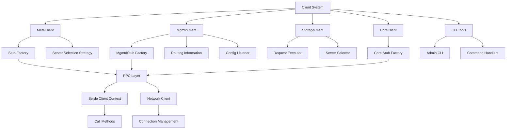
```mermaid
graph TD
    Client[Client System]
    Client --> Meta[MetaClient]
    Client --> Storage[StorageClient]
    Client --> Mgmtd[MgmtdClient]
    Client --> Core[CoreClient]
    Client --> CLI[CLI Tools]

    Meta --> Stub[Stub Factory]
    Meta --> ServerSelection[Server Selection Strategy]

    Mgmtd --> MgmtdStub[MgmtdStub Factory]
    Mgmtd --> RoutingInfo[Routing Information]
    Mgmtd --> ConfigListener[Config Listener]

    Storage --> RequestExecutor[Request Executor]
    Storage --> ServerSelector[Server Selector]

    Core --> CoreStubFactory[Core Stub Factory]

    CLI --> AdminCLI[Admin CLI]
    CLI --> Commands[Command Handlers]

    Stub --> RPC[RPC Layer]
    MgmtdStub --> RPC
    CoreStubFactory --> RPC

    RPC --> SerdeClient[Serde Client Context]
    RPC --> NetClient[Network Client]

    SerdeClient --> CallMethods[Call Methods]
    NetClient --> Connections[Connection Management]
```

## 2.3. Client Component Structure

### 2.3.1. MetaClient Architecture

This diagram illustrates the internal structure of MetaClient and its relationships with other components.

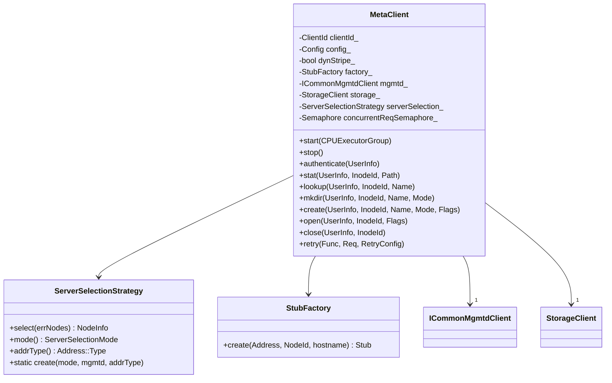
```mermaid
classDiagram
    class MetaClient {
        -ClientId clientId_
        -Config config_
        -bool dynStripe_
        -StubFactory factory_
        -ICommonMgmtdClient mgmtd_
        -StorageClient storage_
        -ServerSelectionStrategy serverSelection_
        -Semaphore concurrentReqSemaphore_
        +start(CPUExecutorGroup)
        +stop()
        +authenticate(UserInfo)
        +stat(UserInfo, InodeId, Path)
        +lookup(UserInfo, InodeId, Name)
        +mkdir(UserInfo, InodeId, Name, Mode)
        +create(UserInfo, InodeId, Name, Mode, Flags)
        +open(UserInfo, InodeId, Flags)
        +close(UserInfo, InodeId)
        +retry(Func, Req, RetryConfig)
    }

    class ServerSelectionStrategy {
        +select(errNodes) NodeInfo
        +mode() ServerSelectionMode
        +addrType() Address::Type
        +static create(mode, mgmtd, addrType)
    }

    class StubFactory {
        +create(Address, NodeId, hostname) Stub
    }

    MetaClient --> ServerSelectionStrategy
    MetaClient --> StubFactory
    MetaClient --> "1" ICommonMgmtdClient
    MetaClient --> "1" StorageClient
```

**MetaClient Functionality**:
- Provides file system metadata operations (stat, lookup, mkdir, create, open, close)
- Implements retry logic for handling server failures
- Uses server selection strategy to choose the appropriate metadata server
- Manages concurrent request limits through semaphore
- Handles background tasks like closing files and pruning sessions

### 2.3.2. MgmtdClient Architecture

This diagram shows the MgmtdClient structure and its key components for cluster management.

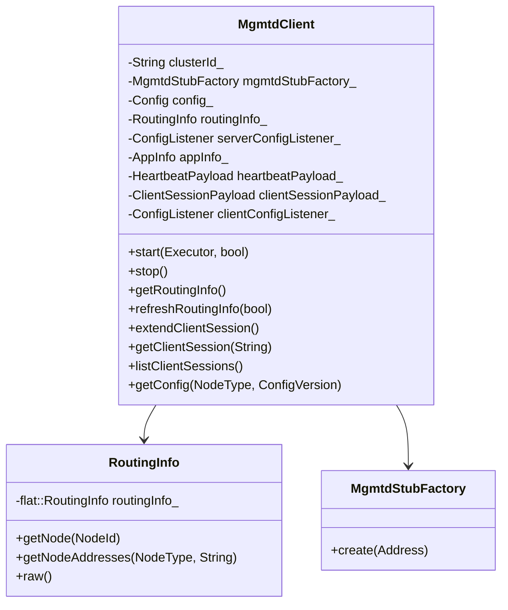
```mermaid
classDiagram
    class MgmtdClient {
        -String clusterId_
        -MgmtdStubFactory mgmtdStubFactory_
        -Config config_
        -RoutingInfo routingInfo_
        -ConfigListener serverConfigListener_
        -AppInfo appInfo_
        -HeartbeatPayload heartbeatPayload_
        -ClientSessionPayload clientSessionPayload_
        -ConfigListener clientConfigListener_
        +start(Executor, bool)
        +stop()
        +getRoutingInfo()
        +refreshRoutingInfo(bool)
        +extendClientSession()
        +getClientSession(String)
        +listClientSessions()
        +getConfig(NodeType, ConfigVersion)
    }

    class RoutingInfo {
        -flat::RoutingInfo routingInfo_
        +getNode(NodeId)
        +getNodeAddresses(NodeType, String)
        +raw()
    }

    class MgmtdStubFactory {
        +create(Address)
    }

    MgmtdClient --> RoutingInfo
    MgmtdClient --> MgmtdStubFactory
```

**MgmtdClient Functionality**:
- Maintains cluster routing information (which servers are available)
- Manages client sessions through creation and periodic extension
- Provides configuration management and updates
- Enables service discovery for other components
- Sends heartbeats to maintain connectivity with management servers
- Facilitates client identification and registration in the cluster

### 2.3.3. StorageClient Architecture

This diagram depicts the StorageClient structure and its components for handling data operations.

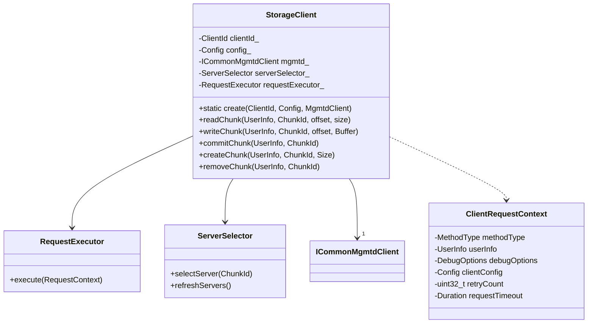
```mermaid
classDiagram
    class StorageClient {
        -ClientId clientId_
        -Config config_
        -ICommonMgmtdClient mgmtd_
        -ServerSelector serverSelector_
        -RequestExecutor requestExecutor_
        +static create(ClientId, Config, MgmtdClient)
        +readChunk(UserInfo, ChunkId, offset, size)
        +writeChunk(UserInfo, ChunkId, offset, Buffer)
        +commitChunk(UserInfo, ChunkId)
        +createChunk(UserInfo, ChunkId, Size)
        +removeChunk(UserInfo, ChunkId)
    }

    class ClientRequestContext {
        -MethodType methodType
        -UserInfo userInfo
        -DebugOptions debugOptions
        -Config clientConfig
        -uint32_t retryCount
        -Duration requestTimeout
    }

    class RequestExecutor {
        +execute(RequestContext)
    }

    class ServerSelector {
        +selectServer(ChunkId)
        +refreshServers()
    }

    StorageClient --> RequestExecutor
    StorageClient --> ServerSelector
    StorageClient --> "1" ICommonMgmtdClient
    StorageClient ..> ClientRequestContext
```

**StorageClient Functionality**:
- Handles data I/O operations (read/write chunks)
- Creates, commits, and removes storage chunks
- Selects appropriate storage servers for operations
- Implements retries and error handling for storage operations
- Maintains metrics and monitoring for storage operations
- Optimizes data transfer through configurable request handling

## 2.4. Network Communication

This diagram illustrates the sequence of events during RPC communication between client and server.

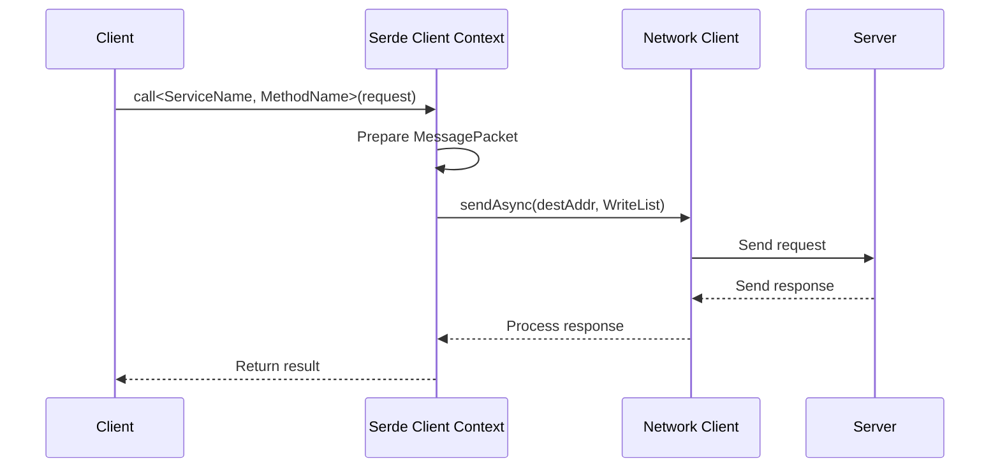
```mermaid
sequenceDiagram
    participant Client
    participant SerdeCtx as Serde Client Context
    participant NetClient as Network Client
    participant Server

    Client->>SerdeCtx: call<ServiceName, MethodName>(request)
    SerdeCtx->>SerdeCtx: Prepare MessagePacket
    SerdeCtx->>NetClient: sendAsync(destAddr, WriteList)
    NetClient->>Server: Send request
    Server-->>NetClient: Send response
    NetClient-->>SerdeCtx: Process response
    SerdeCtx-->>Client: Return result
```

**Network Communication Features**:
- Serializes requests using the Serde framework
- Supports both synchronous and asynchronous RPC calls
- Manages network connections and reconnection strategies
- Handles timeouts and retries for failed requests
- Reports metrics on network latency and throughput
- Supports various transport protocols (TCP, RDMA)

## 2.5. Server Selection Workflow

This diagram shows how clients select servers for metadata operations, including error handling and retries.

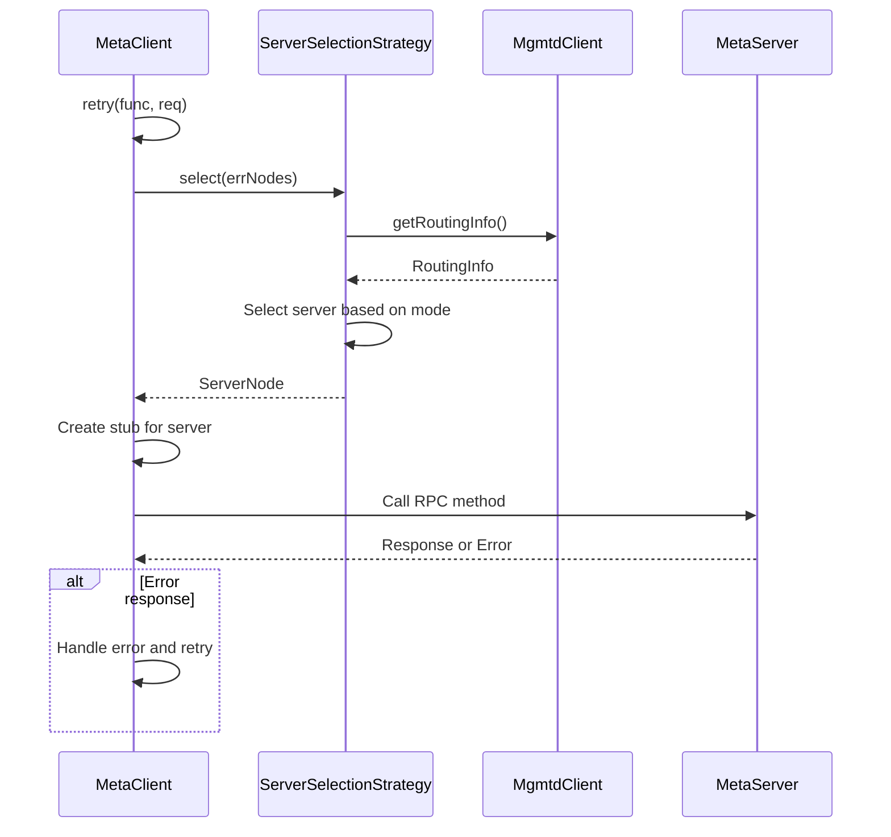
```mermaid
sequenceDiagram
    participant MetaClient
    participant ServerSelection as ServerSelectionStrategy
    participant MgmtdClient
    participant MetaServer

    MetaClient->>MetaClient: retry(func, req)
    MetaClient->>ServerSelection: select(errNodes)
    ServerSelection->>MgmtdClient: getRoutingInfo()
    MgmtdClient-->>ServerSelection: RoutingInfo
    ServerSelection->>ServerSelection: Select server based on mode
    ServerSelection-->>MetaClient: ServerNode
    MetaClient->>MetaClient: Create stub for server
    MetaClient->>MetaServer: Call RPC method
    MetaServer-->>MetaClient: Response or Error

    alt Error response
        MetaClient->>MetaClient: Handle error and retry
    end
```

**Server Selection Features**:
- Multiple selection strategies (Random, Follow, RandomFollow)
- Tracks failed servers to avoid selecting them again
- Retrieves fresh routing information when needed
- Supports different network protocols for each server
- Implements configurable retry policies with exponential backoff

## 2.6. Remote Call Workflow

This diagram details the process of making remote calls from client to server, showing the internal components involved.

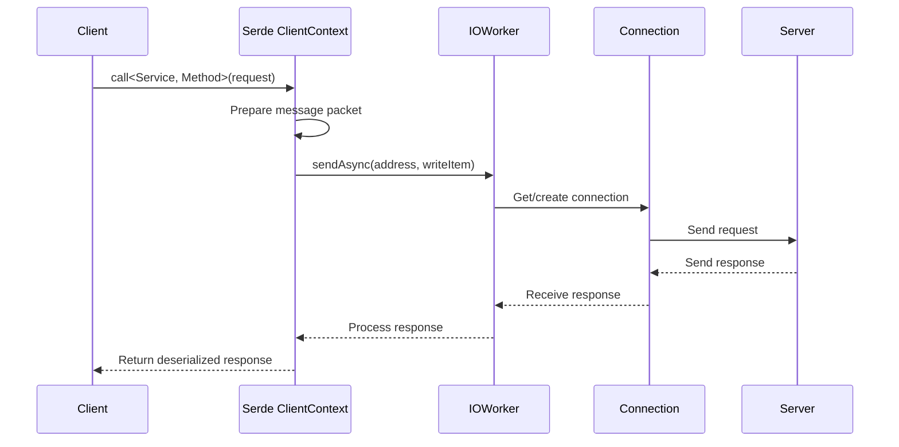
```mermaid
sequenceDiagram
    participant Client
    participant Context as Serde ClientContext
    participant IOWorker
    participant Connection
    participant Server

    Client->>Context: call<Service, Method>(request)
    Context->>Context: Prepare message packet
    Context->>IOWorker: sendAsync(address, writeItem)
    IOWorker->>Connection: Get/create connection
    Connection->>Server: Send request
    Server-->>Connection: Send response
    Connection-->>IOWorker: Receive response
    IOWorker-->>Context: Process response
    Context-->>Client: Return deserialized response
```

**Remote Call Features**:
- Supports both asynchronous (coroutine-based) and synchronous calls
- Handles connection pooling and reuse
- Implements request timeouts and cancellation
- Collects performance metrics (latency, throughput)
- Supports compression for large payloads
- Provides detailed error information for debugging

## 2.7. CLI Command Structure

This diagram shows the structure of the admin CLI tool and its command handlers.

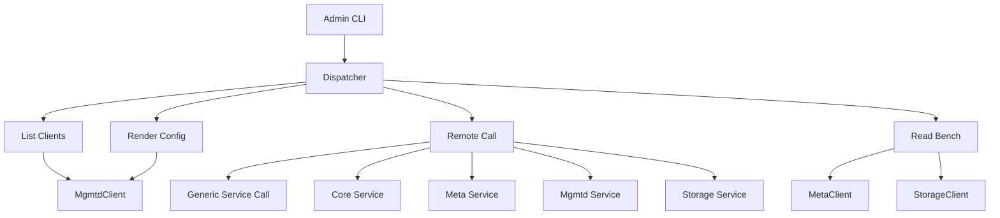
```mermaid
graph TD
    AdminCLI[Admin CLI]
    AdminCLI --> Dispatcher[Dispatcher]

    Dispatcher --> ListClients[List Clients]
    Dispatcher --> RemoteCall[Remote Call]
    Dispatcher --> RenderConfig[Render Config]
    Dispatcher --> ReadBench[Read Bench]

    ListClients --> MgmtdClient
    RemoteCall --> GenericServices[Generic Service Call]
    RemoteCall --> CoreService[Core Service]
    RemoteCall --> MetaService[Meta Service]
    RemoteCall --> MgmtdService[Mgmtd Service]
    RemoteCall --> StorageService[Storage Service]

    RenderConfig --> MgmtdClient
    ReadBench --> MetaClient
    ReadBench --> StorageClient
```

**CLI Functionality**:
- Provides administrative interface for the 3FS system
- Implements commands for debugging and monitoring
- Allows direct interaction with system services
- Supports rendering of configuration information
- Enables benchmarking and performance testing
- Facilitates client session management

## 2.8. Client Session Management

This diagram illustrates the lifecycle of a client session, from establishment to periodic extension.

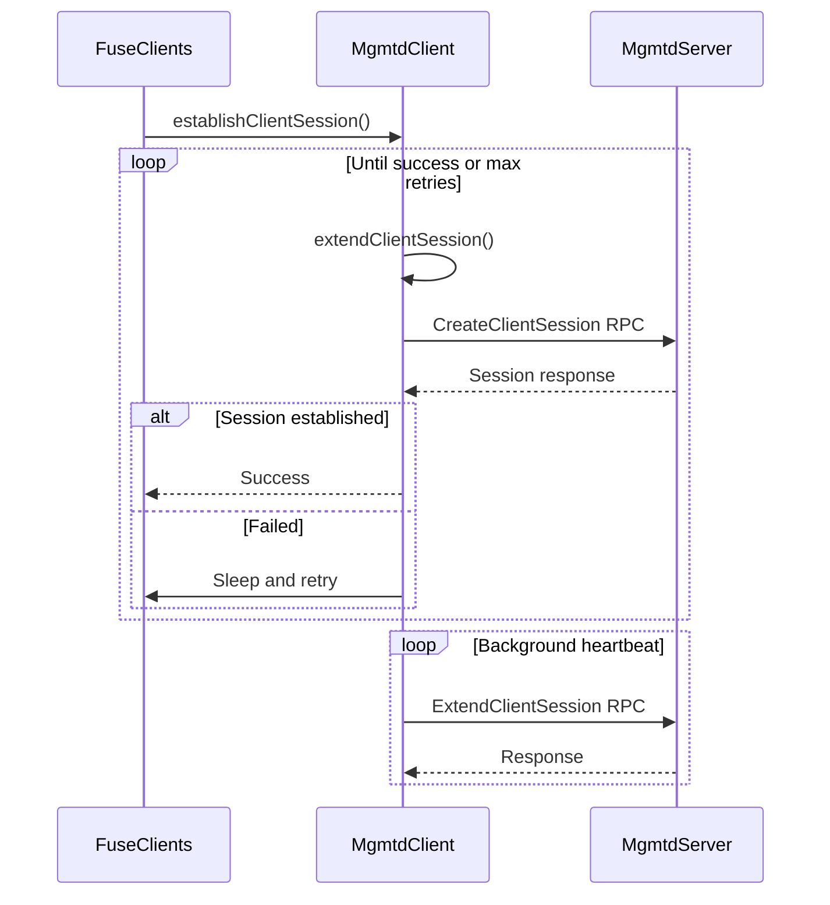
```mermaid
sequenceDiagram
    participant FuseClients
    participant MgmtdClient
    participant MgmtdServer

    FuseClients->>MgmtdClient: establishClientSession()
    loop Until success or max retries
        MgmtdClient->>MgmtdClient: extendClientSession()
        MgmtdClient->>MgmtdServer: CreateClientSession RPC
        MgmtdServer-->>MgmtdClient: Session response

        alt Session established
            MgmtdClient-->>FuseClients: Success
        else Failed
            MgmtdClient->>FuseClients: Sleep and retry
        end
    end

    loop Background heartbeat
        MgmtdClient->>MgmtdServer: ExtendClientSession RPC
        MgmtdServer-->>MgmtdClient: Response
    end
```

**Session Management Features**:
- Establishes client identity in the cluster
- Maintains persistent sessions through heartbeats
- Implements retry logic for session establishment
- Handles session recovery after network failures
- Supports configuration updates during session lifetime
- Enables server-side tracking and management of clients

# 3. FoundationDB Integration Architecture in 3FS (src/fdb)

This document provides an overview of the FoundationDB (FDB) integration architecture in the 3FS system. It covers the main components, their structure, relationships, and workflows.

## 3.1. Overview

The FoundationDB integration in 3FS provides a robust key-value store implementation that interfaces with the FoundationDB database. The integration is designed around several core components that handle initialization, transactions, and database operations.

## 3.2. Component Architecture

### 3.2.1. Core Components

The following diagram shows the main components of the FDB integration and their relationships:

```mermaid
classDiagram
    class FDBConfig {
        +clusterFile: string
        +enableMultipleClient: bool
        +externalClientDir: string
        +externalClientPath: string
        +multipleClientThreadNum: long
        +trace_file: string
        +trace_format: string
        +casual_read_risky: bool
        +default_backoff: int
        +readonly: bool
    }

    class FDBContext {
        -config_: FDBConfig
        -networkThread: thread
        +create(config: FDBConfig): shared_ptr<FDBContext>
        +getDB(): DB
        +maxDbCount(): int64_t
    }

    class DB {
        -db_: unique_ptr<FDBDatabase>
        -readonly_: bool
        -error_: fdb_error_t
        +selectAPIVersion(version: int): fdb_error_t
        +errorMsg(code: fdb_error_t): string_view
        +evaluatePredicate(predicate_test: int, code: fdb_error_t): bool
        +setNetworkOption(option: FDBNetworkOption, value: string_view): fdb_error_t
        +setupNetwork(): fdb_error_t
        +runNetwork(): fdb_error_t
        +stopNetwork(): fdb_error_t
        +DB(clusterFilePath: string, readonly: bool)
        +error(): fdb_error_t
        +setOption(option: FDBDatabaseOption, value: string_view): fdb_error_t
        +rebootWorker(address: string_view, check: bool, duration: int): Task<Int64Result>
        +forceRecoveryWithDataLoss(dcid: string_view): Task<EmptyResult>
        +createSnapshot(uid: string_view, snapCommand: string_view): Task<EmptyResult>
        +purgeBlobGranules(range: KeyRangeView, purgeVersion: int64_t, force: bool): Task<KeyResult>
        +waitPurgeGranulesComplete(purgeKey: string_view): Task<EmptyResult>
    }

    class Transaction {
        -tr_: unique_ptr<FDBTransaction>
        -readonly_: bool
        -error_: fdb_error_t
        +Transaction(db: DB)
        +error(): fdb_error_t
        +setOption(option: FDBTransactionOption, value: string_view): fdb_error_t
        +setReadVersion(version: int64_t): void
        +getReadVersion(): Task<Int64Result>
        +get(key: string_view, snapshot: bool): Task<ValueResult>
        +getKey(selector: KeySelector, snapshot: bool): Task<KeyResult>
        +watch(key: string_view): Task<EmptyResult>
        +getAddressesForKey(key: string_view): Task<StringArrayResult>
        +getRange(begin: KeySelector, end: KeySelector, limits: GetRangeLimits, iteration: int, snapshot: bool, reverse: bool, streamingMode: FDBStreamingMode): Task<KeyValueArrayResult>
        +getEstimatedRangeSizeBytes(range: KeyRangeView): Task<Int64Result>
        +getRangeSplitPoints(range: KeyRangeView, chunkSize: int64_t): Task<KeyArrayResult>
        +onError(err: fdb_error_t): Task<EmptyResult>
        +cancel(): void
        +reset(): void
        +addConflictRange(range: KeyRangeView, type: FDBConflictRangeType): fdb_error_t
        +atomicOp(key: string_view, param: string_view, operationType: FDBMutationType): void
        +set(key: string_view, value: string_view): void
        +clear(key: string_view): void
        +clearRange(range: KeyRangeView): void
        +commit(): Task<EmptyResult>
        +getCommittedVersion(outVersion: int64_t*): fdb_error_t
        +getApproximateSize(): Task<Int64Result>
        +getVersionstamp(): Task<KeyResult>
    }

    class FDBTransaction {
        -tr_: Transaction
        -errcode_: atomic<fdb_error_t>
        +FDBTransaction(tr: Transaction)
        +snapshotGet(key: string_view): CoTryTask<optional<String>>
        +snapshotGetRange(begin: KeySelector, end: KeySelector, limit: int32_t): CoTryTask<GetRangeResult>
        +get(key: string_view): CoTryTask<optional<String>>
        +getRange(begin: KeySelector, end: KeySelector, limit: int32_t): CoTryTask<GetRangeResult>
        +cancel(): CoTryTask<void>
        +addReadConflict(key: string_view): CoTryTask<void>
        +addReadConflictRange(begin: string_view, end: string_view): CoTryTask<void>
        +set(key: string_view, value: string_view): CoTryTask<void>
        +clear(key: string_view): CoTryTask<void>
        +setVersionstampedKey(key: string_view, offset: uint32_t, value: string_view): CoTryTask<void>
        +setVersionstampedValue(key: string_view, value: string_view, offset: uint32_t): CoTryTask<void>
        +clearRange(begin: string_view, end: string_view): CoTryTask<void>
        +commit(): CoTryTask<void>
        +reset(): void
        +setOption(option: FDBTransactionOption, value: string_view): Result<Void>
        +onError(errcode: fdb_error_t): CoTask<bool>
        +getReadVersion(): CoTryTask<int64_t>
        +setReadVersion(version: int64_t): void
        +getCommittedVersion(): int64_t
        +errcode(): fdb_error_t
    }

    class FDBKVEngine {
        -db_: DB
        +FDBKVEngine(db: DB)
        +createReadonlyTransaction(): unique_ptr<IReadOnlyTransaction>
        +createReadWriteTransaction(): unique_ptr<IReadWriteTransaction>
        -setReadonly(rdonly: bool): void
    }

    class HybridKvEngine {
        -kvEngines_: vector<unique_ptr<IKVEngine>>
        -fdbContext_: shared_ptr<FDBContext>
        +fromMem(): shared_ptr<HybridKvEngine>
        +fromFdb(config: FDBConfig): shared_ptr<HybridKvEngine>
        +createReadonlyTransaction(): unique_ptr<IReadOnlyTransaction>
        +createReadWriteTransaction(): unique_ptr<IReadWriteTransaction>
    }

    FDBContext --> FDBConfig : uses
    FDBContext --> DB : creates
    DB --> Transaction : creates
    Transaction <-- FDBTransaction : wraps
    FDBKVEngine --> DB : contains
    FDBKVEngine --> FDBTransaction : creates
    HybridKvEngine --> FDBKVEngine : contains
    HybridKvEngine --> FDBContext : contains
```

The diagram above shows the core components of the FoundationDB integration in 3FS:

- `FDBConfig`: Configuration for FoundationDB connections
- `FDBContext`: Manages the lifecycle of the FoundationDB connection
- `DB`: Represents a connection to a FoundationDB database
- `Transaction`: Wraps a native FoundationDB transaction
- `FDBTransaction`: Implements the 3FS transaction interface on top of FoundationDB
- `FDBKVEngine`: Provides a key-value engine implementation using FoundationDB
- `HybridKvEngine`: Allows using multiple key-value engines, including FoundationDB

### 3.2.2. Result Classes Hierarchy

The following diagram shows the result classes used to handle asynchronous operations with FoundationDB:

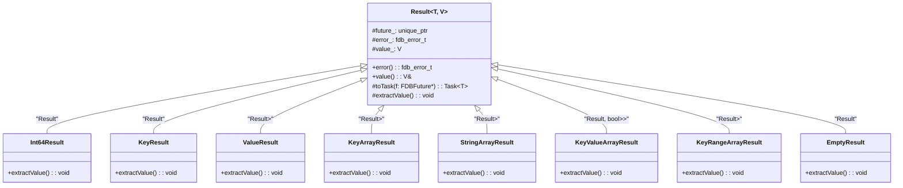
```mermaid
classDiagram
    class Result~T, V~ {
        #future_: unique_ptr<FDBFuture>
        #error_: fdb_error_t
        #value_: V
        +error(): fdb_error_t
        +value(): V&
        #toTask(f: FDBFuture*): Task~T~
        #extractValue(): void
    }

    class Int64Result {
        +extractValue(): void
    }

    class KeyResult {
        +extractValue(): void
    }

    class ValueResult {
        +extractValue(): void
    }

    class KeyArrayResult {
        +extractValue(): void
    }

    class StringArrayResult {
        +extractValue(): void
    }

    class KeyValueArrayResult {
        +extractValue(): void
    }

    class KeyRangeArrayResult {
        +extractValue(): void
    }

    class EmptyResult {
        +extractValue(): void
    }

    Result <|-- Int64Result : "Result<Int64Result, int64_t>"
    Result <|-- KeyResult : "Result<KeyResult, String>"
    Result <|-- ValueResult : "Result<ValueResult, optional<String>>"
    Result <|-- KeyArrayResult : "Result<KeyArrayResult, vector<String>>"
    Result <|-- StringArrayResult : "Result<StringArrayResult, vector<String>>"
    Result <|-- KeyValueArrayResult : "Result<KeyValueArrayResult, pair<vector<KeyValue>, bool>>"
    Result <|-- KeyRangeArrayResult : "Result<KeyRangeArrayResult, vector<KeyRange>>"
    Result <|-- EmptyResult : "Result<EmptyResult, EmptyValue>"
```

The `Result` template class hierarchy allows type-safe handling of different FoundationDB operation results.

## 3.3. Operational Workflows

### 3.3.1. Initialization Workflow

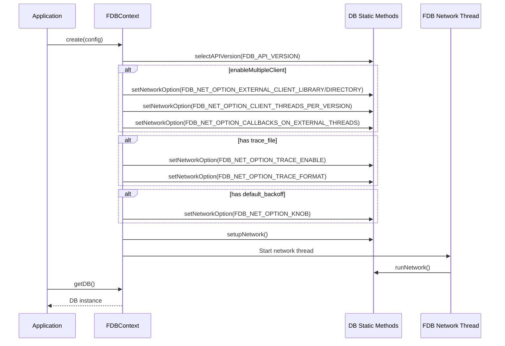
```mermaid
sequenceDiagram
    participant App as Application
    participant Context as FDBContext
    participant DB_Static as DB Static Methods
    participant Network as FDB Network Thread

    App->>Context: create(config)
    Context->>DB_Static: selectAPIVersion(FDB_API_VERSION)
    alt enableMultipleClient
        Context->>DB_Static: setNetworkOption(FDB_NET_OPTION_EXTERNAL_CLIENT_LIBRARY/DIRECTORY)
        Context->>DB_Static: setNetworkOption(FDB_NET_OPTION_CLIENT_THREADS_PER_VERSION)
        Context->>DB_Static: setNetworkOption(FDB_NET_OPTION_CALLBACKS_ON_EXTERNAL_THREADS)
    end

    alt has trace_file
        Context->>DB_Static: setNetworkOption(FDB_NET_OPTION_TRACE_ENABLE)
        Context->>DB_Static: setNetworkOption(FDB_NET_OPTION_TRACE_FORMAT)
    end

    alt has default_backoff
        Context->>DB_Static: setNetworkOption(FDB_NET_OPTION_KNOB)
    end

    Context->>DB_Static: setupNetwork()
    Context->>Network: Start network thread
    Network->>DB_Static: runNetwork()
    App->>Context: getDB()
    Context-->>App: DB instance
```

This diagram illustrates the initialization process of the FoundationDB integration, showing how the FDB network is set up and the DB instance is created.

### 3.3.2. Transaction Workflow

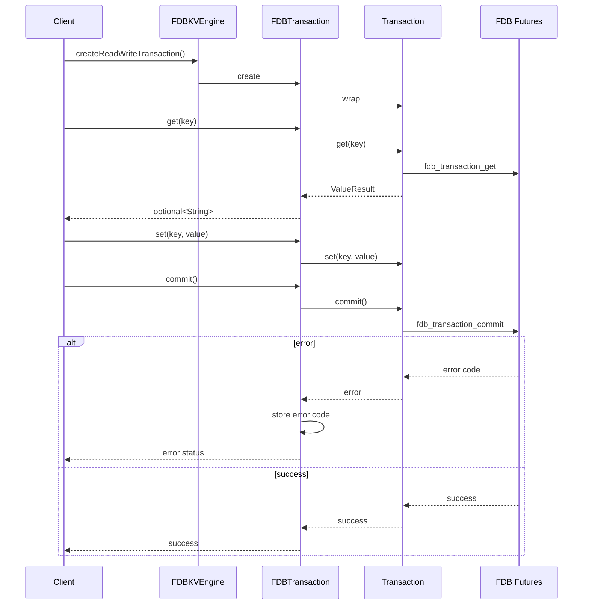
```mermaid
sequenceDiagram
    participant Client as Client
    participant Engine as FDBKVEngine
    participant FDBTx as FDBTransaction
    participant Tx as Transaction
    participant FDBFuture as FDB Futures

    Client->>Engine: createReadWriteTransaction()
    Engine->>FDBTx: create
    FDBTx->>Tx: wrap

    Client->>FDBTx: get(key)
    FDBTx->>Tx: get(key)
    Tx->>FDBFuture: fdb_transaction_get
    Tx-->>FDBTx: ValueResult
    FDBTx-->>Client: optional<String>

    Client->>FDBTx: set(key, value)
    FDBTx->>Tx: set(key, value)

    Client->>FDBTx: commit()
    FDBTx->>Tx: commit()
    Tx->>FDBFuture: fdb_transaction_commit
    alt error
        FDBFuture-->>Tx: error code
        Tx-->>FDBTx: error
        FDBTx->>FDBTx: store error code
        FDBTx-->>Client: error status
    else success
        FDBFuture-->>Tx: success
        Tx-->>FDBTx: success
        FDBTx-->>Client: success
    end
```

This diagram shows the workflow of a transaction, including how operations like get, set, and commit are handled through the various layers of the architecture.

### 3.3.3. Error Handling and Retry Workflow

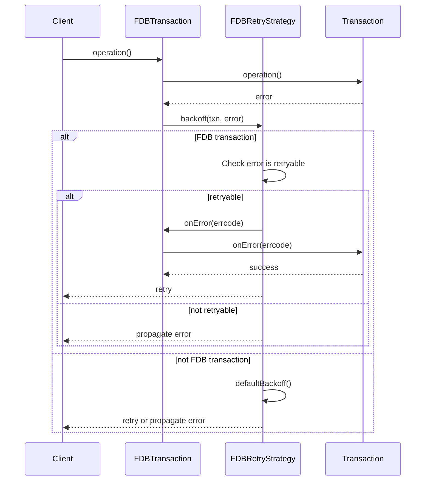
```mermaid
sequenceDiagram
    participant Client as Client
    participant FDBTx as FDBTransaction
    participant RetryStrategy as FDBRetryStrategy
    participant Tx as Transaction

    Client->>FDBTx: operation()
    FDBTx->>Tx: operation()
    Tx-->>FDBTx: error
    FDBTx->>RetryStrategy: backoff(txn, error)

    alt FDB transaction
        RetryStrategy->>RetryStrategy: Check error is retryable
        alt retryable
            RetryStrategy->>FDBTx: onError(errcode)
            FDBTx->>Tx: onError(errcode)
            Tx-->>FDBTx: success
            RetryStrategy-->>Client: retry
        else not retryable
            RetryStrategy-->>Client: propagate error
        end
    else not FDB transaction
        RetryStrategy->>RetryStrategy: defaultBackoff()
        RetryStrategy-->>Client: retry or propagate error
    end
```

This diagram illustrates how errors are handled and the retry mechanism for transient errors in FoundationDB transactions.

## 3.4. Operation Monitoring

The FDB integration includes monitoring capabilities through operation recorders:

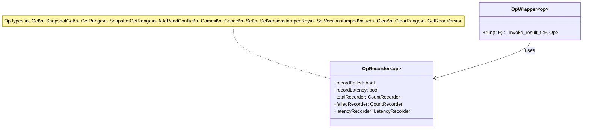
```mermaid
classDiagram
    class OpRecorder~op~ {
        +recordFailed: bool
        +recordLatency: bool
        +totalRecorder: CountRecorder
        +failedRecorder: CountRecorder
        +latencyRecorder: LatencyRecorder
    }

    class OpWrapper~op~ {
        +run(f: F): invoke_result_t~F, Op~
    }

    OpWrapper --> OpRecorder : uses

    note for OpRecorder "Op types:\n- Get\n- SnapshotGet\n- GetRange\n- SnapshotGetRange\n- AddReadConflict\n- Commit\n- Cancel\n- Set\n- SetVersionstampedKey\n- SetVersionstampedValue\n- Clear\n- ClearRange\n- GetReadVersion"
```

The monitoring system uses specialized recorders for different types of operations, tracking metrics like:
- Total operation counts
- Failed operation counts
- Operation latencies

## 3.5. Key Components Functionality

### 3.5.1. FDBContext

The `FDBContext` class manages the lifecycle of the FoundationDB connection, including:
- Selecting the API version
- Configuring network options
- Setting up and running the network thread
- Creating database instances

### 3.5.2. DB

The `DB` class represents a connection to a FoundationDB database and provides:
- Static methods for global FoundationDB operations
- Database-level operations and options
- Creation of transaction objects

### 3.5.3. Transaction

The `Transaction` class wraps a native FoundationDB transaction and provides:
- Both read and write operations
- Transaction options and management
- Asynchronous operations using folly::coro::Task

### 3.5.4. FDBTransaction

The `FDBTransaction` class implements the 3FS transaction interface and provides:
- Higher-level transaction operations
- Error handling and conversion
- Integration with the monitoring system

### 3.5.5. FDBKVEngine

The `FDBKVEngine` class provides a key-value engine implementation using FoundationDB:
- Creates transactions that implement the 3FS transaction interfaces
- Manages the DB connection

### 3.5.6. HybridKvEngine

The `HybridKvEngine` allows using multiple key-value engines:
- Can be created with FoundationDB backing
- Can be created with in-memory backing
- Routes operations to the appropriate underlying engine

# 4. 3FS FUSE Architecture (src/fuse)

This document provides an overview of the FUSE (Filesystem in USErspace) implementation in the 3FS system. It includes component diagrams, workflow illustrations, and descriptions of the main functionalities.

## 4.1. Overview

The 3FS FUSE module implements a FUSE interface that allows the 3FS filesystem to be mounted as a standard filesystem in the operating system. It translates filesystem operations (e.g., read, write, mkdir) into appropriate calls to the underlying storage and metadata services.

## 4.2. Main Components

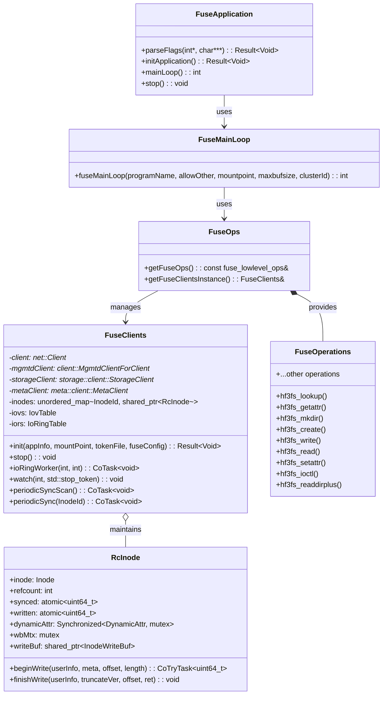
```mermaid
classDiagram
    class FuseApplication {
        +parseFlags(int*, char***): Result~Void~
        +initApplication(): Result~Void~
        +mainLoop(): int
        +stop(): void
    }

    class FuseMainLoop {
        +fuseMainLoop(programName, allowOther, mountpoint, maxbufsize, clusterId): int
    }

    class FuseClients {
        +init(appInfo, mountPoint, tokenFile, fuseConfig): Result~Void~
        +stop(): void
        +ioRingWorker(int, int): CoTask~void~
        +watch(int, std::stop_token): void
        +periodicSyncScan(): CoTask~void~
        +periodicSync(InodeId): CoTask~void~
        -client: net::Client*
        -mgmtdClient: client::MgmtdClientForClient*
        -storageClient: storage::client::StorageClient*
        -metaClient: meta::client::MetaClient*
        -inodes: unordered_map~InodeId, shared_ptr~RcInode~~
        -iovs: IovTable
        -iors: IoRingTable
    }

    class FuseOps {
        +getFuseOps(): const fuse_lowlevel_ops&
        +getFuseClientsInstance(): FuseClients&
    }

    class RcInode {
        +inode: Inode
        +refcount: int
        +synced: atomic~uint64_t~
        +written: atomic~uint64_t~
        +dynamicAttr: Synchronized~DynamicAttr, mutex~
        +wbMtx: mutex
        +writeBuf: shared_ptr~InodeWriteBuf~
        +beginWrite(userInfo, meta, offset, length): CoTryTask~uint64_t~
        +finishWrite(userInfo, truncateVer, offset, ret): void
    }

    class FuseOperations {
        +hf3fs_lookup()
        +hf3fs_getattr()
        +hf3fs_mkdir()
        +hf3fs_create()
        +hf3fs_write()
        +hf3fs_read()
        +hf3fs_setattr()
        +hf3fs_ioctl()
        +hf3fs_readdirplus()
        +...other operations
    }

    FuseApplication --> FuseMainLoop: uses
    FuseMainLoop --> FuseOps: uses
    FuseOps --> FuseClients: manages
    FuseOps *-- FuseOperations: provides
    FuseClients o-- RcInode: maintains
```

This diagram shows the main components of the FUSE implementation and their relationships.

## 4.3. Component Details

### 4.3.1. FuseApplication

The main application class that initializes the FUSE filesystem and handles the application lifecycle.

### 4.3.2. FuseClients

Central management class that:
- Maintains connections to metadata and storage services
- Manages inode cache and state
- Handles I/O operations and background tasks
- Coordinates periodic synchronization

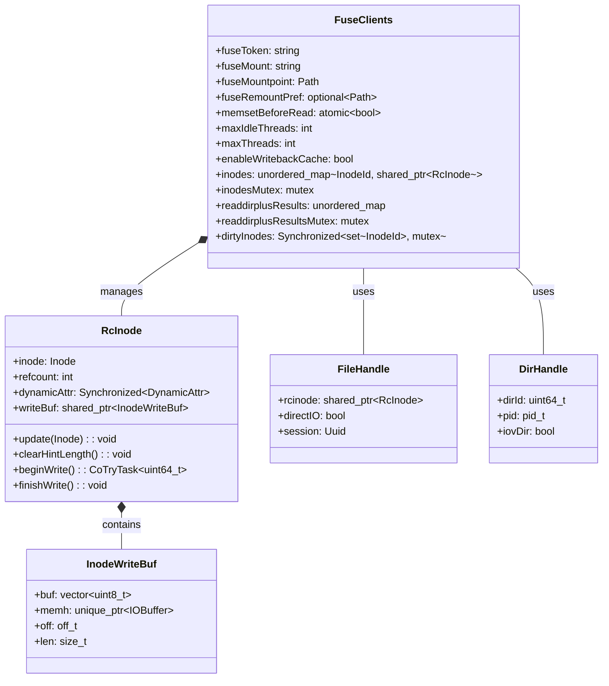
```mermaid
classDiagram
    class FuseClients {
        +fuseToken: string
        +fuseMount: string
        +fuseMountpoint: Path
        +fuseRemountPref: optional~Path~
        +memsetBeforeRead: atomic~bool~
        +maxIdleThreads: int
        +maxThreads: int
        +enableWritebackCache: bool
        +inodes: unordered_map~InodeId, shared_ptr~RcInode~~
        +inodesMutex: mutex
        +readdirplusResults: unordered_map
        +readdirplusResultsMutex: mutex
        +dirtyInodes: Synchronized~set~InodeId~, mutex~
    }

    class RcInode {
        +inode: Inode
        +refcount: int
        +dynamicAttr: Synchronized~DynamicAttr~
        +writeBuf: shared_ptr~InodeWriteBuf~
        +update(Inode): void
        +clearHintLength(): void
        +beginWrite(): CoTryTask~uint64_t~
        +finishWrite(): void
    }

    class InodeWriteBuf {
        +buf: vector~uint8_t~
        +memh: unique_ptr~IOBuffer~
        +off: off_t
        +len: size_t
    }

    class FileHandle {
        +rcinode: shared_ptr~RcInode~
        +directIO: bool
        +session: Uuid
    }

    class DirHandle {
        +dirId: uint64_t
        +pid: pid_t
        +iovDir: bool
    }

    FuseClients *-- RcInode: manages
    RcInode *-- InodeWriteBuf: contains
    FuseClients -- FileHandle: uses
    FuseClients -- DirHandle: uses
```

This diagram shows the internal structure of FuseClients and related classes.

### 4.3.3. FuseOperations (in FuseOps.cc)

Implements all FUSE filesystem operations required by the fuse_lowlevel_ops interface, including:
- File operations (read, write, create)
- Directory operations (mkdir, readdir)
- Attribute operations (getattr, setattr)
- Special operations (ioctl, xattr)

## 4.4. Main Workflows

### 4.4.1. File Read Workflow

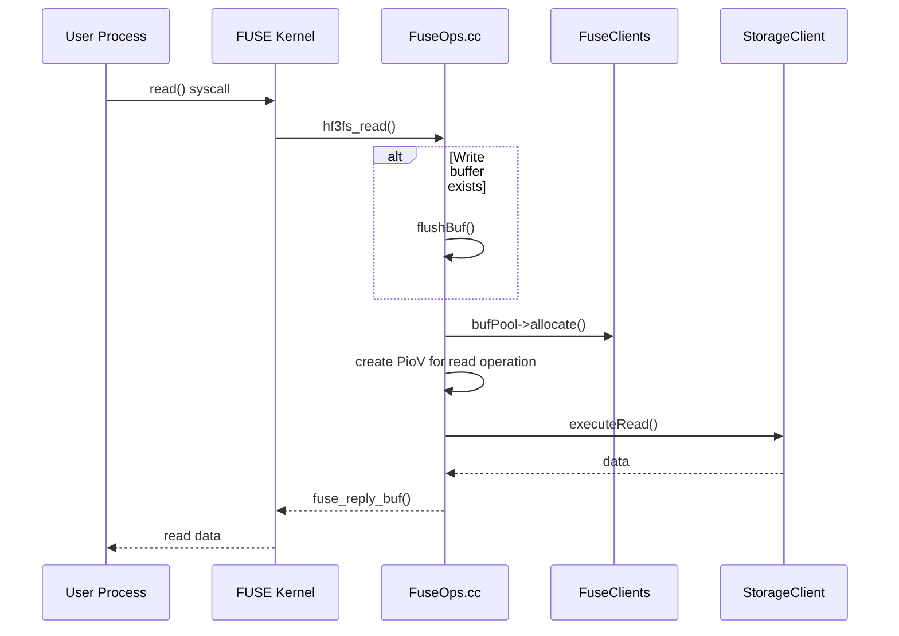
```mermaid
sequenceDiagram
    participant User as User Process
    participant FUSE as FUSE Kernel
    participant FuseOps as FuseOps.cc
    participant FuseClients as FuseClients
    participant Storage as StorageClient

    User->>FUSE: read() syscall
    FUSE->>FuseOps: hf3fs_read()

    alt Write buffer exists
        FuseOps->>FuseOps: flushBuf()
    end

    FuseOps->>FuseClients: bufPool->allocate()
    FuseOps->>FuseOps: create PioV for read operation
    FuseOps->>Storage: executeRead()
    Storage-->>FuseOps: data
    FuseOps-->>FUSE: fuse_reply_buf()
    FUSE-->>User: read data
```

This diagram illustrates the flow of a read operation from a user process through the FUSE layer to the storage backend.

### 4.4.2. File Write Workflow

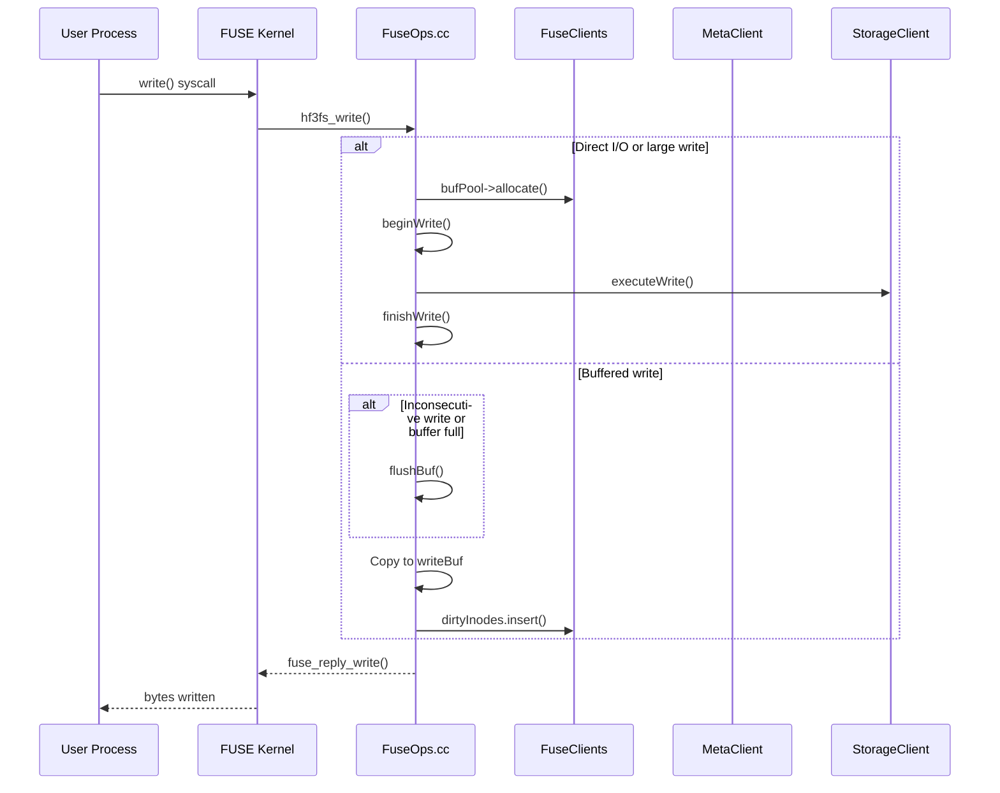
```mermaid
sequenceDiagram
    participant User as User Process
    participant FUSE as FUSE Kernel
    participant FuseOps as FuseOps.cc
    participant FuseClients as FuseClients
    participant MetaClient as MetaClient
    participant Storage as StorageClient

    User->>FUSE: write() syscall
    FUSE->>FuseOps: hf3fs_write()

    alt Direct I/O or large write
        FuseOps->>FuseClients: bufPool->allocate()
        FuseOps->>FuseOps: beginWrite()
        FuseOps->>Storage: executeWrite()
        FuseOps->>FuseOps: finishWrite()
    else Buffered write
        alt Inconsecutive write or buffer full
            FuseOps->>FuseOps: flushBuf()
        end
        FuseOps->>FuseOps: Copy to writeBuf
        FuseOps->>FuseClients: dirtyInodes.insert()
    end

    FuseOps-->>FUSE: fuse_reply_write()
    FUSE-->>User: bytes written
```

This diagram shows how write operations are processed, including both direct I/O and buffered write cases.

### 4.4.3. Periodic Sync Workflow

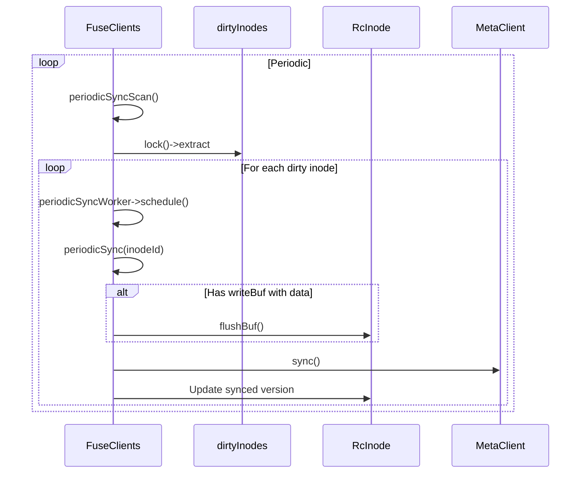
```mermaid
sequenceDiagram
    participant FuseClients as FuseClients
    participant DirtyInodes as dirtyInodes
    participant RcInode as RcInode
    participant MetaClient as MetaClient

    loop Periodic
        FuseClients->>FuseClients: periodicSyncScan()
        FuseClients->>DirtyInodes: lock()->extract
        loop For each dirty inode
            FuseClients->>FuseClients: periodicSyncWorker->schedule()
            FuseClients->>FuseClients: periodicSync(inodeId)

            alt Has writeBuf with data
                FuseClients->>RcInode: flushBuf()
            end

            FuseClients->>MetaClient: sync()
            FuseClients->>RcInode: Update synced version
        end
    end
```

This diagram shows how dirty inodes are periodically synchronized with the metadata server.

## 4.5. IOCTL Operations

3FS implements custom IOCTL operations for special filesystem functionality:

```mermaid
classDiagram
    class IOCTL_Operations {
        +FS_IOC_GETFLAGS
        +FS_IOC_SETFLAGS
        +FS_IOC_FSGETXATTR
        +HF3FS_IOC_GET_PATH_OFFSET
        +HF3FS_IOC_GET_MAGIC_NUM
        +HF3FS_IOC_GET_MOUNT_NAME
        +HF3FS_IOC_RECURSIVE_RM
        +HF3FS_IOC_FSYNC
        +HF3FS_IOC_HARDLINK
        +HF3FS_IOC_PUNCH_HOLE
        +HF3FS_IOC_MOVE
        +HF3FS_IOC_REMOVE
    }
```

These operations provide extended functionality for the filesystem that isn't covered by standard POSIX operations.

## 4.6. I/O Ring and Buffer Management

```mermaid
classDiagram
    class FuseClients {
        +iojqs: vector~unique_ptr~BoundedQueue~IoRingJob~~~
        +ioWatches: vector~jthread~
        +bufPool: shared_ptr~RDMABufPool~
        +maxBufsize: int
    }

    class IoRingTable {
        +lookupSem(): Inode
        +rmIoRing(): void
    }

    class IovTable {
        +lookupIov(): Result~Inode~
        +listIovs(): tuple
        +statIov(): Result~Inode~
    }

    class PioV {
        +addWrite(): Result~void~
        +addRead(): Result~void~
        +executeWrite(): CoTryTask~void~
        +executeRead(): CoTryTask~void~
        +finishIo(): void
    }

    FuseClients *-- IoRingTable: contains
    FuseClients *-- IovTable: contains
    FuseClients -- PioV: uses
```

This diagram shows how I/O operations are managed through ring buffers and memory pools.

## 4.7. Key Features and Optimizations

1. **Write Buffering**: Small writes are buffered to improve performance by reducing the number of operations to storage.

2. **Periodic Sync**: Background thread periodically syncs dirty inodes to ensure data durability.

3. **Memory Management**: Uses a buffer pool to efficiently manage memory for I/O operations.

4. **Caching**: Implements caching of inode metadata and directory entries to reduce calls to the metadata server.

5. **Configurability**: Provides extensive configuration options like read/write timeouts, buffer sizes, and sync intervals.

6. **Optimized I/O**: Uses PioV (Parallel I/O Vector) for efficient I/O operations to the storage backend.

7. **Direct I/O Support**: Supports direct I/O to bypass the kernel page cache when needed.

## 4.8. Conclusion

The 3FS FUSE implementation provides a complete POSIX filesystem interface on top of the distributed 3FS storage system. It balances performance and reliability through careful buffer management, caching, and synchronization strategies.

# 5. 3FS Metadata Service Architecture (src/meta)

This document provides an architectural overview of the metadata service implementation in the 3FS system. It includes component diagrams, internal structures, workflow illustrations, and descriptions of the main functionalities.

## 5.1. Overview

The metadata service is a critical component of the 3FS distributed filesystem, responsible for managing file system metadata including inodes, directories, file attributes, and namespace operations. It ensures consistency, durability, and high availability of metadata across the distributed system.

## 5.2. Main Components

```mermaid
classDiagram
    class MetadataServer {
        +init(): Result<Void>
        +start(): Result<Void>
        +stop(): void
        -metaStore: MetaStore
        -rpcServer: RpcServer
        -journalManager: JournalManager
    }

    class MetaStore {
        +init(): Result<Void>
        +createInode(): Result<Inode>
        +lookup(): Result<Inode>
        +mkdir(): Result<Inode>
        +readdir(): Result<vector<DirEntry>>
        +setattr(): Result<Inode>
        +getattr(): Result<Inode>
        +sync(): Result<Void>
        -inodeTable: InodeTable
        -namespaceTable: NamespaceTable
        -dirTable: DirectoryTable
        -xattrTable: XattrTable
    }

    class RpcServer {
        +registerService(): void
        +start(): Result<Void>
        +stop(): void
        -metaServiceImpl: MetaServiceImpl
        -grpcServer: GrpcServer
    }

    class MetaServiceImpl {
        +Lookup(): Status
        +Create(): Status
        +Mkdir(): Status
        +Rmdir(): Status
        +Readdir(): Status
        +Rename(): Status
        +GetAttr(): Status
        +SetAttr(): Status
        -metaStore: MetaStore*
    }

    class JournalManager {
        +init(): Result<Void>
        +appendJournal(): Result<JournalId>
        +commitJournal(): Result<Void>
        +recoverFromJournal(): Result<Void>
        -journalStore: JournalStore
    }

    class InodeTable {
        +getInode(): Result<Inode>
        +putInode(): Result<Void>
        +updateInode(): Result<Void>
        +deleteInode(): Result<Void>
        -inodeMap: HashMap<InodeId, Inode>
    }

    class NamespaceTable {
        +lookup(): Result<InodeId>
        +link(): Result<Void>
        +unlink(): Result<Void>
        +rename(): Result<Void>
        -namespaceMap: HashMap<ParentId+Name, InodeId>
    }

    MetadataServer *-- MetaStore: owns
    MetadataServer *-- RpcServer: owns
    MetadataServer *-- JournalManager: owns
    RpcServer *-- MetaServiceImpl: contains
    MetaServiceImpl --> MetaStore: uses
    MetaStore *-- InodeTable: contains
    MetaStore *-- NamespaceTable: contains
    JournalManager --> MetaStore: updates
```

This diagram shows the main components of the metadata service and their relationships.

## 5.3. Component Details

### 5.3.1. MetadataServer

The central server component that initializes and coordinates all metadata service functionality.

```mermaid
classDiagram
    class MetadataServer {
        +init(config): Result<Void>
        +start(): Result<Void>
        +stop(): void
        +getMetrics(): MetricsData
        -initMetaStore(): Result<Void>
        -initRpcServer(): Result<Void>
        -initJournalManager(): Result<Void>
        -config: MetadataConfig
        -metaStore: MetaStore
        -rpcServer: RpcServer
        -journalManager: JournalManager
        -metrics: MetricsCollector
    }

    class MetadataConfig {
        +rpcEndpoint: string
        +dataDir: string
        +journalDir: string
        +replicationFactor: int
        +consistencyLevel: ConsistencyLevel
        +cacheSize: size_t
        +syncInterval: Duration
    }

    class MetricsCollector {
        +recordOperation(opType, duration): void
        +recordError(opType, errorCode): void
        +getMetrics(): MetricsData
        -operationCounts: HashMap<OpType, Counter>
        -operationLatencies: HashMap<OpType, Histogram>
        -errorCounts: HashMap<ErrorCode, Counter>
    }

    MetadataServer *-- MetadataConfig: configured by
    MetadataServer *-- MetricsCollector: collects
```

This diagram shows the internal structure of the MetadataServer and its configuration.

### 5.3.2. MetaStore

The core metadata storage system that manages inodes, directory entries, and namespace relationships.

```mermaid
classDiagram
    class MetaStore {
        +init(config): Result<Void>
        +createInode(parent, name, mode): Result<Inode>
        +lookup(parent, name): Result<Inode>
        +mkdir(parent, name, mode): Result<Inode>
        +rmdir(parent, name): Result<Void>
        +readdir(dir): Result<vector<DirEntry>>
        +rename(srcDir, srcName, dstDir, dstName): Result<Void>
        +setattr(inode, attrs): Result<Inode>
        +getattr(inodeId): Result<Inode>
        +sync(inodeId): Result<Void>
        -cache: MetadataCache
        -storage: PersistentStorage
    }

    class InodeTable {
        +getInode(id): Result<Inode>
        +putInode(inode): Result<Void>
        +updateInode(inode): Result<Void>
        +deleteInode(id): Result<Void>
        -db: KeyValueStore
    }

    class NamespaceTable {
        +lookup(parent, name): Result<InodeId>
        +link(parent, name, inodeId): Result<Void>
        +unlink(parent, name): Result<Void>
        +rename(srcParent, srcName, dstParent, dstName): Result<Void>
        -db: KeyValueStore
    }

    class DirectoryTable {
        +addEntry(dirId, name, inodeId): Result<Void>
        +removeEntry(dirId, name): Result<Void>
        +listEntries(dirId): Result<vector<DirEntry>>
        -db: KeyValueStore
    }

    class XattrTable {
        +getXattr(inodeId, name): Result<vector<uint8_t>>
        +setXattr(inodeId, name, value): Result<Void>
        +removeXattr(inodeId, name): Result<Void>
        +listXattr(inodeId): Result<vector<string>>
        -db: KeyValueStore
    }

    class MetadataCache {
        +getInode(id): optional<Inode>
        +putInode(inode): void
        +invalidateInode(id): void
        +getDirEntries(dirId): optional<vector<DirEntry>>
        +putDirEntries(dirId, entries): void
        +invalidateDirEntries(dirId): void
        -inodeCache: LRUCache<InodeId, Inode>
        -dirCache: LRUCache<InodeId, vector<DirEntry>>
    }

    class PersistentStorage {
        +open(): Result<Void>
        +close(): void
        +beginTransaction(): Transaction
        +commitTransaction(txn): Result<Void>
        +abortTransaction(txn): void
        -dbEngine: StorageEngine
    }

    MetaStore *-- InodeTable: contains
    MetaStore *-- NamespaceTable: contains
    MetaStore *-- DirectoryTable: contains
    MetaStore *-- XattrTable: contains
    MetaStore *-- MetadataCache: uses
    MetaStore *-- PersistentStorage: uses
```

This diagram shows the detailed structure of the MetaStore and its sub-components.

### 5.3.3. RpcServer and MetaServiceImpl

The RPC interface that handles client requests and translates them into metadata operations.

```mermaid
classDiagram
    class RpcServer {
        +registerService(service): void
        +start(): Result<Void>
        +stop(): void
        -server: GrpcServer
        -services: vector<Service*>
    }

    class MetaServiceImpl {
        +Lookup(request, response): Status
        +Create(request, response): Status
        +Mkdir(request, response): Status
        +Rmdir(request, response): Status
        +Readdir(request, response): Status
        +Rename(request, response): Status
        +GetAttr(request, response): Status
        +SetAttr(request, response): Status
        +Unlink(request, response): Status
        +Hardlink(request, response): Status
        +Access(request, response): Status
        +Fsync(request, response): Status
        -metaStore: MetaStore*
        -authManager: AuthManager*
        -quotaManager: QuotaManager*
    }

    class AuthManager {
        +validateToken(token): Result<UserInfo>
        +checkPermission(user, inode, operation): Result<bool>
        -tokenValidator: TokenValidator
        -permissionChecker: PermissionChecker
    }

    class QuotaManager {
        +checkQuota(user, spaceNeeded): Result<bool>
        +updateUsage(user, spaceUsed): Result<Void>
        +getQuotaInfo(user): Result<QuotaInfo>
        -quotaTable: QuotaTable
    }

    RpcServer *-- MetaServiceImpl: contains
    MetaServiceImpl --> MetaStore: uses
    MetaServiceImpl *-- AuthManager: uses
    MetaServiceImpl *-- QuotaManager: uses
```

This diagram shows the RPC server components and their relationship with auth and quota management.

### 5.3.4. JournalManager

Manages write-ahead logging and recovery for metadata operations.

```mermaid
classDiagram
    class JournalManager {
        +init(config): Result<Void>
        +appendJournal(operation): Result<JournalId>
        +commitJournal(journalId): Result<Void>
        +recoverFromJournal(): Result<Void>
        -journalStore: JournalStore
        -replicator: JournalReplicator
    }

    class JournalStore {
        +append(entry): Result<JournalId>
        +commit(id): Result<Void>
        +getEntries(fromId, toId): Result<vector<JournalEntry>>
        +truncate(id): Result<Void>
        -journalFile: File
        -indexTable: JournalIndexTable
    }

    class JournalReplicator {
        +replicateJournal(entry): Result<Void>
        +syncReplicas(): Result<Void>
        +checkReplicaStatus(): Result<vector<ReplicaStatus>>
        -replicaConnections: vector<ReplicaConnection>
    }

    class JournalEntry {
        +id: JournalId
        +timestamp: Timestamp
        +operation: MetadataOperation
        +checksum: uint64_t
    }

    JournalManager *-- JournalStore: uses
    JournalManager *-- JournalReplicator: uses
    JournalStore *-- JournalEntry: manages
```

This diagram illustrates the journal management system for write-ahead logging.

## 5.4. Main Workflows

### 5.4.1. File Creation Workflow

```mermaid
sequenceDiagram
    participant Client
    participant RpcServer as RpcServer
    participant MetaService as MetaServiceImpl
    participant Auth as AuthManager
    participant Quota as QuotaManager
    participant Store as MetaStore
    participant Journal as JournalManager

    Client->>RpcServer: Create(parent, name, mode)
    RpcServer->>MetaService: Create()

    MetaService->>Auth: validateToken()
    Auth-->>MetaService: UserInfo

    MetaService->>Auth: checkPermission(WRITE)
    Auth-->>MetaService: Allowed

    MetaService->>Quota: checkQuota()
    Quota-->>MetaService: QuotaOk

    MetaService->>Journal: appendJournal(CREATE_OP)
    Journal-->>MetaService: journalId

    MetaService->>Store: createInode()
    Store->>Store: allocateInodeId()
    Store->>Store: createInodeObject()
    Store->>Store: namespaceTable.link()
    Store-->>MetaService: newInode

    MetaService->>Journal: commitJournal(journalId)
    Journal-->>MetaService: Success

    MetaService->>Quota: updateUsage()
    Quota-->>MetaService: Success

    MetaService-->>RpcServer: newInode
    RpcServer-->>Client: CreateResponse
```

This diagram shows the workflow for creating a new file, including permission checks, journaling, and quota management.

### 5.4.2. Directory Listing Workflow

```mermaid
sequenceDiagram
    participant Client
    participant RpcServer as RpcServer
    participant MetaService as MetaServiceImpl
    participant Auth as AuthManager
    participant Store as MetaStore
    participant Cache as MetadataCache

    Client->>RpcServer: Readdir(dirId)
    RpcServer->>MetaService: Readdir()

    MetaService->>Auth: validateToken()
    Auth-->>MetaService: UserInfo

    MetaService->>Auth: checkPermission(READ)
    Auth-->>MetaService: Allowed

    MetaService->>Store: getattr(dirId)
    Store->>Cache: getInode(dirId)

    alt Cache hit
        Cache-->>Store: cachedInode
    else Cache miss
        Cache->>Store: inodeTable.getInode()
        Store-->>Cache: inode
        Cache-->>Store: inode
    end

    Store-->>MetaService: dirInode

    MetaService->>Store: readdir(dirId)
    Store->>Cache: getDirEntries(dirId)

    alt Cache hit
        Cache-->>Store: cachedEntries
    else Cache miss
        Store->>Store: directoryTable.listEntries()
        Store-->>Cache: entries
        Cache-->>Store: entries
    end

    Store-->>MetaService: dirEntries
    MetaService-->>RpcServer: dirEntries
    RpcServer-->>Client: ReaddirResponse
```

This diagram illustrates the directory listing workflow with cache interaction.

### 5.4.3. Rename Operation Workflow

```mermaid
sequenceDiagram
    participant Client
    participant MetaService as MetaServiceImpl
    participant Auth as AuthManager
    participant Journal as JournalManager
    participant Store as MetaStore
    participant NSTable as NamespaceTable
    participant InodeTable as InodeTable
    participant DirTable as DirectoryTable

    Client->>MetaService: Rename(srcDir, srcName, dstDir, dstName)

    MetaService->>Auth: validateToken()
    Auth-->>MetaService: UserInfo

    MetaService->>Auth: checkPermission(srcDir, WRITE)
    Auth-->>MetaService: Allowed

    MetaService->>Auth: checkPermission(dstDir, WRITE)
    Auth-->>MetaService: Allowed

    MetaService->>Journal: appendJournal(RENAME_OP)
    Journal-->>MetaService: journalId

    MetaService->>Store: rename()
    Store->>NSTable: lookup(srcDir, srcName)
    NSTable-->>Store: srcInodeId

    Store->>InodeTable: getInode(srcInodeId)
    InodeTable-->>Store: srcInode

    Store->>NSTable: lookup(dstDir, dstName)

    alt Destination exists
        NSTable-->>Store: dstInodeId
        Store->>InodeTable: getInode(dstInodeId)
        InodeTable-->>Store: dstInode
        Store->>Store: validateRenameTarget()
        Store->>NSTable: unlink(dstDir, dstName)
        Store->>InodeTable: updateInode(dstInode) // decrement link count
    end

    Store->>NSTable: unlink(srcDir, srcName)
    Store->>NSTable: link(dstDir, dstName, srcInodeId)

    Store->>DirTable: removeEntry(srcDir, srcName)
    Store->>DirTable: addEntry(dstDir, dstName, srcInodeId)

    Store-->>MetaService: Success

    MetaService->>Journal: commitJournal(journalId)
    Journal-->>MetaService: Success

    MetaService-->>Client: RenameResponse
```

This diagram shows the workflow for renaming a file or directory, including namespace management.

## 5.5. Key Features

### 5.5.1. Hierarchical Namespace Management

The metadata service provides a complete hierarchical namespace with directories, files, and links. The NamespaceTable maps (parent directory ID, name) pairs to inode IDs, while the DirectoryTable maintains the list of entries in each directory.

### 5.5.2. Caching and Performance Optimization

The MetadataCache component caches frequently accessed inodes and directory listings to reduce database lookups and improve performance. It implements LRU (Least Recently Used) eviction policies to manage memory usage.

### 5.5.3. Journaling and Crash Recovery

The JournalManager implements write-ahead logging to ensure metadata operations can be recovered in case of crashes. All metadata-modifying operations are first recorded in the journal before being applied to the main database.

### 5.5.4. Access Control and Security

The AuthManager component validates user tokens and performs permission checks based on standard Unix-style permissions stored in the inode attributes. It supports user and group-based access control.

### 5.5.5. Quota Management

The QuotaManager tracks and enforces storage quotas per user or group. It maintains usage statistics and prevents operations that would exceed allocated quotas.

### 5.5.6. Distributed Coordination

For multi-node deployments, the metadata service includes mechanisms for coordination, leader election, and replication to ensure high availability and consistency across the cluster.

### 5.5.7. Extensible Attribute Support

The XattrTable provides storage and retrieval of extended attributes (xattrs) for files and directories, supporting custom metadata beyond standard file attributes.

## 5.6. Conclusion

The 3FS metadata service provides a robust and efficient system for managing filesystem metadata. Its modular design separates concerns between storage, caching, access control, and networking, allowing for flexible deployment and scaling options. The journaling system ensures data integrity even in the face of system failures, while the caching mechanisms optimize performance for common operations.

# 6. Management Daemon (MGMTD) Architecture (src/mgmtd)

This document outlines the architecture of the Management Daemon (MGMTD) in the 3FS system. MGMTD serves as the central coordination and management service that handles cluster configuration, node registration, heartbeats, and routing information.

## 6.1. Main Components Overview

The MGMTD service consists of several core components that work together to provide cluster management functionality.

```mermaid
graph TD
    A[MgmtdServer] --> B[MgmtdOperator]
    B --> C[MgmtdState]
    B --> D[MgmtdBackgroundRunner]
    C --> E[MgmtdData]
    C --> F[MgmtdStore]
    C --> G[UserStoreEx]
    D --> H1[MgmtdHeartbeater]
    D --> H2[MgmtdLeaseExtender]
    D --> H3[MgmtdChainsUpdater]
    D --> H4[MgmtdClientSessionsChecker]
    D --> H5[MgmtdHeartbeatChecker]
    D --> H6[MgmtdNewBornChainsChecker]
    D --> H7[MgmtdRoutingInfoVersionUpdater]
    D --> H8[MgmtdMetricsUpdater]
    D --> H9[MgmtdTargetInfoPersister]
    D --> H10[MgmtdTargetInfoLoader]
    I[MgmtdService] --> B
```

**Key Components:**
- **MgmtdServer**: Main entry point for the MGMTD service
- **MgmtdOperator**: Handles operations exposed by the service interface
- **MgmtdState**: Maintains the current state of the cluster
- **MgmtdData**: Stores routing information, configurations, and other cluster data
- **MgmtdBackgroundRunner**: Manages background tasks like heartbeats and lease extensions
- **MgmtdStore**: Handles persistence of MGMTD data
- **MgmtdService**: RPC service interface for client interaction

## 6.2. Component Structure and Responsibilities

### 6.2.1. MgmtdServer

The entry point for the MGMTD service that initializes and coordinates all components.

```mermaid
classDiagram
    class MgmtdServer {
        +Config config_
        +std::shared_ptr~kv::IKVEngine~ kvEngine_
        +std::unique_ptr~MgmtdOperator~ mgmtdOperator_
        +MgmtdServer(Config config)
        +Result~Void~ beforeStart()
        +Result~Void~ afterStop()
        +Result~Void~ start(flat::AppInfo appInfo, std::shared_ptr~kv::IKVEngine~ kvEngine)
    }

    class Config {
        +net::Server::Config base
        +MgmtdConfig service
    }

    MgmtdServer *-- Config
```

### 6.2.2. MgmtdState and MgmtdData

These components maintain the state and data of the cluster.

```mermaid
classDiagram
    class MgmtdState {
        +std::shared_ptr~core::ServerEnv~ env_
        +flat::NodeInfo selfNodeInfo_
        +MgmtdConfig config_
        +MgmtdStore store_
        +core::UserStoreEx userStore_
        +UtcTime utcNow()
        +Result~Void~ validateClusterId()
        +CoTask~Optional~flat::MgmtdLeaseInfo~~ currentLease()
    }

    class MgmtdData {
        +SteadyTime leaseStartTs
        +RoutingInfo routingInfo
        +ConfigMap configMap
        +LeaseInfo lease
        +UniversalTagsMap universalTagsMap
        +Result~Void~ checkConfigVersion()
        +std::optional~flat::ConfigInfo~ getConfig()
        +Result~Void~ checkRoutingInfoVersion()
        +std::optional~flat::RoutingInfo~ getRoutingInfo()
    }

    MgmtdState --> MgmtdData : contains
```

### 6.2.3. MgmtdBackgroundRunner and Background Services

Manages various background processes that keep the cluster operating.

```mermaid
classDiagram
    class MgmtdBackgroundRunner {
        +MgmtdState& state_
        +std::unique_ptr~BackgroundRunner~ backgroundRunner_
        +std::unique_ptr~MgmtdHeartbeater~ heartbeater_
        +std::unique_ptr~MgmtdLeaseExtender~ leaseExtender_
        +std::unique_ptr~MgmtdChainsUpdater~ chainsUpdater_
        +std::unique_ptr~MgmtdClientSessionsChecker~ clientSessionsChecker_
        +std::unique_ptr~MgmtdHeartbeatChecker~ heartbeatChecker_
        +std::unique_ptr~MgmtdNewBornChainsChecker~ newBornChainsChecker_
        +void start()
        +CoTask~void~ stop()
    }

    class MgmtdHeartbeater {
        +MgmtdState& state_
        +CoTask~void~ send()
    }

    class MgmtdLeaseExtender {
        +MgmtdState& state_
        +CoTask~void~ extend()
    }

    class MgmtdChainsUpdater {
        +MgmtdState& state_
        +CoTask~void~ update()
    }

    MgmtdBackgroundRunner *-- MgmtdHeartbeater
    MgmtdBackgroundRunner *-- MgmtdLeaseExtender
    MgmtdBackgroundRunner *-- MgmtdChainsUpdater
```

### 6.2.4. MgmtdOperator and Service Interface

Handles the RPC interface and service operations.

```mermaid
classDiagram
    class MgmtdOperator {
        +MgmtdState state_
        +MgmtdBackgroundRunner backgroundRunner_
        +MgmtdOperator(std::shared_ptr~core::ServerEnv~ env, MgmtdConfig config)
        +void start()
        +CoTask~void~ stop()
        +CoTryTask~GetPrimaryMgmtdRsp~ getPrimaryMgmtd()
        +CoTryTask~HeartbeatRsp~ heartbeat()
        +CoTryTask~RegisterNodeRsp~ registerNode()
        +CoTryTask~GetRoutingInfoRsp~ getRoutingInfo()
        +CoTryTask~SetConfigRsp~ setConfig()
    }

    class MgmtdService {
        +MgmtdOperator& operator_
        +MgmtdService(MgmtdOperator& opr)
        +CoTryTask~GetPrimaryMgmtdRsp~ getPrimaryMgmtd()
        +CoTryTask~HeartbeatRsp~ heartbeat()
        +CoTryTask~RegisterNodeRsp~ registerNode()
        +CoTryTask~GetRoutingInfoRsp~ getRoutingInfo()
    }

    MgmtdService --> MgmtdOperator : uses
```

## 6.3. Key Workflows

### 6.3.1. Node Registration and Heartbeat Flow

Shows how nodes register with MGMTD and maintain their presence through heartbeats.

```mermaid
sequenceDiagram
    participant Node
    participant MgmtdService
    participant MgmtdOperator
    participant MgmtdState

    Node->>MgmtdService: registerNode(RegisterNodeReq)
    MgmtdService->>MgmtdOperator: registerNode(req)
    MgmtdOperator->>MgmtdState: validate and store node info
    MgmtdState-->>MgmtdOperator: result
    MgmtdOperator-->>MgmtdService: RegisterNodeRsp
    MgmtdService-->>Node: RegisterNodeRsp

    loop Every heartbeat interval
        Node->>MgmtdService: heartbeat(HeartbeatReq)
        MgmtdService->>MgmtdOperator: heartbeat(req)
        MgmtdOperator->>MgmtdState: update node info and timestamp
        MgmtdState-->>MgmtdOperator: result
        MgmtdOperator-->>MgmtdService: HeartbeatRsp
        MgmtdService-->>Node: HeartbeatRsp
    end
```

### 6.3.2. Routing Information Distribution

Illustrates how routing information is maintained and distributed to clients.

```mermaid
sequenceDiagram
    participant Client
    participant MgmtdService
    participant MgmtdOperator
    participant MgmtdState
    participant MgmtdData

    Client->>MgmtdService: getRoutingInfo(GetRoutingInfoReq)
    MgmtdService->>MgmtdOperator: getRoutingInfo(req)
    MgmtdOperator->>MgmtdState: get routing info
    MgmtdState->>MgmtdData: getRoutingInfo(version)
    MgmtdData-->>MgmtdState: RoutingInfo
    MgmtdState-->>MgmtdOperator: RoutingInfo
    MgmtdOperator-->>MgmtdService: GetRoutingInfoRsp
    MgmtdService-->>Client: GetRoutingInfoRsp

    note over MgmtdState: Background: MgmtdRoutingInfoVersionUpdater<br>periodically updates the routing version
```

### 6.3.3. Lease Management

Shows how MGMTD manages cluster leases for primary MGMTD coordination.

```mermaid
sequenceDiagram
    participant MgmtdBackgroundRunner
    participant MgmtdLeaseExtender
    participant MgmtdState
    participant KVStore

    loop Every lease interval
        MgmtdBackgroundRunner->>MgmtdLeaseExtender: extend()
        MgmtdLeaseExtender->>MgmtdState: currentLease()
        MgmtdState->>KVStore: Read current lease
        KVStore-->>MgmtdState: Lease info

        alt Lease needs extension
            MgmtdLeaseExtender->>MgmtdState: Update lease
            MgmtdState->>KVStore: Store new lease
            KVStore-->>MgmtdState: Success
        end

        MgmtdLeaseExtender-->>MgmtdBackgroundRunner: Complete
    end
```

## 6.4. Configuration Management

```mermaid
classDiagram
    class MgmtdConfig {
        +Duration lease_length
        +Duration extend_lease_interval
        +Duration suspicious_lease_interval
        +Duration heartbeat_timestamp_valid_window
        +bool allow_heartbeat_from_unregistered
        +Duration check_status_interval
        +Duration client_session_timeout
        +Duration bootstrapping_length
        +kv::TransactionRetry retry_transaction
        +core::UserCache::Config user_cache
        +bool enable_routinginfo_cache
    }

    class MgmtdLauncherConfig {
        +String cluster_id
        +bool use_memkv
        +kv::HybridKvEngineConfig kv_engine
        +bool allow_dev_version
        +void init(String filePath, bool dump, vector~KeyValue~ updates)
    }

    MgmtdLauncherConfig --> MgmtdConfig : contains service config
```

## 6.5. Client-Service Interaction

```mermaid
flowchart TD
    A[Client] --> B[MgmtdClient]
    B --> C[MgmtdServiceStub]
    C --> D[MgmtdService]
    D --> E[MgmtdOperator]
    E --> F[MgmtdState]
    F --> G[KV Storage]

    subgraph Client Side
    A
    B
    C
    end

    subgraph Server Side
    D
    E
    F
    G
    end
```

## 6.6. Functional Overview

### 6.6.1. Primary Responsibilities of MGMTD

1. **Cluster Membership Management**
   - Node registration and tracking
   - Heartbeat monitoring
   - Node status management (enable/disable)

2. **Configuration Management**
   - Storing and distributing node configurations
   - Version control for configurations
   - Config updates and validation

3. **Routing Information Management**
   - Maintaining cluster topology
   - Distributing routing tables
   - Version control for routing information

4. **Lease Management**
   - Primary MGMTD election
   - Lease acquisition and extension
   - Failover coordination

5. **Chain Management**
   - Chain table configuration
   - Chain creation, updates and monitoring
   - Target ordering and rotation

6. **Client Session Management**
   - Session tracking
   - Session timeout monitoring
   - Session extension

7. **Background Monitoring and Maintenance**
   - Heartbeat checking
   - Target information persistence
   - Chain updates
   - Metrics collection and reporting

The MGMTD service plays a central role in the 3FS system by maintaining the cluster state, coordinating nodes, and ensuring proper distribution of configuration and routing information to all components.

# 7. 3FS Storage Architecture (src/storage)

This document outlines the architecture of the storage subsystem in the 3FS distributed filesystem. The storage layer is responsible for persisting and retrieving chunk data efficiently while maintaining data integrity and high performance.

## 7.1. Overview

The 3FS storage subsystem provides a reliable, high-performance distributed storage solution. It manages data chunks across multiple storage targets, handles concurrent read/write operations, and provides mechanisms for data replication and recovery.

## 7.2. Key Components

The storage subsystem consists of several key components organized in a layered architecture:

1. **Storage Service Layer** - External interface that handles client requests
2. **Storage Operator** - Coordinates operations across storage targets
3. **Target Management** - Handles storage target lifecycle and distribution
4. **Chunk Store** - Manages physical storage of data chunks
5. **Replication Protocol** - Chain Replication for Atomic Queriable Replication (CRAQ)

## 7.3. Architecture Diagrams

### 7.3.1. Component Architecture

```mermaid
graph TD
    Client[Client Applications] --> StorageService

    subgraph "Storage Service Layer"
        StorageService[StorageService] --> StorageOperator
    end

    subgraph "Storage Operation Layer"
        StorageOperator --> TargetMap
        StorageOperator --> StorageTargets
        StorageOperator --> AioReadWorker
        StorageOperator --> UpdateWorker
        StorageOperator --> BufferPool
        StorageOperator --> ReliableForwarding
    end

    subgraph "Storage Target Layer"
        StorageTargets --> StorageTarget
        TargetMap -.-> StorageTarget
    end

    subgraph "Chunk Management Layer"
        StorageTarget --> ChunkStore
        StorageTarget --> ChunkEngine
        ChunkStore --> ChunkFileStore
        ChunkStore --> ChunkMetaStore
        ChunkFileStore --> GlobalFileStore
    end

    subgraph "Worker Layer"
        AioReadWorker --> AioReadJob
        UpdateWorker --> UpdateJob
        DumpWorker[DumpWorker]
        CheckWorker[CheckWorker]
        AllocateWorker[AllocateWorker]
        PunchHoleWorker[PunchHoleWorker]
        SyncMetaKvWorker[SyncMetaKvWorker]
    end
```

The diagram above shows the main components of the storage architecture and their relationships. The storage system is organized in layers, with each layer responsible for different aspects of the storage functionality.

### 7.3.2. Request Processing Workflow

```mermaid
sequenceDiagram
    participant Client
    participant StorageSvc as StorageService
    participant StorageOp as StorageOperator
    participant TargetMap
    participant Target as StorageTarget
    participant ChunkStore

    Client->>StorageSvc: Read/Write Request
    StorageSvc->>StorageOp: Process Request
    StorageOp->>TargetMap: Locate Target
    TargetMap-->>StorageOp: Return Target

    alt Read Operation
        StorageOp->>Target: aioPrepareRead
        Target->>ChunkStore: Read Chunk Metadata
        ChunkStore-->>Target: Chunk Metadata
        Target-->>StorageOp: Prepare Result
        StorageOp->>Target: aioFinishRead
        Target-->>StorageOp: Read Result
    else Write Operation
        StorageOp->>Target: updateChunk
        Target->>ChunkStore: Write Chunk Data
        ChunkStore-->>Target: Write Result
        Target-->>StorageOp: Update Result
    end

    StorageOp-->>StorageSvc: Operation Result
    StorageSvc-->>Client: Response
```

This diagram illustrates how read and write requests flow through the storage system, showing the interaction between different components during request processing.

### 7.3.3. Storage Target Management

```mermaid
graph TD
    subgraph "Storage Target Management"
        StorageTargets-->|creates/loads|StorageTarget
        StorageTarget-->|manages|ChunkStore
        StorageTarget-->|or|ChunkEngine

        ChunkStore-->|uses|ChunkFileStore
        ChunkStore-->|uses|ChunkMetaStore

        ChunkFileStore-->|accesses|DiskFiles
        ChunkMetaStore-->|stores metadata in|KVStore
    end

    StorageTarget-->|reports|Monitoring[Monitoring & Metrics]
    StorageTargets-->|manages|SpaceManagement[Space Management]
```

This diagram shows how storage targets are managed in the system, illustrating the relationship between targets and the underlying storage mechanisms.

## 7.4. Main Components Description

### 7.4.1. Storage Service Layer

- **StorageService**: Exposes storage functionality as RPC services, handling client requests for operations like read, write, update, and chunk management.

### 7.4.2. Storage Operation Layer

- **StorageOperator**: Coordinates operations across storage targets, implementing the core functionality for read/write operations, space management, and target coordination.
- **BufferPool**: Manages memory buffers for I/O operations to optimize memory usage and reduce allocations.
- **ReliableForwarding**: Ensures reliable data forwarding across storage nodes in a replication chain.

### 7.4.3. Storage Target Layer

- **StorageTargets**: Manages a collection of storage targets, handling target creation, loading, and space information.
- **TargetMap**: Maintains a mapping of chain IDs to storage targets for efficient target lookup.
- **StorageTarget**: Represents an individual storage target, managing chunk operations and metadata for a specific target.

### 7.4.4. Chunk Management Layer

- **ChunkStore**: Manages chunk data and metadata, providing an interface for operations like read, write, and query.
- **ChunkEngine**: Alternative implementation of chunk management using a Rust-based engine.
- **ChunkFileStore**: Handles the physical storage of chunks in files.
- **ChunkMetaStore**: Manages chunk metadata storage in a key-value store.
- **GlobalFileStore**: Provides a global view of file descriptors across the storage system.

### 7.4.5. Worker Layer

- **AioReadWorker**: Handles asynchronous I/O read operations.
- **UpdateWorker**: Processes chunk update operations (write, remove, truncate).
- **DumpWorker**: Performs background dump operations for storage data.
- **CheckWorker**: Executes verification and health check tasks.
- **AllocateWorker**: Manages chunk allocation operations.
- **PunchHoleWorker**: Reclaims storage space by punching holes in sparse files.
- **SyncMetaKvWorker**: Synchronizes metadata in the key-value store.

## 7.5. Key Workflows

### 7.5.1. Read Operation

1. Client sends a read request to StorageService
2. StorageService delegates to StorageOperator
3. StorageOperator identifies the target via TargetMap
4. StorageOperator prepares the read using AioReadWorker
5. StorageTarget accesses the chunk data from ChunkStore or ChunkEngine
6. Data is returned through the service layers back to the client

### 7.5.2. Write Operation

1. Client sends a write request to StorageService
2. StorageService delegates to StorageOperator
3. StorageOperator identifies the target via TargetMap
4. StorageOperator initiates the write operation
5. StorageTarget updates the chunk using ChunkStore or ChunkEngine
6. Optional forwarding to next replica via ReliableForwarding
7. Result is returned to the client

### 7.5.3. Target Management

1. StorageTargets creates or loads targets based on configuration
2. Each StorageTarget initializes ChunkStore or ChunkEngine
3. StorageTargets registers targets in the TargetMap
4. Space information is collected and maintained for management decisions

## 7.6. Read Processing Flow

The following sequence diagram illustrates how read requests are processed in the 3FS storage system:

```mermaid
sequenceDiagram
    participant Client as StorageClient
    participant Service as StorageService
    participant Operator as StorageOperator
    participant Target as StorageTarget
    participant ChunkReplica as ChunkReplica
    participant AioReadWorker as AioReadWorker
    participant ChunkStore as ChunkStore

    Client->>+Service: batchRead(BatchReadReq)
    Service->>+Operator: batchRead(ServiceRequestContext, BatchReadReq, CallContext)

    Note over Operator: Create BatchReadJob with all read IOs

    Operator->>Operator: Get target snapshot from TargetMap
    Operator->>+Target: Get target by chain ID for each read IO
    Target-->>-Operator: Return target

    Operator->>Operator: Set storage target in each job

    Operator->>Operator: Allocate read buffers from BufferPool

    loop For each AioReadJob
        Operator->>+Target: aioPrepareRead(job)
        Target->>+ChunkReplica: aioPrepareRead(store, job)

        ChunkReplica->>+ChunkStore: get(chunkId)
        ChunkStore-->>-ChunkReplica: Return ChunkInfo with metadata

        Note over ChunkReplica: Verify chunk version
        Note over ChunkReplica: Set up read parameters (fd, offset, etc)

        ChunkReplica-->>-Target: Return read preparation result
        Target-->>-Operator: Return read preparation result
    end

    Operator->>+AioReadWorker: enqueue(AioReadJobIterator)

    AioReadWorker->>AioReadWorker: Submit read jobs to I/O engine
    AioReadWorker->>AioReadWorker: Wait for I/O completion

    Note over AioReadWorker: Process completed reads

    AioReadWorker-->>-Operator: Signal completion via baton

    Operator->>+Target: aioFinishRead(job) for each completed read
    Target->>+ChunkReplica: aioFinishRead(store, job)

    ChunkReplica->>ChunkReplica: Validate read results
    ChunkReplica-->>-Target: Return validation result
    Target-->>-Operator: Return finish result

    alt Send data inline
        Operator->>Operator: Copy data to inline response buffer
    else Use RDMA transmission
        Operator->>Operator: Setup RDMA transmission for all read data
    end

    Operator-->>-Service: Return BatchReadRsp
    Service-->>-Client: Return BatchReadRsp

```

## 7.7. Write Processing Flow

The following sequence diagram illustrates how write requests are processed in the 3FS storage system, including the chain replication protocol:

```mermaid
sequenceDiagram
    participant Client as StorageClient
    participant Service as StorageService
    participant Operator as StorageOperator
    participant ReliableUpdate as ReliableUpdate
    participant LockManager as LockManager
    participant Target as StorageTarget
    participant ChunkReplica as ChunkReplica
    participant ChunkStore as ChunkStore
    participant ReliableForwarding as ReliableForwarding
    participant NextTarget as NextNodeTarget

    Client->>+Service: write(WriteReq)
    Service->>+Operator: write(ServiceRequestContext, WriteReq, IBSocket)

    Note over Operator: Create UpdateReq from WriteReq

    Operator->>+ReliableUpdate: update(requestCtx, updateReq, ibSocket, target)

    ReliableUpdate->>+Operator: handleUpdate(requestCtx, req, ibSocket, target)

    Note over Operator: Check target permissions and states

    Operator->>+LockManager: Lock chunk to serialize concurrent operations
    LockManager-->>-Operator: Chunk locked

    Operator->>+Operator: doUpdate(requestCtx, updateIO, updateOptions, featureFlags, target, ibSocket, buffer, remoteBuf, chunkEngineJob, allowToAllocate)

    alt Send data inline
        Note over Operator: Use inline buffer data
    else Use RDMA
        Operator->>Operator: Allocate buffer for RDMA read
        Operator->>Operator: Setup RDMA read batch
        Operator->>Operator: Perform RDMA read to fetch data from client
    end

    Operator->>+UpdateWorker: enqueue update job
    UpdateWorker->>+Target: updateChunk(job, executor)
    Target->>+ChunkReplica: update(store, job, executor)

    ChunkReplica->>+ChunkStore: get(chunkId)
    ChunkStore-->>-ChunkReplica: Return ChunkInfo or NotFound

    Note over ChunkReplica: Verify version compatibility

    alt New chunk
        ChunkReplica->>ChunkReplica: Create new chunk
    end

    ChunkReplica->>ChunkReplica: Check and update chunk versions
    ChunkReplica->>ChunkReplica: Perform actual write operation
    ChunkReplica->>ChunkReplica: Update checksums
    ChunkReplica->>ChunkStore: set(chunkId, chunkInfo, persist)

    ChunkReplica-->>-Target: Return write result
    Target-->>-UpdateWorker: Return update result
    UpdateWorker-->>-Operator: Signal completion via baton

    Operator-->>-Operator: Return write result

    Operator->>+ReliableForwarding: forwardWithRetry(...) to successor in chain
    ReliableForwarding->>+NextTarget: forward update request

    Note over NextTarget: Next node performs same write operation

    NextTarget-->>-ReliableForwarding: Return result
    ReliableForwarding-->>-Operator: Return forwarding result

    Operator->>+Operator: doCommit(...) when chain replication complete

    Operator-->>-ReliableUpdate: Return update result
    ReliableUpdate-->>-Operator: Return update result

    Operator-->>-Service: Return WriteRsp
    Service-->>-Client: Return WriteRsp
```

## 7.8. Commit Process Flow

The commit operation is a critical part of the CRAQ protocol, which ensures data is durably stored and consistent across replicas. The following sequence diagram illustrates how the commit process works in 3FS:

```mermaid
sequenceDiagram
    participant TailNode as Tail Node
    participant Operator as StorageOperator
    participant Target as StorageTarget
    participant ChunkReplica as ChunkReplica
    participant ChunkStore as ChunkStore
    participant ReliableForwarding as ReliableForwarding
    participant PrevNode as Previous Node

    TailNode->>+Operator: doCommit(requestCtx, commitIO, updateOptions, chunkEngineJob, featureFlags, target)

    Operator->>+UpdateWorker: enqueue commit job
    UpdateWorker->>+Target: updateChunk(job, executor)
    Target->>+ChunkReplica: commit(store, job)

    ChunkReplica->>+ChunkStore: get(chunkId)
    ChunkStore-->>-ChunkReplica: Return ChunkInfo with metadata

    Note over ChunkReplica: Verify commit version compatibility

    ChunkReplica->>ChunkReplica: Update commit version
    ChunkReplica->>ChunkReplica: Set chunk state to CLEAN
    ChunkReplica->>+ChunkStore: set(chunkId, chunkInfo, persist)
    ChunkStore-->>-ChunkReplica: Return result

    ChunkReplica-->>-Target: Return commit result
    Target-->>-UpdateWorker: Return update result
    UpdateWorker-->>-Operator: Signal completion via baton

    alt Not head node in chain
        Operator->>+ReliableForwarding: Forward commit to previous node
        ReliableForwarding->>+PrevNode: Forward commit request
        PrevNode-->>-ReliableForwarding: Return result
        ReliableForwarding-->>-Operator: Return result
    end

    Operator-->>-TailNode: Return commit result
```

## 7.9. Chunk Allocation Management

The chunk allocation system is responsible for efficiently managing the lifecycle of chunks in the storage system. Below is a detailed architecture diagram showing the components involved in chunk allocation:

```mermaid
flowchart TD
    Client[Client Request] --> ChunkStore

    subgraph ChunkStoreSystem["ChunkStore System"]
        ChunkStore["ChunkStore"]
        ChunkMetaStore["ChunkMetaStore"]
        ChunkFileStore["ChunkFileStore"]
    end

    subgraph AllocationComponents["Allocation Components"]
        AllocateState["AllocateState\n- Active chunks\n- Recycled chunks\n- Created chunks"]
        CreatedChunks["Created Chunks Pool"]
        RecycledChunks["Recycled Chunks Pool"]
        FreeSpace["Free Space Management"]
    end

    subgraph PersistentStorage["Persistent Storage"]
        PhysicalFiles["Physical Files\n(256 files/chunk size)"]
        RocksDB["RocksDB Metadata\n- Chunk metadata\n- Allocation records"]
    end

    subgraph AllocationProcess["Allocation Process"]
        CreateRequest["Create Chunk Request"]
        CheckRecycled["Check Recycled Chunks"]
        CheckCreated["Check Created Chunks"]
        AllocateNew["Allocate New Space"]
        WriteMetadata["Write Metadata"]
    end

    ChunkStore --> ChunkMetaStore
    ChunkMetaStore --> AllocateState
    ChunkMetaStore --> ChunkFileStore
    ChunkFileStore --> PhysicalFiles
    ChunkMetaStore --> RocksDB

    AllocateState --> CreatedChunks
    AllocateState --> RecycledChunks
    AllocateState --> FreeSpace

    CreateRequest --> CheckRecycled
    CheckRecycled --> |"Empty"| CheckCreated
    CheckRecycled --> |"Has chunks"| WriteMetadata
    CheckCreated --> |"Empty"| AllocateNew
    CheckCreated --> |"Has chunks"| WriteMetadata
    AllocateNew --> WriteMetadata

    CreatedChunks -.-> CheckCreated
    RecycledChunks -.-> CheckRecycled
    FreeSpace -.-> AllocateNew
    WriteMetadata -.-> RocksDB
```

### 7.9.1. Detailed Chunk Allocation Process

The chunk allocation system follows a sophisticated process to efficiently allocate and recycle storage space:

```mermaid
sequenceDiagram
    participant Client
    participant ChunkStore
    participant ChunkMetaStore
    participant AllocateState
    participant KVStore
    participant ChunkFileStore

    Client->>+ChunkStore: createChunk(chunkId, chunkSize)
    ChunkStore->>+ChunkMetaStore: createChunk(chunkId, meta, chunkSize, executor, allowToAllocate)

    ChunkMetaStore->>ChunkMetaStore: Load AllocateState for chunkSize

    alt Recycled chunks available
        ChunkMetaStore->>AllocateState: Check recycledChunks
        AllocateState-->>ChunkMetaStore: Return recycled chunk position
        ChunkMetaStore->>KVStore: Remove from recycled list
        ChunkMetaStore->>KVStore: Update reused count
    else No recycled chunks, created chunks available
        ChunkMetaStore->>AllocateState: Check createdChunks
        AllocateState-->>ChunkMetaStore: Return created chunk position
        ChunkMetaStore->>KVStore: Remove from created list
        ChunkMetaStore->>KVStore: Update used count
    else No available chunks, need to allocate
        ChunkMetaStore->>AllocateState: Check if allocation in progress

        alt Space allocation needed
            ChunkMetaStore->>ChunkFileStore: allocate(chunkFileId, fileSize, allocateSize)
            ChunkFileStore-->>ChunkMetaStore: Return allocation result

            ChunkMetaStore->>KVStore: Update allocateIndex
            ChunkMetaStore->>KVStore: Update file size

            loop For each new chunk position
                ChunkMetaStore->>KVStore: Add to created chunks list
            end

            ChunkMetaStore->>KVStore: Update created count
            ChunkMetaStore->>AllocateState: Update created chunks list
        end

        AllocateState-->>ChunkMetaStore: Return position for new chunk
    end

    ChunkMetaStore->>KVStore: Create metadata for new chunk
    ChunkMetaStore->>KVStore: Update created size

    KVStore-->>ChunkMetaStore: Commit transaction result

    ChunkMetaStore-->>-ChunkStore: Return result

    ChunkStore->>ChunkFileStore: open(chunkInfo.meta.innerFileId)
    ChunkFileStore-->>ChunkStore: Return file view

    ChunkStore->>ChunkStore: Update in-memory chunk maps

    ChunkStore-->>-Client: Return createChunk result
```

## 7.10. Metadata Management System

The metadata management system is responsible for maintaining all chunk-related metadata in the storage system, providing a reliable and efficient way to track chunk states, versions, and physical locations.

```mermaid
classDiagram
    class ChunkStore {
        +Config config_
        +ChunkFileStore fileStore_
        +ChunkMetaStore metaStore_
        +create(PhysicalConfig)
        +load(PhysicalConfig)
        +get(ChunkId) Result~Map::ConstIterator~
        +createChunk(ChunkId, uint32_t, ChunkInfo&, Executor&, bool)
        +set(ChunkId, ChunkInfo&, bool)
        +remove(ChunkId, ChunkInfo&)
        +queryChunks(ChunkIdRange)
        +getAllMetadata(ChunkMetaVector&)
    }

    class ChunkMetaStore {
        +Config config_
        +ChunkFileStore& fileStore_
        +KVStore kv_
        +uint64_t createdSize_
        +uint64_t removedSize_
        +vector~ChunkId~ uncommitted_
        +AtomicMap~uint32_t, AllocateState~ allocateState_
        +create(KVStoreConfig, PhysicalConfig)
        +load(KVStoreConfig, PhysicalConfig, bool)
        +get(ChunkId, ChunkMetadata&)
        +set(ChunkId, ChunkMetadata&)
        +remove(ChunkId, ChunkMetadata&)
        +createChunk(ChunkId, ChunkMetadata&, uint32_t, Executor&, bool)
        +punchHole()
        +sync()
        +allocateChunks(AllocateState&, bool)
        +recycleRemovedChunks(AllocateState&, bool)
    }

    class AllocateState {
        +mutex createMutex
        +mutex recycleMutex
        +mutex allocateMutex
        +bool loaded
        +bool allocating
        +bool recycling
        +uint32_t chunkSize
        +uint32_t allocateIndex
        +uint64_t startingPoint
        +uint64_t createdCount
        +uint64_t usedCount
        +uint64_t removedCount
        +uint64_t recycledCount
        +uint64_t reusedCount
        +uint64_t holeCount
        +vector~ChunkPosition~ createdChunks
        +vector~ChunkPosition~ recycledChunks
        +map~uint32_t, size_t~ fileSize
    }

    class ChunkEngine {
        +copyMeta(RawMeta, ChunkMetadata)
        +toSlice(string)
        +aioPrepareRead(Engine, AioReadJob)
        +update(Engine, UpdateJob)
        +commit(Engine, UpdateJob, bool)
        +queryChunk(Engine, ChunkId, ChainId)
    }

    class ChunkAllocator {
        +ShardsSet~GroupId~ full_groups
        +ShardsMap~GroupId, GroupState~ active_groups
        +GroupAllocator group_allocator
        +load(Iterator, Counter, Size)
        +allocate(Clusters, bool)
        +reference(Position, bool)
        +dereference(Position)
    }

    class MetaStore {
        +RocksDB rocksdb
        +open(config)
        +get_chunk_meta(chunk_id)
        +add_chunk(chunk_id, chunk_meta, sync)
        +move_chunk(chunk_id, old_meta, new_meta, sync)
        +remove(chunk_id, chunk_meta, sync)
    }

    ChunkStore --> ChunkMetaStore
    ChunkStore --> ChunkFileStore
    ChunkMetaStore --> ChunkFileStore
    ChunkMetaStore o-- AllocateState
    ChunkEngine ..> MetaStore
    ChunkEngine ..> ChunkAllocator
```

### 7.10.1. Metadata Key Structure and Organization

The system organizes metadata keys in RocksDB using a structured prefix system to optimize retrieval and management:

```mermaid
graph TD
    Root[RocksDB Key Space]

    Root --> MetadataKeys["METADATA - Chunk Metadata"]
    Root --> FileSize["FILESIZE - Physical File Sizes"]
    Root --> CreatedSize["CREATEDSIZE - Total Created Size"]
    Root --> RemovedSize["REMOVEDSIZE - Total Removed Size"]
    Root --> Uncommitted["UNCOMMITTED - Uncommitted Chunks"]
    Root --> SyncDummy["SYNCDUMMY - Sync Control"]
    Root --> Removed["REMOVED - Removed Chunks"]
    Root --> Recycled["RECYCLED - Recycled Chunks"]
    Root --> Created["CREATED - Created Chunks"]

    MetadataKeys --> ChunkID["ChunkID → ChunkMetadata"]

    subgraph CountKeys["Counter Keys"]
        Created --> CreatedCount["CREATEDCOUNT - Created Counter"]
        Created --> UsedCount["USEDCOUNT - Used Counter"]
        Created --> RemovedCount["REMOVEDCOUNT - Removed Counter"]
        Created --> RecycledCount["RECYCLEDCOUNT - Recycled Counter"]
        Created --> ReusedCount["REUSEDCOUNT - Reused Counter"]
        Created --> HoleCount["HOLECOUNT - Hole Counter"]
    end

    subgraph AllocationKeys["Allocation Keys"]
        FileSize --> FileIndex["ChunkSize:FileIndex → Size"]
        Created --> ChunkPositions["ChunkSize:Position → Empty"]
        Recycled --> RecycledPos["ChunkSize:Position → Empty"]
        Removed --> RemovedPos["ChunkSize:Timestamp:Position → Empty"]
        Root --> AllocateIndex["ALLOCATEINDEX - Current Allocation Index"]
        Root --> AllocateStart["ALLOCATESTART - Starting Allocation Point"]
    end

    style Root fill:#f9f,stroke:#333,stroke-width:2px
    style MetadataKeys fill:#bbf,stroke:#333,stroke-width:1px
    style CountKeys fill:#bfb,stroke:#333,stroke-width:1px
    style AllocationKeys fill:#fbb,stroke:#333,stroke-width:1px
```

## 7.11. Chunk Lifecycle Management

The following diagram illustrates the complete lifecycle of a chunk in the storage system:

```mermaid
stateDiagram-v2
    [*] --> Created: allocateChunks()

    Created --> Used: createChunk()
    Used --> Updated: write()
    Updated --> Committed: commit()

    Committed --> Removed: remove()
    Removed --> Recycled: recycleRemovedChunks()
    Recycled --> Used: createChunk()

    Removed --> PunchedHole: punchHoleRemovedChunks()
    PunchedHole --> [*]

    state Used {
        [*] --> Clean
        Clean --> Dirty: update operation
        Dirty --> Clean: commit operation
        Clean --> Uncommitted: node failure
        Uncommitted --> Clean: recovery
    }
```

## 7.12. Storage System Components

### 7.12.1. StorageOperator

The StorageOperator is the central coordination component that handles all storage operations. It manages:

1. Read/write request handling
2. Buffer allocation for data transfer
3. Target selection and coordination
4. RDMA data transfer
5. Chain replication coordination

### 7.12.2. AioReadWorker

The AioReadWorker provides asynchronous I/O capabilities for read operations:

1. Manages I/O thread pools
2. Handles asynchronous reading from storage devices
3. Supports both traditional AIO and io_uring interfaces
4. Processes batches of read requests efficiently

### 7.12.3. ChunkReplica

ChunkReplica handles the actual storage operations on chunks:

1. Read preparation and validation
2. Write operations with version control
3. Commit operations
4. Checksum validation and update

### 7.12.4. Target Management

Storage targets are managed through:

1. Dynamic addition and removal of targets
2. Health monitoring and state management
3. Replica distribution and balancing
4. Chain formation and maintenance

### 7.12.5. ReliableForwarding

The ReliableForwarding component ensures that updates are properly propagated through the replication chain:

1. Request forwarding to successor nodes
2. Retry and failover mechanisms
3. Consistency validation
4. Chain version management

# 8. 引用和资料

[1] VS Code Copilot Agent: https://github.blog/news-insights/product-news/github-copilot-the-agent-awakens/

[2] DeepSeek 3FS: https://github.com/deepseek-ai/3FS/tree/main/src/storage
