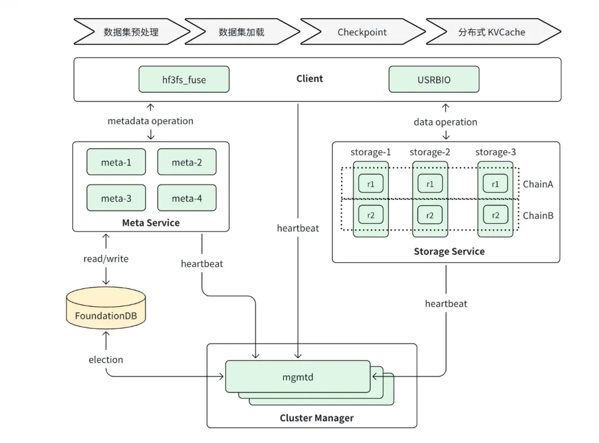
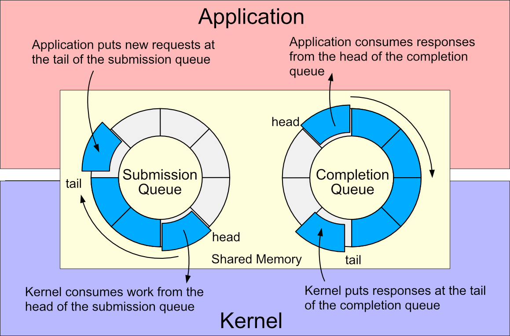
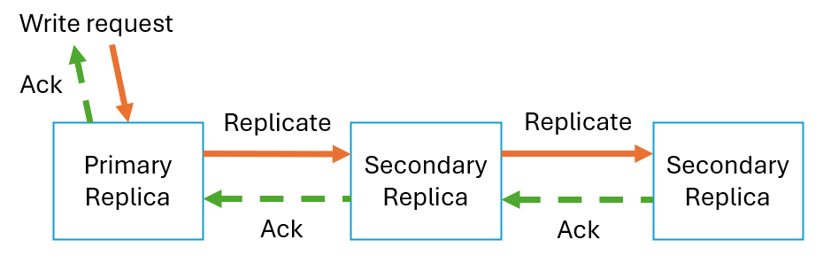
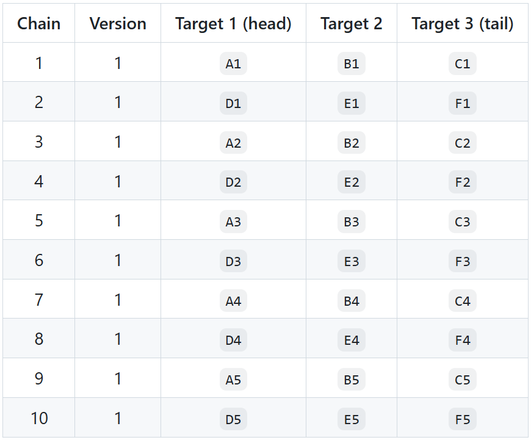
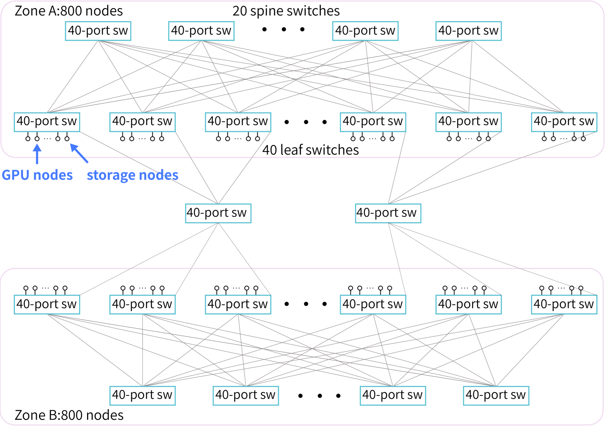
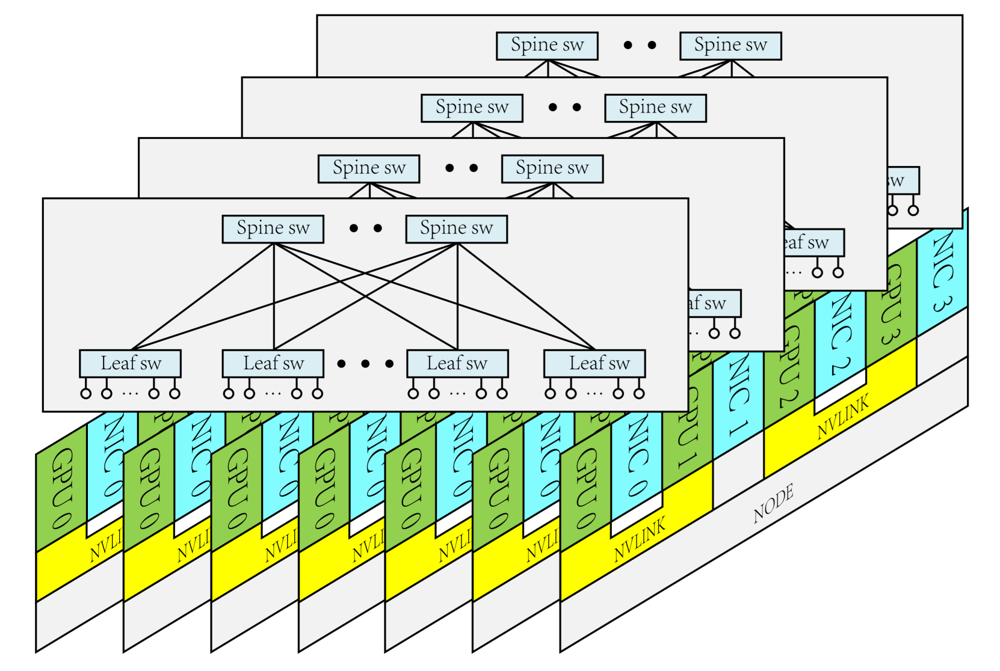
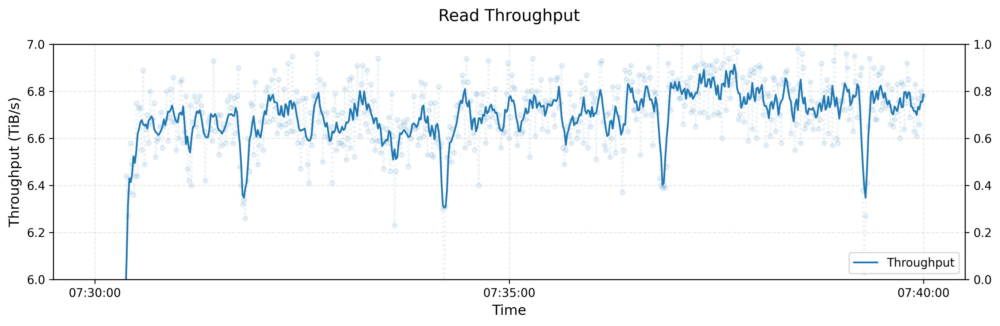
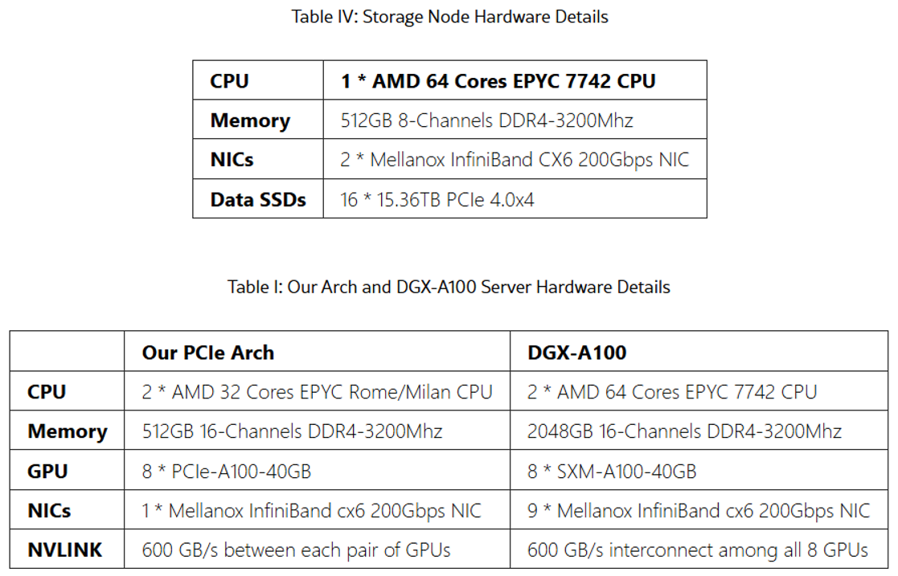

# DeepSeek 3FS 中更多值得注意的地方

近期 DeepSeek 横空出世，不仅把大语言模型成本降低十数倍 [[1]](.)，更是开源了全套 AI 基础设施，开源了模型，还开源了运营成本。其中 3FS 为大家展示了面向 AI 的存储系统是什么样，它与 DeepSeek 的 AI 基础设施深度整合和优化 [[4]](.)。

互联网上许多专家对 3FS 的解读已经非常全面：

  * Andy730: https://mp.weixin.qq.com/s/qKRioV45IbOq91XDsUEIcg

  * XSKY: https://mp.weixin.qq.com/s/RWCbpIBmHCzGNroFhbm2oA

  * ByteDance: https://mp.weixin.qq.com/s/X60PsEPeFsb-ZPKATMrWrA

  * StorageScale: https://mp.weixin.qq.com/s/sPkqOdVA3qBAUiMQltveoQ 

在此基础之上，本文列出一些我额外觉得有意思、有感想的地方。

前编：

  * https://mp.weixin.qq.com/s/3nvw9RJrAjgB5SNtAeArEA

## P Specification

分布式系统的一大难题是正确性，近年来形式化验证在存储系统中的采用越来越多，常见的语言有 TLA+ [[6]](.) 和 P Spec [[7]](.)。TLA+ 由大名鼎鼎的 Lamport 主推，语言接近数学逻辑，能够支持正确性证明。相比之下，P Spec 的语言围绕状态机，语法对程序员友好许多，主打状态迭代验证，对状态空间的搜索优化了不少 [[8]](.) 。

谁在使用 P Spec？典型的例子有，微软的 USB3 [[9]](.)，IoT [[10]](.)，Async Event Handling [[11]](.)；DeepSeek 的 3FS [[5]](.)。谁在使用 TLA+？典型的例子有，AWS 的 DynamoDB [[12]](.)，S3 [[13]](.)，EBS [[12]](.)；MongoDB 的复制协议 [[14]](.)，TiDB [[15]](.)，CockroachDB [[16]](.)。

3FS 中，P Spec 被用来建模 DataStorage，验证复制协议的正确性，例如所有写必须完成、版本号必须递增、所有副本必须更新等等。P Spec 还被用来建模 RDMASocket，验证诸如所有等待中的数据必须被处理、缓冲区使用不得越界、不得重复发送等等。

关于正确性，另一方面，3FS 采用 Rust 来实现存储引擎  [[17]](.)。Rust 语言内建严格的内存安全机制（Ownership），仅花费编译而非运行时开销。哪怕抛开这些，仅仅把 Rust 当 C/C++ 使用，其语言也现代很多。Rust 被越来越多地用于重写底层系统，例如 AWS S3 [[13]](.)、Linux 内核 [[18]](.)（Non-trivial）。

## 元数据管理

分布式文件系统的一大挑战是管理庞大的 inode 和 dentry 元数据，另一大挑战是实现 rename、rmdir、mv 对应的分布式事务。早期的系统，如 HopsFS [[19]](.)，用较复杂的方法自己实现事务；而 Facebook (Meta) Tectonic [[20]](.) 则简单地不支持跨分片的事务。

3FS 十分简单地解决了这些问题，它复用 Apple FoundationDB [[21]](.)，后者支持分布式事务。作为一个开源的、支持横向扩展、支持分布式事务的 KV 数据库，选择并不多，FoundationDB 可能是仅有的选择。并且，FoundationDB 经过大公司验证，开源的支持和文档也不错 [[22]](.)。相比之下，RocksDB 也十分常用，但往往用于解决单节点内的需求。

在分布式文件系统中，用数据库来管理元数据是近年来的趋势。3FS 使用 FoundationDB 管理集群的元数据，用 RocksDB 管理存储节点的元数据。类似地，Ceph BlueStore [[23]](.) 也用 RocksDB 管理存储节点的元数据，Tectonic 用 ZippyDB 管理集群的元数据 [[20]](.)，JuiceFS 支持选择 PostgreSQL、Redis、TiKV 等管理集群的元数据 [[24]](.)。

(图片来自于 [ByteDance](.) 的 3FS 解读，链接见文章开头)

## FUSE 用户空间文件系统

文件系统把一切放到用户空间的努力前仆后继。在文章开头 [XSKY](.) 的 3FS 解读文章中，有对 FUSE 更深刻详细的解读。

这不仅仅是为了性能，内核的调试更加困难，难以无干扰地升级部署。3FS 很巧妙地把 io_uring 的设计融入到 FUSE 中，以突破其性能和拷贝的限制，并且连接到 RDMA 的收发。新的 API 叫作 USRBIO [[25]](.)。

(图片来自于 [[35]](.))

## 写流程和复制协议

3FS 采用链式复制（Chain Replication），这是常见的写协议，重在简单。另一种常用的协议是 Quorum Write，多见于数据库，如 TiDB [[27]](.)，PolarDB [[28]](.) 等。让人好奇的是为什么 3FS 不使用星型复制（与 Quorum Write 兼容）。链式复制因为节点跳数多，会带来额外的写延迟，全闪存场景往往使用星型复制。

3FS 采用的 CRAQ 重点在于允许从从副本中读取数据，注意主副本可能正在写入数据。从副本中的数据可能会差至多一个版本，客户端需要放宽一致性限制。相比之下，Ceph 往往要求只有主副本可以读取数据，从副本的带宽无法利用，为强一致性所牺牲。值得借鉴的是，AWS S3 在 Quorum Write/Read 的基础上实现了强一致性 [[29]](.)。

另一方面，如果系统是 Append-only 的，在强一致性上允许读所有副本似乎就没有这么困难，不过文件系统总是允许 In-place 修改文件。尽管 3FS 的存储引擎是 Copy-on-Write （COW）的。

似乎 3FS 对写路径的优化并不多，尤其是延迟方面。例如其 GitHub 页面 [[2]](.) 只发布了读吞吐量而没有写，写路径大量使用锁和同步 IO [[26]](.)，不像读路径和网络 IO 充分协程化。这可以由 AI 存储的使用场景解释，数据加载、KVCache、训练集读取都是重读场景，训练集读取甚至需要小的随机读（FFRecord）。而 Checkpoint 虽然是重写场景，但多为批量写入。

额外地，关于 Checkpoint，DeepSeek 基础设施论文 [[4]](.) 中提到是每 5min 进行一次，每个节点写入速度达到 10 GB/s（180 节点），数秒完成整个 Checkpoint。另外，3FS 设计文档 [[2]](.) 中表示的是 3 副本，但论文 [[4]](.) 中描述的是 2 副本，见 VI-B2：“The total 2880 NVMe SSDs provide over 20PiB storage space with an mirror data redundancy”。

论文中还提到，基于 3FS 构建了 3FS-KV、消息队列、对象存储。在文章开头 [Andy](.) 的 3FS 解读文章中，有更详细的介绍。3FS-KV 用于 KVCache，消息队列用于模块间指令通信，对象存储用于存储图片、视频、文档等。这种方式与 VAST DATA [[32]](.)、Ceph [[31]](.)、Azure Storage [[30]](.) 类似，在一个统一存储平台上构建多样的服务。

## 数据放置（Placement）

3FS 如何决定数据该存储在哪里？首先，文件被等长地切分 Chunk 存储，Chunk 尽量分散。在文件的 inode 上可以查找该文件使用哪一个 Chain Table，以及随机数种子。两者加上数据块的 Chunk ID，可以在 Chain Table 中定位到复制 Chain。复制 Chain 包含 3 个副本的 Target，Target 对应到存储节点的 SSD 盘。

值得注意的是，一个 SSD 盘被划分为多个 Target，而 3 副本的“副本”指 Target，而不是常见的服务器节点。这大概是为了进一步切分单个 SSD 已能提供的极高带宽。另一方面，排布 Chain Table 需要考虑数据平衡，并在节点故障后让尽量多的节点参与修复。这被视为 Balanced Incomplete Block Design [[2]](.) 问题，可以在部署时由优化器生成 [[33]](.) 。

(图片来自于 3FS 设计文档 [[2]](.))

## 网络

DeepSeek 基础设施论文 [[4]](.) 描述了其网络建设。网络分为 2 个 Zone，使用 InfiniBand 和 2-层 Fat-tree 架构。每个存储节点配备双 IB 网卡，各自接入一个 Zone，以在各 Zone 中共享存储服务。

为流控（QoS），网络使用了 InfiniBand Service Level（SL），并映射到 Virtual Lane（VL）。不同 VL 互不干扰。网络使用静态路由，这个方向的下一步似乎类似 Google Orion SDN [[34]](.)。SDN 控制器拥有全局视图，定时刷新最优决策后，向交换机下发路由配置。NCCL 有额外优化，例如 IB NIC 和 GPU 的 NUMA 亲和，PCIe Relaxed Ordering。

3FS 实现了一套称为 Request-to-Send 的拥塞控制机制，以避免 Incast。在传送数据前，存储节点需要询问客户端是否允许，客户端限制并发数。

值得注意的是，3FS 大量使用 One-sided RDMA。例如，客户端写入数据，是通过存储节点发起 RDMA Read 完成的；而客户端读取数据，则通过存储节点发起 RDMA Write。

(图片来自于 [[4]](.))

论文 [[4]](.) 中提及，DeepSeek 未来将探索用 RoCE 取代 InfiniBand 以降低成本。新节点将配备与 GPU 一比一的网卡。网卡数量翻倍或更多。延续之前的 2-zone 架构，同一节点的网卡各自连接到一个 2-层 Fat-tree Plane。

(图片来自于 [[4]](.))

## 性能

在 Github 页面 [[2]](.) 中，3FS 发表了其读压力测试的吞吐量达到 6.6 TB/s。集群中有 180 个存储节点，各配备 16 个 14 TB 的 NVMe SSD。即平均每个 SSD 盘的吞吐量达到 2.3 GB/s，3FS 近乎实现硬件闪存的原生性能。

(图片来自于 [[2]](.)) 

DeepSeek 基础设施论文 [[4]](.) 中有更详细的硬件配置。注意 3FS 的客户端运行在 GPU 节点上，这些节点负责繁重的 LLM 训练和推理，资源需求也极高，且需避免被客户端干扰。

## 引用和资料 

[1] LLM-Price 大语言模型服务价格汇总 ：https://github.com/syaoranwe/LLM-Price

[2] DeepSeek 3FS : https://github.com/deepseek-ai/3FS/blob/main/docs/design_notes.md 

[3] DeepSeek 3FS blog : https://www.high-flyer.cn/blog/3fs/

[4] DeepSeek AI infra paper 2024 : https://arxiv.org/html/2408.14158v1 

[5] P Specs in 3FS : https://github.com/deepseek-ai/3FS/blob/main/specs/README.md 

[6] Industrial Use of TLA+ : https://lamport.azurewebsites.net/tla/industrial-use.html

[7] P Spec case studies : https://p-org.github.io/P/casestudies/

[8] P Spec search prioritization heuristics : https://ankushdesai.github.io/assets/papers/fse-desai.pdf

[9] P Spec in Microsoft USB3 : https://www.microsoft.com/en-us/research/blog/p-programming-language-asynchrony/

[10] P Spec in Microsoft IoT : https://www.infoworld.com/article/2250253/microsoft-open-sources-p-language-for-iot.html

[11] P Spec in Microsoft Async Event Handling : https://www.microsoft.com/en-us/research/project/safe-asynchronous-programming-p-p/

[12] TLA+ at AWS : https://lamport.azurewebsites.net/tla/formal-methods-amazon.pdf

[13] TLA+ at AWS S3 : https://www.amazon.science/publications/using-lightweight-formal-methods-to-validate-a-key-value-storage-node-in-amazon-s3

[14] TLA+ at MongoDB Replication Protocols : https://www.mongodb.com/community/forums/t/about-the-tla-specifications-of-mongodb/275204

[15] TLA+ at TiDB : https://github.com/pingcap/tla-plus

[16] TLA+ at CockroachDB : https://github.com/cockroachdb/cockroach/blob/master/docs/tla-plus/ParallelCommits/ParallelCommits.tla

[17] 3FS uses Rust to build storage engine : https://github.com/deepseek-ai/3FS/tree/main/src/storage/chunk_engine

[18] Rust to rewrite Linux Kernel : https://www.usenix.org/conference/atc24/presentation/li-hongyu

[19] HopsFS paper 2017 : https://www.usenix.org/conference/fast17/technical-sessions/presentation/niazi

[20] Facebook (Meta) Tectonic : https://www.usenix.org/conference/fast21/presentation/pan

[21] Apple FoundationDB : https://www.foundationdb.org/files/fdb-paper.pdf

[22] Apple FoundationDB Github : https://github.com/apple/foundationdb

[23] Ceph BlueStore using RocksDB : https://docs.ceph.com/en/reef/rados/configuration/bluestore-config-ref/

[24] JuiceFS metadata engine selection : https://juicefs.com/en/blog/usage-tips/juicefs-metadata-engine-selection-guide

[25] 3FS USRBIO API : https://github.com/deepseek-ai/3FS/blob/main/src/lib/api/UsrbIo.md

[26] DeepSeek 3FS 源码解读——磁盘 IO 篇 : https://zhuanlan.zhihu.com/p/27497578911

[27] Raft in TiDB : https://www.vldb.org/pvldb/vol13/p3072-huang.pdf

[28] Raft in PolarFS : https://zhuanlan.zhihu.com/p/653252230

[29] Diving Deep on S3 Consistency : https://www.allthingsdistributed.com/2021/04/s3-strong-consistency.html

[30] Azure Storage paper 2011 : https://azure.microsoft.com/en-us/blog/sosp-paper-windows-azure-storage-a-highly-available-cloud-storage-service-with-strong-consistency/

[31] Ceph unified storage : https://ceph.io/en/

[32] VAST DATA Whitepaper : https://www.vastdata.com/whitepaper/

[33] 3FS to generate chain table when deploying : https://github.com/deepseek-ai/3FS/blob/main/deploy/data_placement/README.md

[34] Google Orion SDN paper 2021 : https://www.usenix.org/conference/nsdi21/presentation/ferguson

[35] Redhat intro for io_uring : https://developers.redhat.com/articles/2023/04/12/why-you-should-use-iouring-network-io
